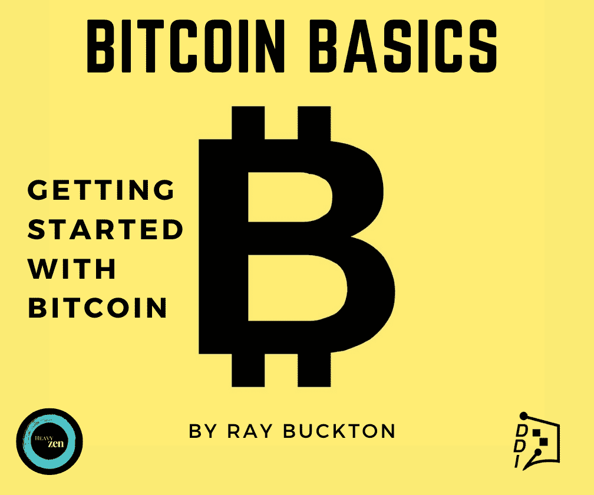

# 技术领域“史诗般”的一周

> 原文：<https://medium.datadriveninvestor.com/an-epic-week-in-tech-ee12e62bb581?source=collection_archive---------25----------------------->

## **DDI 技术通讯| 8 月 19 日当周 Alpha 交易**

# DDI 更新:

在我们深入堡垒之夜、抖音和垃圾双关语之前，有一些内务处理。

我们在每一期都推出了**专家聊天**功能，这是有原因的。

把它想象成一个高端咨询服务，也是一个专家知识的市场，所有人都可以进入。无论你是专业人士、企业家还是学生，专家聊天的目的是在专家和需要接触他们的人之间架起一座桥梁。

感兴趣吗？[在这里注册](https://datadriveninvestor.com/expertchatregistration)。

顺便说一下，我们知道不是每个人都是文字大师。没关系；我们仍然有一个新的想法，将你的专业知识和智慧转化为金钱。

你是一个习惯性的推特用户，还是一个世界级的 Redditor？你有没有每天花几个小时在 Quora 和 StackExchange 上找乐子？你需要第三只手来数你编辑了多少维基百科文章吗？

如果是这样，DDI 的幕后有一个**绝密项目**正在进行，它可能非常适合你。

**如果你想一起做一件大事，给我们发一封电子邮件**:主题为【思想者】的 research@datadriveninvestor.com

**最新 DDI 问题:**

*   [加密货币](https://medium.com/datadriveninvestor/aaaand-its-gone-706f05f8b254)
*   [市场&经济](https://medium.com/datadriveninvestor/close-but-no-cigar-stock-market-targets-record-highs-amidst-stalled-covid-relief-fad5a5699cde)
*   [技术](https://medium.com/datadriveninvestor/rocky-start-for-reels-global-tech-splinters-5g-gets-a-boost-33f9dc14662a)

(注:如果你喜欢这封邮件，请考虑把它转发给某个会从中获益匪浅的人。如果有朋友给你发了这封邮件，你可以 [*订阅 DDI 简讯*](https://www.datadriveninvestor.com/about/) *这样你就不会错过任何一个节拍。)*

# DDI 编写器亮点

每期我们都喜欢从展示一些来自 DDI 社区的发人深省的故事开始。想让你的故事成为特色吗？在这里提交你的最佳表现。

[AI 出奇的聪明，就在你眼皮底下](https://www.datadriveninvestor.com/2020/08/14/ai-is-surprisingly-smart-right-under-your-nose/)

“营销人员不仅应该关心，而且应该拥抱人工智能。”吉姆·卡扎曼

如何以交易为生

"没有游戏计划，你只是在赌博."-阿莫尔·加特

[现在去哪里投资？](https://www.datadriveninvestor.com/2020/08/18/where-to-invest-right-now/)

“相对于世界其它地区而言，(搅局者)是一个你可以期待高度稳定的地方，从而提高你投资的可预测性。”-奥利维尔·曾德

[押注旅游公司](https://www.datadriveninvestor.com/2020/08/18/taking-a-bet-on-travel-companies/)

"这是我投资个股的一个机会."亚历山大·拉戈

否认事实——人类忽视伤害人的事实和真相的能力

"反科学偏见比我们承认的更普遍."-希万吉·阿格拉瓦尔

# 在新闻报道中出现

## 堡垒之夜史诗

Epic Games 向其 IOS 和堡垒之夜应用发送了一个更新，允许直接支付，以绕过应用内销售的 30%佣金。

苹果和谷歌对此都不高兴，因为更新违反了两家公司的服务条款。两家公司都迅速将堡垒之夜从他们的商店下架。

Epic 对苹果提起诉讼，声称苹果应用商店垄断了移动应用市场。Epic 还播放了一段对苹果 1984 年著名广告的模仿，名为[*1980 年-堡垒之夜*](https://youtu.be/euiSHuaw6Q4) *。*

Epic Games 勇敢的以一个更加开放和公平的游戏行业的名义对其平台合作伙伴提起反垄断诉讼。尽管如此，在法庭上挑战苹果和谷歌是一项资源密集型的冒险，即使是对一家像 Epic 这样资金雄厚的公司来说。

对于苹果和谷歌来说，现在是处理另一场诉讼的艰难时刻，因为两家公司最近都在国会忍受着反垄断的尴尬。

苹果威胁取消 Epic 对 iOS 和 Mac 开发者工具的访问权，加大了赌注。

对此，Epic 写道，“苹果的行为将无可挽回地损害 Epic 在堡垒之夜用户中的声誉，对独立的虚幻引擎业务的未来是灾难性的。”

## 没有例外

没有立场，人们不得不承认史诗这一天的到来。苹果[很坦诚](https://www.theverge.com/2020/8/17/21373108/apple-response-epic-app-store-fortnite-lawsuit)他们提出收回威胁，欢迎堡垒之夜回到他们的商店，只要 Epic 放弃支付处理更新，以遵守苹果的服务条款。

苹果公司发表了如下声明:

> “Epic 给自己制造的问题是一个很容易解决的问题，如果他们提交应用程序的更新，使其符合他们同意并适用于所有开发者的准则。”

苹果公司要求 Epic 在 8 月 28 日之前做出决定。在那之后，该公司将继续从开发者项目中削减 Epic。

# 抖音申奥

## 先是微软，然后是 Twitter，现在是甲骨文

据报道，总部设在加州的跨国科技公司甲骨文(Oracle)已与字节跳动就另一项抖音收购展开谈判。

川普签署了另一项行政命令**，给予字节跳动** [**更多时间**](https://www.theverge.com/2020/8/14/21369753/bytedance-tiktok-trump-china-app-privacy-90-days) 寻找买家，但这也意味着更多有实力的竞标者必将进入舞台。然而，考虑到特朗普与甲骨文的亿万富翁联合创始人拉里·埃里森有着愉快的历史，甲骨文在微软(Twitter 谁？)

中国科技巨头华为也面临来自美国的压力，因为它在获得美国技术制造的芯片方面面临更严格的限制。

围绕美国、中国和抖音的戏剧足以弥补今年大片的不足。然而，不要轻视这种可怕的情况。我们在上一期的快讯里写了很多，[**来看看**](https://medium.com/datadriveninvestor/close-but-no-cigar-stock-market-targets-record-highs-amidst-stalled-covid-relief-fad5a5699cde#266e:~:text=press.-,China) 。

# 当人们问“比特币是如何工作的？”我们推荐这本书。

比特币被一些人誉为“数字黄金”，被另一些人誉为“纯粹的货币”，对许多人来说，它意味着许多东西。 [**比特币基础知识:比特币入门**](https://www.amazon.com/dp/B08FBP9W4Y) 帮助你开启比特币之旅。

这本书将帮助你对构成比特币的**基本概念**感到舒适，无论你是寻求被告知还是**准备好亲自参与**比特币。**了解比特币网络的关键特征**，解释如何将比特币从一个人转移到另一个人，深入研究**比特币的历史**，等等。

# 不断变化的景观

## 哦，快乐的人们！

金融服务全明星 Robinhood 刚刚在 G 轮融资中又获得了 2 亿美元。这个大获成功、备受争议的 YOLO 日间交易市场现在的估值约为 112 亿美元，它让我完全不知道哪里是“初创公司”的终点，哪里是绝对的庞然大物的起点。

## 不动=更易移动

到目前为止，2020 年，当我们凝视屏幕超过 1.6 万亿小时时，COVID 将我们所有人都粘在了我们的移动设备上。

**我们在移动应用上的花费比以往任何时候都多 25%**,营销人员正在追逐这一趋势，今年到目前为止，移动广告投放增加了 70%。

## 如果我今年读的每一篇积极的文章都能赢得一个尼古拉奖，

我的银行存款仍然比 Nikola 少，Nikola 是一家价值 340 亿美元的电动汽车制造商。我也不会被邀请参加我爸爸的双关语派对。

重点是，Nikola 最近向美国第二大垃圾处理供应商 Republic Services 确认了一份 2500 辆零排放垃圾车的订单后，受到了媒体的关注。我想在这里开一个垃圾玩笑，但是太垃圾了。

# 其他新闻

## 死亡购物中心复活

亚马逊正在与西蒙地产集团就将空置的零售空间转变为亚马逊物流中心进行谈判。这对亚马逊来说是显而易见的，旨在关闭住宅送货服务的“最后一公里”。

这家电子商务巨头还宣布将在美国六个城市扩展其实体办公室，增加 3500 个公司职位。

## 向前冲

尽管 COVID 确实对旅游和旅游业造成了损害， **Airbnb 计划今年推进**[**IPO**](https://www.bloomberg.com/news/articles/2020-08-12/airbnb-revenue-tanks-67-in-second-quarter-ipo-planned-for-2020)**。该公司称，随着人们寻找离家近的替代度假方式，预订量出现了惊人的反弹。**

## 去月球！

不，我们不是在谈论特斯拉股票。SpaceX 公司计划不早于 10 月 11 日将宇航员送入和送出空间站。

# 观看表演

我们在 Alpha Trades 的朋友们本周深入研究了市场、密码和经济。通过最近的剧集找到你的优势:

[比特币货币的循环如何影响 DeFi |水平，需要长期关注](https://youtu.be/tZ_UKM1Foic)

[莱特币会超过以太坊和比特币吗？](https://youtu.be/qi7qa6-6go0)

[2020 年 8 月 17 日美国股市讨论周](https://youtu.be/aP70JWqRdZc)

订阅阿尔法交易不和谐服务器学习技术分析和如何投资获利。询问 2 天的高级会员试用！

# 放弃

数据驱动投资者(DDI)提供的信息不用于做出任何金融决策，也不是购买、持有和/或出售特定证券或金融工具的请求或建议。

Alpha Trades，LLC 提供的信息不用于制定任何财务决策，也不是购买、持有和/或出售特定证券或金融工具的请求或建议。

访问 Alpha Trades 的完整服务条款:[https://bit.ly/3faVeeV](https://bit.ly/3faVeeV)