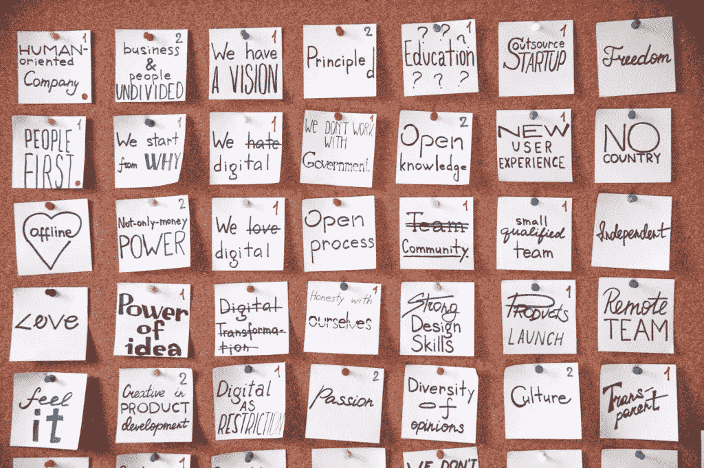

# 专家指南:如何让 2021 年成为你有史以来最好的一年；和千禧女财神在一起

> 原文：<https://medium.datadriveninvestor.com/an-experts-guide-how-to-make-2021-your-best-year-ever-with-the-millennial-money-woman-696a2cf7f185?source=collection_archive---------17----------------------->

在 2020 年的最后几个小时里，我非常激动地与你分享我对千禧女财神 Fiona 的采访！在我看来，她模仿了如何利用困难的一年，把它变成一个天价的胜利。对我来说，看到 Fiona 如何在疫情开始她的博客，并以惊人的速度增长，与世界分享金融知识，是非常鼓舞人心的。

> ***“变革之风一吹，有的造墙，有的造风车。”***
> 
> *一句古老的中国谚语*

如果今天你正在寻找如何准备让 2021 年成为你有史以来最好的一年的灵感，请阅读我下面对她的采访——也请在*她的*博客上找到[她对我的采访——真正启动 2021 年，让它成为你有史以来最好的一年！！！](https://themillennialmoneywoman.com/new-year-goals/)

说够了，是时候见见菲奥娜——千禧女财神了！

地板是你的了！

The Millenial Money Woman aka Fiona — [follow her on Twitter](https://twitter.com/The_MMW)

# 谁是千禧金钱女？

我是菲奥娜，千禧女理财人的创始人，我只是想帮助年轻的专业人士理解有时很模糊的金融领域。

我第一次发现自己对金融的热情是当我看到我的祖父母在一些糟糕的财务规划后，以他们的名义输掉了每一分钱。他们一生都在工作，每天都在工作，当他们接近退休时，他们的辛勤工作化为乌有，因为他们没有养成健康的理财习惯。

就在那时，我知道我想在财务方面领先一步，所以我收集了我的资源，埋头读书，尽可能多地学习。

我不允许任何人犯同样的错误。

我的教育背景使我能够帮助年轻的专业人士在有时很模糊的金融领域航行:

*   获得了国际金融理财师奖(CFP——相当于金融忍者)
*   获得特许退休规划顾问(CRPC)
*   获得个人财务规划理学硕士学位

因为我获得了知识并养成了健康的理财习惯，我在 23 岁时买了第一套房子，没有债务(减去我的抵押贷款)，在我的社区里共同创立了一个金融非营利项目，再过几年我就要成为百万富翁了。

虽然我只是一个千禧一代，但我经历了很多，我在这里将我迄今为止在金融方面的数万小时阅读、头脑风暴和现实生活经验传递给你。

# 你如何计划成功？

在我看来，规划成功不需要天赋。

需要的是纪律、承诺和一致性。

所以，为了计划成功，我有一个非常基本的过程:

首先，我每天花少量的时间来简单地思考和头脑风暴我目前的生活状态——包括个人生活和商业生活。这是我花时间反思我的过去的地方(到目前为止我成功了吗？有什么我可以做得更好的吗？)而且我还考虑我要去哪里，要去那里我要做些什么。

在我花时间反思和思考我需要做什么来使我的博客成功之后，我开始通过创建一个愿景板来可视化我的目标。这是一块很大的板，在一个非常显眼的地方(比如我的卧室)展示我的目标(短期和长期)。

这些目标是可以量化和容易衡量的。换句话说，我可以很容易地确定我是否离我的目标更近了一步，或者我是否需要改进我的游戏计划以使这些目标成为现实。

要考虑的非常重要的一点是永远不要创造看似不可能完成的目标。确保你对你的目标时间框架和实际目标是现实的。

要了解更多关于富人如何真正利用目标设定为自己谋利的信息，请点击这里:[心态差异:穷人与富人](https://themillennialmoneywoman.com/poor-vs-rich/)。

你也不想灰心丧气，彻底放弃你的项目。

# 2020 年你最大的收获是什么？

我在 2020 年学到的第一课就是任何人都可以在任何地方赚钱。

我希望我早些时候就知道你可以通过写博客赚钱。老实说，我真希望我能早点开始。不过，早做总比不做好。

你真的有权力选择如何看待形势。

有些人可能已经绝望地退出了 2020。

其他人可能已经将 2020 年作为创业的动力，并开始朝着他们的最终目标努力。

我的最终目标是自由，通过我的博客，我离自由又近了一步。

# 你如何确定哪个工作/行业是你的职业？

任何人都可以在任何地方找到工作。

但不是每个人都能自己创业。这很可怕，很冒险，也可能令人望而生畏。

然而，你会减少很多压力——如果你只是将你的激情结合在一起，成功的几率会高得多。

找出你真正擅长的和你真正喜欢的事情。

现在把这些激情结合在一起，你就有了神奇的公式。

对我来说，我的热情是金融和帮助年轻的专业人士，因为我不想让他们经历我的家人和我的祖父母经历的事情。我很擅长写作——这对我来说很容易，我可以按需写作。

因此，在反思了我的热情和专业知识之后，我决定成为一名金融博客写手。我可以写一些关于金融的文章，帮助年轻的专业人士，而且我从来不觉得自己在工作。

你知道吗——每天早上醒来，我做的事情真的感觉像是一份礼物。

我很幸运，我希望你也能找到你的激情。

*评论 Matt:在这里阅读关于* [*寻找你的 Ikigai*](https://www.financial-imagineer.com/ikigai/) *，或者在这里阅读关于* [*寻找你的目的的艺术*](https://www.financial-imagineer.com/art-of-purpose/) *。*

# 你做“新年决心”吗？为什么/为什么不？

我每年都制定新年计划！

然而，我的过程与大多数人有一点不同:我在滚动的基础上设定我的目标，这意味着我每个月都会评估我的目标，并在必要时调整我的目标。

每个月调整我的目标有助于我轻松进入我需要做些什么来获得成功的过程。

我见过很多我的学员在新的一年开始时试图将一种习惯转变为另一种习惯，但由于这种突然的转变，他们几乎总是失败。

例如，我有一个喜欢巧克力和其他糖果的好朋友。她在 2019 年底的目标是不再吃巧克力。句号。她刚刚结束假期和新年前夕的食物…她想从 2020 年 1 月 1 日开始突然改变行为。

她坚持了 3 个星期才恢复了正常的行为。

这就是为什么我认为全年努力制定或调整你的目标是如此重要。

你不一定非要等到一年结束才设定新的目标。

然而，年底确实标志着我设定一些长期目标并开始朝着这些目标努力的好时机。

例如，我和我的丈夫坐在一起(下面有更多的内容)讨论我们在未来 3 年、7 年和 10 年内想做什么。

进行这些对话有助于我们找出一个粗略的路线图，在短期内如何向这些长期目标迈进一步。

 [## 首次创业的 4 个资金管理技巧|数据驱动的投资者

### 超过 82%的企业倒闭是由于财务管理不善和现金流问题。开始新的…

www.datadriveninvestor.com](https://www.datadriveninvestor.com/2020/10/23/4-money-management-tips-for-first-time-entrepreneurs/) 

# 关于丈夫/妻子设定目标的讨论

和你的另一半一起设定目标是非常重要的。

毕竟，你们现在是一对了，你们两个应该一起朝着你们的目标努力。

我和老公在设定目标方面非常成功(目前为止！手指交叉)。

我们的过程很简单:我们每月坐一次，喝着红酒，吃着奶酪，用一个小时的时间讨论我们的现状，我们想要达到的目标，以及我们需要做些什么来达到目标(当谈到成功规划时，这与我的过程非常相似)。

我发现对我丈夫和我自己真正有效的是，我们在一个非常放松、没有威胁的氛围中设定目标。

这不是对抗性的，我们一起讨论我们的目标。

有时候，我们的目标可能不一致——这完全没关系。重要的是我们都知道对方的目标。然后，我们想出如何帮助对方更接近这些目标。

然而，我丈夫和我非常幸运，因为我们在同一页上:我们想要同样的东西(对大多数人来说)。

因此，每个月(通常是每个月的最后一个星期五)，我们都会坐在迈阿密家中的假火炉旁，喝着红酒，吃着奶酪，谈论我们的目标和下一步计划。

避免混淆最重要的是与你的伴侣沟通。

我建议多沟通而不是少沟通。

这真的是接近你们共同目标的简单秘诀。祝你好运！

如果你想了解更多关于如何与你的伴侣谈论金钱的信息，点击查看我的博客文章《如何与你的伴侣谈论金钱》。

*评论马特:如果你还没有看过，这里是我们如何做我们的* [*夫妇 5 年规划会议*](https://www.getrichslowly.org/couple-goals/) *。*

# 你如何抓住新的一年到来的势头？

我的博客才运行了 8 个月，已经在福布斯上发表了两次，预算很性感，已经在超过 35 个播客上出现，让我意识到新的一年，2021 年就是要变得更好。

现在是抓住势头的时候了。

对于 2021 年，我的计划很简单:

坚持发布视觉上吸引人且易于理解的个人理财内容。

我坚信，随着我继续发布准确、引人入胜且易于阅读的信息，机会会自己出现。

写博客是一场长期的战斗，我知道取胜的关键因素之一是坚持不懈，永不放弃。这正是我计划在 2021 年做的事情。

> 这将是迄今为止最伟大的一年！
> 
> *千禧女富豪，又名菲奥娜*

# 你的博客在 2020 年取得了巨大的成功；你每天是怎么分配时间的？

我从博客生涯开始学到的一个非常重要的经验就是时间管理。如果你不正确理解如何管理和分配你的时间，那么你可能是世界上最聪明的人——但你仍然无法按时完成事情，满足最后期限。

虽然我是自己的老板，但我会自己设定最后期限。我没有错过一个的习惯。记住，要想成功，你需要自律，所以不要成为顺其自然的牺牲品，因为在你知道之前，“习惯”会变成一种自动的行为。

我知道我的身体和大脑在早上工作得最好，所以那是我首先处理最紧迫任务的时候:写博客。通常，我在凌晨 3:30 到 4:30 之间醒来。我已经习惯了这种时间模式，即使没有闹钟，我通常也会在这个时间醒来。

当我充满想法和精力的时候，我会在早上写一篇博客。

接下来，我通过电子邮件、电话、ZOOM calls 与当前的联系人建立联系。我喜欢和我的联系人聊天，建立新的关系，所以这一步可能需要几个小时！

了解更多关于[整理你的网络](https://themillennialmoneywoman.com/things-i-would-tell-my-younger-self/)的力量。

白天，我每小时花 15 分钟管理我的社交媒体账户——T2 的 Pinterest 和 T4 的 Twitter。

在中午，我试着进入我的设计模式。那是我为我的网站创建图形和数字设计的地方。我总是试图改进我的网站，所以我也花一些时间了解最新的虚拟主机平台更新，谷歌算法更新等。

最后，在晚上，你会发现我在播客上接受采访(我通常一个月做 10 到 15 个播客)，或者阅读最新的个人财务资料以保持身材，这样我就可以向我的观众提供最新最好的消息。

冲洗并重复。

我每天都这么做——周末、工作日、节假日等等。

我意识到要成为成功的博客，你不能休息一天。你必须始终坚持你的计划，它会及时得到回报。我的长期心态和愿景是我迄今为止的目标。

**千禧女富豪菲奥娜**

感谢 Fiona 在博客上分享你对如何让 2020 年成为超级成功的一年的见解！

如果你喜欢在 Fiona 的博客上阅读我的采访，请[点击这里继续阅读并探索她的博客](https://themillennialmoneywoman.com/new-year-goals/)。

相信菲奥娜和我今天能激励你开始你的 2021 规划。我们都期待并祝愿你有一个健康、繁荣、充满新机遇的新年！

财务想象你的生活！

新年快乐，

马特|金融幻想工程师

如果你喜欢这篇文章，也请考虑加入我的收件箱团队，通过电子邮件在我的博客、[上订阅](https://www.facebook.com/financialimagineer)[，比如我的脸书页面](https://www.financial-imagineer.com/)或[在 Twitter 上关注我](https://twitter.com/FI_imagineer)。

*原载于 2020 年 12 月 30 日 https://www.financial-imagineer.com**[*。*](https://www.financial-imagineer.com/millenial-money-woman-2021/)*

***访问专家视图—** [**订阅 DDI 英特尔**](https://datadriveninvestor.com/ddi-intel)*