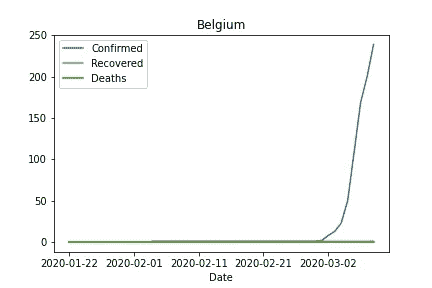
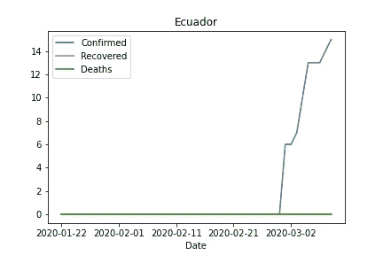
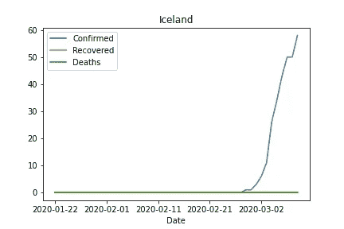
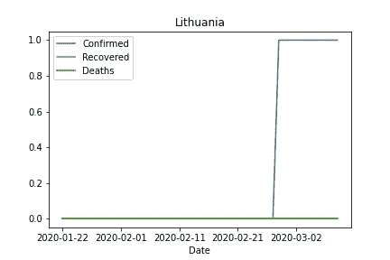
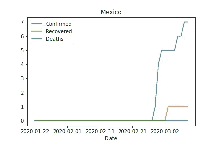
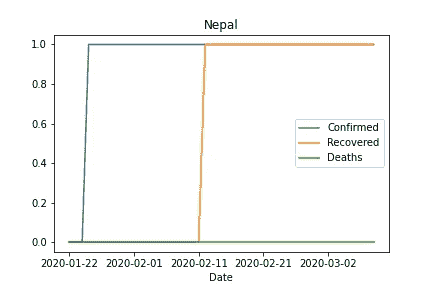
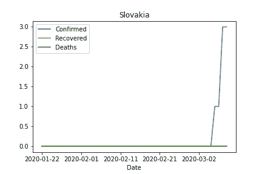

# 为新用户探索熊猫，并可视化冠状病毒正在发生什么

> 原文：<https://medium.datadriveninvestor.com/an-exploration-of-pandas-for-a-new-user-and-visualising-what-is-going-on-with-coronavirus-f6978ce60562?source=collection_archive---------14----------------------->


Photo by [Sid Balachandran](https://unsplash.com/@itookthose?utm_source=medium&utm_medium=referral) on [Unsplash](https://unsplash.com?utm_source=medium&utm_medium=referral)

我已经学了几个星期的 Python，最近对熊猫有了更多的了解。

> 在计算机编程中， **pandas** 是为 **Python** 编程语言编写的软件库，用于数据操作和分析。特别是，它提供了数据结构和操作来操作数字表和时间序列。它是在三条款 BSD 许可下发布的自由软件。

由于冠状病毒是所有的新闻，我认为这将是很好的尝试和可视化的一些数据。

[](https://www.datadriveninvestor.com/2019/02/07/8-skills-you-need-to-become-a-data-scientist/) [## 成为数据科学家所需的 8 项技能|数据驱动型投资者

### 数字吓不倒你？没有什么比一张漂亮的 excel 表更令人满意的了？你会说几种语言…

www.datadriveninvestor.com](https://www.datadriveninvestor.com/2019/02/07/8-skills-you-need-to-become-a-data-scientist/) 

我从安装 jupyter 笔记本和创建一个新项目开始。然后我寻找一个可以收集数据的来源。我选定了这个来源:[https://raw . githubusercontent . com/datasets/新冠肺炎/master/time-series-19-covid-combined . CSV](https://raw.githubusercontent.com/datasets/covid-19/master/time-series-19-covid-combined.csv)，它列出了我感兴趣的字段:

*   国家
*   日期
*   确认的
*   恢复
*   死亡


Photo by [CDC](https://unsplash.com/@cdc?utm_source=medium&utm_medium=referral) on [Unsplash](https://unsplash.com?utm_source=medium&utm_medium=referral)

我一直在 jupyter 和 pandas 文档之间来回切换，我确实设法得到了一些有趣的信息，其中一些有点奇怪，但我想我需要更多地使用它。

```
import pandas as pd
import matplotlib.pyplot as plt
import io
import requests
url="[https://raw.githubusercontent.com/datasets/covid-19/master/time-series-19-covid-combined.csv](https://raw.githubusercontent.com/datasets/covid-19/master/time-series-19-covid-combined.csv)"
s=requests.get(url).content
dataset=pd.read_csv(io.StringIO(s.decode('utf-8')))dataset.columns
```

这将输出数据帧的列列表

```
['Province/State', 'Country/Region', 'Lat', 'Long', 'Date', 'Confirmed', 'Recovered', 'Deaths']
```

然后我想看看数据框中的国家，只是为了检查我正在处理的信息

```
dataset['Country/Region'].unique()
```

这导致了

```
['Mainland China', 'Thailand', 'Japan', 'South Korea', 'Taiwan', 'US', 'Macau', 'Hong Kong', 'Singapore', 'Vietnam', 'France', 'Nepal', 'Malaysia', 'Canada', 'Australia', 'Cambodia', 'Sri Lanka', 'Germany', 'Finland', 'United Arab Emirates', 'Philippines', 'India', 'Italy', 'UK', 'Russia', 'Sweden', 'Spain', 'Belgium', 'Others', 'Egypt', 'Iran', 'Lebanon', 'Iraq', 'Oman', 'Afghanistan', 'Bahrain', 'Kuwait', 'Algeria', 'Croatia', 'Switzerland', 'Austria', 'Israel', 'Pakistan', 'Brazil', 'Georgia', 'Greece', 'North Macedonia', 'Norway', 'Romania', 'Denmark', 'Estonia', 'Netherlands', 'San Marino', 'Belarus', 'Iceland', 'Lithuania', 'Mexico', 'New Zealand', 'Nigeria', 'Ireland', 'Luxembourg', 'Monaco', 'Qatar', 'Ecuador', 'Azerbaijan', 'Czech Republic', 'Armenia', 'Dominican Republic', 'Indonesia', 'Portugal', 'Andorra', 'Latvia', 'Morocco', 'Saudi Arabia', 'Senegal', 'Argentina', 'Chile', 'Jordan', 'Ukraine', 'Saint Barthelemy', 'Hungary', 'Faroe Islands', 'Gibraltar', 'Liechtenstein', 'Poland', 'Tunisia', 'Palestine', 'Bosnia and Herzegovina', 'Slovenia', 'South Africa', 'Bhutan', 'Cameroon', 'Colombia', 'Costa Rica', 'Peru', 'Serbia', 'Slovakia', 'Togo', 'Vatican City', 'French Guiana', 'Malta', 'Martinique', 'Bulgaria', 'Maldives', 'Bangladesh', 'Moldova', 'Paraguay', 'Albania', 'Cyprus', 'St. Martin', 'Brunei']
```


Photo by [T.H. Chia](https://unsplash.com/@teckhonc?utm_source=medium&utm_medium=referral) on [Unsplash](https://unsplash.com?utm_source=medium&utm_medium=referral)

太棒了，所以我想把列限制在我想要的范围内，所以我运行了这个:

```
a = dataset[['Country/Region','Date','Confirmed','Recovered','Deaths']]
a.head().to_csv()
```

这导致了

```
,Country/Region,Date,Confirmed,Recovered,Deaths
0,Mainland China,2020-01-22,1,0,0
1,Mainland China,2020-01-23,9,0,0
2,Mainland China,2020-01-24,15,0,0
3,Mainland China,2020-01-25,39,0,0
4,Mainland China,2020-01-26,60,0,0
```

现在我需要将指数改为日期，然后在数据框中为每个国家绘制一个图表，显示确诊、恢复和死亡人数

```
b=a.set_index('Date')
for country in b['Country/Region'].unique():
    c=b[b['Country/Region']==country]
    c.plot(title=country)
    plt.savefig(country+'.png')
```

我发现我第一次跳到熊猫身上很酷，不管怎样，这是我制作的图表！



然后我尝试了一些不同的东西