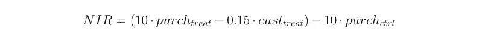

# 使用机器学习进行目标促销的示例

> 原文：<https://medium.datadriveninvestor.com/an-illustration-of-targeted-promotions-with-machine-learning-ab9523eb064a?source=collection_archive---------1----------------------->

## 机器学习

这篇文章将有助于你的业务前所未有的增长。

你最近收到过 Myntra 的折扣券吗？或者你的购物钱包里有没有收到过促销余额/奖励积分？如果答案是肯定的，那么你很可能是促销活动的接收者。

*针对性促销:对一定会购买该产品的顾客进行促销。*

因为在商业策略中，对所有客户进行促销是非常冒险的。这背后有两个令人信服的主要原因。
1)促销/优惠券会给公司带来很大一笔费用。
2)在收入方面会有经营亏损的风险。
如果顾客在收到优惠券之前就已经计划购买产品，那该怎么办？那么零售商通过赠送优惠券会产生更少的利润。这也是公司的一种损失。

因此，通过使用机器学习技术，我们可以优化促销成本。

让我们来看一个场景，你有客户的数据，根据他们的 id，是否给予促销？是否购买了产品？还有很多其他的功能。

抓紧了！我要讨论的是星巴克数据科学家招聘过程中被问到的问题。你可以在这里看到他们给了候选人什么。

# 星巴克

> 顺便说一句，他们的肉桂卷星冰乐混合咖啡非常美味。你应该试试。

首先，我们应该了解星巴克提供的文件中的数据是如何组织的。

First five lines of Training data

正如我前面说过的，V1 到 V7 有七个抽象特征。所以我们应该注意数据是如何相互关联的。

> 另请阅读:[星巴克优惠优化流程](https://medium.com/@prashantjadiya/offer-optimization-using-machine-learning-46a1f5d1b59b)

此外，他们还定义了两个指标。
1) **递增响应率(IRR):** 【IRR】描述了与未接受促销相比，有多少客户购买了促销产品。在数学上，它是促销组中的购买者人数与购买者组中的客户总数的比率(*处理*)减去非促销组中的购买者人数与非促销组中的客户总数的比率(*控制*)。

**2)净增量收入(NIR):** 【NIR】描述通过发送促销获得(或损失)了多少收入。从数学上来说，这等于收到促销的购买者总数的 10 倍减去发出的促销次数的 0.15 倍，再减去没有得到促销的购买者人数的 10 倍。

我做过一个实验，在没有做任何数据处理的情况下，我把数据输入到像逻辑回归和随机森林这样的分类器中。尽管如此，这并不富有成效。(它给出的内部收益率为 0，NRR 为-1132.00，因此这对一家公司来说是巨大的损失。)

但在做了一些数据操作和预处理后，我发现很少有顾客会购买。事实上，80%的人甚至没有购买过促销产品，只有 20%的人购买过咖啡(或任何产品)。

现在主要的逻辑开始了，我搜索了一些技术来解决不平衡数据的问题。我开始了解上采样(从现有数据中获取更多数据点)。我选择了 SMOTE(合成少数过采样技术),下面是它的工作原理。

Creation of new points in the minority class

我创建了一个名为 response 的新特性列，其中包含 1(客户购买了促销产品)和 0(表示其他)。

上采样和创建新要素的过程使我的数据集增加了一倍。之后，我认为现在可以向模型提供数据了。

我选择了 sklearn 管道的随机森林分类器，因为它的最优性和可靠性，它给了我 0.0173 的 IRR 和 168.40 的 NRR。但是我对结果不满意。

> Sklearn Pipeline:在调整超参数时，组装几个可以交叉验证的转换。这可以节省我们获得最佳超参数的时间，同时减少代码行数。

在这个过程中，我了解到 XGBoost 算法非常适合不平衡的数据，因此我决定将它应用于 sklearn 的管道中的相同数据。但不幸的是，我不能用管道来运行它，我尝试了一整夜，但它不能。

是的，我在验证数据上获得了 92%的 AUC_SCORE。此外，我测试了我对内部收益率和 NRR 的预测，它给出了 0.0214 的内部收益率和 313.25 的 NRR。

好哇，当我得到这些结果的时候，我欣喜若狂。因为星巴克本身的模型不太精确(IRR: 0.0188，NRR: 189.45)。然而，我从许多资源中获得了帮助，其中一些在博客的末尾有所提及。

> 注意:你可以在这里访问本博客[附带的代码。](https://github.com/prashantjadiya/Starbucks-Promotion)

这种方法对你的生意也很有用。通过有针对性的促销来吸引更多的顾客。

参考资料:
1)[https://www . kdnugges . com/2017/06/7-techniques-handle-unbalanced-data . html](https://www.kdnuggets.com/2017/06/7-techniques-handle-imbalanced-data.html)
2)【https://rikunert.com/SMOTE_explained】
3)[https://www . quora . com/In-class ification-how-do-you-handle-an-unbalanced-training-set/answers/1144228？srid=h3G6o](https://www.quora.com/In-classification-how-do-you-handle-an-unbalanced-training-set/answers/1144228?srid=h3G6o)

> 谢谢大家！我希望你喜欢这篇文章，并学到一些新的东西。如果你喜欢，你可以在这里鼓掌，我也渴望在 LinkedIn 上与你们联系。如果你有比这更有效的方法，请在下面回复。