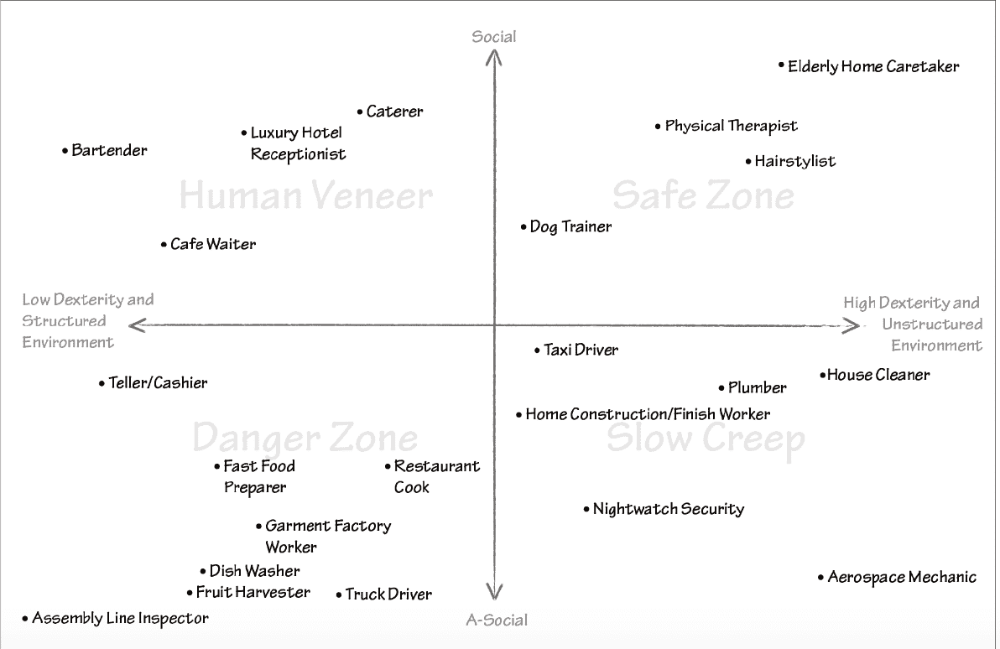

# 一场即将到来的地震革命:人工智能和人类的命运

> 原文：<https://medium.datadriveninvestor.com/an-incoming-seismic-revolution-artificial-intelligence-and-the-fate-of-humanity-184c50c5f191?source=collection_archive---------8----------------------->

## 发现意义，在劳动力市场保持相关性，分享爱

在下一波技术变革中，我们今天职业的一个基本原则，即目的或意义[当然，还有一种自我生存的手段]，将发生实质性的改变；人工智能(AI)无疑将改变人类景观，同时产生一个权力真空，最终将由主要集中在美国和中国的有限数量的科技巨头填补。随着量子计算的潜在突破，计算能力的增强，加上深度学习模型中错误率的降低，将意味着以前需要超级计算机几个月才能完成的复杂计算将在几分钟内完成。在人道主义驱动的事业领域，这是一笔真正的财富，不仅对私营部门，对公众也是如此。

生物技术过程，如聚合酶链式反应(PCR =获得诺贝尔奖的从一条链复制 DNA 序列的分子生物学过程，用于诊断测试、法医应用和实验室研究)可以通过新的数据科学方法加速，从而显著降低成本、提高诊断准确性，并从本质上改善患者的结果。由于宗教、金钱和帝国在塑造社会内部如何运作方面发挥了关键作用，AI 将很快加入领导委员会。事实上，这项创新将提供比电气化和蒸汽机发明更高的实用水平。人们可能会感到恐惧，也可能会非常兴奋，无论如何，灭霸，在这种情况下，以中性的语气，来自《复仇者联盟》【漫威会制作出更好的大片系列来创造巨额财富吗？——我不知道]简洁地概括了即将到来的革命:“害怕它。逃离它。命运总是会到来的。”

 [## 2019 年即将改变世界的技术|数据驱动的投资者

### 很难想象一项技术会像去年的区块链一样受到如此多的关注，但是……

www.datadriveninvestor.com](https://www.datadriveninvestor.com/2019/01/17/the-technologies-poised-to-change-the-world-in-2019/) 

2017 年 5 月 27 日，科学界发生了一件深刻而意想不到的事情，研究人员没有预期在十年内实现。柯洁，当时在围棋抽象策略游戏中排名第一的选手，被 DeepMind 的计算机算法 AlphaGo Master [DeepMind 是 Alphabet Inc .的子公司]以 3–0([链接](https://deepmind.com/alphago-china))击败。更荒谬的是，DeepMind 在征服世界第一的过程中，已经开创了两个超越 AlphaGo 的版本。虽然柯洁获得了 30 万美元，但很难想象他在损失后的精神状态，特别是如果你大半辈子都知道并高度精通的事情可以由一台没有灵魂的机器来实现[当然，它是由它大脑背后的工程师用爱制造的——希望如此]。Sinovation Ventures 董事长兼首席执行官李开复表示，这是中国的“人造卫星时刻”——由于比赛在中国乌镇举行，年轻人群对人工智能及其巨大能力的好奇心被放大了。

事实上，这个国家在人工智能霸权之战中处于相对有利的位置，只有美国——它拥有丰富的数据，政府通过政策和投资提供支持，坚定的企业家，以及越来越多的研究科学家。尽管中国缺乏足够的措施来参与第一波或第二波人工智能(互联网人工智能和商业人工智能)的竞争，但它在第三波和第四波人工智能(感知人工智能和自主人工智能)领域拥有前所未有的优势。尽管如此，这将是 BAT(百度，阿里巴巴，腾讯)对 FAAMIG(脸书，苹果，亚马逊，微软，IBM 和谷歌)——我猜是一个新的缩写？].然而，如果下一个深度学习(机器学习的一个子集)*注定会在企业界被发现，那么谷歌最有可能做到这一点。92).*

现在，你可能仍然对可能的结果持怀疑态度，但当美国政府在 R&D 的数学和计算机科学研究预算不到谷歌的一半时，眼睛会睁得大大的，怀疑会被抹去。93).此外，当大量聪明的博士计算机科学家为这样的公司工作时，由于潜在的飞轮效应，最终必然会出现相当大的进步[如果你们感兴趣，请参考杰弗里·辛顿和吴恩达，他们都是各自领域的人工智能教父]。然而，人工智能先驱们的圣杯是人工一般智能或 AGI，希望系统具有*一般*智能【每一种类似人类的能力建模——视觉、推理、语言、学习等等】([博登](https://www.amazon.com/Artificial-Intelligence-Short-Introduction-Introductions/dp/0199602913)，pg。18).尽管在自然语言处理、图像识别、神经网络和自主系统方面已经取得了惊人的进步，但在完全转变之前，还有许多工作要做。正如博登所说，“人工智能的一些领域似乎特别具有挑战性:语言、创造力和情感。如果 AI 不能模拟这些，AGI 的希望就是虚幻的。50).

回到 AI 霸权之战。即使在乌托邦主义者中，仍然存在一种担忧，即人工智能将创造一种不可想象的不平等的全球财富分配。毫无疑问，这为即将到来的结果描绘了一幅严峻的画面。“人工智能丰富的国家将积累巨大的财富，但也将见证经济的广泛垄断和划分为经济种姓的劳动力市场”( [Lee](https://www.amazon.com/AI-Superpowers-China-Silicon-Valley/dp/132854639X) ，pg。172).蓝领工作将被取代，白领工作也将被取代。对于那些在专业服务部门的人来说，采用和利用基于人工智能的工具来保持竞争力可能是势在必行的。麦肯锡(McKinsey)和普华永道(PwC)等私人公司的大量报告估计，到 2030 年，潜在的工作活动替代率将在 30%—40%之间。这听起来可能令人惊叹，但这并不意味着一切都将发生根本变化[不过，我可能是错的，任何为你提供关于人工智能轨迹的明确共识的人都不知道他们在说什么]。李在他的书《人工智能的超级力量:中国、硅谷和新的世界秩序》中讨论了三个主要的解决方案:

> 1.减少工作时间，因为人工智能将能够完成人类的任务
> 
> 2.作为人工智能，对工人进行再培训将会慢慢改变对技能的需求
> 
> 3.由于大量工人将被取代，收入将得到重新分配[普遍基本收入部分或全部来自对处于有利地位、能够大幅获利的大型科技巨头征税]

**Source:** [**AI Superpowers: China, Silicon Valley, and the New World Order by Kai-Fu Lee**](https://www.amazon.com/AI-Superpowers-China-Silicon-Valley/dp/132854639X)**, pg. 156**

如果你正在考虑走上医学道路，维诺德·科斯拉在斯坦福医学院的一次演讲中与学生分享了一些残酷的话:“如果我想在 15 到 20 年内成为一名好医生，我不会去医学院……我会去数学系**([链接](https://www.youtube.com/watch?v=HZcXup7p5-8))。在他的激进坦率中，有一个重要的教训:随着采集数据的准确性和质量的提高，严格的量化领域将继续渗透到邻近领域。毫不奇怪，增长最快(且薪酬丰厚)的入门级工作之一是数据科学家。最近，在与一位朋友共进午餐时，我被告知微软在 2014 年开发的自然语言处理机器人 Xiaoice，它起草了一本包含 139 首诗的书，并被输入了大量数据。简而言之，当地学者对最终版本不满，说它缺乏“情感表达”([链接](https://www.businessinsider.com/chinese-poetry-written-by-robot-2017-6))。实际上，表达、感受和爱的能力是机器目前无法做到的，也许直到 AGI 问世。这展示了一种独特的价值主张，即人工智能和人类之间的共生关系可以占上风。因此，随着社会在我们周围转变，我们必须回归到使我们成为同一个部落的一个基本素质的核心:给予爱和接受爱。**

**暂时就这样吧——史雷。在我们迎接下一个十年的时候，祝我所有的读者新年快乐，充满热情，身体健康。**

**注意:当我考虑明年要写的主题和书籍时，我会感谢你的任何反馈和建议。欢迎评论或直接回复这篇文章。谢谢！**