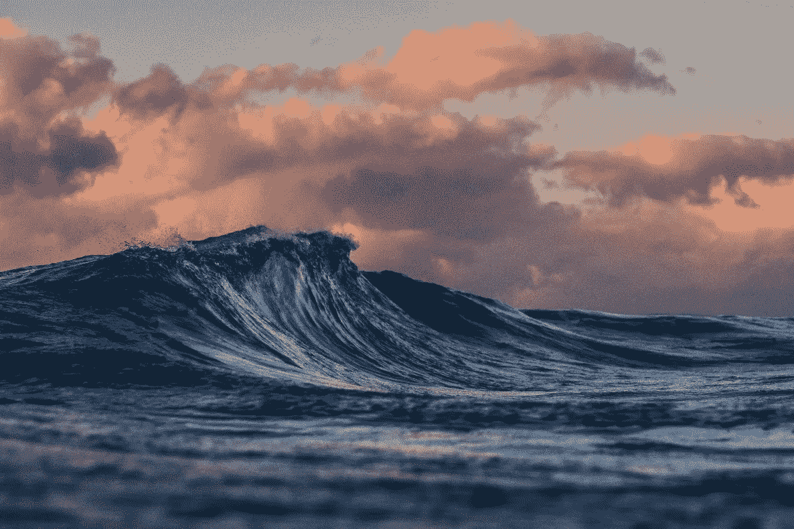
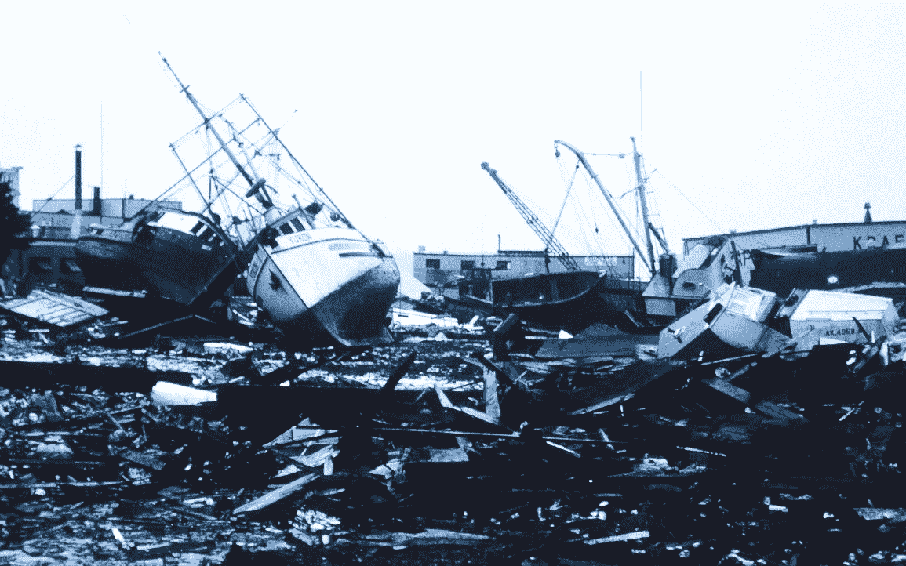

# 安迪·格罗夫《只有偏执狂才能生存》的启示

> 原文：<https://medium.datadriveninvestor.com/an-insight-from-andy-groves-only-the-paranoid-survive-356af91cd92d?source=collection_archive---------8----------------------->

## 进入正题

## 当 10X 事件震撼你的世界时会发生什么？

Photo by [Silas Baisch](https://unsplash.com/@silasbaisch?utm_source=unsplash&utm_medium=referral&utm_content=creditCopyText) on [Unsplash](https://unsplash.com/s/photos/tsunami?utm_source=unsplash&utm_medium=referral&utm_content=creditCopyText)

这本书的全名是*只有偏执狂才能生存:如何利用每个公司都面临的危机点*。这本书深刻而坦诚地描述了英特尔历史上的一段充满挑战的时期，英特尔是安迪·格罗夫创立并领导多年的公司。

介绍性广告是这样的:

> 在*中，只有偏执狂才能生存*，格罗夫揭示了他衡量每个领导者都害怕的噩梦时刻的策略——当大规模变革发生，公司必须在几乎一夜之间适应或放弃——以一种新的方式。

很明显，我们当前的经济动荡正是这种噩梦。从华尔街屡创新高到整个世界陷入封锁的转变令人震惊。不幸的是，这是一个非常确定的赌注，有许多公司将无法幸免于这场惊天动地的事件。

Alaska 1964 Good Friday earthquake and tsunami damage. Photo by [NOAA](https://unsplash.com/@noaa?utm_source=unsplash&utm_medium=referral&utm_content=creditCopyText) on [Unsplash](https://unsplash.com/s/photos/tsunami?utm_source=unsplash&utm_medium=referral&utm_content=creditCopyText)

当我在 90 年代读格罗夫的书时，我特别想起的是一张图表，显示了在大多数企业中起作用的各种力量。然后他接着问，如果这些力量中的一种产生 10 倍的影响，你准备得如何。

竞争、政府法规、技术变革、原材料成本、失去关键供应商或自然灾害只是公司措手不及的几种方式。为了避免被市场环境的 10 倍变化淘汰出局，首席执行官必须永远保持警惕，因此这本书的标题是*只有偏执狂才能生存*。

 [## 危机管理乘“飞机”飞行真相|数据驱动的投资者

### 当埃塞俄比亚航空公司的一架 737 Max 飞机起飞后不久坠毁，整个国家陷入危机。最好的…

www.datadriveninvestor.com](https://www.datadriveninvestor.com/2019/03/26/crisis-management-flies-on-plane-truth/) 

最糟糕的是，你真的无法提前猜测 10X 事件会是什么。就新冠肺炎·疫情公司而言，我敢肯定，很少有公司在六个月前预见到这种剧变。然而，有些耳聪目明的人比其他人更早察觉到海啸即将来临。*

我住在明尼苏达州北部的农村。最近的城镇是一个铁路枢纽，通往世界上最大的内陆港口之一。安静的时候，如果你留心的话，你可以听到十英里外的火车声。当然，不断播放音乐或电视的人会淹没它。从某种意义上说，这就是许多商业领袖错过即将到来的事件的原因。他们没有耳朵听地面，因为他们经常被包围在令人分心的旋风中。

罗夫称这 10 个时刻为战略转折点。他还指出，如果管理得当，这种活动可以成为赢得市场份额的机会，并变得比以往更加强大。

格罗夫提出的观点之一是，管理者通常知道他们必须采取行动，甚至经常知道应该采取什么行动。不幸的是，我们不相信我们的直觉，或者我们没有足够快地采取行动来利用这一时刻。

> "我们必须约束自己，克服做得太少太迟的倾向。"—安迪·格罗夫

可怕的是事情变化的速度有多快。任何关注当前市场内爆的人都知道，对未来的信心很快就会突然变成恐慌。

现在显然不是一切照旧的时候。

# 相关链接

[**沙漠风暴的教训**](https://medium.com/swlh/lessons-from-desert-storm-f3a95960e775)[**谁是你的专家**](https://medium.com/@ennyman/who-are-your-experts-fc862d8186eb)[**点评 Amazon.com**](https://www.amazon.com/product-reviews/0385483821/ref=cm_cr_arp_d_viewpnt_lft?ie=UTF8&filterByStar=positive&reviewerType=all_reviews&pageNumber=1#reviews-filter-bar)