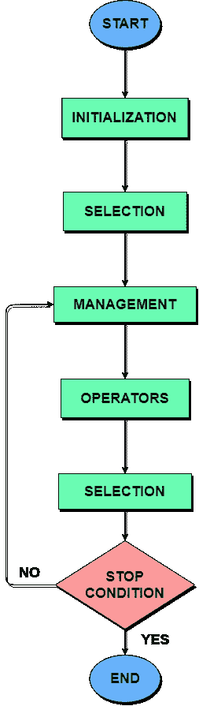
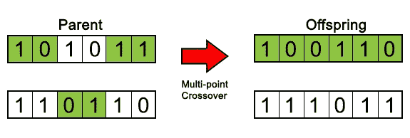
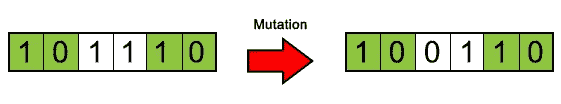

# 对遗传算法概念的理解

> 原文：<https://medium.datadriveninvestor.com/an-insight-into-genetic-algorithms-93428953c098?source=collection_archive---------6----------------------->


Photo by [National Cancer Institute](https://unsplash.com/@nci?utm_source=medium&utm_medium=referral) on [Unsplash](https://unsplash.com?utm_source=medium&utm_medium=referral)

我们时不时会听说 [**遗传算法**](https://en.wikipedia.org/wiki/Genetic_algorithm) 但是这到底是什么遗传算法呢？为什么它听起来和生物学有如此大的关系？当它被实现的时候，它真的使用基因或其他生物实体吗？或者它涉及的过程与生物学中发生的相似吗？这些是我在毕业时第一次听到遗传算法这个术语时就有的问题。如果你像我那时一样，想要在几分钟内弄清楚这个所谓的**遗传算法或 GA** 是什么，那么这是开始你旅程的正确地方。这篇文章是专门为那些对算法概念不熟悉，并且想很好地掌握计算机科学中遗传算法概念的人写的。

# 什么是遗传算法？

**遗传算法**是在[生物学](https://en.wikipedia.org/wiki/Biology)领域，遵循 [**遗传学**](https://en.wikipedia.org/wiki/Genetics) 和 [**自然选择**](https://en.wikipedia.org/wiki/Natural_selection) 原理的一种基于搜索的[优化](https://en.wikipedia.org/wiki/Mathematical_optimization)技术。此[算法](https://en.wikipedia.org/wiki/Algorithm)的主要目的是为相当多的困难问题找到最优或接近最优的解决方案，这些困难问题使用正常程序或算法可能无法解决或需要很长时间才能解决。遗传算法相当经常地用于解决 [**机器学习**](https://en.wikipedia.org/wiki/Machine_learning) 中的优化问题，并为优化问题生成高质量的解。

遗传算法的概念已经从自然遗传进化中被采用，从而再次证明了这一点

> "大自然一直是全人类灵感的巨大源泉。"
> 
> —[lakhasly.com](https://lakhasly.com/en/view-summary/vs1zPToI72)

它是一个更大的计算分支的子集，称为[](https://en.wikipedia.org/wiki/Evolutionary_computation)**。遗传算法是由 [**约翰·h·霍兰德**](https://en.wikipedia.org/wiki/John_Henry_Holland) 和他在[密歇根大学](https://en.wikipedia.org/wiki/University_of_Michigan)的学生和同事开发的，其中[大卫·e·戈德堡](https://en.wikipedia.org/wiki/David_E._Goldberg)最引人注目。**

**简而言之，遗传算法反复修改个体解的群体。在每一步，遗传算法从当前群体中随机选择个体作为父母，并用它们为下一代产生孩子。经过连续几代，种群朝着最优解“进化”。**

> **遗传算法在每一步使用三种主要类型的规则来从当前群体中创建下一代:**
> 
> ****选择规则选择对下一代群体有贡献的个体，称为父母。****
> 
> ****交叉规则结合双亲为下一代形成子女。****
> 
> ****变异规则将随机变化应用于个体父母以形成子代。[1]****

****

**Image by author on actual genetic algorithm flowchart**

# **经典算法与遗传算法的区别**

**经典算法在每次迭代后生成一个点，这些点的序列接近最优解。而另一方面，GA 在每次迭代后生成一个点群，并且群中的最佳点接近最优解。**

**经典算法通过[确定性](https://en.wikipedia.org/wiki/Determinism)方法选择序列中的下一个点，但是遗传算法使用[随机数发生器](https://en.wikipedia.org/wiki/Random_number_generation)以随机方式选择下一个群体。**

# **几个重要的术语**

## **搜索空间:**

**搜索空间基本上是存储和维护群体中所有个体或数据点的地方。这些个人中的每一个都代表给定问题的搜索空间中的一个解决方案。其中的每一个都是由组件组成的[阵列](https://en.wikipedia.org/wiki/Array)或[向量](https://en.wikipedia.org/wiki/Sequence_container_(C%2B%2B)#Vector)，并且类似于[染色体](https://en.wikipedia.org/wiki/Chromosome)，也就是说，它可以被认为是[细胞核](https://en.wikipedia.org/wiki/Cell_nucleus)内的单个染色体。染色体内的可变成分可以被认为是[基因](https://en.wikipedia.org/wiki/Gene)，即一条染色体由几个基因组成。**

## **体能得分:**

**每个人或数据点都有一个健康得分。具有最好或更好的“最优”分数的个体被考虑在内，并被给予更高的优先权来繁殖新的一代。这些具有更好适应值的个体被选择用于[交配](https://en.wikipedia.org/wiki/Mating)，它们通过结合父母的染色体产生更好的[后代](https://en.wikipedia.org/wiki/Offspring)。在实现该算法时，我们可以将种群规模设为固定或静态。更高的种群规模在更少的迭代中产生更好的后代，并且希望通过连续的迭代或世代获得更好的解决方案。如果新的后代与前几代产生的后代之间没有更显著的差异，则认为种群已经[收敛](https://en.wikipedia.org/wiki/Limit_(mathematics))并达到最优解。因此，我们说该算法已经收敛到给定问题的一组解。**

## **操作:**

****选择:**这是一种操作，具有较好适应值的个体被给予优先权，并被允许将其基因传递给下一代。因此，具有更好适应值的个体被允许交配并为下一代繁衍后代。**

****杂交:**这是一种实际的(类似的)交配发生在个体之间的操作。在该操作中选择染色体中的交叉位点或位置，并且从选择操作中选择的两条染色体用于交叉。当被选择的基因被取出并结合以产生新的后代(与父母的长度相同)时，实际的交叉就发生了。)请注意，所有交叉点的选择都是随机进行的。下面的例子将使它更清楚。**

****

**Image by author on Crossover technique**

****突变:**这是一种手术，从后代身上取出一些个体基因，使其发生突变或改变。用‘插入’这个词比用‘改变’好。这样做主要是为了保持群体中的[多样性](https://en.wikipedia.org/wiki/Biodiversity)，也是为了避免我们不希望的算法过早收敛。我们希望算法花自己的时间给出最优解。请注意，突变位置也是随机选择的。下面举个例子把事情说清楚。**

****

**Image by author on Mutation technique**

# **遗传算法的优缺点**

> **与传统的优化算法相比，遗传算法有许多优点。两个最值得注意的是，处理复杂问题的能力和并行性。遗传算法可以处理各种类型的优化，无论目标(适应度)函数是**平稳的还是非平稳的(随时间变化)，线性的还是非线性的，连续的还是不连续的，或者具有随机噪声。因为群体中的多个子代表现得像独立的代理，所以群体(或任何子群体)可以同时在许多方向探索搜索空间。这一特性使得并行算法的实现变得非常理想。可以同时操作不同的参数，甚至不同组的编码字符串。[2]****
> 
> **然而，遗传算法也有一些缺点。应该小心地执行适合度函数的制定、群体大小的使用、诸如突变和交叉率的重要参数的选择以及新群体的选择标准。任何不恰当的选择都会使算法难以收敛或者只是产生无意义的结果。尽管有这些缺点，遗传算法仍然是现代非线性优化中最广泛使用的优化算法之一。[2]**

## **其他优势包括:**

*   **遗传算法能够优化[连续](https://en.wikipedia.org/wiki/Continuous_function)和[离散函数](https://en.wikipedia.org/wiki/Sequence)以及[多目标问题](https://en.wikipedia.org/wiki/Multi-objective_optimization)如路线规划(取决于距离、时间、交通等)。)**
*   **它总是生成一个解决方案，而且是一个随着时间或连续迭代而改进的解决方案。**
*   **当搜索空间或个体群体非常大并且具有大量参数时，该算法非常有用并且产生更好的结果。**
*   **基本上比经典算法更快，效率更高。**

## **缺点包括:**

*   **最大的缺点可能是，由于 GA 本质上是随机的，所以不能保证解决方案的最优性或质量。很多时候可能达不到预期的解决方案。**
*   **如果遗传算法没有正确实现，那么我们可能无法达到最优解，即算法可能不会收敛。**
*   **对于某些问题，为每一个连续的代计算适应值的事实可能增加[计算复杂性](https://en.wikipedia.org/wiki/Computational_complexity)。**

# **伪代码**

**下面是一个典型 GA 的伪代码草图:**

```
GA()
begin
  Create initial population;
  while (Until Stopping Criteria)
    for (Each Chromosome)
      Calculate fitness value;
      Selection (Survival of strong individuals);
      Crossover (Here, new generation produced);
      Mutation (Changing some genes for new and
                different individuals);
    end
  Generate new population;
  end
end
```

# **我们现在可以深入研究代码了吗？**

**下面是一个简单的 python 程序示例，其中实现了遗传算法。代码取自 [GeeksforGeeks](https://www.geeksforgeeks.org/) ，因此我不以任何方式声明以下代码的所有权。我会尽力一步一步地解释代码。**

**这部分主要是在 [Python](https://en.wikipedia.org/wiki/Python_(programming_language)) 中导入 **random** 库，设置种群大小，设置有效基因，以及目标字符串。**

**这是类**个体**定义开始的地方，它定义了两成员变量**染色体**和**适应度**，并初始化它们。**

****突变基因()**是基因发生突变的函数。这里，从基因库中取出一个随机基因，并将其返回给主程序。**

****create_gnome()** 创建目标长度的单个侏儒或染色体，并返回主函数。**

**mate() 是一个非常重要的功能，因为这里正是具有更好适应性的新染色体产生的地方。这里发生的两个操作是**交叉**和**变异**。这实际上是一种修改的或定制的遗传算法，其中的操作是基于随机概率的。如果概率是**小于 0.45** ，那么来自**亲代染色体 1** 的基因被传递给**子代染色体**，而如果概率是**大于或等于 0.45** 并且**小于 0.90** ，那么来自**亲代染色体 2** 的相应基因被传递给**子代染色体**，如果概率是**大于或****

****cal_fitness()** 计算特定染色体的**适应度得分**并返回，以便遗传算法做出相应的决定。这个特定的函数检查是否已经达到目标字符串，并相应地根据尚未满足目标要求的字符数创建适合度分数。**

**这是主要的算法函数，所有前面的函数都被调用来完成各自的工作。首先，创建**初始群体**。然后，根据群体的适应度得分对群体进行**排序，将得分最高的染色体放在最前面。现在，它首先检查**(最佳适应值)**是否具有小于或等于 0 的适应值**，然后它将返回该字符串，因为它是目标字符串，并且算法停止。如果不是，它执行 [**精英化**](https://en.wikipedia.org/wiki/Elitism) 通过将 **10%的最适种群**加入到下一代种群中，并且进一步 **50%的老种群**进入交配产生子代。现在，新一代又从头开始工作，通过所有上述步骤。最终，我们看到在相当长的执行时间后，算法停止并产生**目标字符串**。******

**这是我收到的输出:**

```
PS C:\Users\RAJARSI> & python c:/Users/RAJARSI/Desktop/GA.py
Generation: 1   String: i a2yl [TXl Xn[:rZnL    Fitness: 18
Generation: 2   String: U[vW 5 mL&TgW rdLeVY    Fitness: 17
Generation: 3   String: 4g9W/5 mO&["W rGLefY    Fitness: 16
Generation: 4   String: 4gCa/5 G];[4Wo;G3e}Y    Fitness: 15
Generation: 5   String: 4gCa/5 G];[4Wo;G3e}Y    Fitness: 15
Generation: 6   String: F 1! e GeWk@/bal#tk2    Fitness: 13
Generation: 7   String: F 9! e Ge k@#OtG#e}9    Fitness: 12
Generation: 8   String: F 9! e Ge k@#OtG#e}9    Fitness: 12
Generation: 9   String: { C0Xh GeePv=orG3ePY    Fitness: 11
Generation: 10  String: 5y6/;e Gee3nWorG3ekY    Fitness: 10
Generation: 11  String: 5y6/;e Gee3nWorG3ekY    Fitness: 10
Generation: 12  String: I 1WPe GeekD=oZG_e}Y    Fitness: 9
Generation: 13  String: I 1WPe GeekD=oZG_e}Y    Fitness: 9
Generation: 14  String: I 1WPe GeekD=oZG_e}Y    Fitness: 9
Generation: 15  String: I ( W  GeeknaorG3ekY    Fitness: 8
Generation: 16  String: I ( W  GeeknaorG3ekY    Fitness: 8
Generation: 17  String: I }!pe Geek"QorGPekY    Fitness: 7
Generation: 18  String: I }!pe Geek"QorGPekY    Fitness: 7
Generation: 19  String: I }!pe Geek"QorGPekY    Fitness: 7
Generation: 20  String: F Oo&e Geekn5orGeekY    Fitness: 6
Generation: 21  String: F Oo&e Geekn5orGeekY    Fitness: 6
Generation: 22  String: F Oo&e Geekn5orGeekY    Fitness: 6
Generation: 23  String: F Oo&e Geekn5orGeekY    Fitness: 6
Generation: 24  String: I loOe Geev"5orGeekY    Fitness: 5
Generation: 25  String: I loOe Geev"5orGeekY    Fitness: 5
Generation: 26  String: I goOe GeekJYorGeeks    Fitness: 4
Generation: 27  String: I goOe GeekJYorGeeks    Fitness: 4
Generation: 28  String: I goOe GeekJYorGeeks    Fitness: 4
Generation: 29  String: I goOe GeekJYorGeeks    Fitness: 4
Generation: 30  String: I goOe GeekJYorGeeks    Fitness: 4
Generation: 31  String: I goOe GeekJYorGeeks    Fitness: 4
Generation: 32  String: I goOe GeekJYorGeeks    Fitness: 4
Generation: 33  String: I goOe GeekJYorGeeks    Fitness: 4
Generation: 34  String: I goOe GeekJYorGeeks    Fitness: 4
Generation: 35  String: I lo e GeekJQorGeeks    Fitness: 3
Generation: 36  String: I lo e GeekJQorGeeks    Fitness: 3
Generation: 37  String: I love Geek"farGeeks    Fitness: 2
Generation: 38  String: I love Geek"farGeeks    Fitness: 2
Generation: 39  String: I love Geek"farGeeks    Fitness: 2
Generation: 40  String: I love Geek"farGeeks    Fitness: 2
Generation: 41  String: I love Geek"farGeeks    Fitness: 2
Generation: 42  String: I love Geek"farGeeks    Fitness: 2
Generation: 43  String: I love Geek"farGeeks    Fitness: 2
Generation: 44  String: I love Geek"farGeeks    Fitness: 2
Generation: 45  String: I love Geek"farGeeks    Fitness: 2
Generation: 46  String: I love Geek"farGeeks    Fitness: 2
Generation: 47  String: I love GeekEforGeeks    Fitness: 1
Generation: 48  String: I love GeekEforGeeks    Fitness: 1
Generation: 49  String: I love GeekEforGeeks    Fitness: 1
Generation: 50  String: I love GeekEforGeeks    Fitness: 1
Generation: 51  String: I love GeekEforGeeks    Fitness: 1
Generation: 52  String: I love GeekEforGeeks    Fitness: 1
Generation: 53  String: I love GeekEforGeeks    Fitness: 1
Generation: 54  String: I love GeekEforGeeks    Fitness: 1
Generation: 55  String: I love GeekEforGeeks    Fitness: 1
Generation: 56  String: I love GeekEforGeeks    Fitness: 1
Generation: 57  String: I love GeekEforGeeks    Fitness: 1
Generation: 58  String: I love GeekEforGeeks    Fitness: 1
Generation: 59  String: I love GeekEforGeeks    Fitness: 1
Generation: 60  String: I love GeekEforGeeks    Fitness: 1
Generation: 61  String: I love GeekEforGeeks    Fitness: 1
Generation: 62  String: I love GeekEforGeeks    Fitness: 1
Generation: 63  String: I love GeekEforGeeks    Fitness: 1
Generation: 64  String: I love GeeksforGeeks    Fitness: 0
PS C:\Users\RAJARSI>
```

**如果你收到了不同的输出不要担心，没有两个遗传算法的输出是相同的，因为整个过程是随机运行的。如果你的代码需要更长的时间来运行，没什么好担心的。下一次跑步可能会更快。但是最终算法应该以字符串**“我爱极客”结束****

# **应用程序**

> **贝叶斯推理链接到贝叶斯统计和隐马尔可夫链模型中的粒子方法**
> 
> **分布式计算机网络拓扑**
> 
> **电子电路设计，被称为进化硬件**
> 
> **使用遗传算法学习机器人行为**
> 
> **图像处理:密集像素匹配**
> 
> **使用遗传算法学习模糊规则库**
> 
> **博弈论均衡解决方案**
> 
> **以及更多… [3]**

# **结论**

**所以，在这篇文章中，我首先尝试解释什么是真正的 T2 遗传算法，然后我尝试解释 T4 经典算法和遗传算法的区别。我重点关注了遗传算法中使用的各种重要的**术语**，以及它们与现实生活中的遗传学和生物进化有何相似之处。三种操作**选择、交叉和变异**是整个遗传算法的基础。所以，这些是最重要的操作。**

****优点**和**缺点**是在考虑将 GA 应用到您的问题之前需要知道的一些事情。正如你所看到的，有相当多的问题可以用遗传算法来解决，但也有许多问题不能解决，或者需要花费更多的时间来解决。因此，在数据的群体规模非常大的情况下，我更喜欢使用 GA，因此**随机性**实际上会起作用。你呢？**

# **参考**

1.  **[https://in . mathworks . com/help/gads/what-is-the-genetic-algorithm . html](https://in.mathworks.com/help/gads/what-is-the-genetic-algorithm.html)**
2.  **[https://www . science direct . com/science/article/pii/b 9780124167438000051](https://www.sciencedirect.com/science/article/pii/B9780124167438000051)**
3.  **[https://en . Wikipedia . org/wiki/List _ of _ genetic _ algorithm _ applications](https://en.wikipedia.org/wiki/List_of_genetic_algorithm_applications)**