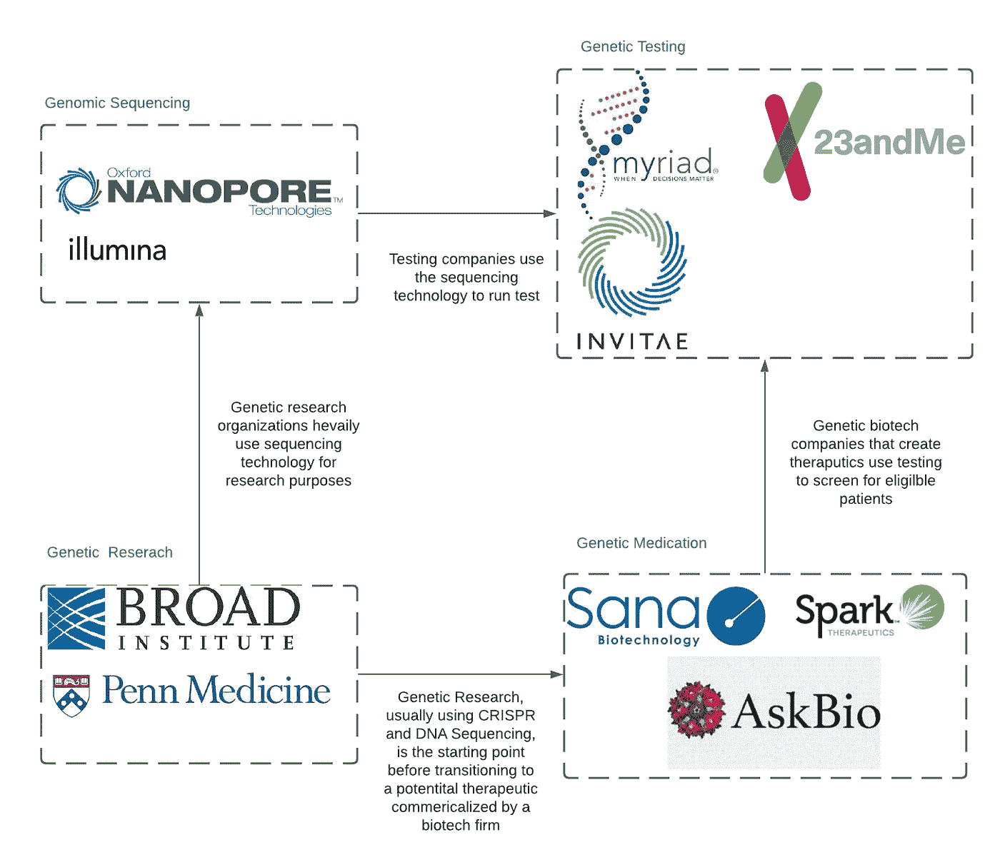
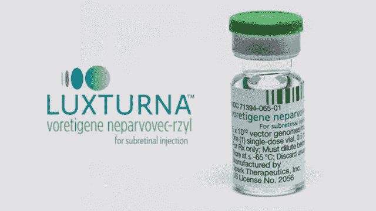
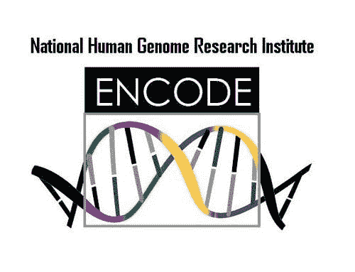

# 基因医学介绍，你应该投资吗？

> 原文：<https://medium.datadriveninvestor.com/an-intro-to-genomic-medicine-and-should-you-invest-b53a2cfa2656?source=collection_archive---------13----------------------->

投资者认为基因组学是下一个技术领域。随着基因组学领域变得越来越主流，这种说法还是有一定道理的。基因组学是对一个人的整个遗传密码或 DNA 的研究。让我们探索基因组医学的世界，了解为什么它有如此巨大的潜力，以及大规模采用和主要财务增长的主要障碍。

沃森和克里克在 20 世纪 50 年代发现了 DNA 的双螺旋结构。然后在 2003 年，第一个人类基因组被测序。这意味着从 1950 年到 2003 年，我们没有构成人体的完整遗传密码。CRISPR(读作“Crisper”)是另一项革命性的生物技术，能够修改人类基因。尽管它源于 1987 年在大肠杆菌中的一项发现，但这项技术直到 2012 年才可用于靶向基因编辑。

我们对 DNA 的了解由来已久，但我们仍处于基因组科学的初级阶段，该领域发展非常迅速。今天，有许多参与者一起工作来组成基因组空间。

KTSDESIGN/SCIENCE PHOTO LIBRARY/Getty

# **风景**

基因组生态系统相当复杂。这个图表仍然是这些组织之间的动态工作的简化，因为有更多的参与者，并且在整个领域有许多交叉授粉。

有基因检测公司，如 Invitae 和 23 和 me，其主要职责是通过收集患者的唾液样本，对其 DNA 进行测序(从唾液中捕获代码)，并提供疾病的预测风险评分，如癌症。基因筛查也可以预测患者对现有药物的反应，根据他们的基因标记，即他们基因组中特定代码的存在，特定的治疗是否对他们有效。

这些公司使用一种称为下一代测序的技术，也称为 NGS。NGS 使用荧光结合对 DNA 进行颜色编码，这使得它能够被计算机快速读取和分析。这一领域有两个主要参与者。最大的是 Illumina 测序和牛津纳米孔技术。这些玩家创造了驱动基因测试的机器。

生产药物和临床基因疗法的基因生物技术公司利用基因检测公司来筛选合格的病人。例子包括 Spark Therapeutics，它发布了第一个 FDA 批准的基因疗法 [LUXTURNA](https://www.fda.gov/news-events/press-announcements/fda-approves-novel-gene-therapy-treat-patients-rare-form-inherited-vision-loss) 。Luxturna 治疗一种罕见的遗传疾病，称为“Leber 先天性黑蒙症”，这种疾病导致出生时部分失明。这一点很重要，因为 Luxturna 确实可以治愈失明，不需要手术，也不需要患者终生服药(不像治疗艾滋病的 HAART 疗法)！

Spark therapeutic 实际上是根据宾夕法尼亚大学的研究建立的。宾夕法尼亚大学以其对 CAR-T 疗法的临床研究[而闻名。CAR-T 疗法对患者自身的免疫细胞 T 细胞进行重新编程，以靶向并杀死癌细胞。这一领域的大多数先进能力来自大学赞助的研究。2012 年，](https://www.usnews.com/news/health-news/articles/2020-12-09/breakthrough-cancer-therapies-offer-hope-for-patients) [CRISPR 通过皮埃尔和玛丽·居里大学和加州大学伯克利分校的研究人员的合作，成为了今天的应用技术](https://science.sciencemag.org/content/337/6096/816)。CRISPR 提供了通过将 DNA 片段插入目标位置来修改活体样本的基因序列的能力。本质上，它允许我们重写我们的 DNA。虽然它在研究实验室中被广泛使用，但今天，我们仍然只是在[临床试验](https://www.nature.com/articles/d41586-020-03476-x)中使用 CRISPR 直接治疗疾病。

# **爆发式增长**

有几个趋势正在推动基因组能力的爆炸，特别是在过去十年里。

测序技术价格的下降。第一个人类基因组测序和比对花费了 30 亿美元。现在我们可以以低至 100 美元的价格对整个人类基因组进行测序。利用技术的成本大幅降低，使得基因测序对大众来说成为可能，从而积累了大量数据。

最终，一旦 DNA 测序完成，一切都变成了数据。大数据、机器学习(AI)和云计算的进步同样有利于基因组学领域。机器学习通常被错误地称为人工智能，它有两种应用方式。首先，它有助于更好地预测病人的结果。机器学习可以预测带有遗传标记的病人对风湿性关节炎的治疗反应是积极还是消极。

第二，它正被用于识别人类在数据中寻找耗时费力的关系。基因组学研究的一个问题是需要筛选的数据堆积如山。我们的人类基因组包含超过 30 亿个碱基对。虽然我们有代码，DNA- A，C，T，G 的组合，科学家们实际上不知道它的大部分是干什么的。[编码项目](https://www.genome.gov/27551473/genome-advance-of-the-month-encode-deciphering-function-in-the-human-genome)目前正试图创建一个巨大的数据库来破译我们基因组片段的功能。[机器学习正被大量用于整理这座数据山](https://www.nature.com/articles/nature28180)，其中包括其他数据集，如患者健康记录和蛋白质功能。这些算法识别基因组的模式和区域，这些模式和区域可能负责与削弱生命的疾病相关的特定功能。

有句话说第一步是最难的。我真的相信！第一个人类基因组测序花了 13 年，现在他们可以在 4 小时内完成测序。这之所以成为可能，是因为人类基因组计划奠定了基础。Luxturna 首次获得 FDA 对基因疗法的批准，这使得许多其他公司也试图打破这一领域变得更加容易。仅仅知道它在实验室里是可能的是不够的，它需要得到临床批准，这样治疗才能适用，从而有利可图。

 [## 这么说一家大型风投基金正在投资你的初创公司？4 实际考虑|数据驱动的投资者

### 首先，恭喜你。融资总是需要努力的，一个大的风险投资基金当然是一个大的…

www.datadriveninvestor.com](https://www.datadriveninvestor.com/2020/08/09/so-a-big-vc-fund-is-investing-in-your-startup-4-practical-considerations/) 

# **基因组学面临的挑战-**

**监管批准** -基因组学仍然是医疗保健的一部分，医疗保健是一个受到严格监管的行业。在技术领域，错误的产品特性可能会导致客户不满意，然而，在这个领域，错误的产品特性会导致死亡。应用于患者的任何东西，无论是基因筛查还是药物，都有生/死的可能性，因此需要 FDA 的批准和临床疗效的证据。这需要时间，而且研究需要一大笔钱。

**资本成本-** 在技术领域，你最大的成本是你的 AWS 账单。在基因组学中，这只是你成本的一部分。在一家治疗公司，临床试验研究的费用高达数十亿美元。即使在研究环境中，为基础研究获得必要的设备也要花费[10 万到 100 万美元](https://www.ncbi.nlm.nih.gov/books/NBK217811/)。

Photo by [Edward Jenner](https://www.pexels.com/@edward-jenner?utm_content=attributionCopyText&utm_medium=referral&utm_source=pexels) from [Pexels](https://www.pexels.com/photo/man-doing-a-sample-test-in-the-laboratory-4033148/?utm_content=attributionCopyText&utm_medium=referral&utm_source=pexels)

**教育** —由于遗传学仍然是一个相对较新的领域，它需要对患者和医生进行大量的教育。医疗保健对变革有偏见，尤其是因为失败的风险如此之大。获得医生的采纳，然后医生向他们的患者推荐治疗和筛查，这对于遗传筛查和治疗的采纳至关重要。

**现代医学的局限性**——尽管我们可能研究了与糖尿病相关的[基因，但功能疗法也需要有效地提供给患者。Spark therapeutic 选择一种罕见的视网膜疾病的原因是治疗方法很简单，直接向眼睛注射药物。糖尿病的治疗需要靶向胰腺，并且药物递送相当具有挑战性。当药物进入人体时，没有简单的方法来告诉它向左或向右。这对于阿司匹林等简单药物来说无关紧要，因为它只是进入血液。然而，当您需要将浓缩剂量的药物输送到非常特定的器官时，这是非常具有挑战性的(并且在今天并不真正有效)。](https://www.ncbi.nlm.nih.gov/pmc/articles/PMC7580382/)[研究和应用](https://finance.yahoo.com/news/global-rna-interference-drug-delivery-115300011.html)正在增长，然而，这个领域依赖于现代基因疗法的有效性和能力。

**成本结构-** 基因组测试和治疗作为一次性程序进行。因此，主要问题在于你如何向病人收费？Luxturna 向其病人[收取 85 万美元](https://www.reuters.com/article/us-spark-icer/sparks-price-for-luxturna-blindness-gene-therapy-too-high-icer-idUSKBN1F1298)的治疗费用。这与病人终身服用的每月药费形成了对比。Cigna 旗下的 Express Script 创建了一个名为 [Embarc](https://www.modernhealthcare.com/payment/cigna-aims-expand-affordable-access-gene-therapies) 的项目，专门为这些治疗付费。然而，考虑到患者在更换雇主时可能会更换保险公司，保险公司的风险是巨大的。

类似地，除非筛查是针对特定突变，如乳腺癌的 BRCA 基因检测，全基因组筛查只应用一次。一旦基因筛查应用于整个人群，这种一次性筛查的性质使得收入模式变得非常棘手。

# 遗传学会是下一个科技吗？

从 5-10 年的长期来看，毫无疑问，基因组学将成为医疗保健领域的主要参与者。然而，与技术不同，还有更大的障碍，如监管合规性、研究资金成本和现代医学的局限性。与 Slack 或 Twitter 等不受监管的科技公司相比，基因组领域的公司 Apples to apples 在规模和增长方面面临更多挑战。此外，它需要明确定义一种方法，在一次性过高成本之外创造收入，并需要找到一种对支付者有吸引力且在行业中实用的收入结构。然而，应用基因组学具有改变生活和彻底改变整个医学领域的巨大潜力。

在未来，随着该领域的成熟，基因筛查将为药物反应提供更好的预测和更有趣的预测，例如总体寿命，甚至你未出生的孩子的潜在智商。它也将成为个性化医疗的重要组成部分，为患者提供更好的药物效果。我预测基因疗法将解决更广泛的常见疾病，如糖尿病和动脉粥样硬化。基因测序技术将变得更加容易获得，也许到了门诊办公室拥有测序设备的地步。然而，到今天为止，我们仍然处于这一漫长而激动人心的旅程的开始。

## 访问专家视图— [订阅 DDI 英特尔](https://datadriveninvestor.com/ddi-intel)