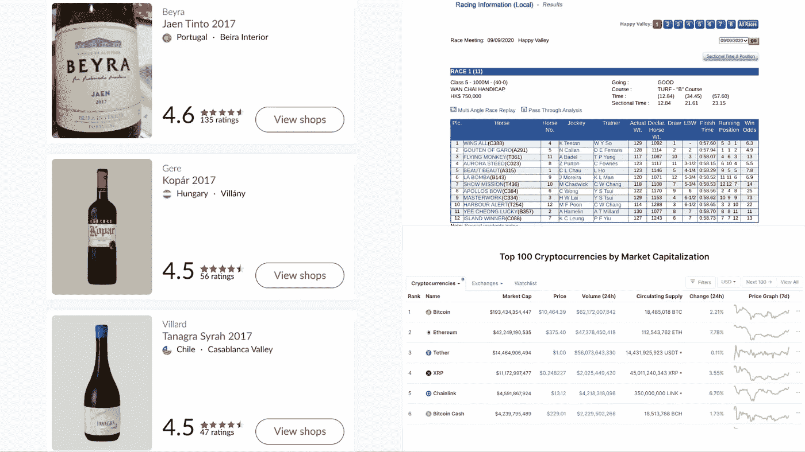
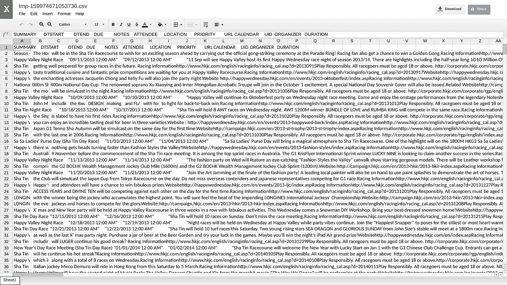
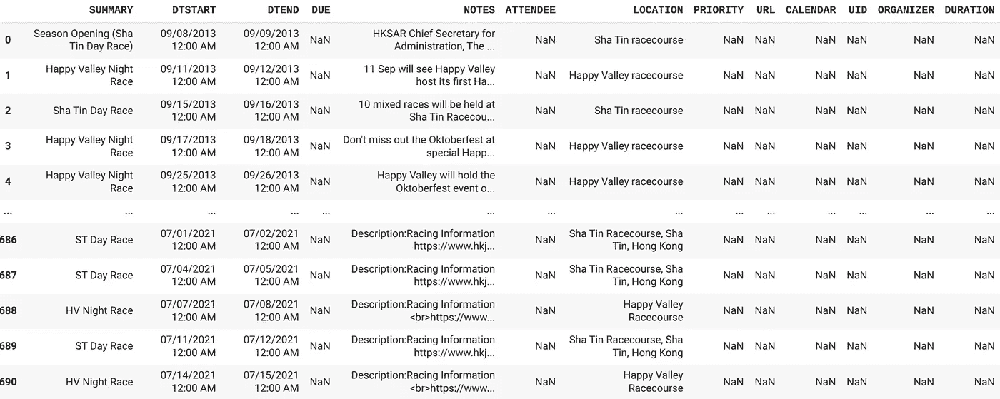
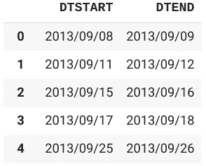

# 阅读抓取数据简介

> 原文：<https://medium.datadriveninvestor.com/an-intro-to-reading-scraped-data-7163b9360bba?source=collection_archive---------17----------------------->

## 从网络抓取中获取有用数据。


Photo by [Nastya Kvokka](https://unsplash.com/@nastya_kvokka?utm_source=medium&utm_medium=referral) on [Unsplash](https://unsplash.com?utm_source=medium&utm_medium=referral)

*免责声明:刮痧处于法律的灰色地带，所以在刮痧之前要做好自己的研究。*

W eb 抓取是获取替代数据的一种强大方式。通过访问额外的、相对未开发的数据(与 API 或整洁的 CSV 文件相比)，你可能会在人工智能建模方面比竞争对手获得优势，无论你是用 Python 编码还是使用 AutoML 工具，如 [Apteo](http://apteo.co) 。

然而，收集到的数据往往极其混乱。不同的网站有完全不同的风格，格式和数据的位置。例如，这里有来自三个不同站点的三个表:一个葡萄酒评论站点、一个赛马站点和一个加密价格站点。



在我们的表格周围有一些东西，比如空格、图像、我们可能不想要的超链接、按钮和不相关的数据。不管使用什么工具，这些都可能出现在我们收集的数据中。

[](https://www.datadriveninvestor.com/2020/08/27/what-is-a-data-catalog-and-how-does-it-enable-machine-learning-success/) [## 什么是数据目录，它如何使机器学习取得成功？数据驱动的投资者

### 数据目录是机器学习和数据分析的燃料。没有它，你将不得不花费很多…

www.datadriveninvestor.com](https://www.datadriveninvestor.com/2020/08/27/what-is-a-data-catalog-and-how-does-it-enable-machine-learning-success/) 

杂乱的数据不适合分析工具，因为分析工具需要特定的、干净的数据格式。

[](https://medium.com/towards-artificial-intelligence/7-techniques-to-clean-and-structure-data-for-analysis-e38af00f3725) [## 清理和结构化数据以进行分析的 7 种技术

### 节省时间的最佳方法。⏰

medium.com](https://medium.com/towards-artificial-intelligence/7-techniques-to-clean-and-structure-data-for-analysis-e38af00f3725) 

## 简单的指南

我最近想检索所有香港赛马会比赛的日期，结果得到了这个结果。



如果我们尝试使用`pd.read_csv`在 Python 中读取这个文件，我们会得到一个错误。

```
ParserError: Error tokenizing data. C error: Expected 3 fields in line 10, saw 9
```

问题出在名字:**逗号分隔值**。通常，抓取的数据不是逗号分隔的。事实上，我们的数据中存在不同程度的间距，我们可以通过放大文件中的一行来看到这一点。


我们需要告诉熊猫分隔符是什么——在这里是制表符。

```
df = pd.read_csv('tmp-159974671053736.csv', sep='\t')
```

现在，我们得到了更合理的产量。



正如我们在 [read_csv 文档](https://pandas.pydata.org/pandas-docs/stable/reference/api/pandas.read_csv.html)中看到的，你可以传入*任何正则表达式*作为分隔符。

出于我的目的，我希望只关注日期列(以获得所有比赛的日期)，这可以用这段代码来实现。

```
df = df[['DTSTART', 'DTEND']]
```

让我们验证一下我们实际上看到的是日期。

```
type(df['DTSTART'][0])
```

这会输出`str`，这意味着我们的日期格式不正确。我们希望将它们格式化为日期，特别是 YYYY/MM/DD 格式(例如 2017/05/25)。

```
df['DTSTART'] = pd.to_datetime(pd.Series(df['DTSTART']))
df['DTEND'] = pd.to_datetime(pd.Series(df['DTEND']))df.DTEND = df.DTEND.dt.strftime('%Y/%m/%d')
df.DTSTART = df.DTSTART.dt.strftime('%Y/%m/%d')
```

现在我们有了我们想要的每场比赛日期的精确格式。



我们可以将其导出为 CSV 格式，如下所示:

```
df.to_csv('df.csv')
```

或 Excel 表格:

```
df.to_excel('df.xlsx')
```

## 摘要

抓取的数据看起来*超级混乱，但是像`read_csv`分隔符参数和正则表达式这样的简单工具可以用来轻松格式化数据。*

***访问专家视图—** [**订阅 DDI 英特尔**](https://datadriveninvestor.com/ddi-intel)*