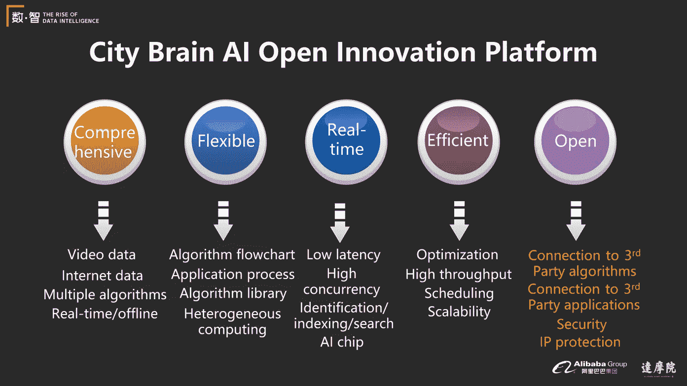
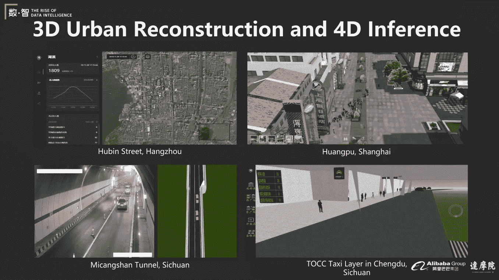
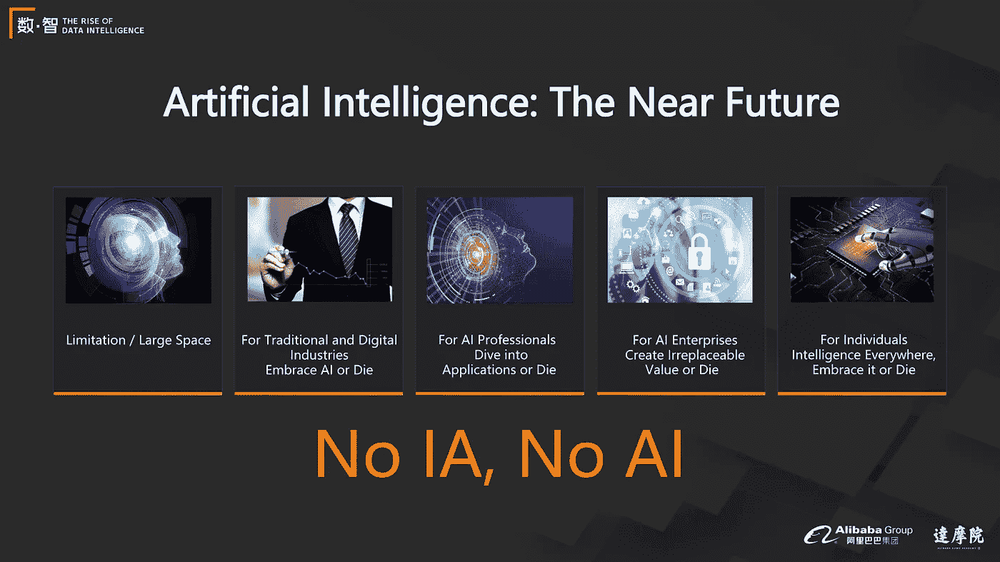

# 人工智能的介绍、发展、应用和未来

> 原文：<https://medium.datadriveninvestor.com/an-introduction-to-ai-its-development-application-and-future-fbf7143dae9a?source=collection_archive---------19----------------------->

如今，[人工智能](https://www.alibabacloud.com/product/machine-learning) (AI)技术应用广泛，各行业不可或缺。利用人工智能推动发展是每个企业都在思考的问题。在这篇文章中，华险生根据 AI 在不同行业中的应用分析了 AI 的发展，并预测了其未来的发展。华贤生是阿里巴巴 DAMO 研究院人工智能中心和[城市大脑实验室](https://www.alibabacloud.com/solutions/intelligence-brain/city)的主任，也是美国电气与电子工程师学会的院士。

# 人工智能的发展

人工智能的发展经历了三个高峰。第一个高峰是 20 世纪 50 年代 AI 的初步崛起。第二个高峰是 80 年代发展起来的 AI 专家系统。现在，我们预测第三个高峰即将到来。前两次高峰并没有像预期的那样彻底改变社会。第三个会有所不同吗？第三个高峰有四个显著特征:

## 1.深度学习技术:

深度学习作为 AI 强有力的支撑工具，为很多尚未解决的问题提供了解决方案。

## 2.巨大的计算能力:

云计算和芯片计算能力的提高，大大增加了计算机的数据处理能力。

## 3.海量数据:

各行业积累的海量数据，为 AI 应用创造价值提供了前提条件。

## 4.成功案例:

搜索引擎、电子商务推荐、面部识别支付的成功应用为人工智能的发展提供了借鉴。

**人工智能产业快速增长**

自 2012 年左右以来，人工智能行业发展迅速。在 2017 年和更早的时候，全球涌现了 8000 多家人工智能创业公司，活跃的人工智能创业公司数量增加了 14 倍。2017 年，167 家中国人工智能企业获得的投资总额超过 50 亿美元。目前，大多数企业都建立了自己的人工智能实验室，以协助发展业务。

**AI 的困境**

虽然人工智能发展迅速，但该技术在实际应用中仍存在许多问题，如收入困难、数据差异大、核心价值难以实现、用户期望高等。

 [## 隐私指南，关于应用开发|数据驱动投资者

### 挪威隐私机构 DPA 对当地的一个现实处以 20 万欧元的罚款，原因是…

www.datadriveninvestor.com](https://www.datadriveninvestor.com/2020/04/29/privacy-guidelines-about-app-development/) 

# 收入

利用人工智能创造收入是人工智能企业面临的最大挑战。根据 2018 年的行业统计，超过 90%的 AI 企业都是亏损的。人工智能项目的缺点是需要高投资，但投资回报率(ROI)低，因为企业必须在项目定制和开发方面投入大量资金。随着企业间的技术差距缩小，开发通用 AI 产品的回报也在降低。

# 实验室与实际应用

AI 实现的第二个困境是实验数据和实际数据的巨大差异。由于公共数据集和真实企业数据之间的巨大差异，真实企业场景中的结果往往不尽如人意。企业无法正确估计这些技术应用的效果，大大降低了企业的信心。例如，在实验室中，开发人员的代码在野外标记的人脸(LFW)上具有很高的准确性，这是一个著名的面部识别数据集。然而，由于场景之间的巨大差异，当这样的代码在实际场景中运行时，结果往往不尽如人意。

另一个例子是人员重新识别。公共测试数据集和实际应用程序之间的差异甚至更大。与公开数据集中的数据相比，真实场景中的人往往穿着不同的衣服，乘坐不同的车辆，执行不同的动作。这种变化给算法的识别带来了很大的困难，大大降低了算法的准确性。

**可用技术与用户需求**

人工智能的第三个困境是现有技术和用户的真实需求之间存在巨大差异。企业用户对 AI 的期望很高，往往希望通过使用 AI 解决大部分业务问题。然而，人工智能只是针对某些类型的业务问题的良好解决方案。它无法满足所有业务需求。

# 什么是成功的 AI 技术/应用？

一般来说，成功的 AI 技术会为企业创造核心价值。AI 技术的价值观可以分为以下几类。

## 1.让它变得更好:

如果企业投入大量的人力物力去改进现有的应用，往往得不到预期的回报，造成资源的浪费。

## 2.提供及时的帮助:

在这种情况下，企业开发的技术可以为行业创造不可替代的价值，为一些商业问题提供很好的解决方案。

## 3.创建新功能:

一项新的人工智能技术带来了新的需求和新的业务。手机的大屏幕就是一个很好的例子。手机是为通信而设计的，但随着技术的发展，手机允许用户通过更大的屏幕观看视频、浏览网站和打视频电话。更大的屏幕已经成为手机不可或缺的功能。

**大规模人工智能应用**

基于大规模的 AI 应用，阿里巴巴通过解决实际应用场景中的问题来推动其 AI 研发。下图是阿里巴巴的部分 AI 应用。本文描述了基于这些应用的人工智能。

**视觉搜索**

目前，视觉搜索技术广泛应用于许多领域，例如普通搜索、商品搜索、城市搜索和原材料搜索。下面的例子用电子商务领域的视觉搜索来描述视觉搜索的关键技术。

# 视觉搜索过程

电子商务视觉搜索过程可以分为六个步骤:类别分类、主题检测特征提取、检索和索引、排序、结果呈现。该系统基于该算法识别图像中产品的类别。然后，系统通过主体检测对图像中的目标产品进行标记，并基于算法将图像的像素转化为可计算的特征。产品图像搜索引擎将产品的特征数据与索引中的特征数据进行比较，根据相似性对返回的结果进行排序，并最终显示重新排列的产品。

# 特征学习

特征学习是视觉搜索的关键步骤。基于深度学习的特征学习方法从图像中提取产品的特征，并将图像转换为可比较的向量。深度学习提高了特征学习的效果，并允许用户设计网络结构，以迫使神经网络理想地收敛图像特征。这大大提高了搜索算法的准确率和召回率。

# 索引和搜索系统

索引和搜索系统是视觉搜索中的另外两个挑战。搜索矢量是一项挑战。一种常见的方法是将图像的矢量特征转换成可以被索引的数据。在搜索阶段，企业构建搜索系统来处理用户的搜索请求。搜索系统将索引数据分发到多个服务器进行存储，将每个搜索请求发送到不同的服务器进行处理，对所有搜索结果进行汇总和排序。

# 技术效果

淘宝应用程序的 pailitao 功能使用视觉搜索技术来识别用户图像中的产品并检索它们。下图是派力陶的效果。在这里，系统检索到的产品与用户上传的图片中的产品基本相同或相似。该功能减少了用户手动搜索产品的时间，大大提升了用户的购物体验。

**视觉创作**

视觉创建技术可以应用算法来创建视觉数据，包括图像、三维(3D)图形和视频。这项技术通过结合视觉分析、搜索和视觉创作引擎，将用户的想法转化为可见的视觉数据。以下是视觉创作在不同场景中的应用实例。

# Alibaba wood——将产品页面变成视频

阿里巴巴已经使用视觉创作技术，在几秒钟内将淘宝上的产品页面变成视频。系统自动分析产品页面上的图像和文本，并根据分析结果生成视频。通过将静态的产品页面转化为动态的视频，可以提高点击率(CTR)和产品的转化率，降低视频制作成本。

# 视频修复和增强

视觉创作也可以用来修复低分辨率的视频。人工修复 1.5 小时的胶片需要 40 天，但用人工智能技术修复只需 3 小时。在阿里巴巴和优酷推出的“经典高清影片”模块中，通过视频修复和增强，在极短的时间内自动修复 1000 多部经典影片。下图是电视剧《士兵突击》的修复效果。这部电视剧在电影院上映，受到了观众的高度赞扬。

## 视频内容嵌入:从位置检测和跟踪到渲染

通过视频创作，企业可以在视频中的适当位置嵌入广告。嵌入视频内容的技术使用算法来分析视频场景，将广告放置在水平/垂直平面或曲面上，并将广告无缝地呈现到场景中。这样，企业广告就自然地嵌入到视频中，不破坏视频内容，也不增加视频时长，避免了观众的负面反应。下图是视频内容嵌入的效果。

## 鲁班:自动图形设计

鲁班是视觉创作的另一个应用。作为阿里巴巴开发的智能平台，鲁班可以自动为用户设计平面广告。它整合用户的文案、图片、想要的广告风格，自动生成符合用户需求的广告图片或海报。新手用户可以使用鲁班每秒生成 8000 条横幅。2017 年双 11 全球购物节期间，阿里巴巴集团利用鲁班生成 4.1 亿条横幅，提升了双 11 的影响力，帮助企业大幅降低宣传成本。

鲁班的发展是一次宝贵的经验。在如此短的时间内手动生成大量的广告横幅将是一项困难的任务。使用自动设计技术使这种场景成为可能，并且在大的推广场景中是不可或缺的。企业已经意识到，AI 应用应该首先关注核心需求。AI 促进商业创新，商业创新提高 AI。

## 视觉诊断

视觉诊断是另一个重要的人工智能应用。分为两种:对人的诊断(医学影像技术)和对产品或机器的诊断(工业视觉技术，尤其是质检技术。)以下是来自阿里巴巴集团的视觉诊断的技术和应用。

# 智能医疗保健

阿里巴巴的医疗保健人工智能团队致力于通过使用人工智能技术，使医疗分析和健康管理更加高效、包容和具有成本效益。统计表明，在各种健康因素中，健康行为占我们健康的比重高达 50%，但我们的大部分健康支出都花在了医疗服务上。重症监护室(ICU)通常是人们在健康上花费最多的地方。为了更有效地保护人们的健康，阿里巴巴医疗团队通过收集人类的听觉、视觉、知觉和文本数据，构建了一个智能健康管理平台。该平台对生命体征和健康数据进行整合分析，为糖尿病、高血脂、心血管等高危疾病用户提供预警，并对用户每天的健康数据进行分析。它帮助用户实时跟踪自己的身体状况，并随时调整自己的身体。它促进用户保持健康的行为，以确保他们的健康。

# 冠状动脉 CTA 的精确分析

通过深度学习和 3D 图像检测，CT 血管造影(CTA)图像分析技术对冠状动脉进行精确的分割和命名，识别冠状动脉中的狭窄区域和小病变斑块。精确的图像和深度学习技术可以检测出病人体内的所有小病变。

# 智能骨科:脊柱磁共振诊断

人工智能应用于骨科脊柱结构的提取，椎体和椎间盘的精确分割和测量。算法可以帮助医生进行诊断和治疗，并可以在细粒度水平上区分退行性疾病。这大大提高了诊断的效率。

下图是智能骨科技术在髋膝关节手术中的应用实例。利用该算法，系统可以自动标记关节内特征点的位置、角度和长度，为医生在手术中提供可靠的参考。

# 迅维:健康搜索平台

在阿里巴巴搭建的健康搜索平台上，医生可以在平台上找到与当前病例相似的信息和医学影像。通过参考历史治疗记录和治疗经验，他们可以更好地诊断患者，并为患者制定更合理的解决方案。

# 天猫精灵解决方案

阿里巴巴基于医疗保健数据构建了一个知识图表，并将知识存储在天猫精灵可以访问的数据库中。用户可以通过天猫精灵从数据库调用信息。天猫精灵基于知识图谱提供健康改善解决方案。天猫精灵还可以自动分析和管理用户的健康状况。

# 未来健康管理

传统医学文化强调在人生病之前干预健康。阿里巴巴的未来健康管理解决方案通过认知、判断、决策和学习，帮助用户在健康问题发生之前进行预防，并与人工智能医疗技术相结合，保护人们的健康。

# 新冠肺炎 CT 图像分析

2 月 16 日，阿里巴巴人工智能医疗团队成功推出冠状病毒疾病(新冠肺炎)的 CT 图像分析系统。该系统分析并输出数据，如 20 秒内新冠肺炎的概率和肺部病变面积的百分比，预测准确率高达 96%。已在 160 多家定点医院安装。通过超过 290，000 次调用(基于最新数据)，它可靠地支持了新冠肺炎的快速诊断。

# 完整的基因组测序和分析

阿里巴巴为新冠肺炎设计的全基因组测序和分析技术可以在 10 分钟内完成所有基因组的比对。该算法覆盖了高达 95%的完整基因组，诊断准确率接近 100%。这项技术将新冠肺炎的完整基因组测序时间从两三天缩短到 14 小时。

**工业视觉诊断**

工业视觉诊断广泛应用于电池板、纺织品和大型机械制造过程中的产品质量检测和故障诊断。旨在节省人力，提高产品的良率，以及设备的精度和稳定性。以下是工业诊断在各行业的应用实例。

# 太阳能电池板缺陷检测

太阳能电池板缺陷的人工检测需要很长时间，并且不能检测所有的缺陷。为了解决这些问题，阿里巴巴设计了太阳能电池板检测系统。该系统可以检测所有细胞板，并使用人工智能技术进行分析，为企业提高检测效率 36 倍。下图比较了手动检测和基于人工智能的检测之间的识别准确性、速度和粒度。基于人工智能的检测在所有这些方面都优于人工检测。

# 更多工业视觉检测

工业视觉检测技术广泛应用于输电线路检测、食品质量检测等行业场景，并取得了令人满意的效果。

# 爱养猪

阿里巴巴打造的 AI 养猪模式，利用 AI 技术实时监控每头猪的身体状况。人工智能技术还支持远程计数、行为分析、饲料监控和健康警报等功能。

**城市大脑**

阿里巴巴集团设计的城市大脑系统旨在整合一个城市积累的数据，利用 AI 技术分析收集的数据，并为城市提出优化解决方案。该系统利用人工智能和计算能力分析城市数据，为城市治理和服务提供数据支持基础，使城市治理变得智能、高效、经济高效和便捷。该系统在城市治理模式、服务模式和产业发展方面取得了突破。

下图是城市大脑系统的结构。城市大脑系统收集各种类型的数据，如视频数据、全球定位系统(GPS)数据和微波，并分析视频数据，以获得对数据的初步了解。它通过使用人工智能算法来分析和处理生成的认知信息，并提供优化解决方案，如交通灯优化、公交车优化和事故事件警报。该系统通过将城市元素整合到搜索引擎中来自动搜索和挖掘数据。因此，该系统可以搜索可疑车辆，检测交通模式，并同时定位拥堵原因。该系统还可以根据诸如当前交通状况、天气和事件之类的因素来预测诸如交通流量和交通事故概率之类的各种数据，并基于该预测来执行干预。

目前，阿里巴巴城市大脑已在 30 多个城市和城区的 60 多个项目中部署。阿里巴巴开发的城市大脑 AI 开放创新平台协助 R&D 和 10 多家研究机构和第三方制造商的部署。城市大脑的六组产品已经广泛应用于许多重要领域，如交通、安全和市政管理。

# 城市大脑人工智能开放创新平台

城市大脑 AI 开放创新平台具有五大优势:功能全面、灵活多变、实时性高、运行高效、开放性高。可以在 AI 平台层面为开发和研究团队提供安全可靠的支持。平台提供的大规模视频分析处理加速技术，使单台服务器可以同时处理 100 多个视频，大大提高了视频数据处理的效率。

# 全天候事件检测

城市大脑的全天候事件检测功能会在仪表盘上近乎实时地自动排列城市中检测到的事件，并持续更新相关数据。根据事件类型，系统会自动处理事件或及时通知交警。

# 杭州城市大脑:交通感知、交通信号优化和事件优化

通过阿里巴巴城市大脑提供的交通感知和交通信号优化，杭州交通效率提升 15.3%。该系统每天可以报告 20，000 起事故，准确率为 96%。

# 杭州城市大脑:专车优先

城市大脑通过干扰交通灯和优化道路交通来减少警车、救护车和消防车等特殊车辆的行驶时间。

# 城市大脑的附加功能

城市大脑提供了额外的功能，如车辆检查、危险驾驶行为检测、交通流量预测、市政管理和安全检测。通过这些功能，城市大脑支持着城市的发展。

# 三维城市重建与 4D 推理

城市大脑提供的 3D 城市重建和 4D 推理功能，可以通过 3D 沙盒展示实时的城市状态和城市在不同时间点的运行状态。

在城市大脑的设计和实施过程中，阿里巴巴 AI 团队利用 AI 技术创造了不可替代的价值，探索了应用场景，优化了产品功能，为产品产生了核心竞争力。最后，团队将产品转化为平台，再转化为生态系统，为城市治理和管理提供了强有力的技术支持。

# 人工智能的未来趋势

尽管今天的 AI 方法论存在局限性，但 AI 仍然有发展空间，因为各行业的许多问题尚未解决。传统和数字产业应该拥抱人工智能技术，以支持它们的进一步发展。人工智能专业人士应该拥抱这个行业。企业要大规模实施 AI，就要为客户创造足够的价值。对于个人来说，AI 无处不在。我们应该拥抱它，拥抱它带来的变化。

人工智能的作用取决于我们如何理解、开发和使用它。如果用得不好，AI 也不会有太大的影响。如果我们拥抱 AI，用先进的核心 AI 技术设计产品，创造不可替代的价值，AI 可以在世界范围内产生重大影响，帮助每个人取得成功。

*在* [*我们的科技展系列*](https://resource.alibabacloud.com/webinar/topic/tech-show.html?spm=a2c65.11461447.0.0.701a34e5ssC6IS) *上，从阿里巴巴的顶级资深专家那里了解我们的核心技术和最新产品更新。*

# 原始来源:

 [## 人工智能的介绍、发展、应用和未来

### 阿里巴巴云 2020 年 7 月 8 日 592 如今，人工智能(AI)技术应用广泛，不可或缺…

www.alibabacloud.com](https://www.alibabacloud.com/blog/an-introduction-to-ai-its-development-application-and-future_596382) 

**进入专家视图—** [**订阅 DDI 英特尔**](https://datadriveninvestor.com/ddi-intel)