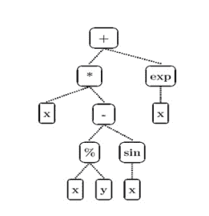
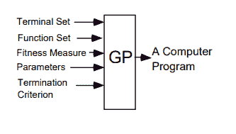
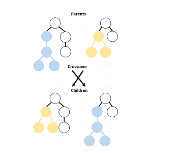
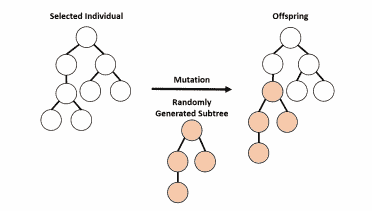

# 遗传程序设计导论

> 原文：<https://medium.datadriveninvestor.com/an-introduction-to-genetic-programming-94ad22adbf35?source=collection_archive---------1----------------------->

([source](http://geneticprogramming.com))

想让你的计算机不用明确编程就能解决问题吗？

本文将向您介绍遗传编程(基于生物的机器学习)，并带您了解遗传编程的工作、表示、类型和应用。

但是首先，让我们看看遗传算法和遗传编程有什么不同。

查尔斯·达尔文的名言:

*“幸存下来的不是最强壮的物种，也不是最聪明的物种，而是对变化最敏感的物种。”*

遗传算法的整个概念是基于上面的引用。

**遗传算法(或 GA)** 是一种在计算中使用的搜索技术，以自然选择和进化生物学的理论为基础，寻找优化和搜索问题的真实或近似解决方案。

## 词汇:

1.  **个人**:任何可能的解决方案
2.  **群体**:所有个体的群体
3.  **适应度**:我们正在优化的目标函数(每个个体都有一个适应度)

它从随机产生的个体群体开始，在几代人中发生。在每一代中，评估群体中每个个体的适应度，选择多个个体(基于它们的适应度)，并修改以形成新的群体。新的群体用于算法的下一次迭代。当已经产生了最大数量的代，或者对于群体已经达到令人满意的适应度水平时，算法终止。

例如，考虑一群长颈鹿。脖子稍长的长颈鹿可以在所有较低的树枝被吃掉后，以较高树枝的叶子为食。他们有更好的生存机会。有利的特征通过长颈鹿的世代传播。现在，进化的物种有长长的脖子。

另一方面，**遗传编程是遗传算法的专门化**，其中每个个体都是一个计算机程序。遗传编程和遗传算法的主要区别是解决方案的表示。

> **遗传算法的输出是一个量，而遗传编程的输出是另一个计算机程序。**

# **简介:**

**遗传编程(或 GP)** 由**约翰·科扎**先生介绍，是**进化算法(EA)** 的一种，是机器学习的子集。进化算法用于发现人类不知道如何直接解决的问题的解决方案。

遗传编程是一种系统的方法，通过应用自然发生的**遗传操作**的类似物，使**计算机自动解决问题**并迭代地将一群计算机程序转化为新一代程序。遗传操作包括*交叉、变异、繁殖、基因复制和基因删除*。

> 遗传编程是计算机程序的进化。

# **工作:**

它从一组初始程序开始，这些程序由可以手动选择或随机生成的**功能**和**终端**组成。这些函数可以是标准的算术运算、编程运算、数学函数或逻辑函数。这些程序在给定的输入和预期的输出数据上相互竞争。群体中的每个计算机程序都是根据它在特定问题环境中的表现来衡量的。该测量被称为*健康测量*。表现最好的程序被挑选出来，对它们进行变异和繁殖以产生下一代。下一代相互竞争，这个过程一直持续到进化出完美的程序。

Main Loop of Genetic Programming([source](https://www.researchgate.net/publication/2415604_A_Genetic_Programming_Tutorial))

这里有一个简明的解释:

进行初始群体、评估(为群体中的每个程序分配一个适应度函数)、选择“更适合”的个体、变异(突变、交叉等)、迭代和终止。

# **程序表示:**

遗传编程中的程序被表达为**语法树**而不是代码行。树可以很容易地递归计算。该树包括**节点**(功能)和**链接**(终端)。节点表示要执行的指令，链接表示每个指令的参数。举例来说，考虑以下等式的实现:x∫((x % y)-sin(x))+exp(x)，如下图所示。在本例中，端子集= {x，y}和功能集= {+，-，∫，% cos，sin，exp}

GP syntax tree([source](https://pdfs.semanticscholar.org/67ad/23b5a145d8d1480e9da570f1c36e13abd0cb.pdf?_ga=2.8615029.1991654169.1591933472-1189386458.1591933472))

# **GP 的五大准备步骤:**

*   确定终端集合
*   确定函数集
*   确定适合度
*   确定运行的参数
*   确定指定结果的方法和终止运行的标准。

现在让我们看看像**交叉**和**变异**这样的遗传操作符是如何应用在子树上的。

交叉算子用于在两个个体之间交换子树。

Crossover Operator for Genetic Programming

GP 应用点突变，其中树中的随机节点被选择并用不同的随机生成的子树替换。

Mutation Operator for Genetic Programming

## 各种类型的遗传编程包括:

*   [基于树的遗传编程](http://geneticprogramming.com/about-gp/tree-based-gp/)
*   [基于堆栈的遗传编程](http://geneticprogramming.com/about-gp/stack-based-gp/)
*   [线性遗传编程](https://en.m.wikipedia.org/wiki/Linear_genetic_programming) (LGP)
*   [语法演变](https://en.wikipedia.org/wiki/Grammatical_evolution)
*   扩展紧凑遗传编程(ECGP)
*   [笛卡尔遗传编程](https://www.cartesiangp.com/) (CGP)
*   概率增量程序进化
*   强类型遗传编程(STGP)
*   [多目标软件的遗传改进](http://www0.cs.ucl.ac.uk/staff/ucacbbl/gismo/) (GISMO)

## 四种常用于遗传编程的语言是:

1.  口齿不清
2.  矩阵实验室
3.  计算机编程语言
4.  Java 语言(一种计算机语言，尤用于创建网站)
5.  C

# **应用:**

入侵检测系统、癌症研究、曲线拟合、数据建模、符号回归、特征选择、分类、游戏、量子计算等。

这两个视频将帮助您了解遗传编程的工作原理及其应用。

[https://youtu.be/K2Hl7m2Ty_4](https://youtu.be/K2Hl7m2Ty_4)

# **结论:**

遗传编程比遗传算法强大得多。它被用来设计编写新程序的程序。遗传编程在寻找变量不断变化的解决方案时很有用。本质上，这是计算机程序自我编程的开始。**在有效性、生产率和简单性方面，GP 的智能利用提供了一个可与最先进方法相媲美的系统。**

# **参考文献:**

1.  约翰·科扎，1992 年。*遗传*编程:*通过自然选择的方式对计算机进行编程*。麻省剑桥:麻省理工学院出版社
2.  遗传编程入门教程 Gecco-2010 —俄勒冈州波特兰市，2010 年 7 月
3.  遗传编程教程约翰·r·科扎和里卡多·里坡

4.[https://www . research gate . net/publication/2415604 _ A _ Genetic _ Programming _ Tutorial](https://www.researchgate.net/publication/2415604_A_Genetic_Programming_Tutorial)