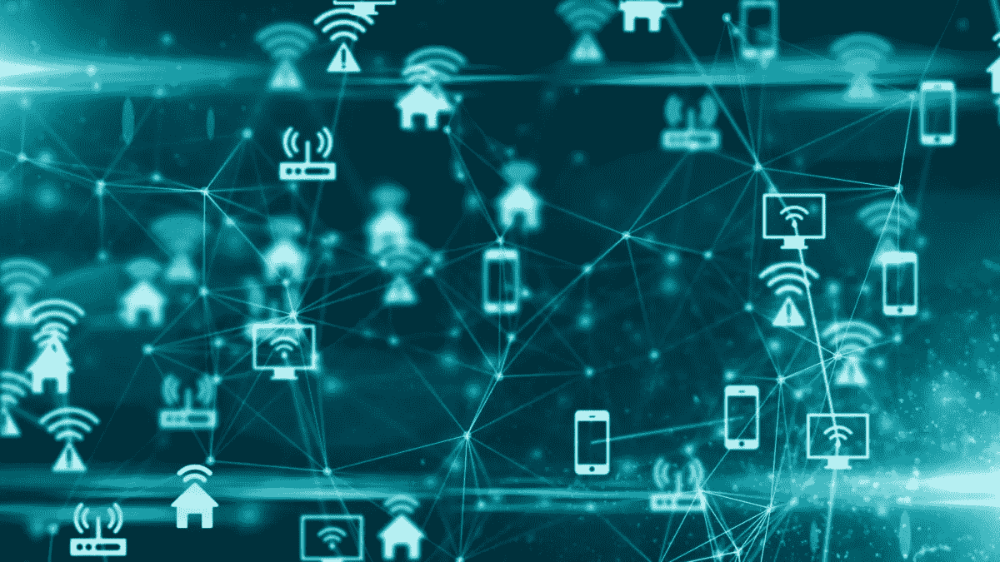
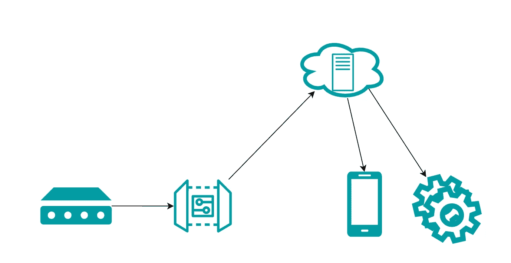
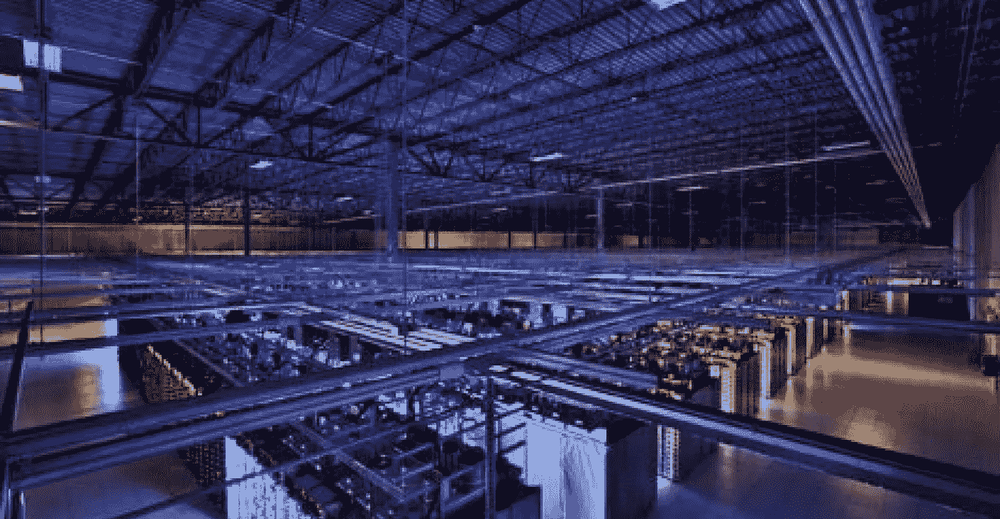
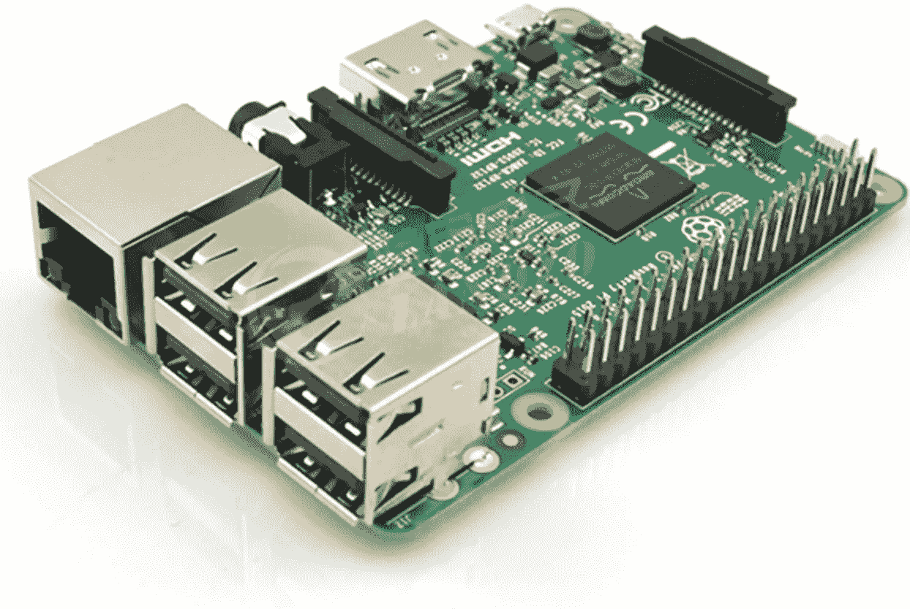

# 物联网和网络简介

> 原文：<https://medium.datadriveninvestor.com/an-introduction-to-iot-and-networking-85c4de239477?source=collection_archive---------10----------------------->

# 介绍

智能家居、恒温器和自动驾驶汽车有什么共同点？他们都使用传感器和设备，以便将他们从周围环境中收集的数据转化为环境的实际变化。如果没有被称为物联网(IoT)的技术和架构，像这样的系统就无法很好地运行。物联网允许设备之间的通信，这是让世界进步得更好更快的原因。想象一下，在世界的任何地方都有眼睛，并利用这些知识来指导你的日常决策。

Imagine having eyes **anywhere** in the world and using that knowledge to inform the decisions you make on a day-to-day basis.

# 数据使用的增加

数据，数据，数据。到目前为止，几乎每家公司都把收集海量数据放在了优先位置。这样做的原因是，你可以让分析师(又名人工智能)在给他们的数据集中指出重大问题和趋势。部分原因是大公司想要尽可能多的数据。

所以，为了解决每个人都想要数据的问题，一个年轻人走到一家大公司的 CEO 面前，问“想要数据？只需要用可能比人类更精确的无生命物体来探测周围”，嘣，物联网诞生了。

开个玩笑，事情可能没那么简单。一个名叫凯文·阿什顿的人首先使用这个术语来描述一个虚拟世界(互联网)通过传感器连接到现实世界的系统。现在，从环境中收集数据并告诉人们是一回事(例如，在人们外出时监控他们的家)，但实际使用这些数据并根据这些数据采取行动会对人们产生如此大的影响。这就是物联网目前所处的位置——处理来自传感器(如摄像头、温度传感器、近程传感器)的数据，并使用电机、控制器等设备对其进行处理。

Interconnectivity of devices

# 物联网的工作原理

现在，您已经对物联网有了一些了解，让我们更深入地了解它的具体工作原理。多年来，有许多架构来描述物联网系统，但最简单的架构有 3 层。感知、网络和应用层。

**感知层**

这一层包含了与现实世界的联系。“感知层”是使用光学传感器(摄像机)、接近传感器、陀螺仪传感器等传感器感知环境的地方。这些传感器产生的数据需要发送到某个地方进行处理。

 [## 物联网和采矿业的未来|数据驱动的投资者

### 物联网可以做出重大贡献的领域之一是采矿！2 月 3 日，在开普…

www.datadriveninvestor.com](https://www.datadriveninvestor.com/2020/03/02/internet-of-things-and-the-future-of-the-mining-industry/) 

**网络层**

网络层负责从传感器获取数据，并对其进行处理，以可能产生一些结果。有两种主要的方法可以做到这一点，它们被称为云计算和边缘计算。

**应用层**

这一层定义了要部署的特定于应用程序的服务，并部署它们。

# 物联网的基本结构

好吧，前面的部分可能有助于了解物联网的工作原理，但可能很难将其可视化。一个非常基本和常见的结构看起来有点像这样:

1.  传感器——收集数据
2.  网关—聚合来自不同传感器的数据。根据应用程序的不同，网关也可以做一些处理。
3.  云—这是数据的主要存储点。它通常是一个集中的位置，具有大量的存储空间和大量的计算能力，因此公司和企业可以在其上运行他们的人工智能，并根据他们收集的数据进行分类和预测。
4.  应用程序——这是所有这些努力的最终结果，它可以以多种形式出现。应用程序获取处理过的数据，并对其进行一些物理处理，比如移动一个马达，或者在手机上显示一个通知。

Simple IoT process

我构建了一个非常简单的物联网系统，遵循相同的结构。你可以在这里查看它的演示。

# 云计算和边缘计算的区别

你可能听说过云计算和边缘计算。他们都实现了相同的目标，但每种类型都有一些额外的好处和不同之处。云计算使用云来存储和计算从传感器收集的数据，云本质上只是一堆可以存储和计算数据的服务器。在这种情况下，所有的数据都被发送到云中，不做任何处理。虽然它可以更有效一点，但它大大增加了整个物联网系统的延迟(降低了速度)和反应性。由于云服务器位于数百英里之外的一个中心位置，传输数据和接收响应可能需要一段时间。

The “cloud” is just a huge server room at centralized locations

另一方面，边缘计算在网关本身进行一些计算。这允许更低的延迟(提高速度)，因为使设备相互通信的必要计算是在更近的范围内完成的，而不是必须与云通信。例如，如果温度传感器和空调设备连接在同一个网关上，而不是让网关立即将其数据发送到云，它可以计算空调设备是否应该打开(基于温度传感器数据)，然后将其发送到空调设备和云。

我创建的系统使用边缘计算，因为计算是在我使用的 raspberry pi 设备上完成的，然后才发送到云。然而，手机上的消息需要更长时间才能显示出来，因为它首先通过云，增加了整体延迟。

The gateway I used for sending data.

# 建立工作关系网

物联网最重要的一个方面是移动数据。在物联网系统中，可能有数千个传感器与单个网关通信，然后该网关需要将所有数据发送到云(数百英里外的服务器)。这不是魔法。不同的设备使用不同的通信方法，它们取决于几个因素，包括电池寿命、传输的数据量和范围。这些通信方法被称为网络协议，并且有很多这样的协议。这里有一些经常使用的。

**蓝牙低能耗(BLE)**

该协议使用蓝牙短距离传输小数据包，这使得它非常适合传感器到网关的通信。

**ZigBee**

ZigBee 类似于 BLE，但更多的是为工业用户而不是消费者设计的，这就是为什么你以前可能没有听说过它。

**MQTT**

MQTT 协议在物联网中应用非常广泛。事实上，你在上面的视频中看到的我的物联网项目就用到了它。它使用发布/订阅+代理模型工作，其中发布者向订阅者发送数据，代理检查发送的数据是否经过授权。

# 摘要

*   总而言之，物联网是设备和云的通信。
*   它在世界上有很大的潜力，可以把虚拟的东西和人类联系起来。从监控到改变世界，物联网大有潜力。
*   通过网络协议在设备之间进行通信会使用大量资源，这可以通过边缘计算等方式来克服。