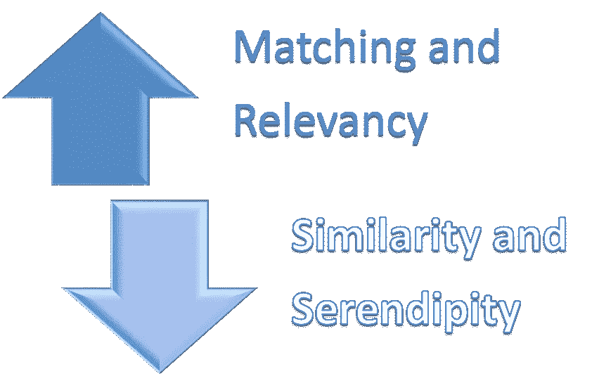

# 基于知识的推荐系统介绍

> 原文：<https://medium.datadriveninvestor.com/an-introduction-to-knowledge-based-recommender-system-68ad577fc6f1?source=collection_archive---------0----------------------->

互联网信息泛滥，消费者寻找商品的问题也是如此。坚持下去，作为解决方案一部分的推荐系统已经帮助像网飞、亚马逊、脸书这样的公司赚了数十亿美元。网飞的推荐引擎每年帮助节省超过 10 亿美元。

# **需要的确是发明之母**

随着产品越来越进化，营销和销售的压力越来越大；推荐引擎减少了搜索的时间，抓住了用户的需要和需求，并有助于扩展业务。有一些流行的算法在幕后运行，如基于内容的过滤、协同过滤、混合推荐系统等。这些算法会考虑用户的历史记录、偏好、商品的特征以及用户与商品的互动，从而给出推荐。

Image highlights the dichotomy of popular Content based and Collaborative filtering vs Knowledge based Recommendation Engine [Image Source](https://www.frbatlanta.org/economy-matters/regional-economics/2017/12/14/atlanta-fed-explores-rural-metro-economic-divide)

# 完事了吗？

不是每个商业模式都可以扩展到数百万或数十亿消费者，不是每个企业都可以在早期阶段捕获用户数据和历史，不是每个推荐都可以不受限制，也不是每个相似的产品都可以推荐给相似的消费者。这些是基于特定知识领域的数据的部门的问题，如医疗保健、航空、住房等。这些领域的初创公司经常面临冷启动问题，即用户评分低，这是在构建推荐引擎时最广泛承认的问题之一。

 [## 机器学习的外汇交易挑战|数据驱动的投资者

### 机器学习是人工智能的一个分支，之前占据了很多头条。人们是…

www.datadriveninvestor.com](https://www.datadriveninvestor.com/2019/02/18/the-challenge-of-forex-trading-for-machine-learning/) 

这时，基于知识的推荐系统成了救星。

# 哲学的改变

顾名思义，这种类型的推荐系统主要依靠使用特定领域的知识来帮助搜索。

这是否意味着，我们使用一堆过滤器来查询域？听起来不酷吗？

我很想这么说，但在我们的情况下，数据要复杂得多，交织在一起，很难查询。因此，推荐系统不仅需要帮助查询，还需要提供个性化的结果。

Importance of matching and relevancy increases in comparison to similarity and serendipity

为了构建这个推荐系统，整个本体需要存储在任何形式的合适数据库中，无论是 SQL 中的表格还是 MongoDB、图形数据库等 NOSQL。

所提供的建议也在很大程度上受到用户选择和特性的限制。所提供的建议伴随着较高的误报成本，因此风险较高。例如，如果医生 A 和医生 B 都进行整形外科手术，如果该病例需要专门从事脊柱外科手术的整形外科医生(专门从事整形外科手术)，则医生 A 不能被称为与医生 B 相似。因此，基于专业计算相似医生的领域变得更加具体。因此，基于知识的推荐系统提供了更具确定性的解决方案。

# 循序渐进的过程

*   过滤器:UI 中设计了一组特定的过滤器，供用户进行查询。
*   数据库:整个领域的信息都存储在适合该领域的数据库中，如航空业可以选择图形数据库。
*   规则:整个知识由一套规则管理。规则是为帮助知识领域中的搜索而编写的一组逻辑语句。例如，在像 Expedia 这样的旅游部门，各种航空公司的整个路线数据库都保存在数据库中(我猜它是一个图形数据库)。一旦乘客选择了始发地和目的地，规则会根据限制条件(如最长等待时间不得超过 6 小时)帮助选择转机航班。
*   映射:各种信息字段也从较低的抽象层次映射到较高的抽象层次，以补充搜索。例如里根、杜勒斯和 BWI 可以被映射到更高级别的搜索，如 IAD。映射可以在各种数据字段之间、规则之间或数据和规则之间进行。
*   一旦进行了查询，就结合映射来应用一系列或一组规则，以提供相关的搜索结果。用户不断改变查询参数，直到满意为止。

# 机器学习的妙处是不是丢了？

人工智能和机器学习领域的专家喜欢使用微积分、代数、概率和统计来提出最具挑战性问题的直观解决方案。在基于知识的推荐中，尽管它根据用户的选择缩小了搜索范围，但它仍然为基于相关性和质量来改进结果提供了足够的空间。

可以建立机器学习模型来提供最相关的搜索结果。有许多预测和排序算法，如逐点法、成对法，可用作此过程的一部分。

然而，一旦业务开始扩大，随着用户反馈的增加，系统可以切换到基于内容或协作的推荐模式。

[Image Source](https://www.cartoonstock.com/searchtips.asp)

# 最后一英里..

基于知识的推荐引擎可以方便地解决冷启动问题，并为业务增长提供可靠的解决方案。然而，它也有自己的挑战形式。企业需要足够的资本来获取领域信息，这在本质上是高度动态的。存储所需的数据库应该是可扩展的、低延迟的，并且适合于流动数据模型。最后，有时用户很难提出与需求相匹配的精确查询。用户甚至可能带着搜索查询在产品空间中游荡。

**临时准备系统:**

在导航期间，用户提供被称为“评论”的反馈。然后使用评论来帮助用户在检索到的相关搜索结果中导航。批评有三种形式:

*   *单元评论，*表示对单个项目属性的变更请求。
*   *复合评论，*一次代表多个变更请求。
*   *动态评论，*考虑用户评论的历史。

基于这些评论，查询的参数被改变或修改以帮助用户满足他们对结果的选择。例如，如果用户正在搜索从 BWI 到三藩市的廉价航班，但是找不到航班。使用评论的方法，几个日期与更便宜的航班将被推荐。动态评论会考虑所有的可能性，比如根据历史上常见的模式，将联航的航班改为美航，建议从 IAD 飞往旧金山。查看用户查询的历史也有助于个性化。

# 结论

一旦我们准备好了一个推荐系统，符合我们商业模式的要求，我们所需要的就是一个好的衡量标准，像 MAP@k，MAR@k。但是这些衡量标准的成功也取决于用户的使用和反馈，反馈越多，系统越好。最后，是时候雇用更多的数据科学家来帮助扩展产品，并希望有一天能站在像 Youtube、网飞这样的巨头中间。感谢您的阅读，祝您有美好的一天。

引用:

 [## 基于知识的推荐系统

### 基于知识的推荐系统是一种特殊类型的推荐系统

en.wikipedia.org](https://en.wikipedia.org/wiki/Knowledge-based_recommender_system)