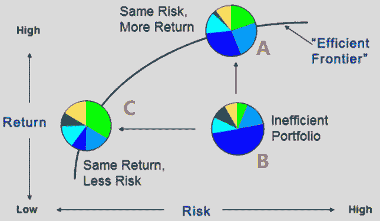
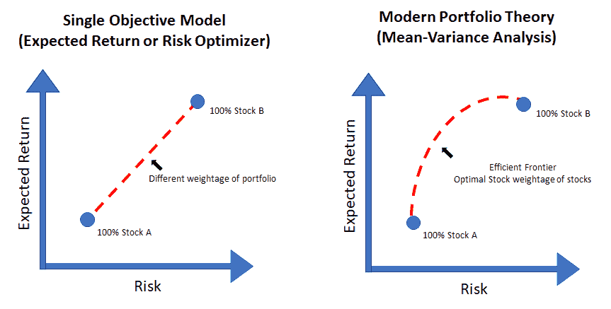
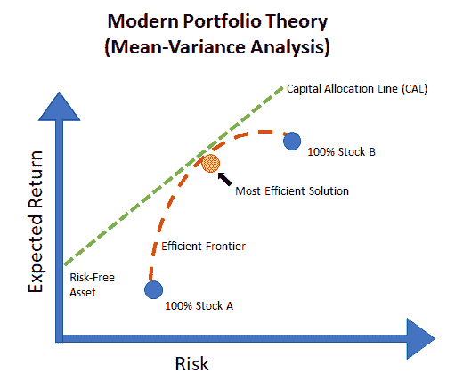
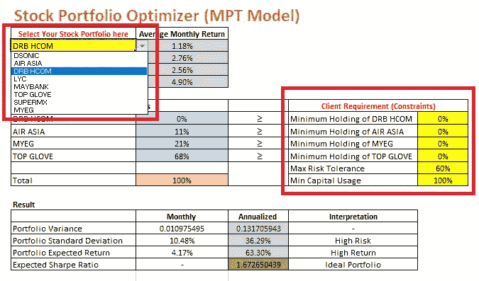
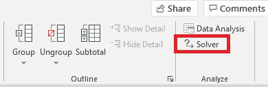
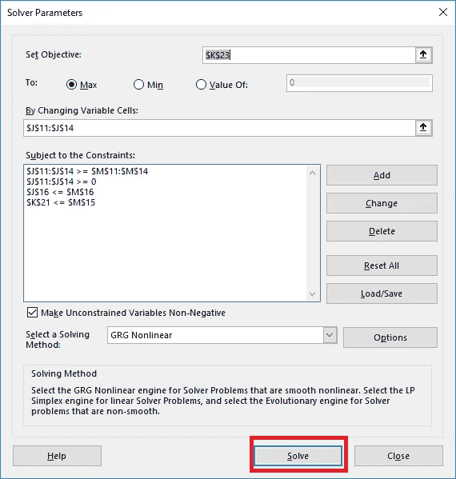
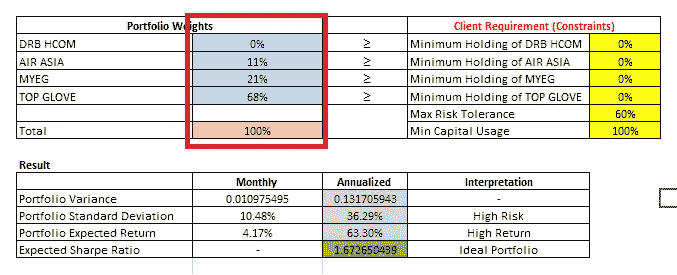

# 投资组合优化中的现代投资组合理论(MPT)导论

> 原文：<https://medium.datadriveninvestor.com/an-introduction-to-modern-portfolio-theory-mpt-in-portfolio-optimization-d19cd8b16b34?source=collection_archive---------4----------------------->

在每一个股票投资决策中，作为一个理性的投资者，关注的总是投资的回报。投资者将选择投资于预期回报率最高的股票。但是，在现实生活的投资中，每一次选择股票都会包含不确定的因素，所以投资者应该考虑风险因素[1]。这导致了多种股票的组合和持有它的权重会导致不同的预期收益和不同的与投资者相关的风险。

Fig 1: Portfolio Return with different portfolio and Risk. Original Image from Peerlendingserver.com

如上面的图 1 所示，考虑一个投资者投资组合，可以用 X 金额的资本购买一组股票，例如，房地产投资信托(REIT)组股票。在资本 X 相同的情况下，投资组合 B 导致投资者承担较低的预期收益和较高的风险，并且可以根据投资者的偏好，通过改变 REIT 股票集合中每只股票的持有权重，优化投资组合 B，使其具有较低的风险但类似的预期收益(投资组合 C)或具有相同风险的较高的预期收益(投资组合 A)。说明这种关系的一个更简单的数学模型如下:

> 马克斯·z₁=a₁x₁+a₂x₂+a₃x₃+a₄x₄….+ AₙXₙ

其中:

Aₙ =特定股票 n 的预期回报率

Xₙ =投资组合中持有股票的权重。

Z₁ =投资组合的预期收益

或者

> *min z*₂*= a*₁*x*₁*+a*₂*x*₂*+a*₃*x*₃*+a*₄*x*τ*…。+ A* ₙ *X* ₙ

其中:

Aₙ =与特定股票 n 相关的风险数量*

Xₙ =投资组合中持有股票的权重 n

Z₂ =与投资组合相关的风险

**收益率的风险相关绝对偏差，而不是 Markowitz 模型中所示的标准差*

上述数学关系是线性的，但是，在现实世界中，投资者在选择投资组合中的股票组合时，会同时考虑多个因素和目标，例如，与投资者采取的无风险活动相比，该投资组合的表现如何，或者每单位风险的平均回报是多少。

这导致了现代投资组合理论(MPT)或均值-方差分析，这是现代投资组合优化的黄金标准，是由 Harry Markowitz 在 1952 年提出的，他后来因此获得了诺贝尔经济学奖[2]。

Fig 2: Comparison of Modern portfolio theory with single objective model

图 2 显示了与单一目标模型相比，MPT 模型下的预期收益和风险的关系。在 MPT 模型中，方差和协方差用于量化投资组合风险，使用以下公式:

> *投资组合收益率风险=股票 A 的加权方差+股票 A 和股票 B 的协方差*

或者数学上:

> *var(r*ₚ*)=σw*ₐ*var(r*ₐ*)+σσ2w*ₐ*w*ᵦ*cov(r*ₐ*。R* ᵦ *)*

其中:

Rₚ =投资组合的回报率

Rₐ =股票 a 在一定时期内的回报率

Wₐ =股票 a 在投资组合中的权重

Rᵦ =股票 b 在一定时期内的回报率

Wᵦ =股票 b 在投资组合中的权重

投资组合的相关风险或方差不仅取决于资产的方差，还取决于任何两项资产的协方差，这是投资组合中每两项资产的回报相对于彼此移动的紧密程度，这主要是由于金融市场相互影响的事实，这意味着投资不会独立变化。[mf4]

为了计算这种关系，需要一个二次目标函数，通过求解该函数，可以构建一条有效的边界线，该边界线给出了对于任何给定的风险水平具有最高回报水平的有效投资组合集。考虑到一定的风险，这是一个重要的工具，可以用来观察所选的投资组合是否表现良好。低于这条线的投资组合是无效的，因为它们不能为相关的风险水平提供足够的回报。

Figure 3 Capital Allocation Line and Efficient Frontier

当我们考虑无风险资产时，例如，投资者将其资本投资于无风险定期存款而不是股票，可以画出资本分配线(CAL)。落在 CAL 和有效边界交叉切线上的投资组合被认为是所有可能的投资组合中最有效的投资组合，并且称为夏普比率的优化参数被优化。夏普比率是指每单位波动率或总风险超过无风险利率的平均回报率。这是一种通过调整风险来检验投资业绩的方法。[3]

**使用 Excel 优化投资组合:**

我举例说明了 excel 规划求解如何在优化投资组合中发挥作用。你可以在这里下载

第一步:相应地选择你的股票组合，注意平均月回报是根据平均月回报计算的。如果你有什么金融知识，可以相应的换成资本资产定价模型(CAPM)和套利定价理论(APT)。

相应地提出你的要求，比如最低持股量，或者你的风险偏好。

Step 1

第二步:

单击“规划求解”按钮求解问题，excel 将自动为您提供具有优化夏普比率的投资组合。

Step 2A

Step 2B

Result

希望这个 excel 能让你对 NLP 或 LP 如何用于投资组合优化有所了解。

感谢您的阅读

**注:我不是金融专家，也不是金融出身*

*免责声明:以上介绍和 excel 表格是基于我个人的理解，是为了分享知识而写的。excel 计算公式是基于 MPT 理论制定的，使用和修改风险自负。*

**参考文献:**

1.《风险和投资组合分析:原理和方法》。(纽约:运筹学和金融工程中的斯普林格系列)

2.马尔科维茨(1956 年 3 月)。“受线性约束的二次函数的优化”。海军研究后勤季刊。3 (1–2): 111–133.doi:10.1002/nav.3800030110。

3.https://developers . refinitiv . com/article/portfolio-optimization-modern-portfolio-theory

4.https://ufdc images . uflib . ufl . edu/AA/00/06/10/50/00001/ooropeza-Report _ final . pdf

5:https://www . investopedia . com/ask/answers/010815/what-good-sharpe-ratio . ASP