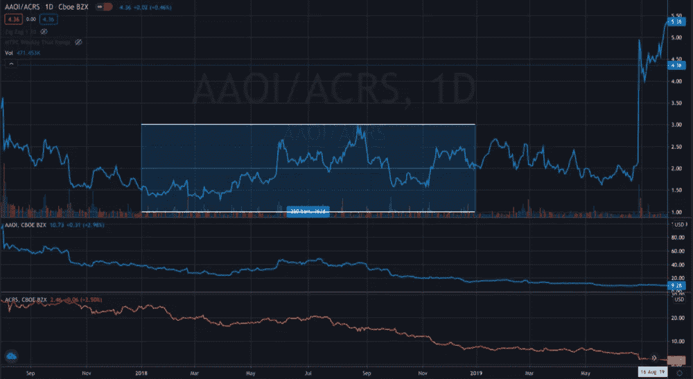
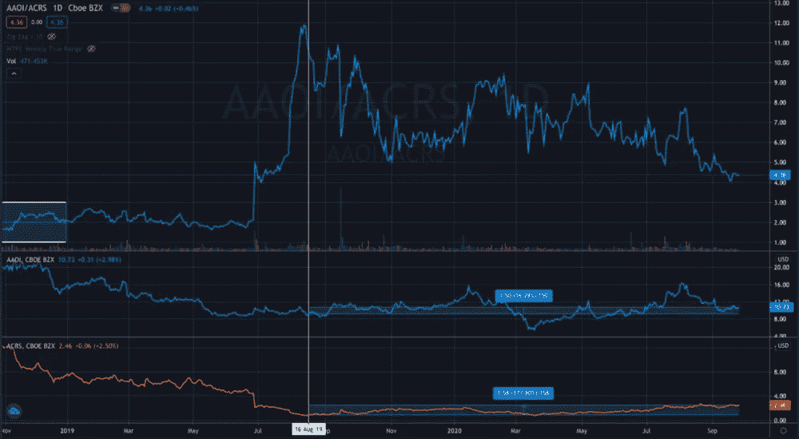

# 配对交易简介

> 原文：<https://medium.datadriveninvestor.com/an-introduction-to-pairs-trading-449503635065?source=collection_archive---------8----------------------->

## 一个简单的、低风险的交易策略，不需要大量的研究

Fig. 1 — A sample interface for a pairs trading strategy

*本文将介绍配对交易的概念。我们将探索该策略背后的理论，使用历史图表运行一个可以使用该策略的示例，并讨论潜在的陷阱和我们可以对我概述的步骤进行的改进。*

## 理论

配对交易是对冲策略的一种形式，当我们看到两种高度相关的资产的相关性出现差异时，我们就做空一种，做多另一种。我们坚持这一立场，直到我们看到两种资产之间的关系再次“重新关联”。

那么我们如何定义散度呢？我们可以看看这两项资产的比率。我们用一种资产的价格除以另一种资产的价格，并用这个新的时间序列来寻找交易设置。在下面的例子中，我用平均价格较高的资产除以平均价格较低的资产，所以我的比率总是大于 1。对于本例，我们将以下列方式定义设置:

1.  以一个低方差的观察期为例，1 年，并注意在此期间比率的高低。
2.  在这个观察期之后，当比率大于上限时，我们寻找机会做空分子资产，做多分母资产
3.  当比率下降到低点以下时，我们就在寻找机会做多分子，做空分母。

如果我们将价格较低的资产除以价格较高的资产，同样的规则适用，但是买入/卖出的决定将会颠倒。

我们为什么要这样做？好吧，让我们想想当比率改变时会发生什么。重要的是要记住，我们有两个高度相关的资产，这意味着它们的行为相似。当该比率大幅增加时，可能会发生三种情况:

1.  分子的值不成比例地增加了
2.  分母的值不成比例地减少了
3.  1 和 2 同时发生

这可能意味着分子资产被高估，分母资产被低估，或者两种情况都存在。鉴于我们知道这些资产通常以类似的方式表现，我们会预计市场会自我修正，比率将返回到类似的历史值或围绕一个新的数字稳定，本质上，资产将再次变得相关。

配对交易的好处之一是它的低风险性。做空一种资产、做多另一种资产背后的想法是，我们在弥补损失。如果这种背离不是历史水平的“异常行为”，而是潜在的新关系形成，我们将确保我们的损失最小化，即使交易对我们不利。这确实反映了交易中普遍存在的“过去的表现并不代表未来的行为”的概念。重要的是要记住，我们纯粹是假设我们选择的两种资产将回到它们以前的高相关性水平，但可能没有基本面的证据来支持这一点。

## 例子

我为纳斯达克交易所获取了一个报价器列表，并运行了一个简短的 python 脚本，以返回 2018 年期间前 200 个报价器中相关性最高的资产。下面是其中两项资产的图表，一项是“光纤网络产品”供应商应用光电(AAOI)，另一项是旨在生产治疗免疫系统疾病药物的制药公司 Aclaris Therapeutics (ACRS)。

Fig. 2 — The observation period for our strategy, a full year of historical data

从图表中可以看出，AAOI 是平均价格较高的资产，因此我在第一个面板中显示了 AAOI/ACRS 的图表。突出显示的部分是我们的观察期，在整个 2018 年，我们看到了偏差，但通常观察到 1.00 至 3.00 之间的相当一致的比率。下面的两个面板描绘了相关资产的价格行为。

所以我们有我们的比率范围，1.00-3.00。一旦我们看到比率偏离这个范围，我们就对交易感兴趣。这里需要注意的是，我们并不是一看到异常活动就进行交易，而是简单地对交易的可能性发出警告。我们仍然需要寻找一个明确的反转或烛台模式，表明该比率正在返回到其观察水平。下一张图着眼于 2019 年，在那里我们看到了我们的战略在行动。

Fig. 3 — The execution of our strategy

我们可以看到，从 5 月下旬开始，我们的比率朝着上升方向迈出了一大步。这种情况一直持续到八月初达到顶峰。接下来，如果我们在直播中看到这种情况，我们可能会认为这是回到原始水平的开始，这就是我们可能进行交易的地方。该比率已经超过了我们的最高水平，因此在 2019 年 8 月 16 日，我们可以做空价格较高的资产 AAOI，做多价格较低的资产 ACRS。这里的另一个关键点是，我们购买的每项资产的股票的货币价值应该相等。我们可以快进到写这篇文章的那一天，大约一年后，看到我们还没有达到我们最初的水平，也没有一个持续的稳定水平来建议一个新的比率数字，但我们的交易会有很大的利润。由于价格在过去一年中上涨，AAOI 空头将为负 16.29%。另一方面，ACRS 龙在过去的一年里上涨了 177.80%。假设每笔交易的初始投资是相同的，那么在一年多的时间里，我们的净收益是(177.80–16.29)/2 = 80.75%。

 [## 每个交易者都应该知道的最佳交易策略指标|数据驱动的投资者

### 像其他生意一样，成功的交易需要对我们的表现进行分析。在运用策略时…

www.datadriveninvestor.com](https://www.datadriveninvestor.com/2020/11/16/best-trading-strategy-metric-every-trader-should-know/) 

## 改进/评论

我认为这个策略有两个关键——时机和耐心。时机非常重要，因为如果做得正确，它可以确保我们在市场开始向我们期望的方向发展时进入市场，并帮助我们实现利润最大化。在上图中，我们可以看到该比率在最初飙升后，似乎在 7 月初有所回落。这将是一个糟糕的交易点，因为这个比率在此之后迅速上升。如果我们看看这段时间的资产价格，我们看不到 ACRS 再次上涨的迹象，也看不到 AAOI 下跌的迹象。我们会在这一点上寻找交易，但市场还没有给我们一个强烈的信号来进行交易，所以时机是关键，因为我们在等待一个更好的信号。

更好的信号出现在我们的入口点。我们观察到过去几天 AAOI 和 ACRS 的价格下跌，似乎已经触底，这就是我们进行交易的原因。

然后我们必须有耐心。这种交易至少要持续一年，才能实现可观的利润。我们还可以看到，在这一年中，我们有许多次会出现赤字。在这一年中，在我们开始交易的 6 个月后，AAOI 明显高于我们的卖出点，ACRS 回到我们的买入水平。如果当价格触及这些水平时，我们坐在自己的办公桌前观看这种交易，我们将不得不提醒自己，我们已经从过去几个月的比率中看到明确的迹象，即它正在向以前的水平靠近。在这种情况下，重要的是要提醒自己，由于之前的证据，我们应该咬紧牙关度过这些更困难或不确定的时期，因为未来有合理的盈利机会。

我们可以对这一策略进行许多改进，其中之一就是让规则稍微复杂一些。

1.  我们可以将布林线添加到比率图表中，当比率似乎从其中一个波段反弹时进行交易。
2.  我们可以根据烛台模式更具体地定义我们的条目。例如，如果我们的比率高于高点，当我们观察到看跌的烛台模式时，我们将卖出分子资产，反之亦然。
3.  我们可以计算比率图的移动平均线，并根据线交叉的时间进行交易。

这些只是我们如何使这个策略变得更复杂的一些想法。我很有兴趣看到人们对这个策略的其他想法，所以请随意写在下面的评论中。

**进入专家视角—** [**订阅 DDI 英特尔**](https://datadriveninvestor.com/ddi-intel)