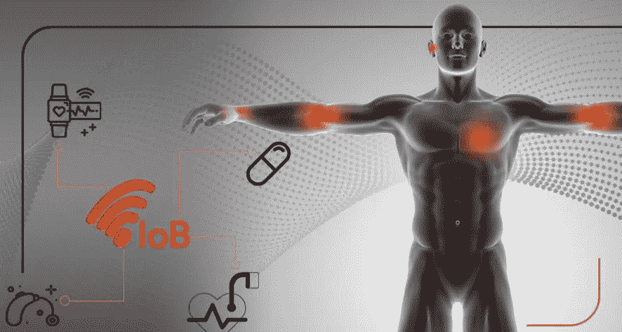

# 身体网络导论

> 原文：<https://medium.datadriveninvestor.com/an-introduction-to-the-internet-of-bodies-a93cadd9db51?source=collection_archive---------4----------------------->

Image from scrabbl.com

身体的互联网正在到来。在这十年的每一个新的转折点，一些技术都在整合，关于可能成为一种趋势的新奇事物的观点以更高的强度出现。例子是物联网(物联网)的整合和一个新时代即将到来的预期，即物联网(IoB)。你没有看错。身体网络，没错。

**什么是身体网络**

身体的互联网，在某种程度上，是物联网的延伸。它是人类制造的数据的集合，发送给外部处理。这个概念可能看起来有点可怕，但其他新技术起初似乎也是如此。

如果我们停下来想一想，***第一代 IoB*** 已经开始变得可行了。通过使用人体外部的设备，如用于监测身体活动和一些基本健康元素的小工具，它得到了普及。在这一代，理论上可以在短时间内成为现实，我们将只需要实时发送数据进行处理和决策，如警报生成或建议。一个实际的例子是外部心脏监测器(如跑步带或带心脏测量功能的智能手表)，它可以发送关于心率可能出现意外变化的实时警报。

 [## 理解物联网|数据驱动的投资者

### 一个系统越开放，它就越有利于创新和产生信任。然而，当谈到开放系统时…

www.datadriveninvestor.com](https://www.datadriveninvestor.com/2019/09/28/making-sense-of-iot/) 

第二代***IoB***将使用人体内部的设备进行，例如起搏器、助听设备或大脑植入物。同样，当这些设备向外部服务器实时发送数据和信息时，这个概念就完整了。很容易想象，对心律或其他器官可能出现的问题进行即时和实时警告会带来巨大的好处。对于适合这一代人的设备也采取了一些措施，如监测吞咽的药丸(用于成像检查)和脑电波指令设备。已经有 RFID 微芯片植入宠物体内，这一概念可能也适用于人类，不仅用于健康监测，还用于个人身份识别甚至支付。
这一代的主要区别在于，设备可以主动承担一些控制功能或干预。这可能意味着由医生远程控制的智能起搏器，甚至在未来，由人工智能控制。另一种可能性，不那么复杂，是让除颤器与智能起搏器“对话”,以获得更高的效率。

**而 IoB 的进化，会是什么呢？**

随着技术的进步，没有人能肯定地说未来 10 年不会发生这种情况。在所谓的 ***第三代 IoB*** 中，装置会与人体的部分融合。通过生物技术，有可能预期在未来，人类身体的某些部分将具有收集、发送数据、甚至主动干预的智能。

**要点考虑**

(几乎)总是，可能出现的主要问题与使用个人信息导致的隐私和道德有关。也许最有说服力的例子与公司可能实施的健康计划或人寿保险的价格有关，这些公司掌握着关于一个人健康的敏感信息。其他人监控个人习惯的问题无疑是另一个需要考虑的点。考虑到可能的收益和成本，是否共享数据将由个人决定。