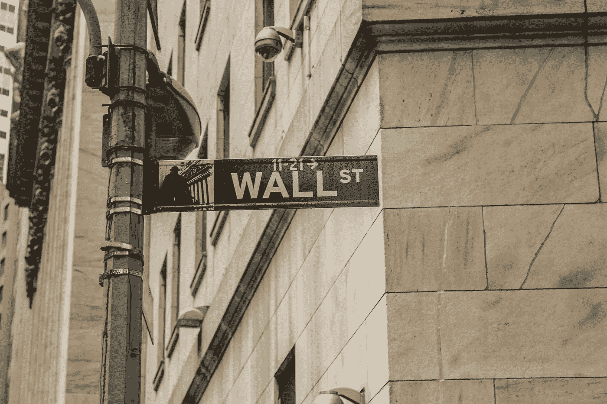
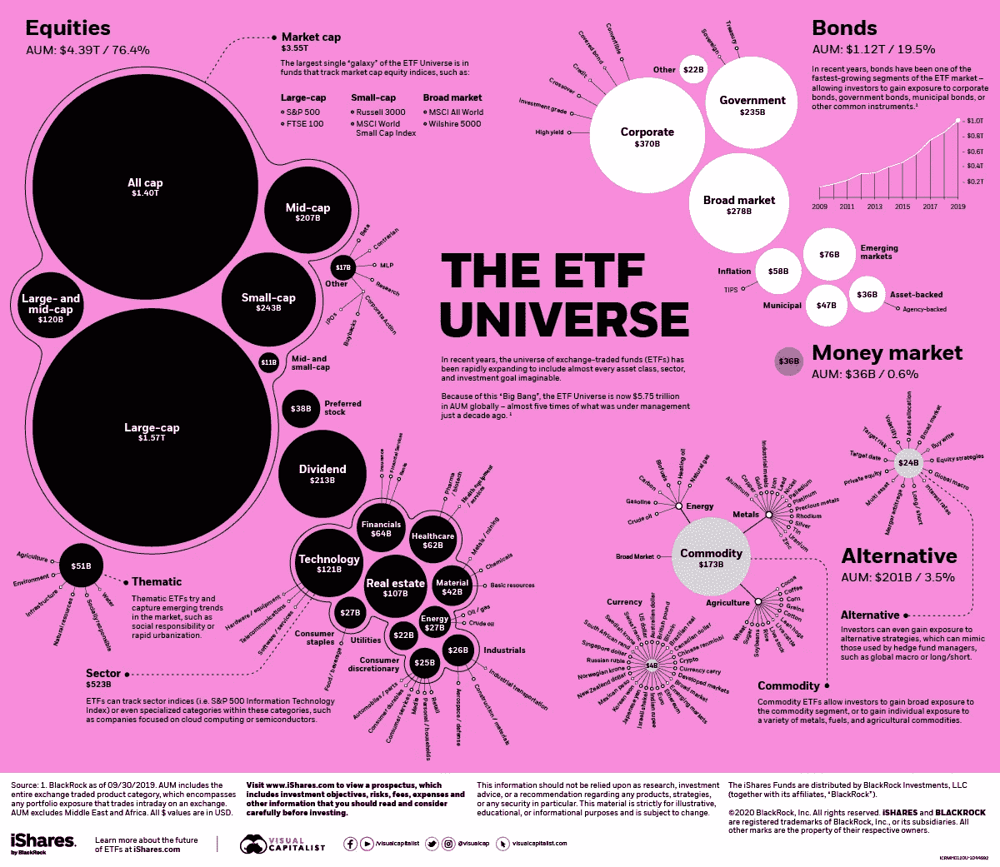

# ETF 入门指南。

> 原文：<https://medium.datadriveninvestor.com/an-introductory-guide-on-etfs-e5e5c0843eac?source=collection_archive---------20----------------------->

一个新手投资者可以做的第一件事，即使他或她不想深入交易世界，就是投资 ETF。这种形式的长期投资对潜在投资者来说是最安全的。

(交易所交易基金还可以用于除长期交易以外的各种交易方式。)

Photo by [Sophie Backes](https://unsplash.com/@sophili?utm_source=unsplash&utm_medium=referral&utm_content=creditCopyText) on [Unsplash](https://unsplash.com/s/photos/wall-street?utm_source=unsplash&utm_medium=referral&utm_content=creditCopyText)

交易所交易基金(ETF)还是相当新的事物。首只 ETF 于 1989 年发行，跟踪标准普尔 500 指数(S&P500)。顾名思义，ETF 是一种在证券交易所交易的投资基金，就像股票一样。就像任何其他基金一样，ETF 内部持有各种投资工具，如债券、大宗商品和股票。持有股票的 ETF 称为股票 ETF，持有债券的 ETF 称为债券 ETF 等。他们还可以跟踪各种指数，如前所述，比如 S&P500。也有专注于产生股息的 ETF，股息 ETF。

许多公司捆绑各种投资工具，发行自己的基金。最大的玩家是先锋和贝莱德。

有了 ETF，散户投资者就可以进入市场，进行投资，而这在其他情况下是不可能的。例如，中国股票不能被外国人收购，在香港交易所上市的股票除外。另一方面，我们可以通过 ETF 投资中国市场。

散户投资者可以使用它们，避免巨额管理费和非多样化的投资组合。最适合作为长期投资。

在阅读 ETF 的详细信息时，你需要注意“费用率”。ETF 价格的这一百分比由 ETF 持有人每年支付。

The image has been taken from [https://www.visualcapitalist.com/](https://www.visualcapitalist.com/).

问题是有 2000 多种不同的交通工具可供选择。那么，让我们讨论一下我们的一些选择。

 [## 这些名字和数字是怎么回事？风投投资你的 5 种主要方式|数据驱动…

### 一个风险投资者正在投资你——好消息。但随后你会在他们的投资工具中看到一连串的名字和数字…

www.datadriveninvestor.com](https://www.datadriveninvestor.com/2020/10/04/what-is-with-all-these-names-and-numbers-5-major-ways-in-which-a-vc-invests-in-you/) 

# 指数 ETF

## 1.SPDR 标准普尔 500 交易所交易基金信托

*   **符号:**间谍
*   **收盘价:**:320.88 美元
*   **年费用率:** 0.09%

该 ETF 跟踪标准普尔 500，包含美国市场最大的 500 家公司。像这样的 ETF，我们不能出错。它分散到以下几个部门:技术 31.96%，医疗保健 14.79%，消费周期 13.46%，金融 13.15%，工业 9.10%，消费非周期 6.92%，公用事业 3.26%，能源 2.96%，基础材料 2.43%，电信服务 1.98 **%。**

## 2.景顺 QQQ 信托

*   **符号:** QQQ
*   **收盘价:**255.56 美元
*   **年费用率:** 0.20%

与 SPY 类似，这只 ETF 跟踪纳斯达克 100 指数。它在各个部门和国家都是多样化的。它包括来自美国 98.49%，香港 0.82%，中国 0.44%，荷兰 0.25%等国家的股票，以及科技 63.41%，消费周期 20.69%，医疗保健 7.60%，非消费周期 3.85%，工业 2.44%，电信服务 1.27%，公用事业 0.74%等行业的股票。

## 3.iShares MSCI 新兴市场 ETF

*   **符号:** EEM
*   **收盘价:**43.14 美元
*   **年费用率:** 0.68%

该 ETF 包含来自新兴市场和地区的股票，如香港 33.25%，台湾 12.04%，韩国 11.64%，印度 8.06%，中国 6.52%，巴西 5.12%，南非 3.69%，俄罗斯联邦 3.40%，沙特阿拉伯 2.81%，泰国 2.35%。来自西方散户投资者无法接触的国家的公司股票。

# 行业交易所交易基金

## 4.技术选择部门 SPDR 基金

*   **符号:** XLK
*   **收盘价:** $105.20
*   **年费用率:** 0.13%

它主要包括美国科技行业的大型公司，但也包括一些中型公司。像微软、苹果、Visa 和英特尔这样的公司只是其中的一部分。

## 5.全球 X 机器人和人工智能 ETF

*   **符号:** BOTZ
*   **收盘价:** $25.36
*   **年费用率:** 0.68%

你有没有想过你会投资人工智能(A.I .)但很难在所有这些即将到来的公司中导航？这让我们有机会接触机器人和人工智能领域的公司。

# 反向 ETF

## 6.ProShares 简称 Dow30

*   **符号:**狗
*   收盘价:46.43 美元
*   年费用率: 0.95%

这只 ETF 追踪一个倒置的道琼斯 30 指数。反向 ETF 的走势与其跟踪的指数相反。在这种情况下，如果 Dow30 向下移动-0.5%，那么 DOG ETF 将向下移动+0.5%。

## 7.ProShares 超短 S&P500

*   **符号:** SDS
*   收盘价格:17.86 美元
*   年费用率: 0.90%

另一类反向 ETF 是“双做空”ETF。这种特殊的 ETF 使我们面临双重逆标准普尔 500 指数。

# 商品交易所交易基金

## 8.SPDR 黄金信托公司

*   **符号:** GLD
*   **收盘价:**178.70 美元
*   年费用率: 0.40%

这种 ETF 通过伦敦金库中持有的金条来跟踪黄金的现货价格。

*来源*

1.  [https://en.wikipedia.org/wiki/List_of_S%26P_500_companies](https://en.wikipedia.org/wiki/List_of_S%26P_500_companies)
2.  [https://en.wikipedia.org/wiki/NASDAQ-100](https://en.wikipedia.org/wiki/NASDAQ-100)
3.  https://en.wikipedia.org/wiki/Dow_Jones_Industrial_Average
4.  【https://en.wikipedia.org/wiki/List_of_stock_market_indices 
5.  [https://www.etf.com/](https://www.etf.com/)

免责声明:

为了投资这些市场，你必须意识到风险并愿意接受它们。不要用你输不起的钱去交易。本文包含的信息仅用于教育目的，不作为任何特定投资的建议。在任何市场交易都有很高的风险，可能不适合所有的投资者。

## 访问专家视图— [订阅 DDI 英特尔](https://datadriveninvestor.com/ddi-intel)