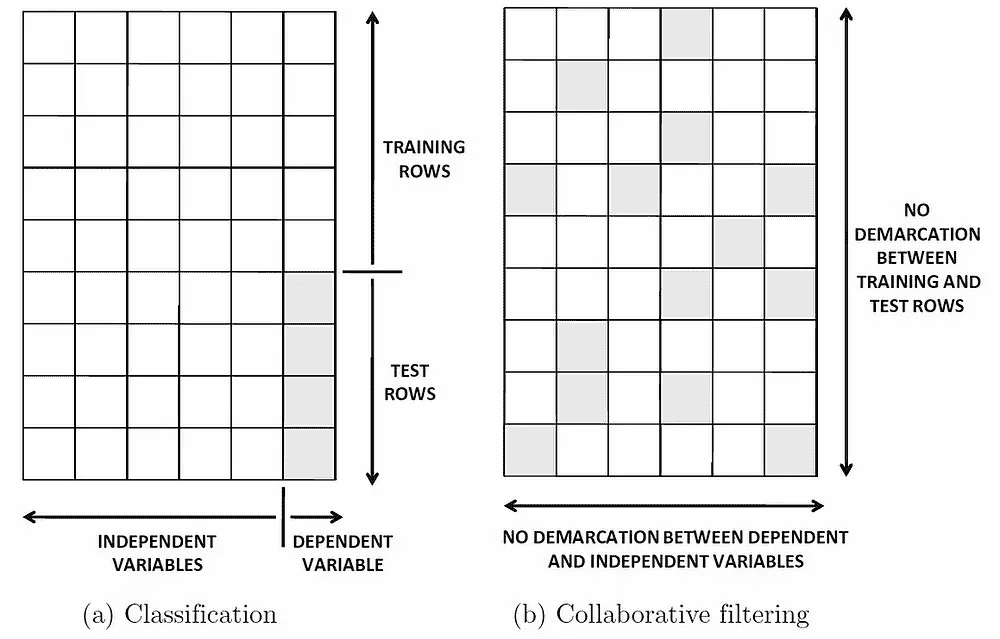
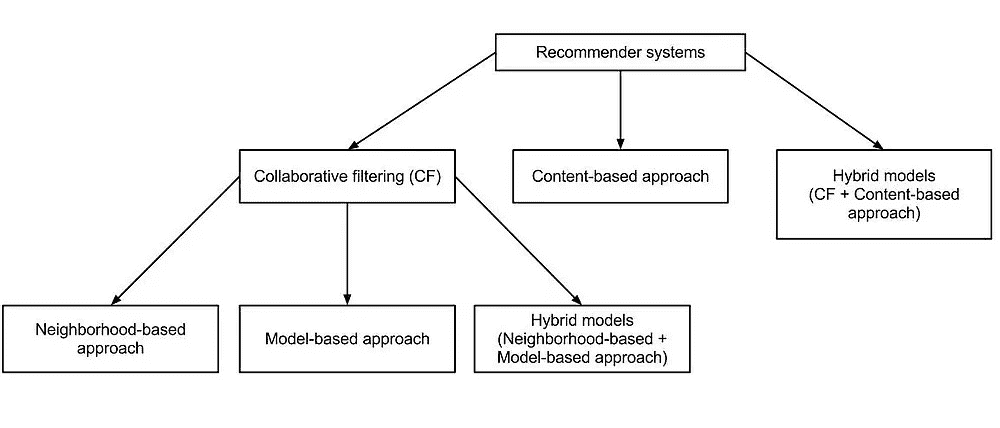

# 亚马逊推荐系统概述:协同过滤

> 原文：<https://medium.datadriveninvestor.com/an-overview-of-amazons-recommendation-systems-collaborative-filtering-8929d6e48536?source=collection_archive---------22----------------------->

生活在这个疫情让我们几乎所有人都成了亚马逊(Amazon)等平台上的频繁网购者，我们中的一些人成了 T2(Alibaba)网飞(T3)的常客，我们中的一些人花了更多的时间观看 T4(Youtube)上的视频(如果我们还没有这样做的话，就像我一样；-)而我们不禁注意到这些电商网站/app 使用的**推荐**系统。除了增加这些公司的销售额之外，它实际上还帮助了我们(客户)很多，尤其是现在，当我们不得不在家管理一切，并且整天在家工作的时候。

这意味着没有必要再列购物清单或浪费大量时间为你的宝宝寻找合适的衣服。你点击一件商品，其他商品就会弹出来，推荐我们购买像我们一样的其他顾客已经购买的商品。

这些推荐通常会加快搜索速度，让用户更容易访问他们感兴趣的内容，并给他们带来他们从未搜索过的惊喜。我们开始感到被了解和理解，在大多数情况下，我们最终会购买我们渴望拥有的东西，即使并不需要，或者腾出更多时间来观看向我们推荐的电影或视频，我们甚至不会搜索，从而增加这些顶级巨头的收入，如**亚马逊**、**网飞**、 **YouTube** 等。

看到它的强大，毫无疑问现在已经用了十几年了。

**那么什么是推荐系统呢？**

根据用于进行推理的数据，它大致分为两种类型:

*   *基于内容的过滤，使用项目(目录)属性。*
*   *协同过滤，除了项目属性之外，还使用用户行为或交互。*

在这篇文章中，我将探索更多关于协同过滤的内容。

***那么，什么是协同过滤？***

协同过滤是最常见的在线产品推荐方式。它是“协作的”,因为它根据其他客户的偏好来预测给定客户的偏好。

 [## 一瞬间学会数据科学！？数据驱动的投资者

### 在我之前的职业生涯中，我是一名训练有素的古典钢琴家。还记得那些声称你可以…

www.datadriveninvestor.com](https://www.datadriveninvestor.com/2020/07/23/learn-data-science-in-a-flash/) 

这些类型的系统利用用户交互来过滤感兴趣的项目。我们可以用矩阵来可视化交互集合，其中每个条目(m，n)表示用户 *m* 和项目 *n* 之间的交互。看待协同过滤的一个有趣的方式是将其视为对 ***分类*** 和 ***回归*** 的概括。虽然在这些情况下，我们的目标是预测一个直接依赖于其他变量(特征)的变量，但在协同过滤中，特征变量和类别变量之间没有这种区别。

[Image Source](https://link.springer.com/book/10.1007%2F978-3-319-29659-3)

协同过滤基于这样的假设，即过去同意的人将来也会同意，并且他们会像过去一样喜欢相似种类的项目。该系统仅使用关于不同用户或项目的评级简档的信息来生成推荐。

我们不能真正推广使用协同过滤，因为市场上的每家公司都在使用自己的模型。亚马逊使用 ***单品协同过滤。***

***什么是单品协同过滤？***

当全世界都在关注基于用户的协同过滤时，**亚马逊**在 2003 年提出了一种算法，在这种算法中，产品推荐不仅基于*客户*之间的相似性，还基于*产品之间的相关性。通过项目对项目的协同过滤，推荐算法会检查访问者最近的购买历史，并为每次购买调出相关项目的列表。在所有列表中重复出现的项目是推荐给访问者的候选项目。但是这些候选人的权重或大或小取决于他们与访问者之前购物的相关程度。*

关联性的概念仍然来源于顾客的购买历史:如果购买 A 的顾客很可能也购买 B，那么 B 与 A 相关。但亚马逊的个性化团队根据经验发现，在商品层面分析购买历史比在客户层面分析会产生更好的推荐。

因此，推荐算法通过为每个顾客创造个性化的购物体验，提供了一种有效的定向营销方式。在未来，我们不会惊讶地看到零售行业更广泛地将推荐算法应用于在线和线下的定向营销。虽然电子商务企业拥有最简单的个性化工具，但与传统的大规模方法相比，该技术的转换率更高，这也将使其对线下零售商具有吸引力，可用于邮寄、优惠券和其他形式的客户沟通。

*原载于 2020 年 10 月 15 日*[*【https://www.numpyninja.com】*](https://www.numpyninja.com/post/an-overview-of-collaborative-filtering)*。*

## 访问专家视图— [订阅 DDI 英特尔](https://datadriveninvestor.com/ddi-intel)