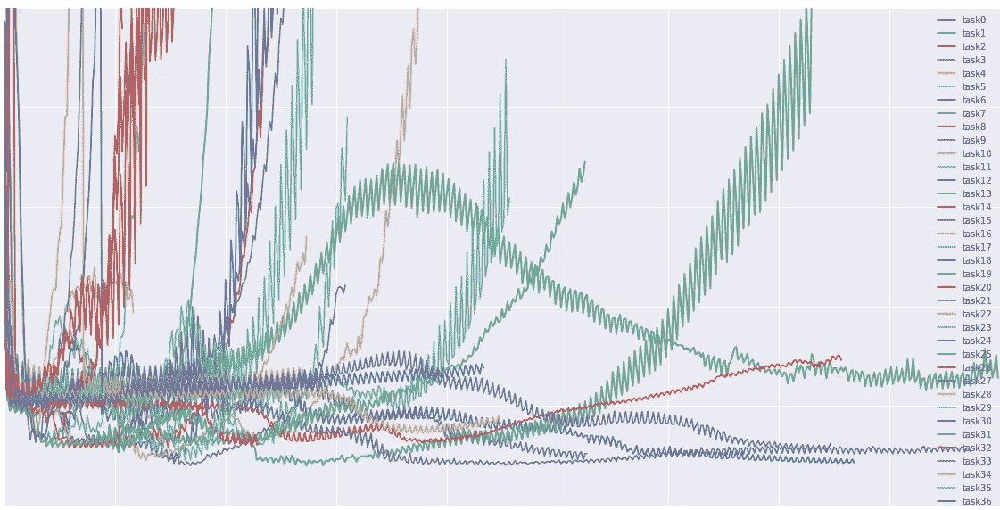
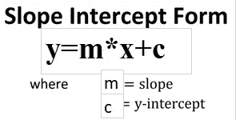
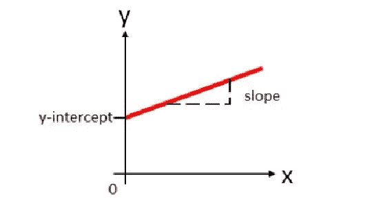
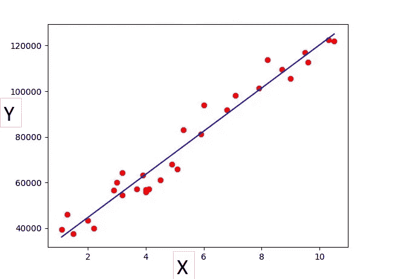
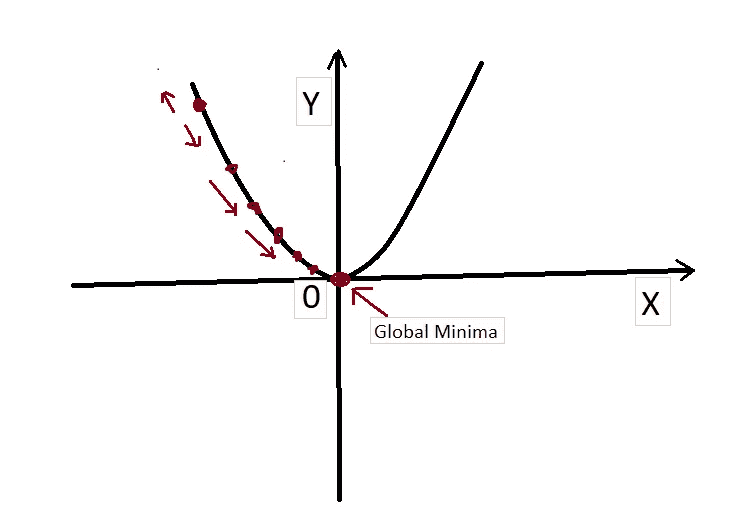
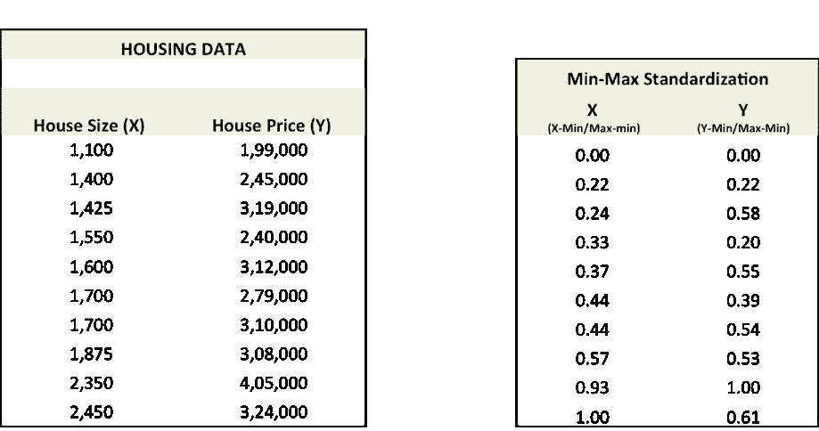
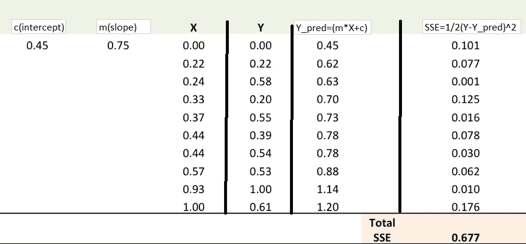
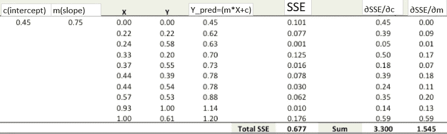
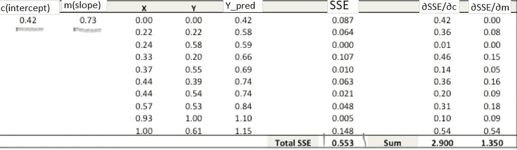
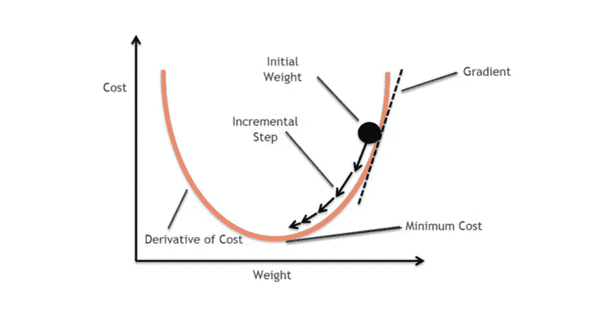

# 梯度下降算法综述

> 原文：<https://medium.datadriveninvestor.com/an-overview-of-gradient-descent-algorithms-e373443afa7f?source=collection_archive---------3----------------------->

source:[SEBASTIAN RUDER](https://ruder.io/author/sebastian/index.html)

# **概述:**

无论您是在处理现实生活中的问题还是构建软件产品，优化始终是最终目标。优化基本上意味着为您的问题获得最佳输出。大多数数据科学算法都是优化问题，其中最广泛使用的算法之一是梯度下降算法。

# **梯度下降:**

梯度下降是一种优化算法。它用于查找使成本函数最小化的函数的参数/系数的值

当函数的参数无法解析计算(例如使用线性代数)且必须通过优化算法搜索时，最好使用梯度下降法。

 [## 将定义 2020 年就业前景的五大数据科学和机器学习趋势|数据驱动…

### 数据科学和 ML 是 2019 年最受关注的趋势之一，毫无疑问，它们将继续发展…

www.datadriveninvestor.com](https://www.datadriveninvestor.com/2020/02/19/five-data-science-and-machine-learning-trends-that-will-define-job-prospects-in-2020/) 

有这么多奇怪的术语，一开始会让人感到困惑，但一旦你明白了，就会很容易理解。我在这里的意图是保持简单，以便任何人都可以很快理解。

让我们详细了解梯度下降及其功能。

首先，我们都知道线性代数中的直线方程如下。

在哪里，

m =斜率(这表示在 x 值单位变化内，y 改变了多少)

c =截距(一些默认的正值或负值)

x =独立变量，用于预测

y =因变量，需要预测

通过下面的图片让我们了解一下。图中的红点是实际数据点，蓝线是预测线。在这种情况下，我们试图找到误差最小的线(考虑所有的数据点)。这涉及到成本函数或损失函数的概念。

误差=实际值-预测值

# **让我们理解成本函数和损失函数:**

损失函数计算单个训练示例的误差，而成本函数是所有训练示例的损失函数的平均值。

成本函数基本上告诉我们，我们的模型对' **m** '和' **c** '的单个值的预测“有多好”。

梯度下降帮助我们找到成本函数最小的那些参数/系数(m 和 b)值。

要达到这个最小值或全局最小值，需要知道两件事

1.  走哪条路(向上和向下的话)
2.  学习率

梯度下降算法有助于利用导数作出决定。

导数计算为图形在特定点的斜率。斜率是通过在该点画一条切线来描述的。所以如果我们能够计算出这条切线，我们就能够计算出达到最小值的方向。

# **求参数 m 和 c 值的步骤:**

1.  选取参数 m 和 c 的随机值。
2.  对损失函数中的每个参数求导。在机器学习的术语中，取损失函数的梯度。将参数值代入导数(梯度)
3.  用梯度调整权重(m 和 c ),以达到 SSE 最小的最佳值，并决定学习率。

4.使用 m(斜率)和 c(截距)的新参数进行预测，并计算 SSE(误差平方和)的新值

5.重复步骤 3 和 4，直到对 m 和 c 的进一步调整不会显著减少误差。

# 让我们按照上面的步骤举例:

我们有下面的数据集，通过知道房子的大小来预测它的价格。

预测房价(Y _ pred)= SFT 的房屋面积*斜率+截距

**误差平方和(SSE) =总和(实际房价-预测房价)**

**误差平方和(SSE) = Sum(Y — Y_pred)**

(请注意，还有其他测量误差的方法。SSE 只是其中之一)

现在使用标准定标器或最小-最大定标器将数据标准化，以保持数据单元较少且范围相同。(我们在这里使用了最小-最大缩放器)

**步骤 1:** 为了拟合直线 Y_pred = X*m+c，从 m 和 c 的随机值开始，并计算预测误差(SSE)

**第二步:**对其中的每个参数取损失函数(SSE)的导数。我们将使用**链式法则**来寻找这些导数。在机器学习的术语中，取损失函数的梯度。将参数值代入导数(梯度)

∂SSE/∂c = — (Y — Y_pred)

∂SSE/∂m = — (Y — Y_pred)*X

这里，SSE= (Y — Y_pred) = (Y-(X*m+c))

∂SSE/∂c 和∂SSE/∂m 是作为斜率计算的**梯度，**用于找到达到全局最小值的期望方向。

**步骤 3:** 用梯度调整权重(m 和 c)以达到 SSE 最小的最佳值

我们需要更新上述 m & c 的随机值，以便我们朝着最佳 m & c 的方向前进

更新规则:

*   ∂SSE/∂c
*   ∂SSE/∂m

因此，更新规则如下:

1.  新截距(c)= c —学习率***∂sse/∂c =**0.45–0.01 * 3.300 = 0.42
2.  新斜率(m) = m—学习率***∂sse/∂m=**0.75–0.01 * 1.545 = 0.73

**学习速率**是优化算法中的一个调整参数，它确定每次迭代的步长，同时向损失函数的最小值移动

**第四步**。使用新的 m(斜率)和 c(截距)进行预测，并计算新的 SSE 值(误差平方和)

**步骤 5:** 重复步骤 3 和 4，直到对 m 和 c 的进一步调整不会显著减小误差。那时，我们已经到达了预测精度最高的最优 m，c。这也被称为达到全局最小值(pic 中的最小成本)。

图片比文字更能说明问题。

这是所有关于梯度下降算法。

**结论:梯度下降**是**在各种机器学习算法中用于**最小化代价函数的优化算法。基本上**用于**更新学习模型的参数。

希望你喜欢我的文章。请点击拍手(最多 50 次)来激励我继续写下去。

想要连接:

联系方式:[https://www.linkedin.com/in/anjani-kumar-9b969a39/](https://www.linkedin.com/in/anjani-kumar-9b969a39/)

如果你喜欢我在 Medium 上的帖子，并希望我继续做这项工作，请考虑在 [**版块**](https://www.patreon.com/anjanikumar) 上支持我