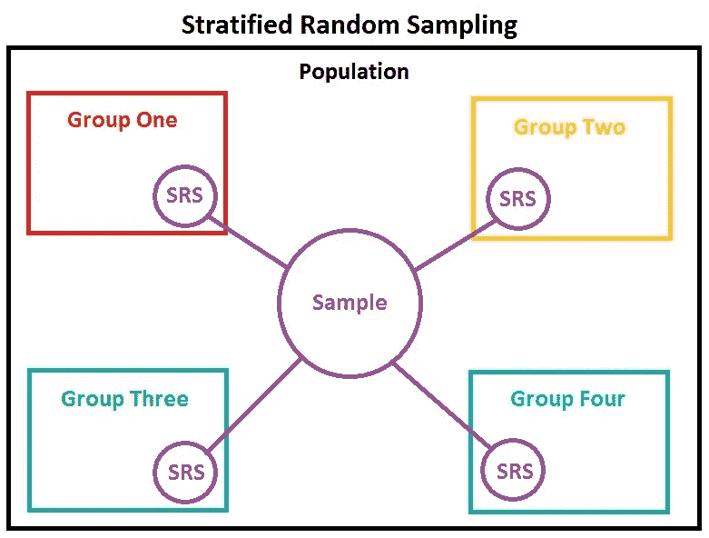
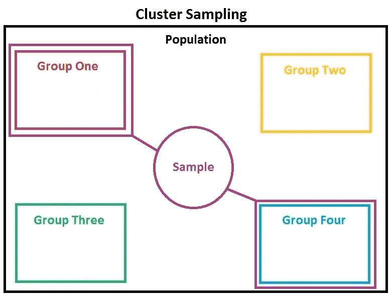

# 统计抽样概述

> 原文：<https://medium.datadriveninvestor.com/an-overview-of-statistical-sampling-202806bf2995?source=collection_archive---------21----------------------->

Photo by [fotografierende](https://unsplash.com/@fotografierende?utm_source=unsplash&utm_medium=referral&utm_content=creditCopyText) on [Unsplash](https://unsplash.com/?utm_source=unsplash&utm_medium=referral&utm_content=creditCopyText)

数据收集是任何机器学习管道的初始阶段。大多数情况下，收集数据是一项容易执行的任务。然而，从这些数据中获得有用的见解可能并不容易。有时甚至收集数据也不容易，例如为选举的民意调查收集数据。为了这个任务，我们不能只是去询问每个人对民意测验的看法。因此，我们必须设计有用的抽样技术，有效地收集数据，以便它能很好地代表整个人口。

## 统计抽样的特征:

统计抽样必须以这样一种方式进行，即它应该模拟整个人口。这样，我们至少可以预期人口和样本的分布应该是相似的。作为第一步，我们必须首先定义我们的**目标人群**，我们将从那里收集样本。例如，在印度选举的民意调查中，**的目标人群**将是 18 岁以上的印度公民。取样可以是有偏的，也可以是无偏的，这取决于取样的方式。例如，在印度进行民意测验预测抽样时，如果我们只考虑某个邦(如凯拉邦)的意见，它永远不会是全体人口的真正代表。因此，我们将相同的采样称为**有偏采样**。

# 统计抽样技术；

采样可以通过多种方式进行。举个例子，

## 简单随机抽样:

在这种抽样方法中，我们选择最明显的方法，即我们以随机的方式选择样本。这意味着所有的抽样单位都有相等的概率被选中。这可以通过两种方式实现，例如有替换的采样和无替换的采样。 ***采样与替换*** 确保一个采样单元有机会被选择不止一次。例如，在我们的民意测验预测问题中，我们可能不止一次地听取同一个人的意见，这似乎不是解决这个问题的好方法。另一方面 ***无替换抽样*** 不会将抽样单位带回总体。在我们的投票预测问题中，这似乎是一个比前者更好的方法，因为这确保了同一个人的意见不会被采纳两次。

 [## 数据科学和软件工程哪个更有前途？数据驱动的投资者

### 大约一个月前，当我坐在咖啡馆里为一个客户开发网站时，我发现了这个女人…

www.datadriveninvestor.com](https://www.datadriveninvestor.com/2019/01/23/which-is-more-promising-data-science-or-software-engineering/) 

这种方法虽然看起来简单，但它并不总是能确保无偏差的抽样，因为所有的单位都有相同的可能性。

## 分层抽样:

这种取样方法试图解决我们在前一个案例中遇到的问题。这里，我们首先将整个样本分成具有相似属性的组。例如，我们可以将印度的全部人口划分为不同的邦或宗教，同时考虑他们的意见。具有相似特征的人群称为 ***阶层。例如，如果我们将我们的国家划分为不同的州，同时进行民意测验预测，假设某个州的人有相似的观点，每个州将形成一个阶层。***

(Image Source:Wikipedia)

上图是我们在每组取样。

## 整群抽样:

分层抽样提出了在一个组中有相似样本的想法， ***整群抽样*** 提倡在每个群中有不同种类的元素集合的想法。这里我们假设每一个聚类都是总体的样本。我们还假设每个聚类是互斥的，即**没有两个相同的聚类具有相同的采样单位**。例如，如果我们有一堆红色、绿色、蓝色的球，那么每一组都有一个球。在这种情况下，每个采样单元将是一个集群，因为它是整个样本的完美代表。我们也可以遵循两阶段整群抽样技术，对一个整群进行抽样，然后在其上应用随机抽样。

(Source Wikipedia)

上图显示，我们将每个集群作为一个样本，因为它们中的每一个都是整个群体的完美代表。

## 系统取样:

系统抽样首先按一定顺序列出总体，然后每第 k 个数抽样一次。这确保了第一次取样。然而，当群体中存在循环模式时，这带来了一个缺点。例如，我们有 100 块巧克力，每第 5 块巧克力是 eclair，我们选择 k 作为 5，那么我们最后只抽样 eclair。这可能是一个严重的问题。然而，如果没有这样的模式，并且我们想要更快的采样，这种方法效果很好。

上面讨论的统计技术虽然不能确保无偏倚的抽样，但它们使样本保持有偏倚的机会最小化。然而，作为一个经验法则，我们可以增加样本的大小，使其无偏。