# Git 和 Github 的终极帖子

> 原文：<https://medium.datadriveninvestor.com/an-ultimate-post-to-git-and-github-f447f0be295b?source=collection_archive---------21----------------------->

嘿，大家好，在这篇文章中，我们将熟悉如何使用 Git 和 GitHub。


# Git — > Git 是一个版本控制系统。

它允许您记录项目的不同版本，也允许您及时返回以检查项目的以前版本。

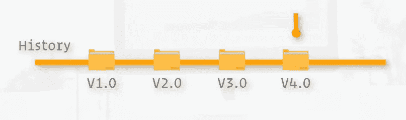

Image Source: Google Images

# 开源代码库

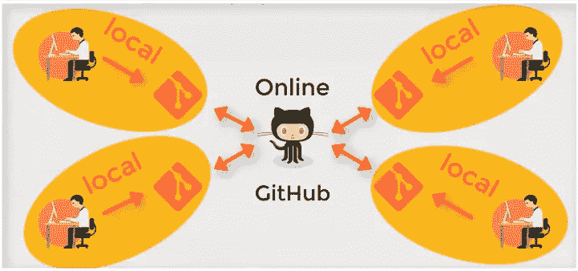

Image Source: Google Images

Github 是一项在线服务，在这里你可以托管你的代码并与其他开发者共享，也可以进行协作。稍后会详细介绍。

通常，有两种类型的版本控制系统。

1.  **中央集权的 VCS**

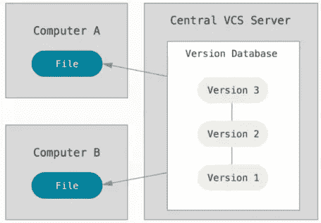

集中式 VCS 有一台包含所有项目版本的服务器。

2.**分发 VCS**

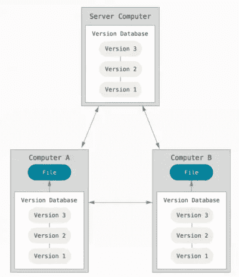

在分布式 VCS 中，我们将不同版本的项目保存在本地的不同计算机上，也保存在中央服务器上。因此，如果服务器发生问题，我们在本地系统中仍有副本，万一网络出现故障，我们也可以利用本地存储进行版本控制。

在接下来的演示中，我将使用 Visual Studio 代码和 Git。它们可以从这里下载，适用于您使用的相应操作系统。

VS 代号:【https://code.visualstudio.com/ 

https://git-scm.com/

然后安装 VS 代码很简单，所以我将发布 git 安装的片段。

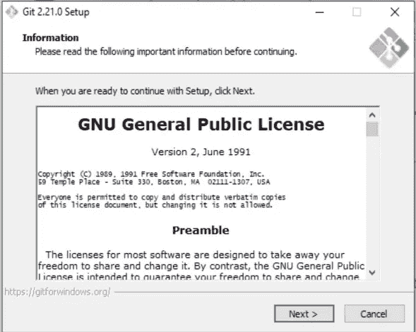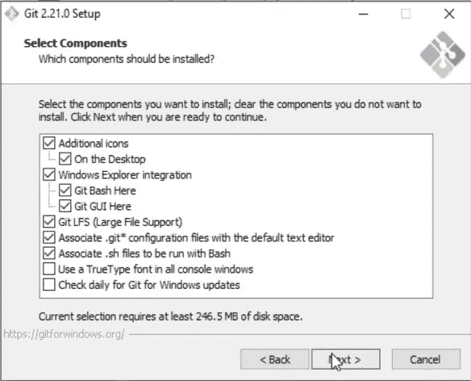

S1

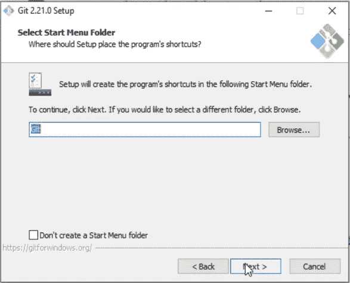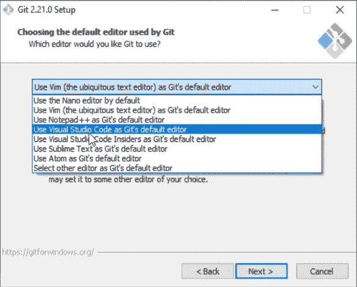

S2

在这一步，我选择 VS code 作为 git 的默认编辑器，你可以选择任何你喜欢的编辑器。

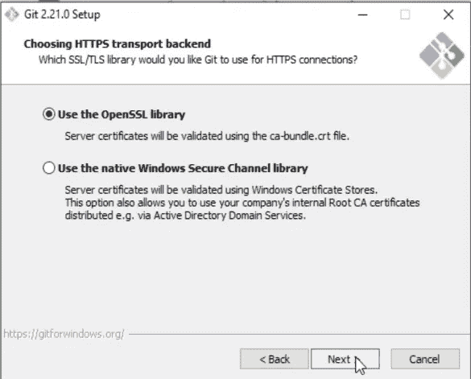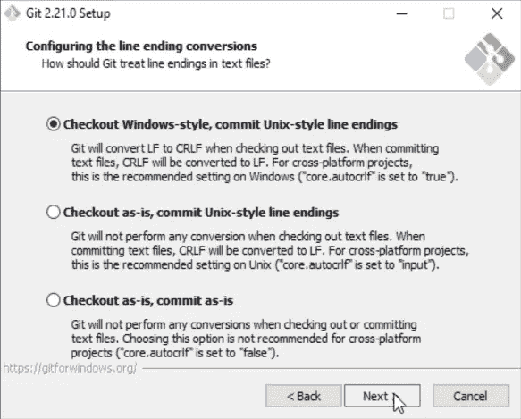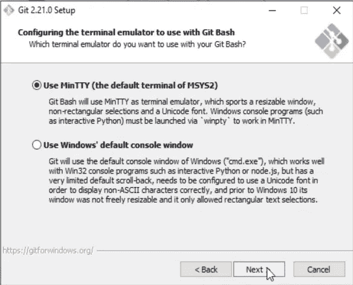

S3

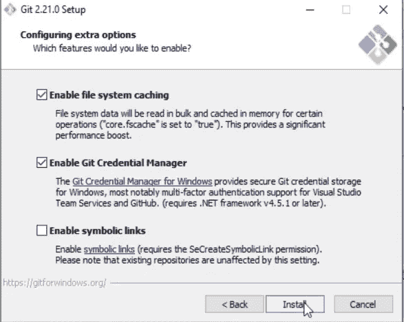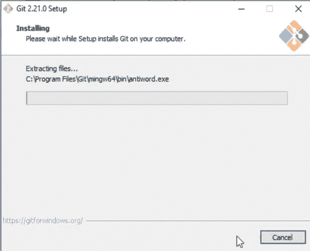

S4

git 安装结束。还安装了 Git Bash，我们可以在终端上运行命令。

## 创建新的存储库/存储库:

为了演示，我将把项目文件夹存储在桌面上，在此之前，让我们检查一下 git 版本，为此，让我们打开 git bash。

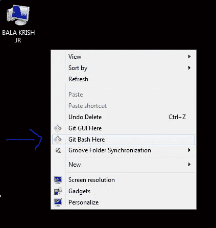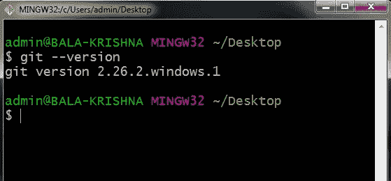

在我们继续之前，让我们来看一些基本的终端命令。

```
## Displays the present working directory. 
**pwd**## cmd to go to desktop directory.
**cd desktop**## Create a new folder
**mkdir demo**## Go back on one folder
**cd ..**## Go back on multiple folders
**cd ../..**## Create a new file
**touch sample.txt**## Display all files and folders in the working directory
**ls**## Rename a file
**mv sample.txt sample2.txt**## Delete a file
**rm sample2.txt**## Delete a folder
**rm -rf demo**## Open a folder in VS Code
**code demo**## Clear your git bash screen
**clear**
```

很好，现在让我们来处理我们的演示文件夹，我希望这个文件夹被用作我的 repo/repository，我希望 git 跟踪该文件夹中的文件。为此，我们必须指定一个 git 命令来启动。

```
## Convert a folder into local git repository
**git init**
```

运行此命令后，您必须看到。存储库中的 git 文件夹。此外，它还显示我们处于回购的(主)分支。稍后将详细介绍分支。

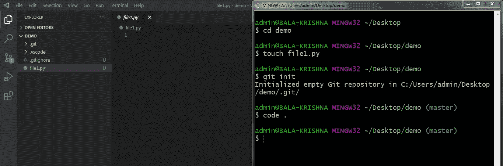

默认情况下，它隐藏在 VS 代码中，在 VS 代码编辑器的 settings.json 中添加下面的 JSON 文件。

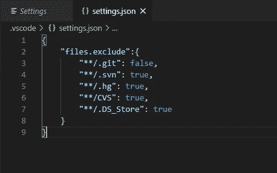

git 初始化之后，文件夹中的所有文件都没有被跟踪，我们可以使用下面的命令来检查文件的状态。

```
## Check the status of a repo
**git status**
```

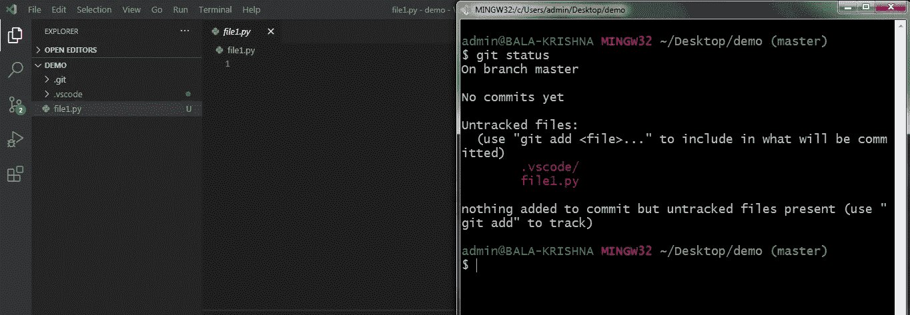

现在从描述中我们得到一些信息，比如我们在主分支上，我们还没有提交，文件仍然没有被跟踪(U)。

跟踪就像是一个文件的快照，你越是改动文件，它就会做出快照的改动。

## ***Git 的阶段***

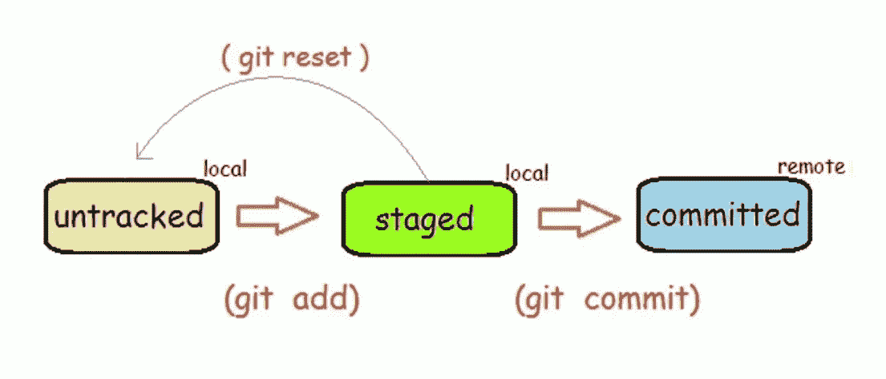

现在，当一个新文件被创建时，它最初是不被跟踪的，然后我们执行" **git add** "命令开始跟踪该文件，它被移动到暂存区，因此如果一个文件在暂存区中，这意味着它准备好被提交。

```
## Move a file to staging area
**git add <filename>**or## Move all files in folder to staging area
**git add .** ## Commiting a file (with some description message)
**git commit -m "Initial Commit"**## If you want to remove any staged file
**git rm --cached <filename>**
```

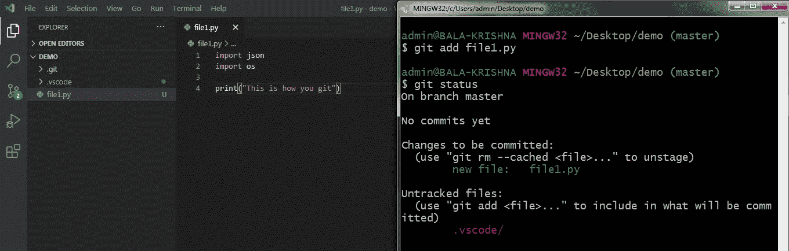

现在添加我们的文件后，我们可以看到它开始跟踪我们的文件。此外，它还存在于我们的暂存目录中，可以提交了。


现在，当我们尝试提交时，它会显示一条消息，说明它无法识别我们的身份，这一点很重要，因为以后当您与其他人协作时，我们需要知道谁对记录进行了任何更改或提交。所以让我们添加一个用户名和电子邮件。

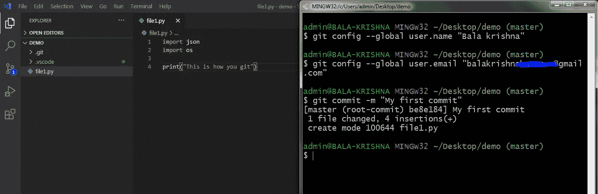

现在，添加用户名和电子邮件后，我们就可以进行第一次提交了。

很好，现在我们可以修改我们的文件，看看 git 是否能够找到它们，然后我们将修改后的文件提交给 git。

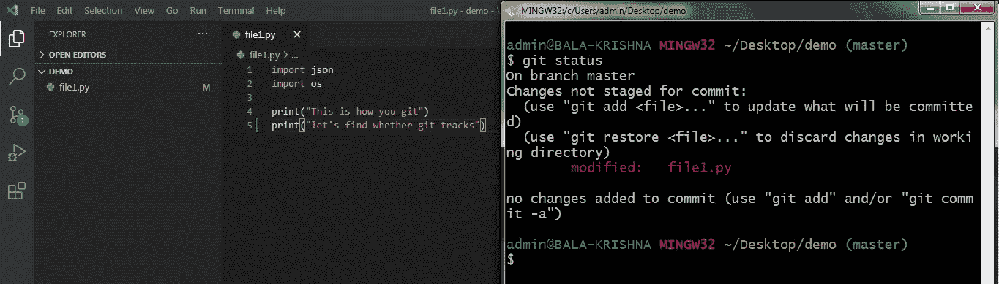

因此，正如所料，它跟踪文件并标记为修改，现在为了保存它，我们将文件添加到 git 暂存区，然后用不同的消息再次提交。

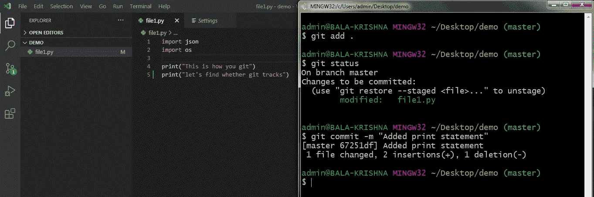

好了，现在让我们在回购中创建一个新文件，看看会发生什么。因此，我们看到该文件目前未被跟踪，因为在我们提交时，它不在以前的快照中。


因此，要将该文件添加到我们的 repo 中，我们需要将它们添加到暂存区并再次提交。

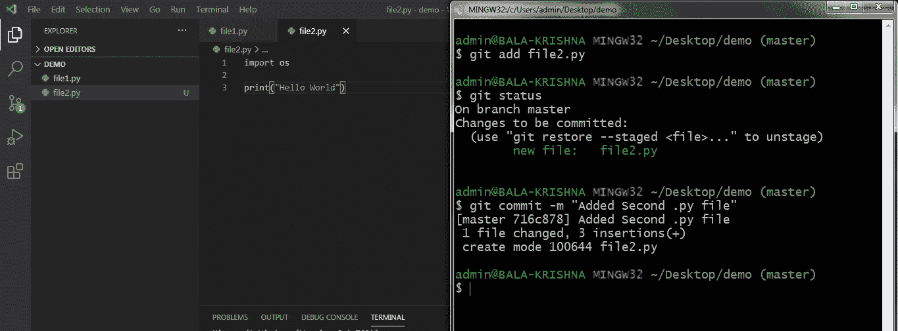

同样的概念也可以扩展到文件夹。

现在让我们看看到目前为止我们做了什么，简单来说 git 提供了一个命令

```
# To see history of a repo
**git log**# To see hisotry briefly
**git log --oneline**
```

这描述了我们到目前为止对回购的更改。

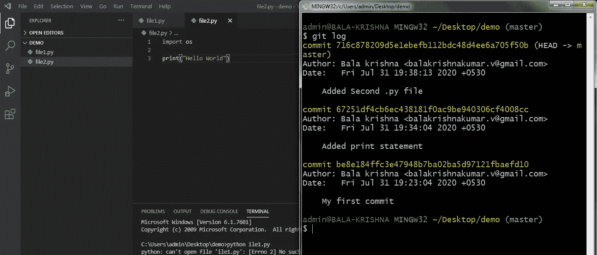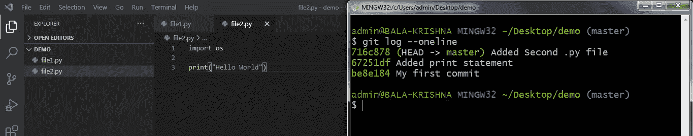

我们看到，每个提交都用基于 SHA256 的代码标识，这允许我们返回到特定的提交，我们将在稍后分支时使用它。

如果我们想检查我们提交的第一个版本，我们可以使用“我的第一次提交”的 sha 代码，使用命令

```
Go back in time to see earlier commits.
**git checkout ######**
```

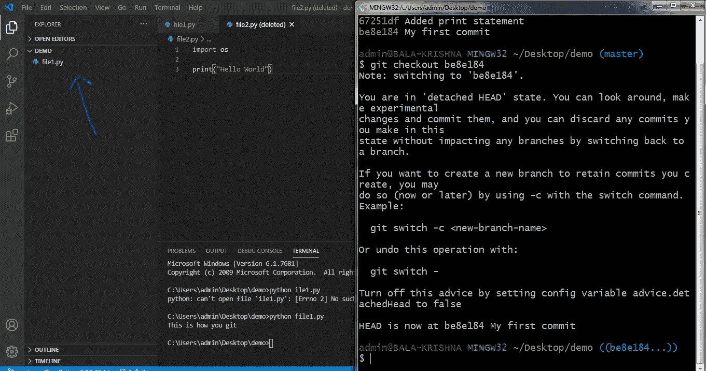

现在，我们看到 file2.py 不再存在，因为它在我们第一次提交时不存在，我们可以返回到当前状态，因为它不是永久的，为此，请运行命令

```
# Go to the current state
**git checkout master**
```

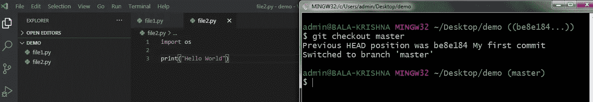

## **Git 回复:**

到目前为止，在我们的示例中，我们已经创建了 3 个提交并添加了 2 个。py 文件，但是假设我们希望停留在第二次提交，并使更改永久化。也就是说，我们不再需要提交 file2.py 文件。为此，我们使用 git revert 命令。

```
## Go back in time and make the changes permanent.
**git revert --hard ######**
```

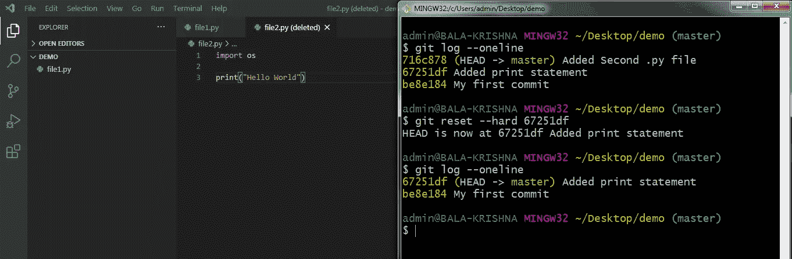

我们现在看到历史上没有第二个 py 文件的痕迹。还有其他两个标志可用软和混合，执行类似的行动，更多的代码运行。请注意，此操作是永久性的。

## 忽略 git 中的文件:

有一些创建的其他文件不需要每次都被跟踪，所以我们可以在一个名为. gitignore 的文件中指定这些文件。所以在这个文件中指定的文件不会被跟踪，除非我们删除它们。

现在让我们创建一个 requirements.txt 文件，一个包含一些图像的文件夹，并将它们添加到忽略文件中。

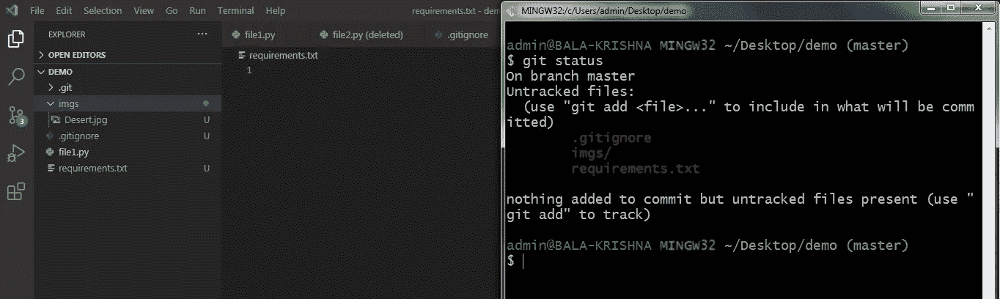

正如所料，git 开始跟踪新添加的文件，所以让我们取消对它们的跟踪。

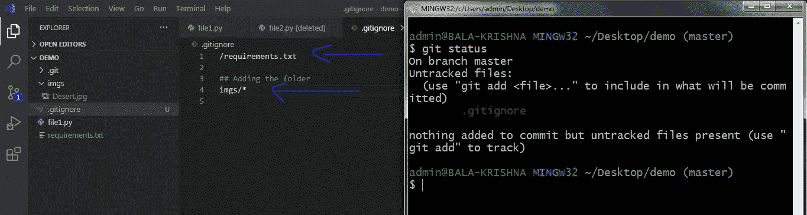

现在将它们添加到。gitignore 文件，它不再暂存它们。然后让我们进行最后的提交，添加。gitignore 文件。

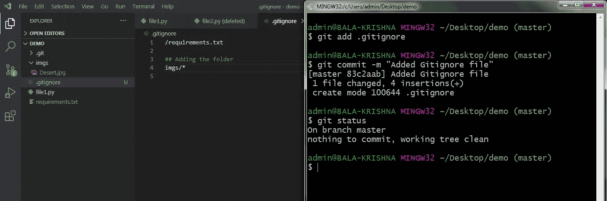

# **Github :**

git 和 GitHub 之间一直存在混淆，所以 git 是一个版本控制工具，允许我们在本地管理我们的代码，相反，GitHub 是一个在线服务，在那里你可以分享你的代码，以便与其他开发者合作。

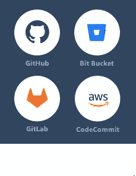

还有其他类似 GitHub 的服务，其中一些在这里有详细说明。但是 GitHub 在他们当中很受欢迎。

因此，如果你没有账户，你可以在 [GitHub](https://github.com/) 上创建一个。

然后验证结束后，去 https://github.com/new[的](https://github.com/new)，在这里我们可以创建一个新的在线空仓库。填写您选择的字段，如果您想了解更多关于[的信息，请点击这里](https://choosealicense.com/)。

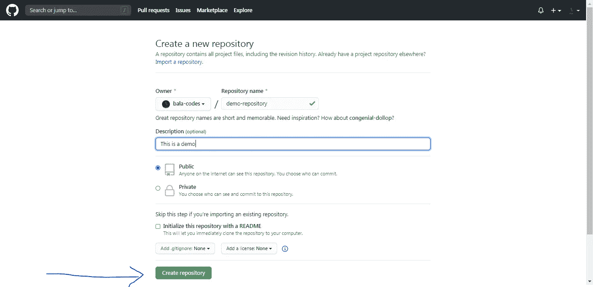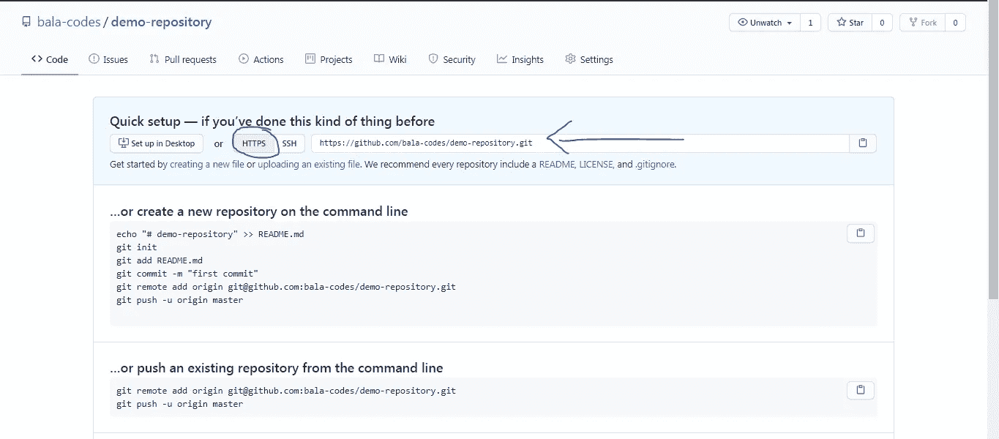

现在，我们将使用 https 链接将我们计算机中的本地回购推送到 Github。运行命令，第一个命令替换 repo 中的 https 链接。

```
**## Commands** **git remote add origin** [**https://github.com/username/demo-repository.git**](https://github.com/bala-codes/demo-repository.git)**git push origin master**
```

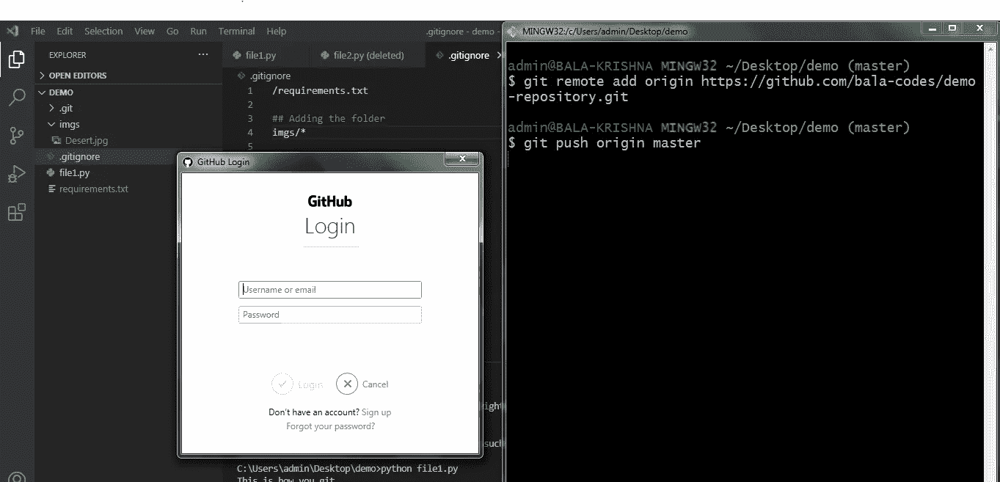

运行命令时，提示输入用户名和密码，以连接 GitHub 并推送您的代码。成功登录后，我们看到我们的本地回购被转移到在线 GitHub 回购。

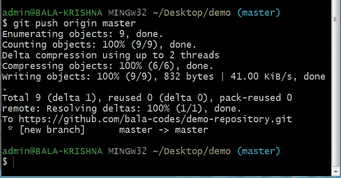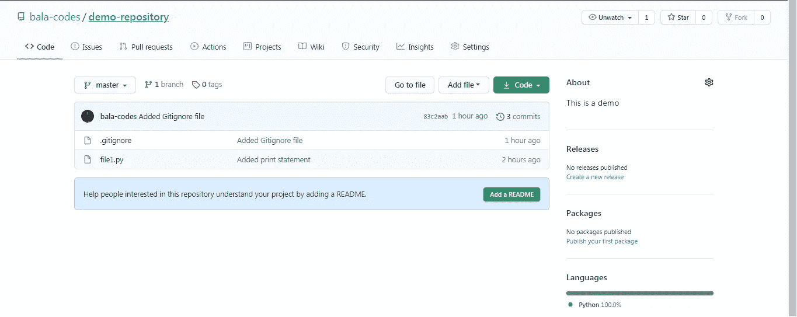

所以在将一个 repo 移动到 GitHub 之后，如果我们对本地 repo 做了一些新的更改并提交了它们，它将被存储在本地。为了保存对 GitHub 的更改，我们需要运行更多的命令。

```
# Adding a new file
**touch file3.py**# Adding to the staging area
**git add file3.py**# Commiting locally **git commit -m "Adding third .py file locally"**# Moving the changes to online github repo
**git push origin master**
```

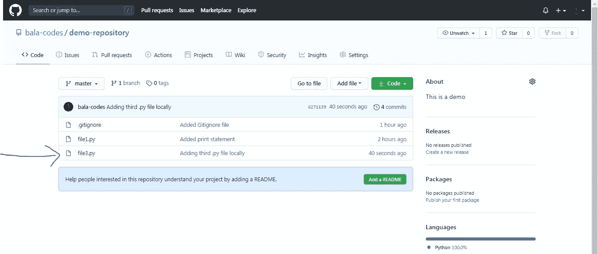

我们看到我们的新文件反映在在线 Github 回购中。

此外，还可以在 GitHub 中编辑文件并提交更改。

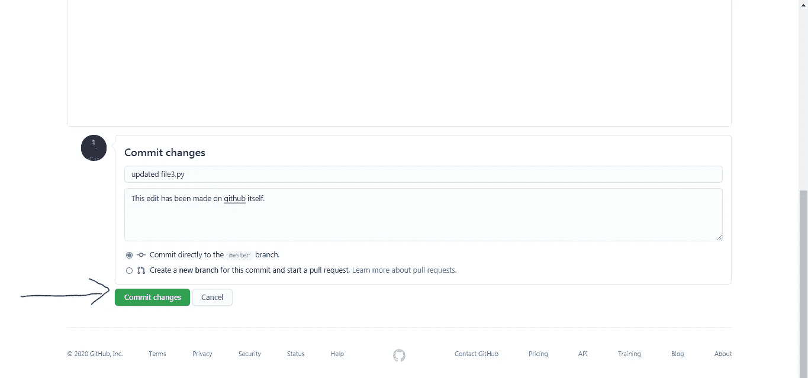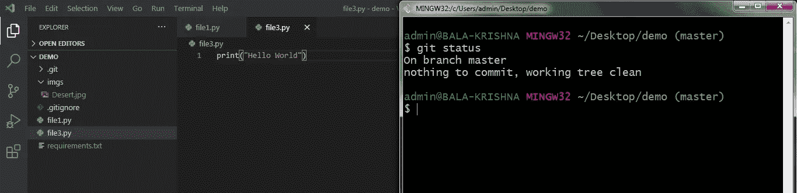

但是这些更改并没有反映在本地存储库中，所以它不是最新的。因此，我们需要将回购从网上转移到本地回购。运行命令，

```
## Pull the latest repo from github to local
**git pull origin master**(or)## Set the default branch as at github(master) and local(master)
**git branch --set-upstream-to=origin/master master
git pull**
```


# Git 分支

好的，到目前为止，我们已经创建了文件，操作它们，在 git 和 GitHub 之间推/拉它们，等等。

git 中另一个有趣的想法是创建分支的概念。


有时，我们不想改变项目的当前状态，但希望在不破坏原始代码的情况下试验一些新想法，在这种情况下，我们可以对当前项目进行分支，并独立进行一些新的更改，如果我们满意，我们可以稍后将分支与当前状态合并，然后继续前进。

好，首先让我们看看本地的回购结构是什么样的。

我们可以看到我们在主分支和 file1.py、file3.py、imgs 文件夹和 requirements.txt 中。

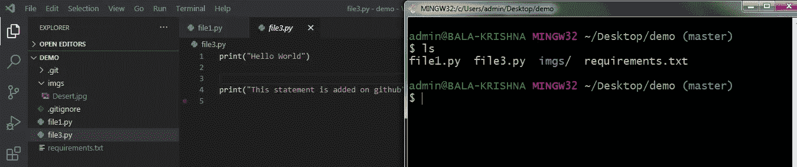

我们创建 2 个新分支，即:**路径-1** 和**路径-2。**

```
## Creating new branch
**git branch <branch name>**## Listing our the total branches in the repo
**git branch**## Switch to a new branch from master.
**git checkout <branch name>**## Deleting a branch
**git branch -D <branch name>**
```

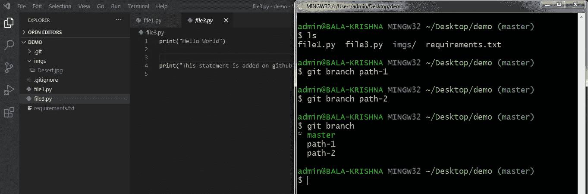

因此，在我们创建分支之后，让我们导航到 branch → path-1，修改 file1.py 中的代码，保存它，并提交更改。

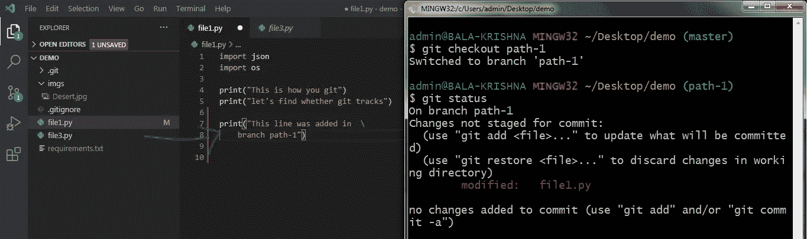

因此，我们看到更改已提交，现在如果我们切换回 branch → Master，我们将看不到所做的更改，因为我们还没有合并它们，我们仍在单独维护分支。

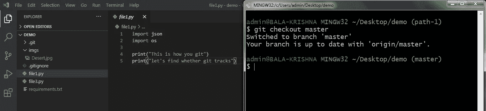

## 删除分支→路径-2

我们创建了 2 个分支 path-1 和 path-2，现在如果我们想删除一个分支，我们也可以这样做。

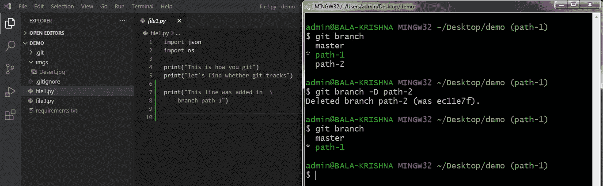

然后暂时直到我们在这篇文章的后面到达合并选项，我们将保持分支并且我们也将我们的变化推到 GitHub 在线仓库。

为此，让我们进入我们想要推送的分支并运行命令。

```
## Switch to a new branch from master.
**git checkout <branch name>**## Push the new branch to the github repo
**git push origin <branch name>**
```

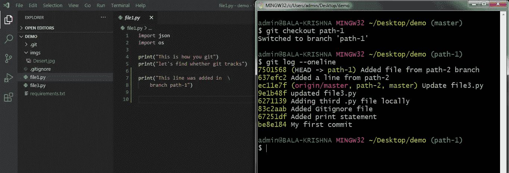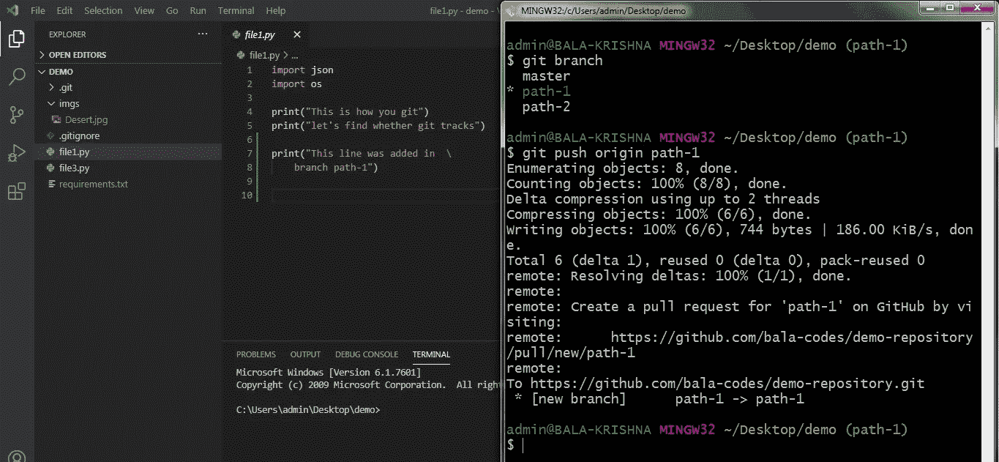

在 Github 上查看我们的在线回购，我们看到现在有 2 个分支，如果我们切换到 path-1 分支，我们可以在 python 文件中找到我们的新变化。

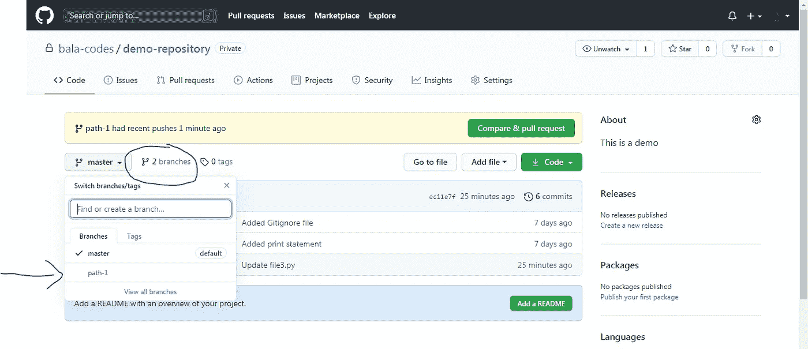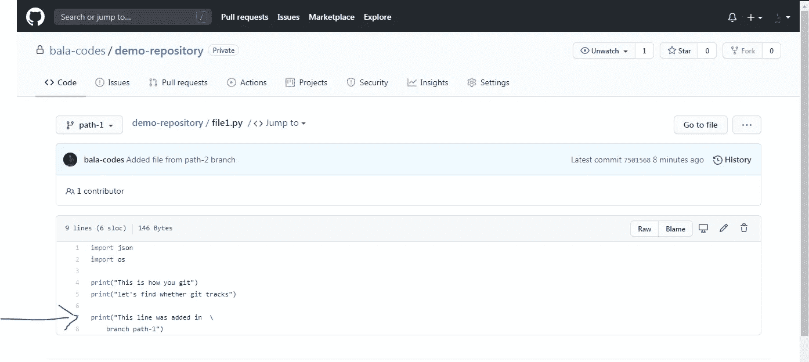

## 在 Github 上创建分支:

或者，我们也可以在 GitHub 上创建一个分支，并将其放到我们的本地回购中。让我们在 Github 上创建一个分支→ **path-3** ,编辑 file3.py 并提交更改。

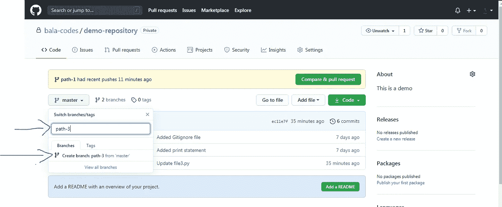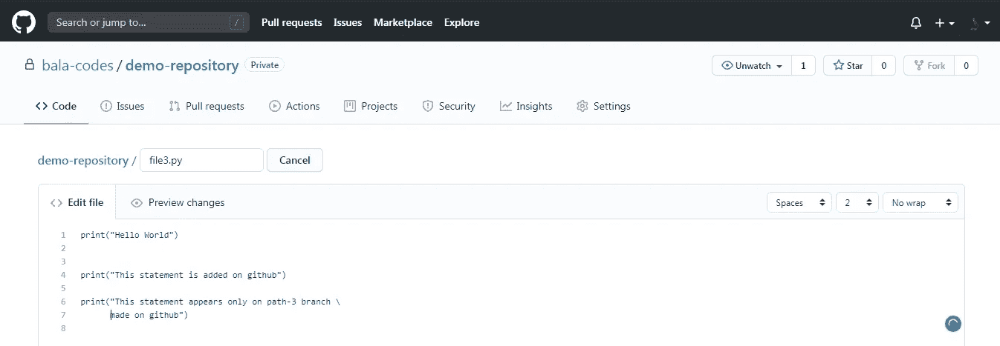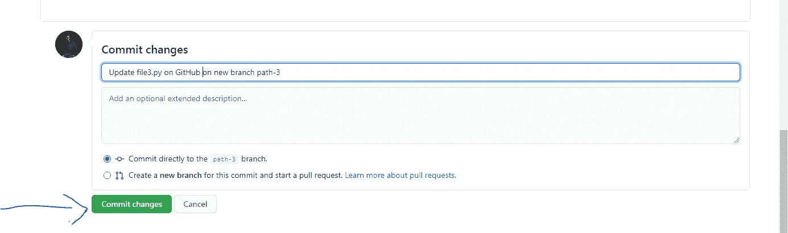

现在，让我们将更改提取到本地存储库中。目前，我们在本地回购中只有 2 个分支机构，**分支→主，路径-1** 。现在，我们将把**分支→ path-3** 添加到来自 Github 的本地回购中。

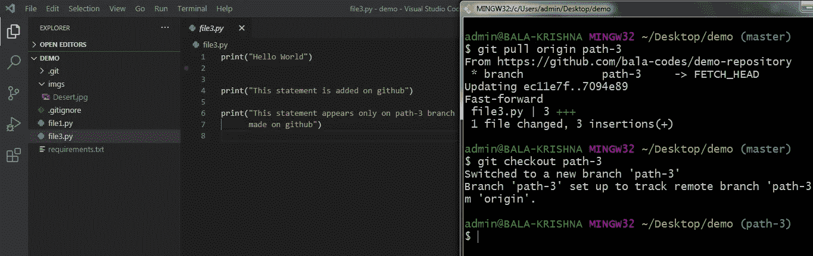

就是这样，一个简单而优雅的在线管理代码的方法，如果你遇到困难，请在评论中告诉我。

如果你认为这是你应得的，请投票并关注。

在那之前，下次见。

**文章作者:**

**BALAKRISHNAKUMAR V**

点击订阅 DIntel [。](https://ddintel.datadriveninvestor.com/)

在这里加入我们的网络:[https://datadriveninvestor.com/collaborate](https://datadriveninvestor.com/collaborate)