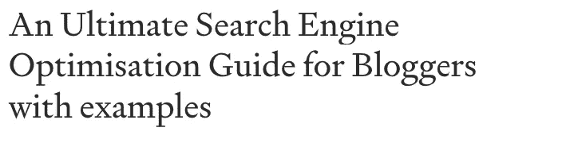
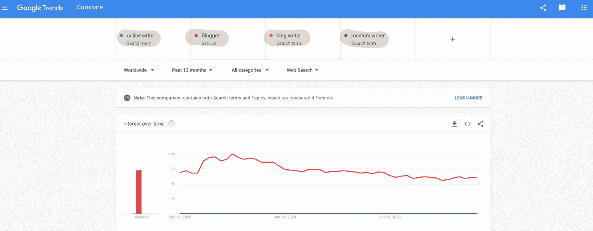
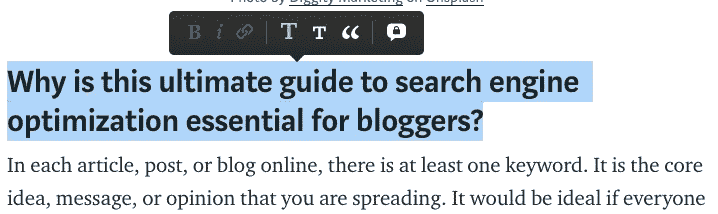

# 博客的终极搜索引擎优化指南，附示例

> 原文：<https://medium.datadriveninvestor.com/an-ultimate-search-engine-optimisation-guide-for-bloggers-with-examples-c46f11ffea39?source=collection_archive---------35----------------------->

Photo by [Diggity Marketing](https://unsplash.com/@diggitymarketing?utm_source=medium&utm_medium=referral) on [Unsplash](https://unsplash.com?utm_source=medium&utm_medium=referral)

# 为什么这本搜索引擎优化的终极指南对博主来说至关重要？

在每篇在线文章、帖子或博客中，至少有一个关键词。它是你正在传播的核心思想、信息或观点。如果每个搜索这些关键词的人都能把你的作品列为排名第一的结果，那就太好了。如果还没有，这篇文章将帮助你使用搜索引擎优化(SEO)实践朝着这个目标努力。如果你知道怎么做，SEO 并不难。

假设你已经围绕至少一个关键词写了你最好的博客(每个帖子或博客推荐一个且只有一个关键词；这超出了本文的范围)，本文将指导你采取另外**三个步骤为你的媒体故事或博客**做搜索引擎优化。最终，你的作品在搜索引擎上的排名会更高，也更容易被更多的公众看到。

为搜索引擎优化你的媒体故事和博客的三个步骤是:

1.  **优化你的页面标签**。
2.  **为人类和搜索引擎优化你的内容。**
3.  **去社交媒体。**

简单吗？是的，但没那么容易。这很容易，因为它看起来直截了当，但事实并非如此，因为有一些基本细节、经验法则和最佳实践需要您通过不断学习和体验来获得。本指南将使不容易的部分再次变得容易。

因此，让我们开始实施**终极三步指南，为这个中等故事**搜索引擎优化。

# 1.优化您的页面标签

页面标签是网页设计中的术语。他们向谷歌等搜索引擎发出信号，告诉它们哪些关键词对你的博客很重要，你希望你的博客因什么而排名靠前。幸运的是，大多数博客平台(Medium、WordPress 等)通过仔细彻底地设计你的标题、副标题、标签等，使得优化技术页面标签变得很容易。

## 标题标签

一般来说，标题标签是页面上最强大的标签。你需要写一个关键词丰富的标题，把最重要的关键词放在左边。它应该少于 80 个字符，前 59 个通常会作为标题出现在谷歌上。以这篇帖子的标题为例，我这篇文章的关键词是“搜索引擎优化指南”，助手关键词是“终极”、“给博主”、“举例”。

An example of a keyword-heavy title for Search Engine Optimization

**小贴士 1:** 不要频繁更换头衔，至少 6 周内不要。否则，像谷歌这样的搜索引擎会在搜索排名中惩罚你的工作。

**小贴士 2:** 在你发表文章或博客之前，最后审核或确定你的标题。

请注意，从搜索引擎算法的角度来看，辅助关键字“blogger”完全不同于像“博客作者”、“在线作者”或“媒体作者”这样的单词组合。有付费和免费的工具来帮助选择助手关键字。比如如下图，我用 Google trend 在“博主”中进行选择。“网络作家”等。列出这些辅助词，选择最适合你的一个。

Choose the best keywords and helper keywords using tools

## 元描述标签

它的工作是当搜索者看到你的作品出现在搜索结果列表中时“获得点击”。所以把注意力集中在 300 个字符的前 155 个中最重要的内容上。对于本文，我的元描述标记将是如下所示的副标题，

“优化你的故事和博客，提高知名度。搜索引擎优化的最佳实践用一个例子向博客作者解释

## 标题标签

对于你的文章、博客或帖子的搜索引擎优化来说，标题标签是第二强大的标签(从 H1 到 H2 再到 H3 等等，其影响力逐渐减弱)。优化标题标签也变得很容易。您可以将介质上的部分标题用作 H1 标签，将子部分标题用作 H2 标签。在标题标签中写下你的关键词，以 H1 开头，并在关键词周围加上几个 H2 标签。

Create and use keyword-heavy H1 tag on Medium.com

## 其他标签

以上是你可以在大多数博客平台上轻松实现的最重要的标签。

通过关键词交叉链接可以在多个方面帮助你，所以值得一试。但是太多的外呼对你的博客没有好处。一个普遍的建议是只链接到你自己的相关博客，以及相关的高声誉的博客/网站。

其他标签也可以帮助你的作品在搜索引擎上排名更高，例如，图片的 ALT 标签和粗体标签。但是它们的功能并不比上面介绍的那些差。

# 2.**为人类和搜索引擎优化你的内容。**

> “然而，在内容游戏中，我们都是竞争对手，所以请记住，你只需要制作比竞争对手更好的内容，而不是完美的内容。”— Jason McDonald，SEO、数字营销书籍的作者

## 关键词密集和人性化的内容

内容才是王道。你必须为人类和搜索引擎(机器和算法)编写内容。**人类喜欢干净的图片，但最聪明的搜索引擎算法现在寻找具有自然句法和良好语法的句子中的关键词。**一个好的平衡和经验法则是，在计算正常句子中关键词的出现频率时，密度约为 1–2%。

**提示 1:** 经常添加或修改你的内容。谷歌奖励“活着”的页面。

**技巧二:**不要谦虚你的内容，做一个营销者。将关键字与一些活力结合起来，以“获得点击”。这就是为什么你会看到我的标题是 ***一个最终的博客搜索引擎优化指南与例子*** 。

提示 3: 把吸引人眼球的内容放在顶部，把大量文本内容和谷歌链接放在底部。你会发现一个高声誉的搜索引擎优化的相关文章列表。

# 3.转到社交媒体

社交提及和分享向谷歌等搜索引擎发出信号，表明你的博客是活跃和重要的。一个你和你的追随者/评论者的强大而活跃的社会形象会提高你对搜索引擎算法的重要性。这是时下 SEO 的必做之事。

因此，请在 Twitter、Linked In、脸书、YouTube、Pinterest、Instagram 等网站上分享您的文章、博客或帖子。联系那些在你的关键词上有很多关注者的推特和博客，问问他们是否可以建立一个你作品的链接。你不问，你就得不到。

# 写在最后

本文是博客作者和其他在线作者的实用指南。最终的目标是帮助这些人知道如何让他们的努力工作在搜索引擎中更容易获得和更有吸引力。

毕竟，SEO 不仅仅是优化一个博客或一篇文章。也和数字营销、网站设计有关。如果你在博客平台上写作，这些就无关紧要了。

如果你受到启发并对 SEO 感兴趣，下面有更多的资源。

欢迎关注我，了解更多鼓舞人心的故事。敬请期待！

# 作者的其他帖子

 [## 通过模式识别实现自动化股票交易——一种递归编程方法

### 股票模式识别的一种高度概括的全局递归程序方法及其实现

medium.datadriveninvestor.com](/empower-automated-stock-trading-with-pattern-recognition-a-recursive-programmatic-approach-5930da422555)  [## 使用 Python 抓取顶级出版物的数据(使用 Selenium、Imaplib 和 BeautifulSoup4)

### 数据科学项目的一部分，以获得更多的意见和金钱对 Medium.com。这篇文章的重点是收集数据…

medium.datadriveninvestor.com](/scraping-top-publications-data-with-python-using-selenium-imaplib-and-beautifulsoup4-18fcf9b95c47)  [## 如何在介质上写作赚更多的钱？

### 用数据解释。有哪些热门话题？哪些是盈利的？使用最佳实践在…上写作、出版和赚钱

medium.datadriveninvestor.com](/how-to-make-money-on-medium-in-2021-37fbffbd48f1)  [## 抽象的商业模式和行动指向理解 Medium.com 的用户

### 一个端到端的数据科学项目，从模拟现实世界的业务问题开始，到…

medium.datadriveninvestor.com](/data-science-project-get-rewarded-by-knowing-medium-com-user-pool-modeling-business-problem-part-b93b8088c644) 

# 参考

 [## SEO 入门指南[搜索引擎优化]

### 通过搜索引擎优化的排名和流量如果你想学习的话，你会从这个指南中得到最大的收获…

moz.com](https://moz.com/beginners-guide-to-seo)  [## 搜索引擎优化-学习优化搜索引擎优化

### 本指南将介绍和概述搜索引擎优化(SEO)，这是一个非常重要的战术…

www.wordstream.com](https://www.wordstream.com/seo)  [## SEO 2021:用智能互联网营销策略学习搜索引擎优化

### 亚马逊网站:SEO 2021:学习搜索引擎优化与智能互联网营销策略电子书:克拉克，亚当…

www.amazon.com](https://www.amazon.com/SEO-2019-optimization-marketing-strategies-ebook/dp/B00NH0XZR0/ref=zg_bs_6133991011_2?_encoding=UTF8&psc=1&refRID=7ZADRYPME8B0Q40D0DGN)