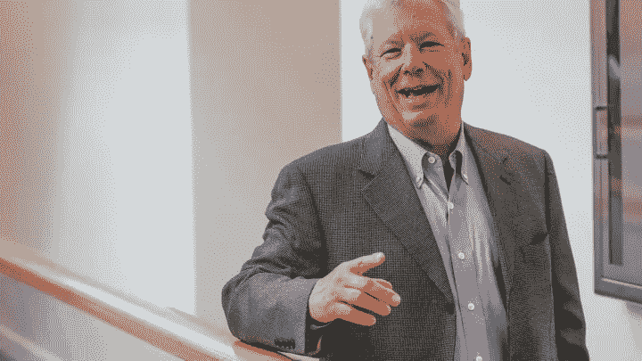
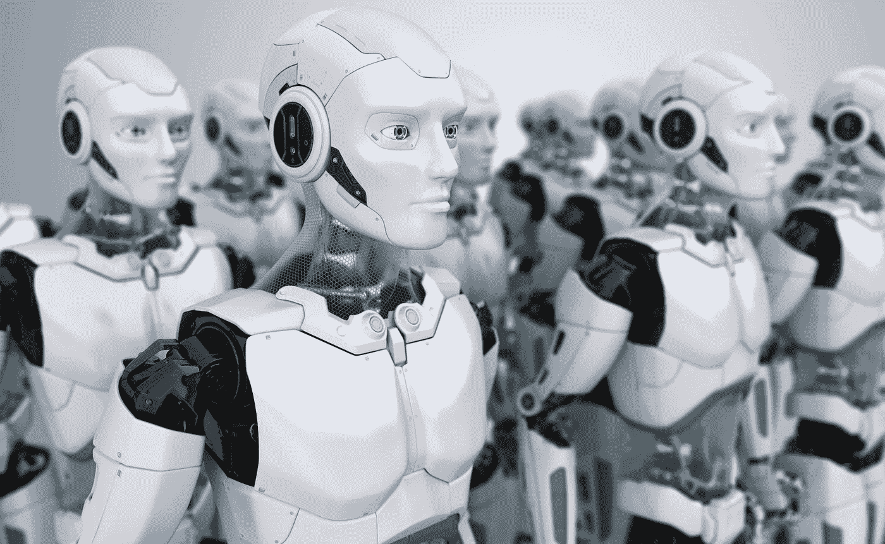
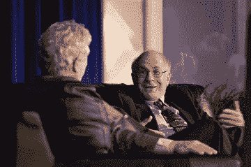
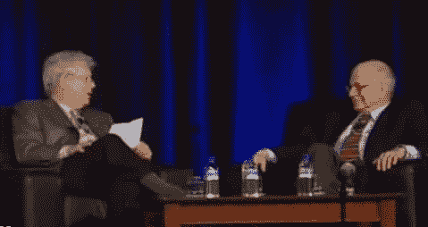

# 一个不太可能的团队挑战大型经济机器，并且赢了！

> 原文：<https://medium.datadriveninvestor.com/an-unlikely-team-takes-on-the-big-econ-machine-and-wins-3d362d1c3627?source=collection_archive---------3----------------------->

这是一个关于创新型经济学家[理查德·塞勒](https://www.chicagobooth.edu/faculty/directory/t/richard-h-thaler)如何与两位杰出的心理学家合作，改变经济学的教学、理解和实践方式的故事。政府制定实际可行的政策是因为这个不可思议的团队能够发现。

通过帮助弥合心理学(对人的研究)和经济学(对金融市场的研究)之间的差距，泰勒冒了很大的风险，但最终它得到了回报，因为我们现在对人们如何和为什么做决定有了更全面的看法，更重要的是，政策标记可以改变像信息传递或选择加入选择这样的小事，以帮助人们毫不费力地做出更好的财务决定。

这是我对理查德·塞勒在谷歌演讲的“非专家”总结——[经济学的行为化——为什么花了这么长时间](https://www.youtube.com/watch?v=D9Uk-YsjQsI)。

> *这次演讲的重点是:行为经济学与常规经济学有什么不同？*

任何东西的买卖(不仅仅是股票——我指的是商店里的牛奶、商场里的牛仔裤和网上的加密货币)都是由人类完成的——所以所有的*经济学都应该被认为是行为经济学，因为一个简单的事实是，所有的人都以某种方式行事——我们不是机器人。*

 [## 为什么包容性财富指数比 GDP 更能衡量社会进步？|数据驱动…

### 你不需要成为一个经济奇才或金融大师就能知道 GDP 的定义。即使你从未拿过 ECON 奖…

www.datadriveninvestor.com](https://www.datadriveninvestor.com/2019/03/08/why-inclusive-wealth-index-is-a-better-measure-of-societal-progress-than-gdp/) 

然而，传统经济学使用的模型假设我们在做决策时会像机器人一样行动。传统经济学断言，“人类总是会以最大化自身利益的方式行事。”

泰勒和他的合著者[卡斯·桑斯坦](https://hls.harvard.edu/faculty/directory/10871/Sunstein)在他们的畅销书[中把传统经济学**中的这些机器人般的生物**称为行为不端](https://www.amazon.com/Misbehaving-Behavioral-Economics-Richard-Thaler-ebook/dp/B00NUB4GFQ/ref=sr_1_2?keywords=kahneman&qid=1552898905&s=digital-text&sr=1-2)。泰勒喜欢说，经济学家不会宿醉，因为他们总是按需饮酒，而且他们从来不需要节食，因为他们吃的食物量正好合适。

**经济总是朝着最好的方向优化。他们总是完全 100%理性。**

我们知道，没有一个活着的人符合这种描述。有些人比其他人更理性，优化得更好，但我们都有偏见。

> “经济学也可以被称为独角兽。他们不存在——他们是虚构的。”——*理查德·塞勒*

例如，点了一道甜点后，当它从厨房出来时，你发现自己已经完全饱了。如果你支付 25 美元，你会比支付 5 美元更有可能吃几口吗？传统经济理论认为你支付的价格(称为沉没成本)不重要，所以对“经济学”来说，支付的价格不重要。然而，对人类来说，我们为那道甜点付出的代价绝对很重要。如果我们为甜点付了更多的钱，我们会更有可能吃甜点，即使不管我们吃不吃甜点，钱都没了。

这不合理，但这是事实。

那么，这里的问题是什么呢？**为什么传统经济学不能在他们的模型中使用经济学——我们为什么要关心？**通过在所有模型中使用经济学，古典经济学变成了对完美优化的研究，而不是对现实行为的研究。这是一个问题，因为我们开始根据完美世界中的*类型场景为人类构建真实世界的解决方案。*

经济学首先在模型中使用经济学而不是人类的唯一原因是出于懒惰:计算最佳情况比计算不确定情况下的决策要容易得多。

因此，年轻的理查德·塞勒开始注意到所有这些不规则现象的发生。他会注意到，人们关心的是沙漠的价格，而不是他们应该关心的，或者学生关心他们在考试中得了多少分，即使他是按曲线评分的，如果他们的“分数”是 75 分也没关系，因为如果最高分是 80 分，他们就会得到“A”分。

他注意到了这样的事情，并开始在黑板上列出一个名为**“人们做的奇怪的事情”**

*两张照片中(左)理查德·塞勒(右)丹尼尔·卡内曼*

最后，泰勒遇到了我最喜欢的两位心理学家丹尼尔·卡内曼和阿莫斯·特沃斯基。我喜欢他们都是朋友。

泰勒开始和他们讨论这些奇怪的行为。问题是，他们一点也不觉得奇怪。但是请记住，这两个人是心理学家，这意味着他们以研究人类为生。泰勒是一名经济学家，他研究金融模型。当他们聚在一起的时候，我想他们会集体“嗯”了一声。

卡尼曼和特沃斯基写了一篇论文，详细描述了人类是如何犯错的(这是显而易见的)，但这些错误是可以预测的(这在当时是革命性的)，几乎所有人都会在相同的场景中犯同样的错误。他们继续解释说，由于这些一贯的错误，我们可以肯定地说，传统的经济模型(由经济学填充)将是错误的。

自然，这一论断激怒了经济专业人士，也让泰勒这样的经济反叛者欣喜不已。然而，过了一会儿，传统经济学家带着一个有趣的论点回来了。

> 如果你提高赌注，人们会把事情做好。

所以，也许人类会犯一些小错误和小的系统性错误，但是从长远来看，对于大问题，人们会理性地行动(就像经济学一样)。我们怎么知道的？对于生活中的重大事件，如果人们觉得自己无法找到正确的答案，他们会聘请专家。

泰勒描述说，这在现实世界中几乎不会发生。想想一个人一生中最重要的决定:结婚和选择职业——很少有人雇佣媒人和职业教练来帮助他们做这些决定。

所以，泰勒带着这个论点回到传统经济学家那里，告诉他们再试一次，他和他的朋友们并不相信。

他们嗤之以鼻，然后回来说:**好吧，也许他们不会聘请专家——但在现实世界中，人们从经验中学习。**

对此，泰勒很快反驳道，对于像结婚、选择职业或为退休储蓄这样的高风险决策，没有从经验中学习的机会。这些事情在他们的一生中会发生一两次。对于他们来说，没有“反馈回路”可以让他们从使论点无效中学习。

显然，传统经济学家对这个自鸣得意的聪明孩子的断言和他的心理学副作用感到羞辱和愤怒。所以他们花了一些时间，想出了一个他们认为万无一失的回归。他们提交了以下材料:

> “如果 90%的人不会做计算概率所需的复杂分析(并因此做出理性的选择),那也没关系，因为那 10%的人最终会从事需要这些分析的工作”*——*[*加里·贝克尔*](https://www.econlib.org/library/Enc/bios/Becker.html)

以下是理查德·塞勒对他们反驳的翻译:“在重要的地方，人们会擅长这种东西。”

不管你怎么看，传统经济学家说的是，只要市场能自我修正，没有人是经济体也没关系。

这是古典经济学家至今仍坚持的立场。

理查德·塞勒在结束演讲时说，虽然他不同意古典经济学理论的这一真理，但他并不否认它的重要性。他说，我们需要知道“完美世界”是什么样子，这样我们才能判断我们离它有多远。

我们永远不会成为经济学家。我们永远不应该为经济设计我们的法律、法规、市场和商业——但是知道完美是什么样子也无妨，这样我们就有东西来衡量我们的进步。

我们花越多的时间来研究人类行为，并把真实条件下的真实理性和决策融入到我们的模型中，我们就能更好地预测未来，为未来做好准备。

