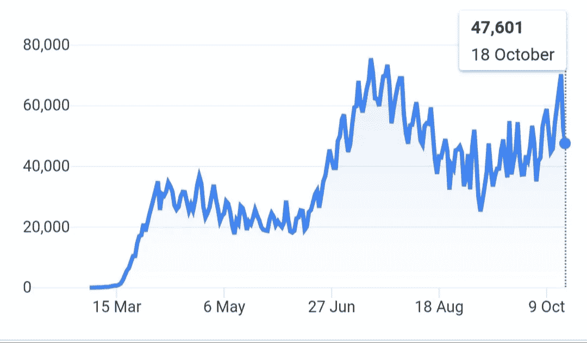
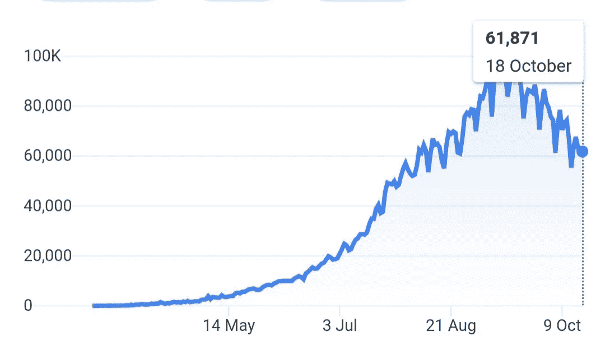
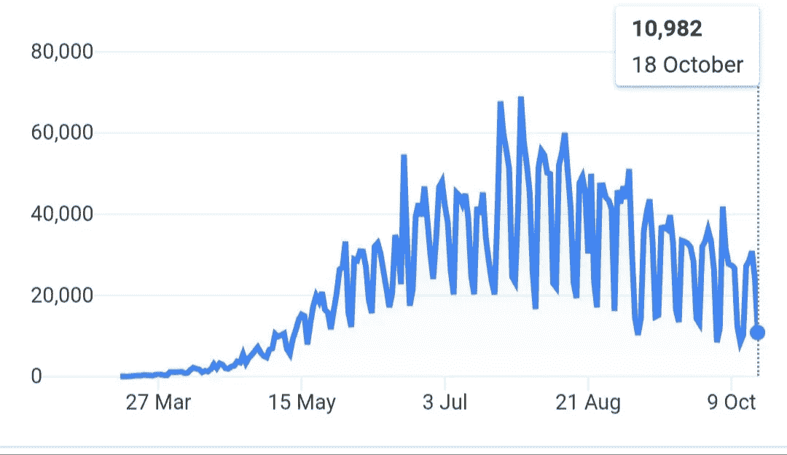

# 分析 3 个受灾最严重国家的新冠肺炎图

> 原文：<https://medium.datadriveninvestor.com/analysing-covid-19-graphs-of-the-3-worst-hit-countries-3536d0bb726a?source=collection_archive---------20----------------------->

## 这些国家有共同的联系吗？

Photo by [Jon Tyson](https://unsplash.com/@jontyson) on [Unsplash](https://unsplash.com/photos/GdczycaOnug/download?force=true)

新冠肺炎已经成功地传播到世界上每一个国家。一些国家如美国和印度有超过 700 万的感染者，一些国家如格陵兰和斐济有不到 100 名冠状病毒受害者。由于不同国家冠状病毒病例数量的巨大差异，在每个国家中疫情的作用持续时间也存在差异。

被认为是这种病毒发源地的中国已经成功地从疫情恢复过来。意大利、德国、印度尼西亚的病例在 3 月至 7 月达到高峰，但这些国家也已经控制住了病毒的传播。与此同时，美国和印度已经成为疫情疫情最严重的国家，每天报告超过 5 万例病例。紧随这两个国家之后的是巴西、俄罗斯和阿根廷，每天新增病例约 10 万例。让我们分析一下 3 个受灾最严重国家的新冠肺炎图表。

# 美利坚合众国

Source: [The New York Times](https://www.nytimes.com/interactive/2020/us/coronavirus-us-cases.html)

迄今为止，美国以超过 800 万的冠状病毒病例在全世界排名第一。

*   6 月中旬，每天的病例数突然增加，最初为 1.8 万例，后来在 7 月中旬猛增至 6 万例。
*   在这一点上，冠状病毒决定休息一段时间，直到 9 月初，每天的病例数下降到约 3 万例，病例数有所下降。但这并不是结束。
*   该图在 9 月中旬左右再次开始上升，最初的计数为 35k，在 10 月中旬再次飙升至 60k。目前，美国每天有超过 60，000 例病例。

## 锁定与政府控制

随着越来越多的人批评政府对疫情的控制，特朗普似乎在危机中辜负了这个国家。他在危机中的政策和行动也没有非常有效地控制疫情。该国确实见证了几次封锁，但从统计数据中可以清楚地看出，他们对控制案件没有多大帮助。

# 印度

Source: [Wikipedia](http://en.wikipedia.org/wiki/Template:COVID-19_pandemic_data)

印度仅次于美国，成为世界上第二个受灾最严重的国家。迄今为止，印度已有超过 790 万病例，死亡人数为 11.5 万。

*   病例在 7 月中旬开始激增，从最初的每天 3 万例增加到 9 月中旬的 9.5 万例。
*   9 月中旬标志着数量增长的停滞，每天限制在 9-9.5 万例。在这之后，9 月 20 日以后，人数持续下降。
*   随着冠状病毒受害者的人数每天都在下降，这个数字已经下降了 6 万例。该图已经明显见证了一个负斜率，预计在未来几天只会下降。

## 锁定与政府控制

印度政府在疫情开始时实施封锁，打算从一开始就控制病毒。3 月 24 日至 4 月 14 日宣布了第一次封锁，随后又进行了三次封锁。

封锁于 6 月 8 日解除，这一举措并不为人们所赞赏，因为当时病例有显著增加。然而，由于所有印度人民因突然实施封锁而遭受损失，莫迪决定在 6 月 8 日采取解锁措施。迄今为止，印度已经见证了 5 次解锁。每一次解锁都给了不同的服务进行正常程序的自由。

# 巴西

Source: [Wikipedia](http://en.wikipedia.org/wiki/Template:COVID-19_pandemic_data)

巴西排名第三，与上述两个国家相比，病例数量相对较少。共报告 524 万例，发生 15.4 万例不幸死亡。

*   巴西在危机期间的情况不同于印度和美国。6 月初，病例开始显著增加，最初数字为 2 万例，但每天计数都给出令人惊讶的结果。
*   有些日子报告了大约 4 万个病例，第二天就下降到 2 万个。该图一直相对停滞，数字显示在 7 月的几天里达到了 70k 的峰值。
*   然而，在 10 月初，病例下降到 1 万例，几乎是巴西疫情的终结。

## 锁定和政府控制

巴西没有实行全国封锁。众所周知，各州和各城市都采取了自己的措施来应对疫情。博尔索纳罗称这些危机为“小流感”，并没有朝这个方向迈出多少步伐。这些举措让人们广泛批评政府。

巴西也复制了印度的一些错误，在病例高峰期重新开放封锁。许多地方都开了餐馆和酒吧。所有这些措施使人们相信只有他们自己才能保护他们免受病毒的侵害。

# 受灾最严重的国家有什么共同点？

如果我们仔细阅读这些国家，我们会发现它们有着共同的联系。所有这些国家的政府都未能在正确的时间采取正确的措施。由于他们采取了不负责任的行动，他们每个人都受到了各自公民的广泛批评。

很难指出是某个地方或某个决定加剧了每个国家的危机，而是每个政府纵容的所有小疏忽导致了每个国家的命运。

由于到目前为止还没有发明这种病毒的疫苗，很难预测疫情何时会结束。然而，手里没有选择余地的人们，已经走上了正常生活的道路，脸上戴着面具，保持着 2 英尺的社交距离。洗手液变得比以前更重要了。但是有一件事情是好的——我们通过离开我们所爱的人几个月的时间，学会了与他们保持关系的重要性。