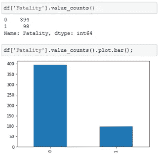
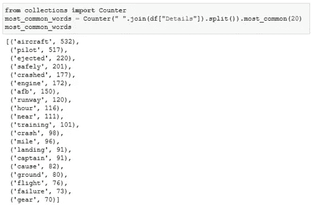
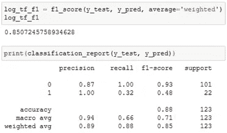
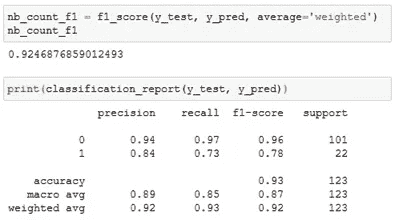

# 用 NLP 分析 F-16 的事故

> 原文：<https://medium.datadriveninvestor.com/analysis-of-f-16-accidents-by-nlp-790dafcaf80?source=collection_archive---------4----------------------->

Photo by [pixabay.com](https://snappygoat.com/s/?q=bestof%3Aaircraft%20crash%20crash%20landing%20accident%20f%2016%20ejection%20seat%20emergency%20exit%20air%20force%20fighter%20jet%20plane%20crash%20rescue#7dd3bf3343528f76c66f6244db8910819a8e76dd,0,0.)

Gursev Pirge 和 Alp Pirge

本文涉及自然语言处理(NLP)的使用，目标是分析美国空军(USAF)1979 年至 2019 年间 F-16 战斗机事故和事件的原因。我们使用了 F-16.net[提供的数据集，它给了我们日期、类型和事故报告。在](https://www.f-16.net/aircraft-database/F-16/mishaps-and-accidents/airforce/USAF/)[之前的论文](https://medium.com/@gursev.pirge/aircraft-crash-analysis-by-word-cloud-f075123cbf8b)和[的第一篇论文](https://medium.com/@gursev.pirge/short-analysis-of-airplane-crashes-2e17deae5eb9)中，分析集中在民用和军用飞机上。在这项研究中，我们决定将重点放在 [F-16 战斗猎鹰](https://en.wikipedia.org/wiki/General_Dynamics_F-16_Fighting_Falcon)上，这种战斗机自 1978 年以来由全球 26 个空军运营，已经制造了 4600 多架，并且仍然在全球范围内广泛使用。它是美国空军很长一段时间的主要战斗机，经历过全球战斗，单引擎和单飞行员飞机，有不稳定的趋势等。所有这些因素导致了超过 42 年的 512 起事故/事件(其中我们使用了 500 起)。

维基百科的定义是:“[自然语言处理(NLP)](https://en.wikipedia.org/wiki/Natural_language_processing) 是语言学、计算机科学和人工智能的一个子领域，涉及计算机和人类语言之间的交互，特别是如何给计算机编程以处理和分析大量自然语言数据。其结果是计算机能够“理解”文档的内容，包括其中语言的上下文细微差别。然后，该技术可以准确提取文档中包含的信息和见解，并对文档本身进行分类和组织。”

本文由两部分组成。在第一部分中，我们进行了数据清理，并准备了各种[字云](https://www.datacamp.com/community/tutorials/wordcloud-python)(通过使用事故报告)以便分析 F-16 事故。[维基百科对词云的定义](https://en.wikipedia.org/wiki/Tag_cloud)如下:“标签云(视觉设计中的词云或单词或加权列表)是文本数据的新颖视觉表示，通常用于描述网站上的关键词元数据(标签)，或可视化自由形式的文本。标签通常是单个单词，每个标签的重要性用字体大小或颜色来表示。这种格式有助于快速感知最突出的术语，以确定其相对突出程度。任期越长，意味着权重越大。”

在第二部分中，重点是使用自然语言处理技术，目的是发现事故报告中的细节，以预测飞行员是否在事故中丧生。文本文件被转换成数字特征向量来运行机器学习算法。在这里，我们尝试比较 for [计数矢量器](https://scikit-learn.org/stable/modules/generated/sklearn.feature_extraction.text.CountVectorizer.html)和[tfidf 矢量器](https://scikit-learn.org/stable/modules/generated/sklearn.feature_extraction.text.TfidfVectorizer.html)的性能。CountVectorizer 将文本文档的集合转换为令牌计数的矩阵，而 TfIdfVectorizer 将文本转换为可用作估计器输入的特征向量。第二部分可以被认为是[情感分析](https://en.wikipedia.org/wiki/Sentiment_analysis)的应用。情感分析(或观点挖掘)是一种 NLP 技术，用于确定数据是积极的、消极的还是中性的。我们使用不同的机器学习算法来获得更准确的预测。已经使用了以下分类算法:逻辑回归、朴素贝叶斯、支持向量机(SVM)、随机森林和 Ada 推进。

我们试图集中讨论以下问题:

*   军用战斗机事故的主要原因是什么？
*   考虑到 F-16 在 42 年后仍在服役，按年、月、作战行动统计的事故数量有趋势吗？
*   分类算法的性能比较。

**数据清理**

第一步是在开始聚类分析之前，使用 pandas 导入和清理数据(如果需要的话)。

根据数据集，只有 8 个缺失的报告，所以我们删除了这些列。

之后，我们从“日期”列中添加了单独的“年”和“月”列。有 16 个未知数，所以我们排除了它们。

在下一步，即文本挖掘中，步骤是:标记化，删除标点符号和停用词，词条化，然后作为字符串连接。

当检查“死亡”栏时，发现(死亡/总事故)比率为 98/492 = 0.1992——几乎五分之一的飞行员在事故中丧生。

**文字云—事故报告**

在获得 WordCloud 之前，我们希望获得最常见的单词，以便对事故报告的内容有所了解。

不出所料，飞机是最常见的词，尽管它没有给出事故原因的概念。下面的单词 Cloud 给出了有关 F-16 飞机事故报告的细节。

**字云—年**

1991 年(32 起)和 1993 年(27 起)是事故发生最多的年份。请记住，1991 年是沙漠风暴年，所以有很多战斗行动，飞行员和维修人员压力太大，在奇数小时飞行，飞机开始老化。

这里有一个快速的提示，当处理数字时，所有的数字都应该被计数，转换成字符串，然后 generate _ from _ frequencies 方法将产生单词云。

**字云——月**

这可能是一个粗略的分析，但结果显示，6 月和 1 月是事故风险最高的月份。榜首和垫底的差距是巨大的。

**死亡分类/评估**

机器学习算法通常将数字特征向量作为输入，因此第一步是将文本文件转换为数字特征向量，以便能够运行机器学习算法。文本矢量化将每个文档转换成一个数字向量。

Scikit-learn 的 [CountVectorizer](http://scikit-learn.org/stable/modules/generated/sklearn.feature_extraction.text.CountVectorizer.html) 提供了一种简单的方法来标记一组文本文档并构建已知单词的词汇表，还可以使用该词汇表对新文档进行编码。返回一个编码向量，其中包含整个词汇表的长度和每个单词在文档中出现次数的整数计数。

字数是一个很好的起点，但被认为是非常基本的。另一种方法是计算词频，目前最流行的方法叫做 [TF-IDF](https://en.wikipedia.org/wiki/Tf%E2%80%93idf) 。这是一个首字母缩写词，代表“*术语频率—逆向文档*”频率，是分配给每个单词的结果分数的组成部分。 [TfidfVectorizer](http://scikit-learn.org/stable/modules/generated/sklearn.feature_extraction.text.TfidfVectorizer.html) 将标记文档，学习词汇和逆文档频率权重，并允许您对新文档进行编码。

下一步将通过使用五种不同的算法来预测死亡率。

**逻辑回归**

使用 CountVectorizer 方法准备的数据的分类报告和逻辑回归分类的 f1 分数如下所示:

f1 分数被定义为精确度和召回率的加权平均值，它同时考虑了误报和漏报。特别是如果存在不均匀的类别分布(在我们的例子中，394 到 98)，f1 分数被认为比准确度更有用。

使用 TfIdfVectorizer 方法准备的数据的分类报告和逻辑回归分类的 f1 分数如下所示:

当逻辑回归应用于 TfIdfVectorizer 准备的数据时，致死率的 f1 值从 0.86 下降到 0.48。召回值(正确预测的正面观察与实际类中所有观察的比率)下降到 0.32，这可以在下面的混淆矩阵中看到。该算法正确预测了 7 起死亡事故，但也错误预测了 15 起，尽管这些飞行员安全弹射。f1 分数是精确度和召回率的加权平均值，召回率低的分数对 f1 分数有负面影响。

**朴素贝叶斯**

使用 CountVectorizer 方法准备的数据的分类报告和朴素贝叶斯分类的 f1 分数如下所示:

使用 TfIdfVectorizer 方法准备的数据的分类报告和朴素贝叶斯分类的 f1 分数如下所示:

这一次，TfIdfVectorizer 的结果更差。如混淆矩阵所示，尽管安全弹射的精度值约为 82 %，但算法对死亡的预测都是错误的。

**支持向量机(SVM)**

通过使用计数矢量器方法准备的数据的分类报告和 SVM 分类的 f1 分数如下所示:

使用 TfIdfVectorizer 方法准备的数据的分类报告和 SVM 分类的 f1 分数如下所示:

**随机森林算法**

使用 CountVectorizer 方法准备的数据的分类报告和随机森林分类的 f1 分数如下所示:

使用 TfIdfVectorizer 方法准备的数据的分类报告和随机森林分类的 f1 分数如下所示:

**AdaBoost**

使用 CountVectorizer 方法准备的数据的分类报告和 AdaBoost 分类的 f1 分数如下所示:

使用 TfIdfVectorizer 方法准备的数据的分类报告和 AdaBoost 分类的 f1 分数如下所示:

混淆矩阵显示，该算法对死亡和安全弹射的预测都非常准确。

**结果对比**

条形图显示应用于由 CountVectorizer 和 TfidfVectorizer 方法生成的矢量的 5 种算法的 f1 值。结果可以总结如下:

Tfidf 载体的 AdaBoost 产生最高的 f1 分数值 0.975。

前 8 个 f1 分都在 0.91 以上。

应用于 Tfidf 的朴素贝叶斯方法产生最低的 f1 分数 0.74。混淆矩阵显示，所有对死亡概率的预测都是错误的，而所有对安全弹射的预测都是正确的。

**结论**

在文章的第一部分，意图是通过使用 WordClouds 来分析 F-16 事故。结果可以总结如下:

*   人为因素(主要是飞行员和机务人员)是军用战斗机事故的主要原因，很难从坠毁事故中排除人为错误。[空军安全中心](https://www.nbcnews.com/id/wbna21427173)声明:“我们有人类驾驶的飞机，人类设计的飞机，人类维护的飞机……我们是人类，会犯错。"
*   很长一段时间，F-16 有一个众所周知的[发动机问题](https://www.nbcnews.com/id/wbna21427173)，20 世纪 90 年代的一些坠机事件可以归咎于这个问题——现在这个问题已经解决了。
*   在激烈的战斗中，事故率上升到更高的水平。
*   F-16 在 42 年后仍在服役，但它现在是一个更可靠的系统(美国空军的 F-16 总数也减少了)，事故率的下降证明了这一点。

在文章的第二部分，重点是使用 NLP 技术，目的是找到事故报告中的细节，以便预测飞行员是否在事故中丧生。

*   尽管“致命性”栏中的值不平衡，但分类算法产生了非常高的 f1 分数和准确度值。
*   对于由计数矢量器和 TfidfVectorizer 方法准备的数据，分类算法产生了类似的结果。
*   AdaBoost 算法产生最高的 f1 值(0.975)，而朴素贝叶斯的 f1 值为 0.74。

**最后，**

对于一些怀疑人为因素的人来说，以下是两份 F-16 事故报告的部分内容:

“……飞行员正在解手，解开了安全带。不知不觉中，安全带缠在了驾驶杆上，当他最终将座位抬起时，飞机发生了不必要的翻滚，无法恢复。飞行员设法安全弹射出来。他在 33000 英尺的高度解开安全带，并在离地 1100 英尺的高度开始弹射。飞行员弹射时未系安全带。这起事故发生在--9 点 20 分，当时 TDY…

“坠毁在— —”飞行员安全跳伞。这是一个所谓的撒尿包事故，在撒尿中断后发生了带扣/飞行控制系统相互作用。飞行员在 27000 英尺的高度部分解开安全带以使用尿包，并在 1500 英尺的高度重新启动弹射座椅后开始弹射。

你可以在这里看到这篇文章和类似的文章[。](https://github.com/gpirge/14.-medium.com-Articles)