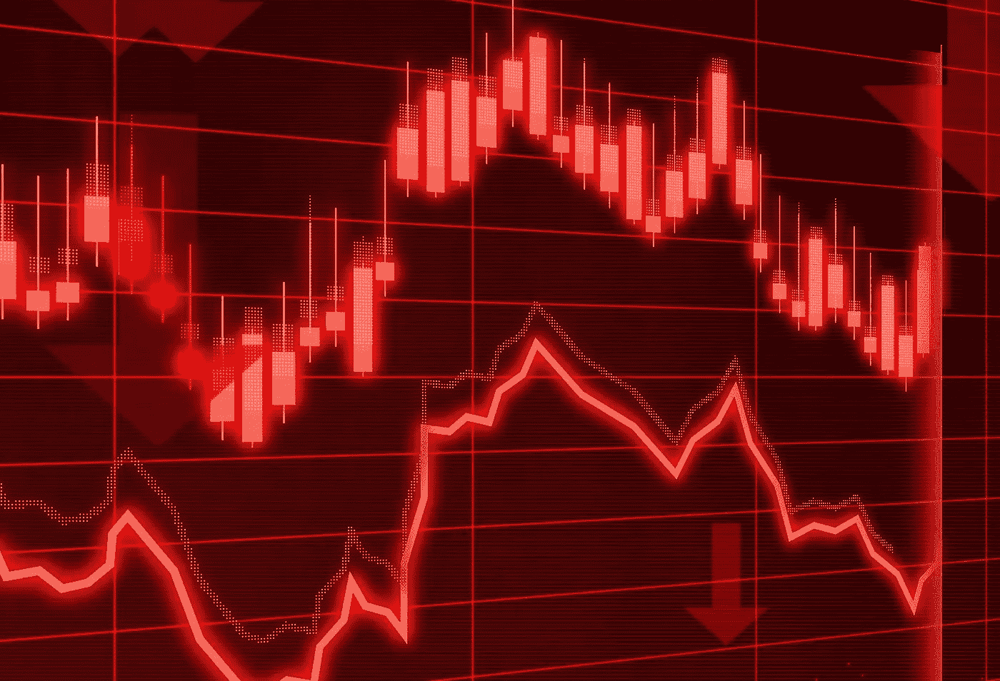

# 分析和弹性，我们能从疫情学到什么

> 原文：<https://medium.datadriveninvestor.com/analytics-and-resilience-what-we-can-learn-from-a-pandemic-7ea546d58054?source=collection_archive---------14----------------------->

## 数据分析在建设更强大、更具弹性的社会中的作用

# 为“不正常”做准备

在我的上一篇文章[直面风暴](https://medium.com/@olivierpenel/facing-down-the-storm-b1aa914a9bc7?source=friends_link&sk=c74024e742290a3740c2727433efeeef)中，我探讨了社区和组织如何转向数据和分析来应对新冠肺炎危机，以及数据世界如何通过众包计划、学术机构和科技公司动员起来[抗击疫情](https://www.sas.com/en_si/insights/articles/analytics/fighting-coronavirus--4-ways-analytics-is-making-a-difference.html)。在本文中，我将重点关注更长远的观点、对更强弹性的需求，以及数据分析将如何帮助组织更好地为下一次危机做准备并更快地恢复。

 [## 数据科学和软件工程哪个更有前途？数据驱动的投资者

### 大约一个月前，当我坐在咖啡馆里为一个客户开发网站时，我发现了这个女人…

www.datadriveninvestor.com](https://www.datadriveninvestor.com/2019/01/23/which-is-more-promising-data-science-or-software-engineering/) 

在不确定的时期，一切都在变化，新的常态继承了以前的常态。一切都是暂时的，常态消失了。在这个“永远不正常”的世界里，组织需要不断地为他们的股东、员工和客户提供价值。他们还需要确保能够在不同性质的危机中保持业务连续性。但是什么危机？我们需要计划的下一个威胁是什么？金融危机、民族主义和气候战争、流行病、重要基础设施的恐怖袭击、自然灾害？小型和大型组织的未来都受到难以预测和缓解的外部事件的影响。

# 对更大弹性的需求

利害攸关的不是“击败竞争对手”，或提高几个百分点的股票价值，而是长期生存的能力。这是西蒙·西内克提出的“[无限游戏](https://simonsinek.com/product/the-infinite-game/)”概念。我们不知道敌人是谁，我们的下一个竞争对手会是谁，我们需要什么才能赢。赢谁？事实上，这不是为了赢，而是为了每天做得更好，最终能够留在游戏中。

对于政府来说，这不仅是衡量国内生产总值、预算赤字或债务的成功，也是衡量社会弹性、社区团结一致支持最弱势群体的能力，以及各国协调一致应对全球挑战的能力。

对于企业领导人来说，衡量成功不仅要看收入增长或股票价值，还要看业务弹性，即快速适应和应对业务中断、保护人员和资产，同时保持业务持续运营的能力。

新冠肺炎危机暴露了公共和私人组织的复原力及其抵御风暴的能力的弱点。这对于那些在孤岛中运营的组织来说尤其痛苦，这些组织的流程架构不佳，没有内置的跨职能协作，数字化成熟度和适应性水平较低。

弹性需要两个关键因素。首先，它需要**自我意识**——一个组织了解自身优势(维持业务连续性所必需的关键资产和流程)和劣势(基于风险评估和情景分析)的能力。其次，它需要**敏捷性和可伸缩性**——组织以各种方式适应不可预见事件的能力:

*   **财务方面**，凭借严格的预算纪律和稳健的流动性管理方法，
*   **运营方面**，特别是对于供应链，但通常也是在流程自动化和决策方面，
*   **组织上**，具备快速实施敏捷跨职能团队的能力，打破内部孤岛，培养创新和自给自足的文化，
*   **技术上**，具有模块化生产和物流平台，以及利用云计算的可扩展 IT 环境。

衡量弹性并不容易，但这方面已经有了标准(业务连续性管理的 [ISO 22301:2012](https://www.itgovernance.co.uk/shop/product/iso22301-iso-22301-bcms-requirements) 和组织弹性的[ASIS SPC . 1–2009](http://www.ndsu.edu/fileadmin/emgt/ASIS_SPC.1-2009_Item_No._1842.pdf))。这个概念并不新鲜，但并没有被广泛使用。从这场危机中吸取教训，我们难道不应该将韧性纳入我们对政府和企业“成功”的定义中吗？

# 受需要的驱使，变得更好

当风暴肆虐时，如果组织想要生存并快速恢复，就必须快速适应。然而，真正的挑战是长期的。一旦危机结束，国家和企业将需要重新考虑如何运作。他们将需要向那些更好地管理这场危机的组织学习，并利用他们的经验在自己的业务中建立更大的弹性。变化将是广泛的，并可能从根本上改变经营业务的某些方面。在许多情况下，这种转变将涉及更广泛、更系统地使用数据分析来推动更加自动化的业务决策。

这种进化始于个人，在被锁定的情况下，由必要性驱动。即使是不太懂技术的人也已经“数字化”，采用他们以前没有使用的技术，例如与家人和朋友保持联系，远程工作，使用数字服务进行银行业务，购物，虚拟医生访问，行政程序，健身房和音乐课等。这种对在线世界的大规模涌入正在推动数字服务的发展，并引发注册和可供分析的相关数据的急剧增加。

事实证明，这场危机是商业实践变革的**催化剂，也是所有行业数字化转型的[加速器](https://www.forbes.com/sites/blakemorgan/2020/04/05/is-covid-19-forcing-your-digital-transformation-12-steps-to-move-faster/)。我认为，这一势头将随着时间的推移而持续下去，并随着随后对更大复原力的追求而扩大。**

**营销**部门将重新审视他们的走向市场方法，因为他们越来越依赖于他们的[数字营销策略](https://www.forbes.com/sites/bernardmarr/2020/03/20/why-companies-turn-to-digital-marketing-to-survive-covid-19/)，这不利于贸易展和展览。当潜在客户和现有客户的所有接触点都变得数字化时，数据、分析和客户智能的作用变得更加重要。

供应链将变得更加敏捷。分析将有助于设计具有更大适应性的工厂，允许在短时间内扩大或缩小生产规模或重新规划生产线(就像 LVMH 决定将生产[从香水转向洗手液](https://www.theguardian.com/world/2020/mar/15/perfume-giant-lvmh-to-make-hand-sanitiser-to-give-to-french-hospitals)时所做的那样)。完全数字化的供应链将使生产从一个工厂转移到另一个工厂变得容易，从而提供替代的采购和物流网络选项，或者采用“按订单生产”的方法，将设计和销售团队与制造设施连接起来，以简化交付周期生产。我们将着眼于更好地整合需求预测和规划与 POS 数据，并使用机器学习技术来[在短时间内预测消费者趋势的转变](https://risnews.com/6-steps-predicting-shifting-demand-patterns-while-navigating-coronavirus-crisis)。整合来自社交媒体的数据并使用情绪分析也可以用于根据恐慌购买行为的可能性来预测补货策略。零售商可以利用这种洞察力来确保他们跟上需求，还可以与客户沟通他们可以在何时何地购物，或者优化 POS 和仓库之间的员工分配。令人鼓舞的是，看到作为应对新冠肺炎危机的一部分而引入的这些能力将如何带来远远超出危机本身的好处。例如，在危机期间使用分析来优化医疗资源将会持续下去，并从长远来看使医疗系统更加高效。

在财务弹性方面，我认为我们将会更加关注**财务** **风险管理**，尤其是在流动性和现金储备方面。情景分析、应急计划和压力测试将成为董事会层面的优先事项。预测和预测性分析将在加强组织的风险评估和准备程度方面发挥关键作用，并使他们能够更好地为未知情况制定计划。这不仅会发生在已经受到严格监管的金融服务领域，也会发生在该领域成熟度或经验较少的其它行业。

**欺诈和网络安全**代表了另一种在危机时期被放大的风险，尤其是当大量个人和企业转向数字领域继续生活时。[寻求利用这样的危机谋取私利的机会主义者必须而且能够被阻止在门口。同样，金融服务在保护自己和客户免受网络犯罪侵害方面往往装备精良，方法成熟，但在零售和通信等其他行业，疫情是提高各种类型欺诈门槛的机会，这样做的好处将长期存在。](https://www.itproportal.com/features/enemy-at-the-gates-preparing-for-rising-fraud-risks-in-a-time-of-crisis/)

这个列表当然不是详尽无遗的，但有一点是肯定的:为了使这些变化有效，组织将比以往任何时候都更需要可靠的数据和高级分析来创建**可操作的洞察力**并做出正确的**决策**。

数据应该随时可用且可靠，以便用于决策。自助式数据可视化和探索功能有助于快速从数据中提取隐藏的洞察力，而无需求助于专业技术技能。预测分析和决策能力是船长在风暴中和风暴后驾驶船只的关键工具。他们的成功将取决于他们访问所需数据的速度，以及他们如何有效地利用这些数据做出明智而及时的决策，从而挽救生命、就业和企业。

为了继续对话，请在 6 月 23 日参加我的简短[网络研讨会](https://www.sas.com/sas/webinars/resilience-and-analytics-what-we-can-learn-from-the-pandemic.html)。

