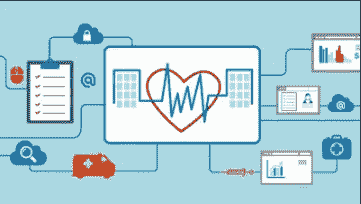
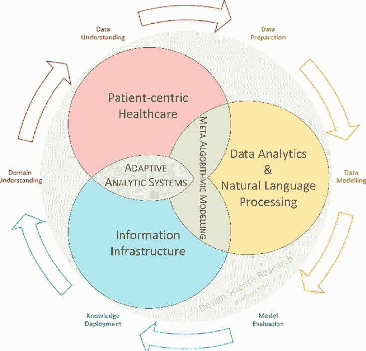

# 医疗保健中的分析

> 原文：<https://medium.datadriveninvestor.com/analytics-in-healthcare-d8d9208a7de7?source=collection_archive---------12----------------------->

在研究这篇文章时，我发现了很多直观的信息，但最突出的主题是“**医疗保健分析**”经过深思熟虑，我选择生命科学作为这篇论文的主题。

**Verily Life Sciences** ，原名 **Google Life Sciences，**是 Alphabet Inc .将**医疗**、**技术**和**数据科学**整合在一起的举措。他们收集健康数据，并利用这些数据为健康问题提供积极的解决方案。Verily 是生物学、化学、物理学、医学、工程学、计算机科学和许多其他领域的专家的结合，旨在创造干预措施，以指数方式改善患者护理。

Verily 推出了“**项目基线”**，其中是一项创建人类健康地图和发明下一代医疗保健工具和服务的计划。随着向更好的数字健康记录的缓慢但稳定的进展，他们正在从健身带、连接设备(如体重秤和血压监视器)中收集健康数据。该公司还与医疗保健中心合作，收集实验室订购模式和药物补充频率的数据。

他们可以利用人工智能**分析健康地图**并为所有年龄的个人创建**相应的统计模型**，根据他们的生活区域、生活方式、饮食习惯和种族进行分类，以预测他们未来的健康状况。这些模型，通过使用**规定性分析**，可以提供**可持续健康的解决方案，并建议有计划的医疗保健**学科和项目。

 [## 为什么数据将改变投资管理|数据驱动的投资者

### 有人称之为“新石油”虽然它与黑金没有什么相似之处，但它的不断商品化…

www.datadriveninvestor.com](https://www.datadriveninvestor.com/2019/01/25/why-data-will-transform-investment-management/) 

**预测分析**为医疗保健提供商提供了实现**最佳未来**结果的机会。基于决策优化技术，这些功能使医疗保健提供商不仅能够为患者或个人推荐最佳的行动方案，还允许比较多个**【假设】**场景，以评估选择一种措施的影响。统计模型可用于在疫情传播前预测任何特定药物途径的需求。此外，它可以通过预测地理传播来帮助限制流行病。例如，verily 可以参与防止新型冠状病毒的传播。通过使用大量数据集，可以开发统计模型来分析根本原因并预测&追踪地理传播。他们还可以根据感染患者的症状建立一个模型，用于早期检测新型冠状病毒感染。

医疗保健领域有很大的分析空间；这是一个尚未完全开发的领域，在未来 10 年将会有最大的开发量。分析可以通过提前预测并推荐最佳行动方案来帮助个人避免健康风险和创伤。Verily 可以通过使用大量数据集训练统计模型，利用分析做出更好的决策。**临床数据**、**研发(R & D)数据**、**制药数据**、**患者行为和情绪数据**应在**项目基线**下收集，以设计准确的健康地图。

Verily 可以使用其分析平台预测以下情况:

一个人应该拥有什么样的生活方式才算健康？

**什么药物都需要制造。**

**医疗保健供应链。**

**预测可能需要的药物的 R&D**。

通过使用统计模型，他们可以将下一代从抑郁和创伤中拯救出来。他们还可以利用他们的分析平台和可用的心理健康数据来制定专门的计划，以帮助人们实现幸福健康的生活。

没有得到充分利用的不是数据。对数据的理解被赋予了较少的权重。Verily 专注于从不同方式收集数据，并对所有类型的数据给予同等重视，以训练统计模型。在我看来，应该给予“**患者行为和情绪数据”更多的权重这将利用我们的模型，了解患者的便利，他们将提供高效的**量身定制的解决方案**。**

心理健康是我们社会的主要问题之一，超过 36%的美国少女患有抑郁症或最近患有严重抑郁症，13.6%的男孩也是如此。结合心理学的分析可以解决很多这样的问题。使用人工智能，可以识别导致抑郁的最常见特征或任何表明一个人正在走向糟糕精神状态的关键指标。有可能提前介入治疗，这可以在某种程度上解决心理健康问题。

分析为医疗保健开辟了新的视野，并迫使世界各地的所有提供商为其客户提供更好的满意度和服务。事实上，随着新兴医疗保健研究可以利用收集的额外数据来提供更好的可持续解决方案，他们可以与保险组织合作来获得**医疗索赔数据**。这些数据对预测未来趋势有很大帮助。考虑这个假设的例子:在上一年的保险公司索赔数据中发现一个模式，显示其糖尿病患者人群中的很大一部分也患有视网膜病。使用预测分析，可以估计明年眼科风险有增加的概率，并可以事先提供解决方案。带有健康地图的医疗索赔数据可以使统计模型在预测个人的未来健康方面更加有效和准确。

Verily 可以通过与学校和组织合作来收集行为数据并提供解决方案，从而扩展其视野。这将极大地提高情感数据的准确性，并为组织提供一种与未来消费者互动的方式。

参考资料:

[https://www . ibmbigdatahub . com/blog/prescriptive-analytics-cure-transforming-health care-industry](https://www.ibmbigdatahub.com/blog/prescriptive-analytics-cure-transforming-healthcare-industry)

[https://healthitanalytics . com/news/Google s-verily-partners-with-emory-health care-to-drive-efficiency](https://healthitanalytics.com/news/googles-verily-partners-with-emory-healthcare-to-drive-efficiency)

[https://verily.com/roles/job/?job_id=1886708](https://verily.com/roles/job/?job_id=1886708)

[https://projectbaseline.com/](https://projectbaseline.com/)

[https://www.izenda.com/what-is-healthcare-analytics/](https://www.izenda.com/what-is-healthcare-analytics/)

[https://channels . the innovation enterprise . com/articles/how-social-media-analysis-can-improve-mental-health](https://channels.theinnovationenterprise.com/articles/how-social-media-analysis-can-improve-mental-health)

https://en.wikipedia.org/wiki/Health_care_analytics

【https://en.wikipedia.org/wiki/Verily 

你真诚的，

希瓦妮·塞尼