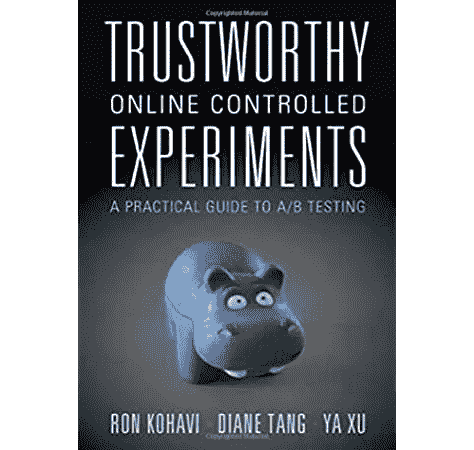
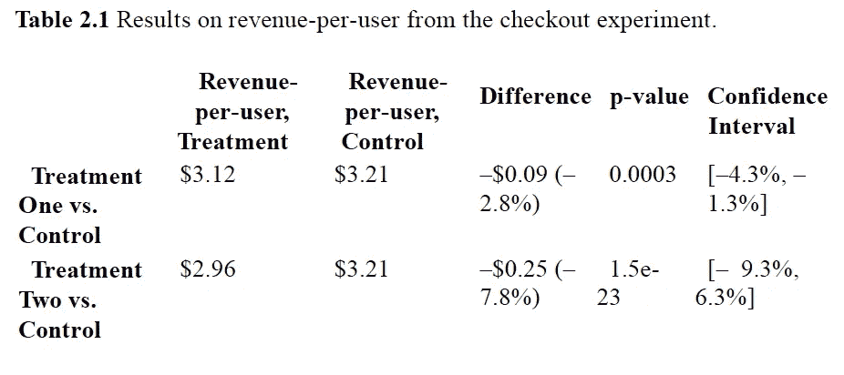
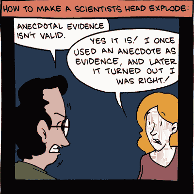

# 在可信的在线受控实验的指导下，对您的 A/B 测试结果进行分析和决策

> 原文：<https://medium.datadriveninvestor.com/analyze-and-make-decision-of-your-a-b-test-result-with-guidance-from-trustworthy-online-controlled-a74eb705b0db?source=collection_archive---------6----------------------->

在上一篇文章中，我们谈到了[如果你有一些想法，如何设计 A/B 测试](https://xiarongcui.medium.com/design-an-a-b-test-with-case-study-from-trustworthy-online-controlled-experiments-the-most-7707eee9f5e3)，今天我们将继续关于如何分析和决策你的 A/B 测试结果的案例研究。我们仍将使用来自最值得信赖的 A/B 测试指南[值得信赖的在线控制实验](https://www.amazon.com/Trustworthy-Online-Controlled-Experiments-Practical/dp/1108724264)的例子和指导。

[Trustworthy Online Controlled Experiments: the most trustworthy guide about online experimentation](https://www.amazon.com/Trustworthy-Online-Controlled-Experiments-Practical/dp/1108724264)

为了分析 A/B 测试结果，您首先需要运行实验，包括仪器和基础设施阶段。一些大型科技公司已经建立了内部实验平台来帮助你建立实验并展示结果，但其他一些公司选择使用外部实验工具。在本文中，我们将直接进入后实验阶段，学习如何分析结果并做出决策。

# 分析结果

## 过程数据

**健全检查**

护栏度量/不变量不应在控制和治疗之间改变。

有两种不变指标，第一种是特定于项目的，第二种是特定于公司的:

1.  **与信任相关的护栏指标**:期望控制和处理样本根据配置调整大小，或者它们具有*相同的缓存命中率*。
2.  **组织护栏指标**:即延迟通常应保持不变。

如果健全性检查失败，我们需要检查实验设置。

## 计算汇总统计数据

如果我们通过了健全性检查，那么让我们来看看汇总统计数据。在工业中，我们通常使用 A/B 测试计算器、内部或外部实验工具([振幅](https://amplitude.com/)、[优化](https://www.optimizely.com/)等)。)，或者用 Python/R 计算，或者手工 Excel 得出结果。

Trustworthy Online Controlled Experiments Book Snapshot

在这种情况下，两个 p 值都是<0.05, so we reject Null that Control and Treatment have the same mean.

It means adding coupon code will degrade the revenue.

We will be talking about how to visualize A/B test analysis in the future articles, if you want to keep updated, please subscribe [Sharon(霞蓉)崔](https://medium.com/u/952bef971021?source=post_page-----a74eb705b0db--------------------------------)关于你想学的其他东西，可以随意评论文章。

# 做决定

LucidChart

决策不仅需要考虑测量得出的结论和更广泛的背景，包括:

## 不同指标之间的权衡

*   用户参与度与收入
*   变革的成本与收益

## 启动变革的成本

*   发布前完全构建功能的成本
*   启动后持续工程维护的成本

## 做出错误决定的负面影响

*   放弃另一项变革的机会成本

# 你能给我一个简单的框架来决定什么时候发布吗？

是的，这里有一些通常有效的指导方针:

Trustworthy Online Controlled Experiments Book Snapshot

*   当结果在统计上或实际上都不显著时，我们可以重复或放弃这个想法。
*   当两者都重要时，发射！
*   当统计上显著但实际上不显著时，不值得推出。
*   当置信区间超出实际显著性水平，并且您发现它可能增加或减少时，最好说没有足够的能力来得出强有力的结论，而且我们也没有足够的数据来做出任何发射决策。我们可以用更多的单元进行后续测试以增加功率。
*   当结果可能具有实际意义但不具有统计意义时，用更大的功率重复测试以获得更高的精度。
*   当结果具有统计显著性且可能具有实际显著性时，在这种情况下，用更大的功率重复测试并选择发射是合理的。

# 下一步是什么？

在下一篇文章中，我会谈到在 A/B 测试中，当数据和轶事被讲出不同的故事时。欢迎订阅 [my medium](https://medium.com/@xiarongcui) 了解更多关于数据科学和产品的信息。敬请期待！

smbc-comics.com

书源:[https://www . Amazon . com/trust worthy-Online-Controlled-Experiments-Practical/DP/1108724264](https://www.amazon.com/Trustworthy-Online-Controlled-Experiments-Practical/dp/1108724264)