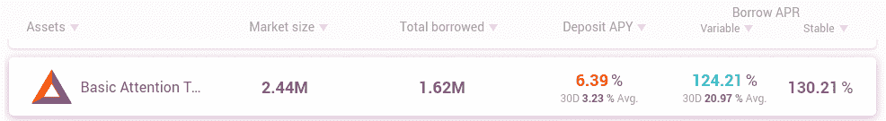
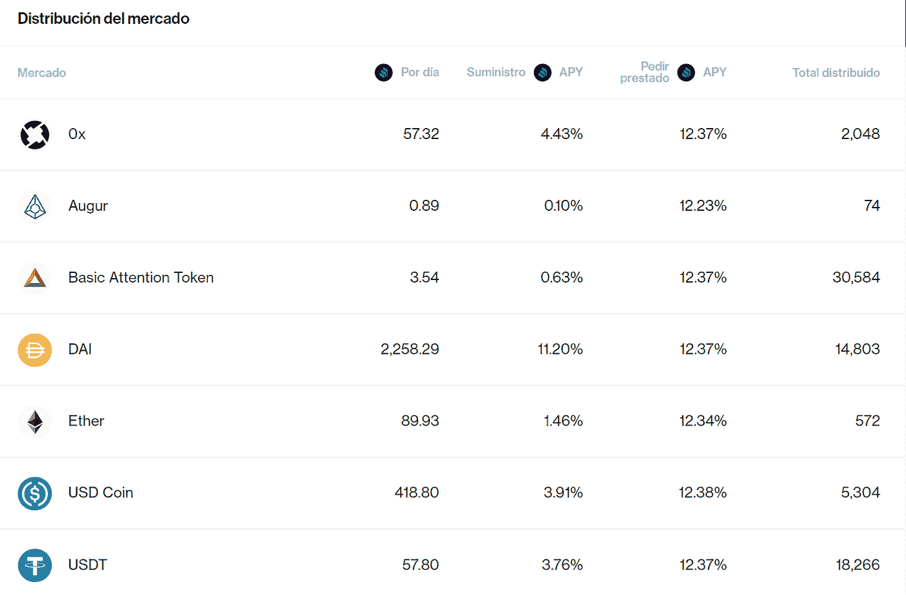

# DeFi 协议中借款的高利率分析

> 原文：<https://medium.datadriveninvestor.com/analyzing-high-interest-rates-on-borrows-in-defi-protocol-bc3e0ce07e29?source=collection_archive---------2----------------------->

## 查看区块链的数据，了解 DeFi 协议如何能让借款资产获得超过 100%的利息

我们最近看到，Aave 协议中 BAT 的借款利率从 100%提高了。

这个数据引起了我们所有人的注意。这个利率怎么可能？怎么会有人愿意支付这笔贷款呢？谁在为此买单？在本帖中，我们将尝试回答这些问题。

# **利率如何运作**

在任何信贷系统中，为了让某人申请贷款(借款人)，另一个人必须先借钱给申请贷款的人(贷款人)。要求贷款的人支付的利息给留下存款的人，其他人可以要求贷款，留下存款的人越多，贷款就越多，因此收取的利息就越少，另一方面，如果借出的钱减少，由于需求增加，供应减少，利息就会增加。

# **在 Aave 中是如何计算的**

在 Aave 中，这些利息是根据存款的利用率计算的，[在这个 excel 表中他们](https://docs.google.com/spreadsheets/d/1RAlW-GLEek7bSG3e98gTrcbFsqurRWkbtpFNzNgyF2w/edit#gid=1361216538)公布了如何计算，以及如何估算这些数据。

目前，如果我们选择 BAT，它会向我们显示利用率和利率。

下面的表格显示了当利用率上升时，利率是如何上升的，从 60%的利用率开始，利息超过了 100%

正如我前面提到的，随着出价的降低，利息必然上升，使得那些曾要求贷款的人支付非常高的利息，以鼓励他们归还贷款，从而增加协议的流动性。

# 这些比率是如何得出的？

如果我们查看协议数据，使用我在本帖中评论的 api，我们会看到从 6 月 21 日开始利率飙升。

如果我们将其与利用率数据进行比较，我们会发现存在直接的相关性

从贷款数量来看，我们发现这些天申请数量激增。

如果我们按天对 BAT 请求量的数据进行分组，我们会看到总量比以前高得多。

这表明，在这些日子里，BAT 的需求比平时高得多，使得该协议在这种加密资产中的流动性较低，这导致利率上升。

# **BAT 的贷款为什么会有这样的增长？**

这些天来，由于复合流动性开采，在协议中为 BAT 存款支付了非常高的利率，如果我们查看这些天来复合的 BAT 存款，我们会发现它们只是以与 Aave 中的请求非常相似的方式增加。

如果我们看一下 Aave 中借款的平均支付价格，我们会发现，在 6 月 21 日至 23 日需求飙升期间，申请的贷款平均得到了支付:

比复利为流动性支付的利息低得多，这意味着至少对于那些要求固定利率的人来说，利息是绰绰有余的。

通过这种方式，有可能以低于 6%的固定利率申请一笔 Aave 贷款，然后以复利形式存入银行，如今，这种方式为存入流动性带来了 30%以上的回报

那些被要求支付可变利息的人，看到了他们的利息是如何暴涨的，使得她的贷款更加不可持续。

# 这些高利率会导致更多的清盘吗？

在需求高峰前借入英美烟草可变利息贷款的人看到他们开始收取非常高的利息贷款，但是从清算的数量来看，这种利息的增长并没有产生更多的清算

# **他们保持这些利益还是已经正规化了？**

在写这篇文章的时候，支付的利息要低得多，

这表明 BAT 的储备已经回到了更高的水平，所以借的钱已经回到了协议上。

化合物对此有影响吗？

在写这篇文章的时候，BAT 的盈利能力很低，因此对那些将流动性留在协议中的用户来说，他们的报酬很低

因此，用户没有动机将该资产留在复利中，因为他们收到的利息较少，他们必须支付贷款，并且收到相对于其他资产的少量红利代币。

# **结论**

在这些市场中，由于流动性低，仍然存在低效率，你可以看到这样的套利机会，作为一种激励，你可以将大量市场从一种协议转移到另一种协议。我们再次看到 DeFI 如何让我们透明地跟踪所有这些信息，并用数据进行验证，而不必相信正在发生的事情。在这里，由于数据访问的便利性，使得“不要相信，要核实”的说法成为可能。

*原载于 2020 年 7 月 21 日 https://www.datadriveninvestor.com**[*。*](https://www.datadriveninvestor.com/2020/07/21/analyzing-high-interest-rates-on-borrows-in-defi-protocol/)*