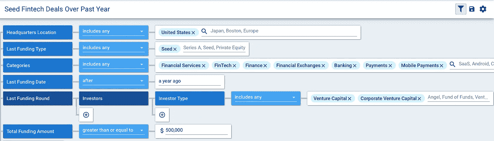
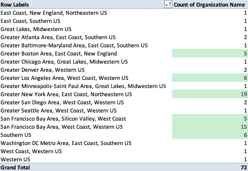
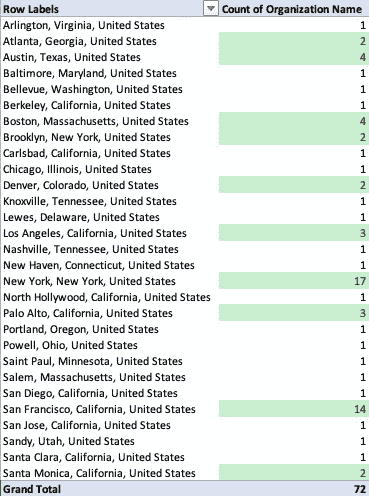
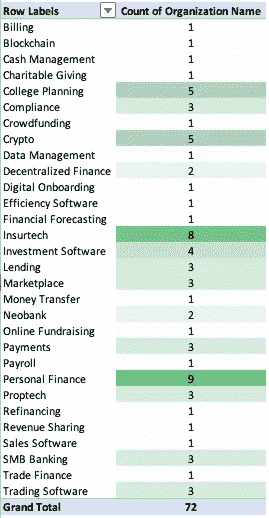
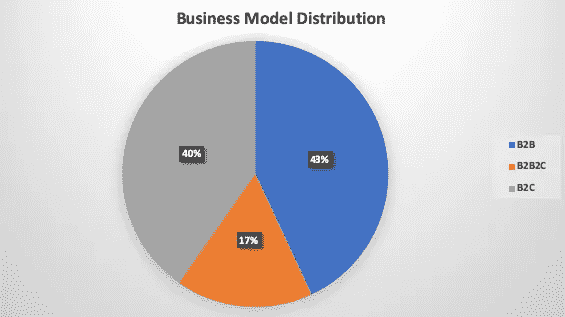
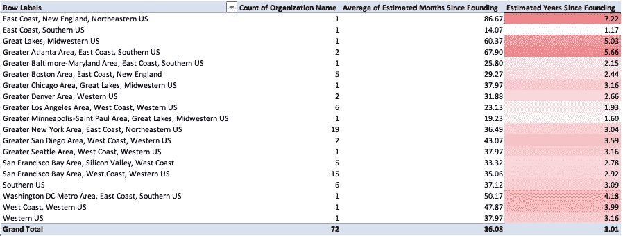

# 为寻求种子资金的金融科技公司分析投资前景

> 原文：<https://medium.datadriveninvestor.com/analyzing-the-investment-landscape-for-fintech-companies-looking-for-seed-funding-fddef37d6056?source=collection_archive---------5----------------------->

## 机会集中在中心

Photo by [Timo Wagner](https://unsplash.com/@timovaknar?utm_source=medium&utm_medium=referral) on [Unsplash](https://unsplash.com?utm_source=medium&utm_medium=referral)

当人们想到金融时，许多人会想到纽约的银行家。同样，当人们想到科技时，他们会想到硅谷和旧金山的反向投资领导者。众所周知，这两个市场控制着金融和科技领域，因此它们共同控制着早期金融科技融资市场也就不足为奇了。

 [## 分散金融的出现|数据驱动的投资者

### 当前的全球金融体系为拥有资源、知识和财富的人创造了巨大的财富

www.datadriveninvestor.com](https://www.datadriveninvestor.com/2019/03/14/the-emergence-of-decentralized-finance/) 

围绕风险投资在主要创新中心之外的扩张一直有很多噪音，尽管这是事实，但在种子阶段这不一定重要。在种子阶段，进入比展示的牵引力更重要，数字将证明这一点。

The image above shows the [Crunchbase](https://www.crunchbase.com/) search used to extrapolate the data I will be referencing (some data cleaning was required, and seven companies were extracted because they cannot be considered core fintech).

在去年报道的 72 宗种子金融科技交易中，只有 17 个州有总部所在地。此外，72 人中有 50 人来自两个州(纽约州和加利福尼亚州)。区域浓度概述如下。

更进一步，你可以看到这个池中的大多数公司都位于两个城市:纽约市和旧金山。

如前所述，这并不奇怪。我对探索种子投资者关注的公司类型更感兴趣。

如下图所示，投资者对个人金融等核心金融科技公司仍有很大兴趣，但对其他一些子行业也出现了兴趣。多年来，保险科技一直是一个热门领域，去年有八家保险科技公司进行了种子融资。大学规划是另一个热点问题，因为教育成本持续上涨，学生债务危机继续让毕业生背负巨额债务。令人惊讶的是，crypto 继续吸引投资者，去年有五家 crpyto 初创公司筹集了种子资金。其他感兴趣的领域包括合规软件、投资软件、借贷/信贷工具、市场业务、支付、proptech、SMB 银行工具和交易软件。

商业模式分布也有点令人惊讶。正如你在下面看到的，不同的模型被相当平均地代表了，B2B 比 B2C 稍微多一点。这与我们从我们的网络中注意到的情况相反，因为似乎更多的种子投资者在这个阶段优先考虑以企业为重点的公司，所以过去一年实现的 B2C 种子交易的数量对我们的团队来说有点令人震惊。

我们还想探究这些公司培育种子需要多长时间。创建一家公司是一项艰苦的工作，而吸引投资者可能更具挑战性。根据我们的分析，一般公司大约需要三年时间来筹集第一轮机构资本。下图显示了不同地理区域之间的差异，但也应注意，一些与平均值差异最大的区域也具有最小的样本量。

最后，我们想探究不同地理位置的公司的种子交易有何不同。下面的柱状图展示了在我们的分析中所有 72 家公司筹集的种子资本金额。在右侧，我们列出了最受欢迎的地点，并探讨了这些地点的公司与整体市场的对比情况。

这项工作的发现再次让我们有点震惊。“种子”轮的定义已经扩大，这一类别中种子资金的范围显示了对种子轮构成的困惑。即使进行标准化处理，平均值和中位数仍然远远高于许多其他类别的资金(尽管我没有数据支持这一点)。我们用来对种子交易进行分类的一般经验法则是 50 万美元到 200 万美元之间的任何东西，尽管这条法则似乎已经过时了。

当将整体市场规模与最受欢迎的市场进行比较时，令人惊讶的是，一家旧金山公司筹集的种子资金的中位数实际上低于整体市场的中位数。此外，在主要中心之外的融资规模明显较小，位于南方的公司的融资中值大约比纽约或洛杉矶的公司少 30%。

我们认为，最后这一点至关重要。假设一家公司在种子期放弃 20%的股权，南方公司的中值后估值为 1212.5 万美元，相比之下，纽约公司为 1750 万美元，洛杉矶公司为 1875 万美元；地域定价套利是有机会的，但挑战在于找到合适的公司。

对于企业家和投资者来说，这里有一些教训需要学习。

首先，这证明了在融资市场上，获得资本比其他任何事情都重要。不太可能有 2/3 最好的金融科技公司完全位于纽约或旧金山，然而，鉴于这些公司距离那些开支票的人很近，也能接触到他们，它们是那些仍能获得资金的公司。对于主要中心之外的创业者来说，这只会让他们更难吸引和筹集资金。

对于投资者来说，尤其是纽约、旧金山和洛杉矶以外的投资者，不仅越来越难找到合适的交易，而且越来越难说服企业家让你进入种子轮。地理上的限制是真实存在的，在选择投资者时，对创业者来说，选择他们可以持续面对面接触的基金更有意义。

种子集资，至少在我看来，是最难获得的。你必须用有限的数据点说服投资者，你和你的公司是值得支持的。通常，这个过程需要几个月的时间来相互了解，并让投资者看到趋势线，而不是单个数据点。这一过程的现实是，它有利于那些以有资本的城市为基础的人。

如前所述，资本本身已经变得分散，不再仅仅居住在湾区。话虽如此，但至少在金融科技种子基金中，被支持的公司远没有那么分散，大部分资本都流向了那些最接近的公司。