# 剖析一个小规模的加密货币欺诈:BCNEX

> 原文：<https://medium.datadriveninvestor.com/anatomy-of-a-small-scale-cryptocurrency-fraud-bcnex-ee0140df2dd0?source=collection_archive---------4----------------------->

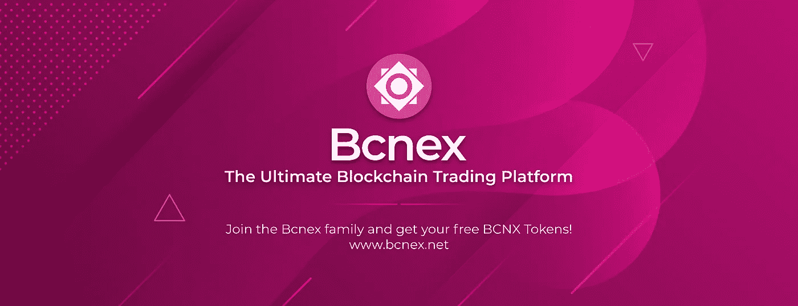

ThE uLtiMaTe bLoCkChAiN tRaDiNg pLaTfOrM

今天是 2019 年 5 月 1 日，如果不是因为一次非常奇怪的在线互动，这一天将继续被遗忘。不幸的是，或者说幸运的是，我的一个朋友[凯尔·吉布森](https://medium.com/u/9ecae25ffa89?source=post_page-----ee0140df2dd0--------------------------------)决定与 Twitter 上的一个加密货币先令账户进行互动。他的声明，“这看起来真他妈的愚蠢，”被一个自称“CryptoChii”的人嘲笑

凯尔没有很好地接受，他得到了，在线社区中人们所说的，ratio'ed，或 BTFO(他的回复没有得到爱):

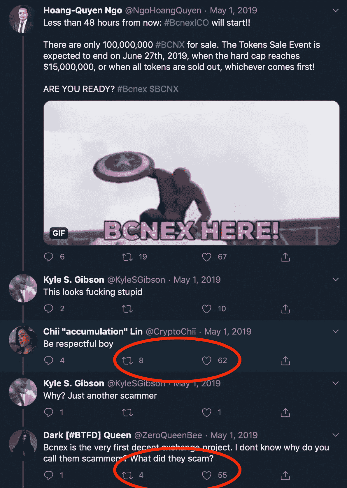

Kyle losing on Twitter, but is he though?

凯尔无法接受这样的想法，即推文“尊重孩子”本身就是不尊重，可能会立即破坏他的回复。这件事持续困扰了他好几天。

 [## 加密货币行业是死是活？数据驱动的投资者

### 九月初，我们在 X-Order 内部就代币市场的未来进行了一场辩论。有趣的是，我们的观点是…

www.datadriveninvestor.com](https://www.datadriveninvestor.com/2019/12/12/will-the-cryptocurrency-industry-be-dead-or-alive/) 

因此，我们中的一些人加入了这个帖子，享受这个比率(注意，我们至少在一周后才开始回复，但所有的推文仍然会收到赞和转发):

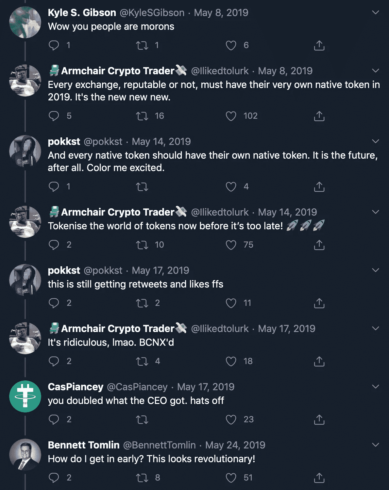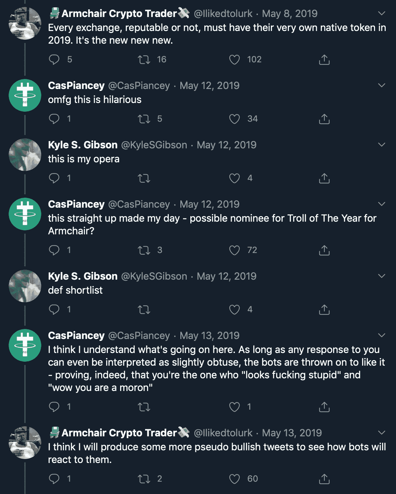

有些事完全不对劲。虽然推文可以吸引几个小时，或者有时，如果你幸运的话，几天，这些对一周前推文的回复得到了不应有的关注。

# Twitter 宣传和骗局的运作是一样的(因为它们是一样的)

几年前上过 Twitter 的人都很熟悉[杰夫·戈尔伯格](https://medium.com/u/6b613d8755e7?source=post_page-----ee0140df2dd0--------------------------------)。杰夫做了一项非凡的工作，他发现了机器人集群和 Twitter 账户农场是如何被用来通过媒体快速有效地传播信息，并直接传到你的面前。基本上，我们中的许多人正在被社会操纵，去看待那些本来不会引起任何关注的话题和概念。

这与加密货币骗局的运作方式相同。不相信我？看看任何一条埃隆·马斯克推文的回复:

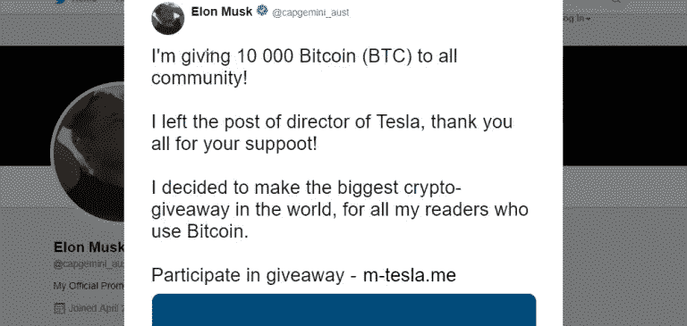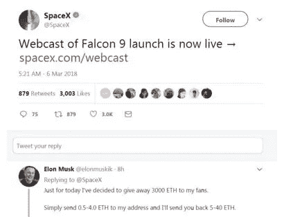

Two examples of fake giveaways of cryptocurrency found beneath Elon Musk and SpaceX tweets. The scammers have since gotten slightly more sophisticated, responding with images that don’t have clickable hyperlinks, instead relying on the gullibility of Twitter users to type in the address themselves.

这些虚假的赠品立即获得了数百个赞和转发，偶尔还会有回复，比如“哇！1 真的管用！！1!谢谢埃隆！”都是希望刚刚涉足加密货币的人会误中如此明显的骗局。

但是这些都是非常小的，简单的骗局。如果你有商业头脑，有更好的方法。输入 BCNEX。

2018 年末，BCNEX 点网出现在互联网上。出现的消息如下:

Message translated for English speaking audience

很快，这个有着徽标和品牌的网站就正式上线了，除此之外还有一份白皮书(不再提供)和“一页纸”:

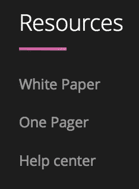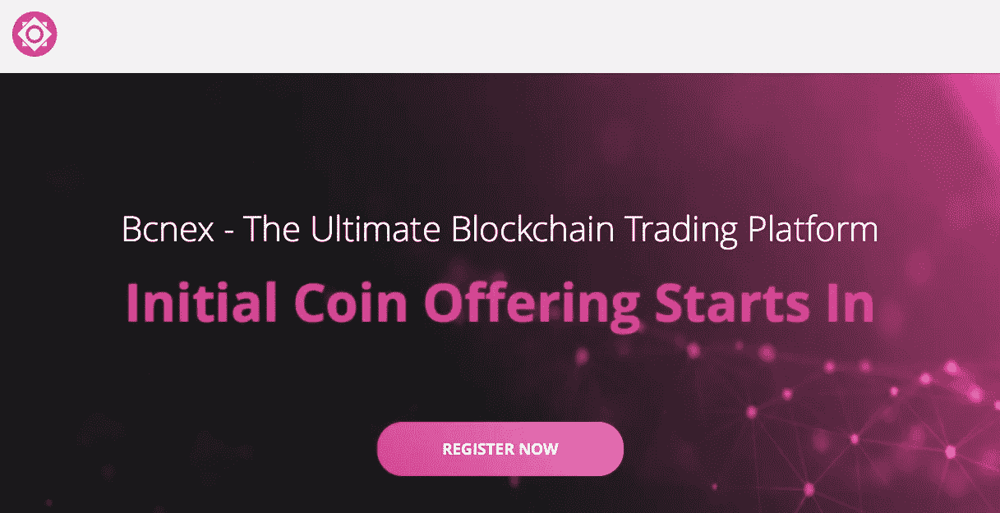

BCNEX 的 Twitter 页面充满了荒谬的赠品和空投，促销中的促销和废话。他们“宣布”成立——但是这个“越南交换平台和令牌”在哪里成立呢？除了…伯利兹还有哪里？当然，是在一个已知的空壳公司注册地址，通过巴拿马文件证明。

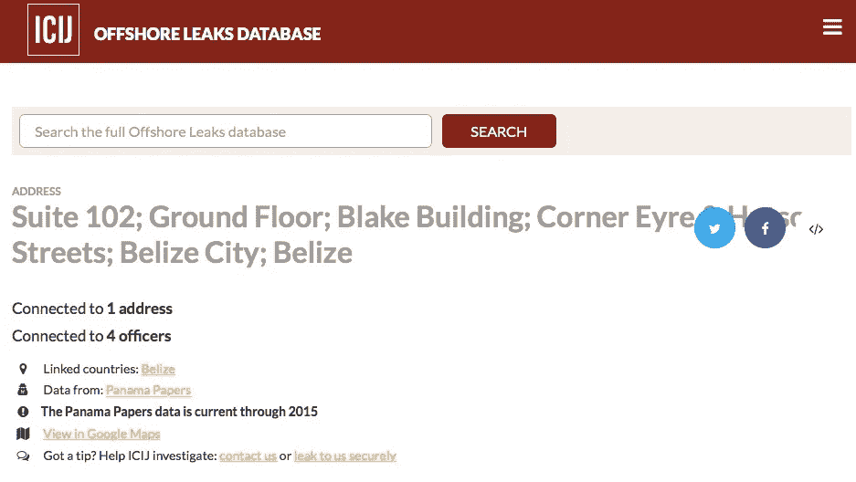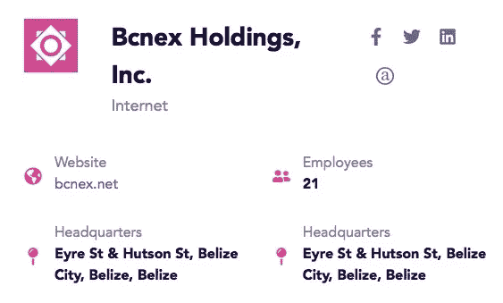

加密货币“新闻”网站 Cointelegraph 在 2019 年 5 月为 BCNEX 提供付费广告:

Whatever the fuck “faster than its rivals” means

whitelabel 交易所(不创建自己的交易平台，而是从开发商那里购买平台的交易所)及其 token 已经达到了受众范围和价值的顶峰。

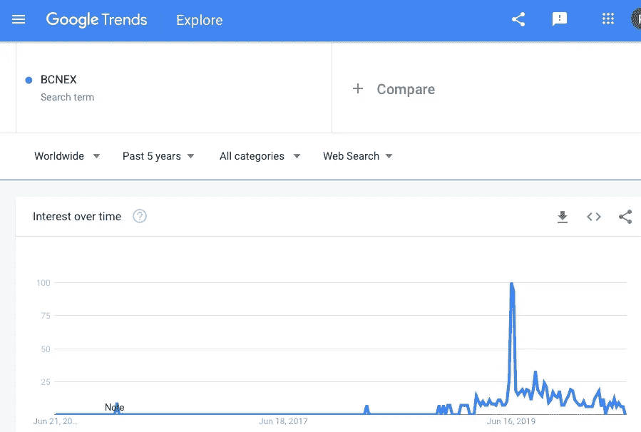

# 不可避免的退出

到 2019 年底/2020 年初，BCNEX Telegram 的用户、Twitter 的用户和 BCNEX 的脸书集团的用户开始抱怨无法提取现金和加密货币。

团队向他们保证这只是网站在维护。

这是四个月后的网站:

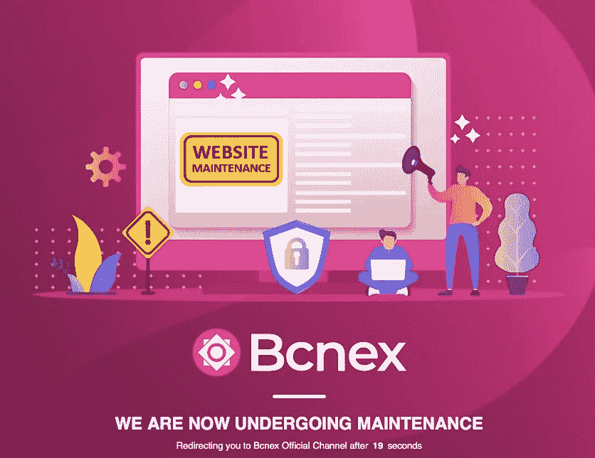

Four months of maintenance should be one hell of an upgrade

# 骗局是如何运作的

如果你需要太长时间；没有阅读版本，以下是较低级但有些复杂的加密货币骗局的操作方式:

第一步。寻找当地投资者，你可以很快收回投资。

第二步。使用注入的现金购买一个网站开发商，一个标志和图形设计师，一个白标交易所，和一个 ERC-20 令牌开发商。

第三步。有了这个运行良好的网站，你可以向投资者展示进展有多快。投资者可能会进行再投资，或者进行更多的投资(股票！).ICO 走向全球。

第四步。随着每天都有新的冤大头和新的资金进入，高管们可以举办奢华的派对和会议。这些人实现了多重目标，一是展示他们的财富和成就，二是他们在聚会上遇到新的投资者和傻瓜。

第五步。一旦最初的炒作过去了，你就关门大吉，再也没有消息了。如果你偷了适当数量的不那么强大和不那么富有的人，你可能会逃脱惩罚。

简单，总是存在，每天都有新的出现。

保持怀疑，朋友们。

**进入专家视角—** [**订阅 DDI 英特尔**](https://datadriveninvestor.com/ddi-intel)