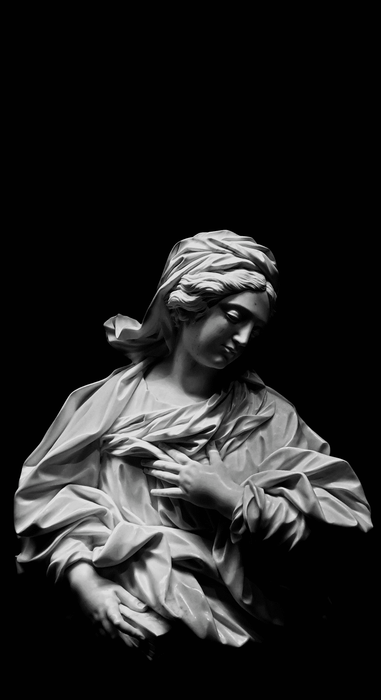

# 只需要一个白人

> 原文：<https://medium.datadriveninvestor.com/and-all-it-took-was-one-white-man-40acaf2ab122?source=collection_archive---------14----------------------->

## 弥合奥德·洛德和笛卡尔之间的鸿沟

Photo by [Michele Caliani](https://unsplash.com/@michele00caliani?utm_source=medium&utm_medium=referral) on [Unsplash](https://unsplash.com?utm_source=medium&utm_medium=referral)

白人竭尽全力帮助美国人。这就是全部的真相——只有真相。白人伪装成普通工人，戴着面具，帮助那些请求帮助的人。那些需要的人。

我的鼻子流血了，他给了我过量。果汁和冰。一个可以装三倍的杯子。

这是我在精神健康中心学到的一课。我身边的人都没疯。他们是工人。他们是人民。

一个苹果的意义不亚于一支笔，但前提是你让它。我干裂的嘴唇对我们所有的父母来说都是一样的，如果你有不止一种肤色的朋友，你会理解的。

医院，像任何机构一样，伸出援助之手。作为一个有特权的人，我是幸运还是不幸地学到了这一课？我认为这不是问题所在。

问题是；为什么，在一个星期天，我觉得有义务在一个作文笔记本上涂写我不想在星期六写的真理？

也许答案是我已经准备好离开了。我非常累。我被我的压力弄得筋疲力尽。

我没有被任何东西感动。音乐不会把我带到另一个空间。我不明白我怎么会有感动所有人的力量…

这是美国在疫情为我创造的特权。

潜台词是任何富家女的闺蜜。工作永远是游戏。

> 本文的第一部分是我在当地医院的精神健康病房半夜醒来鼻子出血后写的一篇日记。这个晚上标志着我的心态发生了实质性的变化:我看到了帮助是什么，帮助。

我走进医院，积极地试图理解我们当代文化中的种族概念，特别是美国的种族关系。

我需要理解女权主义诗人奥德·洛德和启蒙哲学家笛卡尔之间的知识差异，如果他们的教义中真有差距的话。我那善于分析和富有想象力的头脑将发现的可能性转化成了必须完成的任务。我觉得好像突然由我来充当桥梁，接受两种身份的思想，向不喜欢阅读的人传递重叠的原则。

在这个晚上之前，我会流鼻血醒来，从我的私人浴室里拿一些纸巾，让护士知道我流鼻血了。他们会说，“把头往后仰”。我会向后仰着头，直到我觉得我已经做得够多了，然后我会回到我的浴室，扔掉纸巾，忘记护士们曾经帮助过我。

在这个特别的夜晚，我意识到了我这一刻的真相。我住院是因为我需要帮助。我控制不住自己。我需要护士帮忙。我醒来，把流着血的鼻子吹到水池里，然后用纸巾压着鼻子走向护士站。我让护士知道我的鼻子又出血了，她让我把头往后仰。然后她问我想吃点什么或者喝点什么。我告诉她果汁，另一个护士就自己给我拿果汁。他给我拿了两杯果汁，一杯，半杯加冰。我喝了三杯果汁，感觉很神奇。

## 潜台词是任何富家女的闺蜜。

美利坚合众国是建立在少数民族的基础上的。在笛卡尔时代，“我们人民”是白人财产所有者。在二十一世纪，我们中的许多人确信，“我们人民”应该属于任何一个美国人，不管他们长什么样，也不管他们说什么语言。

笛卡尔说过“我思故我在”。笛卡尔说，我们人民，我们美国人民，是一个具有惊人的思考和推理能力的民族，因此，我们美国人民，有能力为自己和他人创造美好的生活。

Audre Lorde 说，由于这种“思考力”,拥有财产的老白人以他的方式运作。Lorde 也不得不说出她的经历，并补充说我们所有人内心的黑人女性说“我感受，所以我自由”。

时代变了，但理性的男人(或女人)说的话保持不变:因为我可以思考，我可以理论化。因为我觉得，我可以把我的时间用来把我自己和我周围的人从这个世界抛给我们的枷锁中解放出来。

白人不是我的敌人，我不应该这样对待他。我不应该假装我必须比他加倍努力才能达到他的成就。我不应该把自己和他或任何其他人联系起来。我应该记得我不必成为两个死去的诗人之间的桥梁。

## 工作永远是游戏。

我自己是个诗人。在我之前有很多诗人，一旦我死了，走了，还会继续有很多诗人。我明白，其他诗人也明白，社会话语搅动着社会的核心。

医院告诉我我工作太努力了。努力寻找在不同时期表现不同的东西。我花了很长时间才意识到我和笛卡尔和洛德一样强大。慢下来是为了让我明白，我不必像其他人一样做任何事情，我所要做的就是去做。