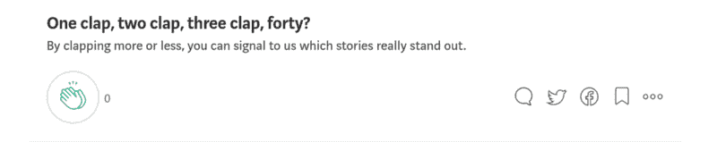

# 角度-更清晰的代码

> 原文：<https://medium.datadriveninvestor.com/angular-cleaner-code-5571f861865d?source=collection_archive---------5----------------------->

## Angular 是一个基于类型脚本的框架，通过反应式编程来构建复杂的 UI 密集型应用程序。

干净的代码不仅仅是可读性，还包括避免编程错误和不必要的复杂逻辑带来的副作用。这是正常的，因为软件规划*从来不会*按计划进行。


# 1).takeUntil —取消订阅 observables

使用反应式/陈述式方法。这个 RxJS 操作符确保了我们的订阅生命周期，无论是使用 AsyncPipe 还是。ngOnInit()中的 subscribe()将在组件拆卸期间取消订阅

```
// *app.component.ts*export class AppComponent implements OnDestroy  {destroyed$: Subject<boolean> = new Subject();
  messages$: Observable<Message[]> =    this.http.get('/messages').pipe(***takeUntil***(*this.destroyed$*));constructor(private http: HttpClient) {}ngOnDestroy(): void {
    this.destroyed$.next(true);
    this.destroyed$.unsubscribe();
  }
}
```

# 2).使用异步管道|始终异步

流是一个随时间变化的*值序列*。在 web 应用程序中，通过网络、事件或用户与 DOM 的交互，输入会随着时间不断变化。

我们最终编写的大部分逻辑只是为了弄清楚*哪些*函数需要从用户事件中调用。

使用异步可观察对象将解析的别名；这确保了组件加载时不会出现问题。

```
<div class="message__wrapper" *ngIf="**messages$ | async as *messages***">
  <div class="message__item" *ngFor="**let message of *messages***">
    ...
  </div>
</div>
```

# 3).嵌套订阅上的切换映射

这个 RxJS 运算符听起来很吓人，其实不然。switchMap 停止从第一个发射的可观测值发射值，并开始从新的可观测值发射项目。

```
**// Don't do this...**this.userService.currentUser$.subscribe(user => 
  this.pageService.getUserPages(user.id).subscribe(pages =>
    this.pages = pages;**// Do this.**destroyed$: Subject<boolean> = new Subject();
user$: Observable<IUser> = this.userService.currentUser$;
pages: IPages = null;ngOnInit(input: FormInput): void {user$.pipe(
    takeUntil(this.destroyed$),
    switchMap(({ id }) => this.pageService.getUserPages(id))
  ).subscribe((pages) => this.pages = pages);}
```

# 4).处理装载/进度条

组件内部的代码很容易变得混乱。在处理加载指示器时，避免一些常见的陷阱。

```
**// Don't do this...**this.isLoading = true;    
  this.pageService.getPages().subscribe(
     (pages: IPages[]) => {
      if (pages.length) {
        this.pages = pages;this.firstPage = pages[0];this.isLoading = false;
      }},
     (err) => this.isLoading = false
);**// Do this.**
getPages(): void {
  this.isLoading = true;    
  this.pageService.getPages().subscribe(
     (pages) => this.handlePages(pages),
     (err) => console.warn(err),
     () => this.isLoading = false
  );
}handlePages(pages: IPages[] | null): void {**// Validate for undefined or null
 // pages is array, 
 // has property 'length'**if (pages?.length) {
   this.pages = pages;**// Avoid using indexes [0], 
   // if needed, use '?.' in like pages?.[0]
   // Destructure first element of the array**
   const [ firstPage ] = pages;this.firstPage = firstPage;
  }
}
```

# 如果这对你有帮助，请鼓掌！🙏

