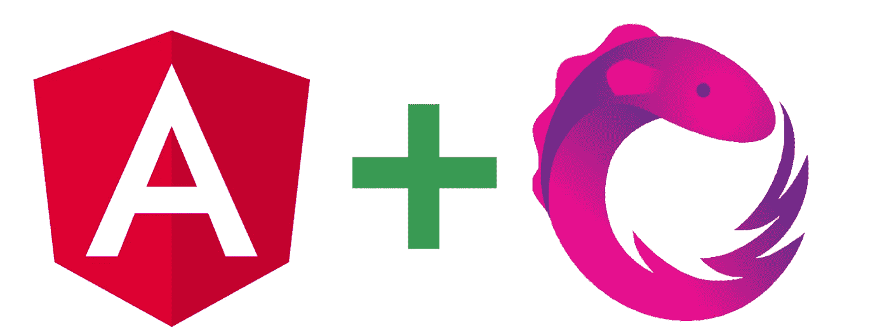
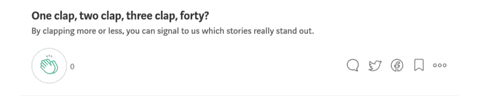

# angular/RxJS——取消订阅可观项目的 5 大方法

> 原文：<https://medium.datadriveninvestor.com/angular-rxjs-top-5-ways-to-unsubscribe-from-observables-6e8d0a7226c?source=collection_archive---------4----------------------->



# 1.手动呼叫取消订阅()

Angular 有一个在拆卸阶段调用的`ngOnDestroy`钩子，提供垃圾收集。

当我们在 Angular 的组件中使用 Observables 时，我们应该设置 ngOnDestroy 方法，并对所有 Observables 调用 unsubscribe 方法。

```
@Component({...})
export class MessageComponent implements OnInit, OnDestroy {
  messageSub: Subscription;

  ngOnInit () {
    const messages$ = this.messageService.getMessages();
    this.messageSub = messages$.subscribe() ngOnDestroy() {
    this.messageSub.unsubscribe()
  }
}
```

我们将 ngOnDestroy 添加到 AppCompoennt 中，并在`this.messageSub` Observable 上调用 unsubscribe 方法。

如果有多个订阅，请考虑将它们推送到一个数组中。AppComponent 中有两个订阅。它们都在 ngOnDestroy 钩子中被取消订阅，以防止内存泄漏。

```
@Component({...})
export class AppComponent implements OnInit, OnDestroy {
  messages$: Subscription;
  currentUser$: Subscription;
  subscriptions: Subscription[]; ngOnInit () {
    const messages$ = this.messageService.getMessages();
    const currentUser$ = this.userService.currentUser();
    this.subscriptions.push(messages$, currentUser$); ngOnDestroy() {
    [...this.subscriptions].map(sub => sub.unsubscribe());
  }
}
```

# 2.使用异步`|`管道

`async`管道订阅一个`Observable`或`Promise`并返回最新发出的值。当组件被破坏时，`async`管道会自动取消订阅，以避免潜在的内存泄漏。

```
@Component({
    ...,
    template: `
        <div class="messages" *ngIf="**messages$ | async as message**">
         <div class="item" *ngFor="let message of messages">
           <span [innerText]="message.text"></span>
           </div>
        </div>
    `
})
export class AppComponent implements OnInit {
    messages$: Observale<Messages[]>
    ngOnInit () {
        this.messages$ = this.messageService.getMessages();
    }
}
```

如果我们在组件中使用 Observables，使用异步管道是一个巨大的优势，因为它会自动订阅/取消订阅它们。我们不必手动取消订阅应用程序中的可观测量。

[](https://www.datadriveninvestor.com/2020/05/27/clean-code-is-crucial-in-software-development-heres-why/) [## 干净的代码在软件开发中至关重要——这就是为什么|数据驱动投资者

### 干净的代码是“容易理解和容易改变的”，它是关于对细节的关注。但是开发人员为什么要担心…

www.datadriveninvestor.com](https://www.datadriveninvestor.com/2020/05/27/clean-code-is-crucial-in-software-development-heres-why/) 

# 3.使用 RxJS `take*`运算符

RxJS 有许多有用的操作符，我们可以用它们在应用程序中取消订阅。他们由`take*`系列运营商组成:

*   **取(**金额:数量 **)**
*   **takeUntil(** 通知者:可观察 **)**
*   **takeWhile(** 条件:可观察)

# 拿走

该运算符使订阅执行一次。该操作符使源订阅发生指定的次数`n`并完成。

`1`通常与 take 操作符一起使用，因此订阅发生一次就退出。

当我们希望一个源可观察对象发出一次，然后从流中取消订阅时，这个操作符是有效的；在使用路径解析器时尤其有用，只需调用 take(1)来确保获得一个数据源，以便解析器可以移动到下一个数据集。

```
@Component({
    ...
})
export class MessageComponent implements OnInit {
    ngOnInit () {
        const messages$ = this.messageService.getMessages()

        messages$.pipe(take(1)).subscribe();
     }
}
```

# takeUntil(通知程序)

该操作符发出由源可观察对象发出的值，直到通知者可观察对象发出一个值。

```
@Component({...})
export class AppComponent implements OnInit, OnDestroy {
    destroyed$ = new Subject<boolean>(); ngOnInit () {
    const messages$ = this.messageService.getMessages();    
    messages$$.pipe(takeUntil(this.destroyed$)).subscribe();
  }    

  ngOnDestroy() {
    this.destroyed$.next(true);
    this.destroyed$.unsubscribe();
    }
}
```

我们有一个额外的通知主题，这是用来让`this.destroyed$`取消订阅的。在我们订阅之前，我们用管道把可观察的东西输送到。takeUntil 将发出间隔发出的值，直到`destroyed$`主题发出，然后它将取消订阅`messages$`

# takeWhile(条件)

`takeWhile`是另一个强大的操作符，但是如果您需要条件中的数据，就不要使用它。对于那些场景，建议坚持使用`takeUntil`，并使用一个主题实例来触发它。

```
// 1, 2, 3, 4, 5
const array$ = of(1, 2, 3, 4, 5);array$.pipe(takeWhile(val => val <= 4))
```

# 如果这对你有帮助，请鼓掌！🙏



**访问专家视图—** [**订阅 DDI 英特尔**](https://datadriveninvestor.com/ddi-intel)