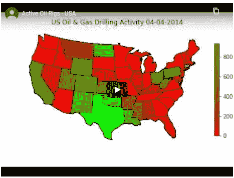

# 动画氯普图

> 原文：<https://medium.datadriveninvestor.com/animated-chloropleth-maps-502a77dbd6c2?source=collection_archive---------15----------------------->

*如果一幅画有一千个字，一部动画就有一百万个字！*

*TL DR:* [*GitHub 代码*](https://github.com/David-Woroniuk/Medium-Articles/blob/master/Animated_Chloropleth_Maps.ipynb) *。*

[时间序列动画](https://medium.com/datadriveninvestor/time-series-animation-in-matplotlib-de023655a197)是展示数据随时间演变的一种有趣而简单的方式，然而，许多数据集包含地理成分。数据的地理要素可能包含更多信息，已被用于情感分析、政治观点分析，以及最近的流行病学数据。

 [## 将定义 2020 年就业前景的五大数据科学和机器学习趋势|数据驱动…

### 数据科学和 ML 是 2019 年最受关注的趋势之一，毫无疑问，它们将继续发展…

www.datadriveninvestor.com](https://www.datadriveninvestor.com/2020/02/19/five-data-science-and-machine-learning-trends-that-will-define-job-prospects-in-2020/) 

本文提供了一个简短的 Chloropleth 地图动画演示，它让我们可以直观地看到两个世界的精华——我们可以可视化一个本地化的数据集，而动画则让我们可以查看随时间的变化。

所以，让我们开始吧！我们需要做的第一件事是卡通包装。当我使用 Google Colabatory 时，我使用了`!apt-get`参数，同时也卸载了 shapely 并重新安装了一个早期版本:

接下来，我们必须导入一些有助于数据分析、可视化和动画的包:

现在我们已经安装了所有的必备包，我们可以开始考虑数据了。我选择想象 2010 年至 2020 年间美国的石油和天然气钻探活动。数据可以在这个 [Github](https://github.com/David-Woroniuk/Medium-Articles/blob/master/O%26G%20Data.csv) repo 中找到:

我们现在定义颜色条中包含的颜色。这些颜色对应于美国各州的每周钻井活动，如`Dataset[‘Value’]`栏所示:

我们现在需要导入底图。由于我正在处理美国地图(下 48)，我选择了[自然地球](https://www.naturalearthdata.com/downloads/110m-cultural-vectors/110m-admin-0-countries/)的`admin_1_states_provinces_lakes`形状文件。自然地球提供的 shapefiles 的完整列表可以在这里[获得。](https://www.naturalearthdata.com/downloads/110m-cultural-vectors/)

我选择了 1:110 的比例，因为我们是在一个相对较小的地理区域内工作。对于全球数据，我鼓励您查看不同的可用选项。最后，我们将面颜色或每个状态的颜色初始化为灰色，状态边界初始化为黑色:

现在我们已经导入了一个形状文件和数据，我们可以开始看生成一个动画。一般来说，当处理动画时，我们提供一个 init 或初始化函数，后面跟着一个 iterable 函数，用于对应每个时间点的每一帧。这里，我们定义了 init 函数`init_run`:

`init_run function`用黑色边界和灰色面颜色初始化 shapefile 中的所有状态，随后被我们的数据集覆盖。我们还将每个州的几何图形和名称联系起来，使得在`run`函数中的使用更加容易:

差不多了——我们只需要添加一些额外的细节，主要是我们之前定义的颜色条。如果没有颜色条，任何使用颜色作为维度的图表，如氯普图，都很难理解。

为了将数据制成动画，我们调用了`matplotlib.animation.FuncAnimation`函数，提供了图形的输入参数、`run`函数和帧，帧指定了动画函数应该被调用的次数。Interval 提供帧之间的延迟，以毫秒为单位。

由于我在 Google Colab 工作，我选择将动画作者定义为`[‘ffmpeg’]`，然而，许多 IPython shells 与 ImageMagick 配合得很好。

最后，我们的动画应该保存在第一个代码块中定义的`root_dir`中。我们可以将氯普图与[折线图](https://medium.com/datadriveninvestor/time-series-animation-in-matplotlib-de023655a197)结合起来，调查美国石油价格和钻井活动之间的相互依赖关系，这可能有助于了解盈亏平衡成本最低的州！