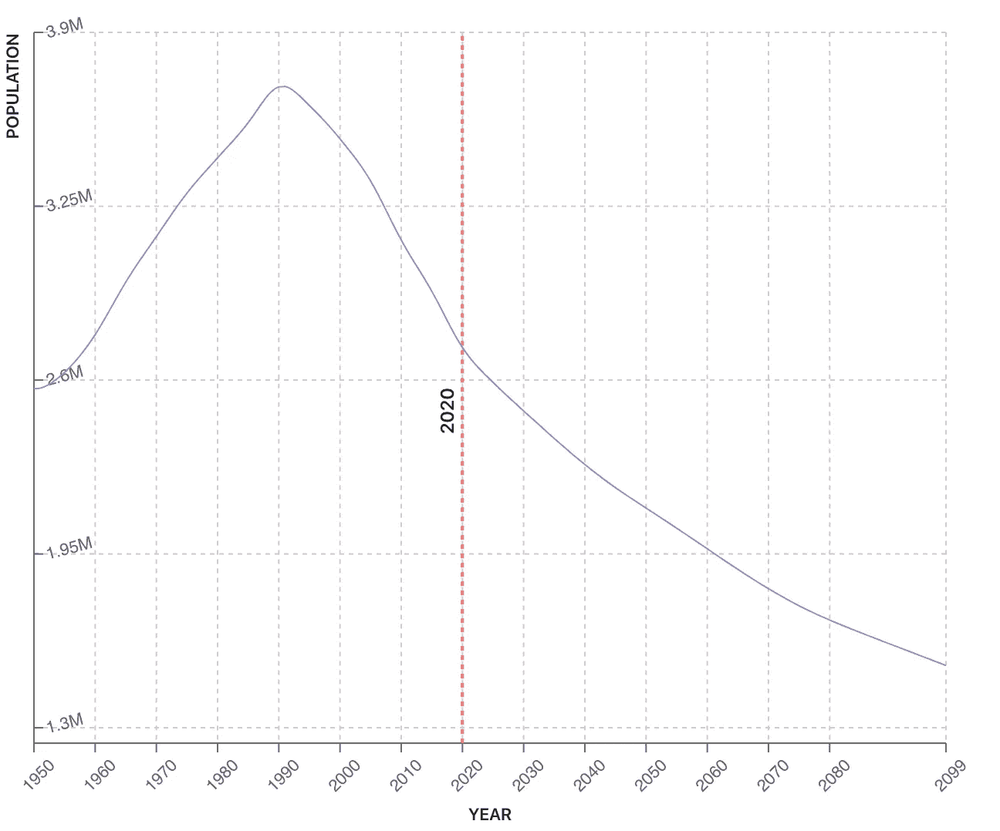

# 另一个政府发行央行数字货币

> 原文：<https://medium.datadriveninvestor.com/another-government-issues-a-central-bank-digital-currency-f049c825e4c6?source=collection_archive---------13----------------------->

2 分钟视频，介绍立陶宛如何刚刚推出了欧洲货币区的首个央行数字货币—[https://youtu.be/4Ua8M5RE9bk](https://youtu.be/4Ua8M5RE9bk)

Source: World Population Review.com

立陶宛将发行自己的中央银行数字货币(CBDC)。立陶宛的人口一直在下降，预计将保持在 20 世纪 60 年代的水平——270 万。然而，它在 14 世纪是欧洲最大的国家，所以时代是如何变化的。这对区块链技术和欧元区来说是一个里程碑，因为这将是一个国家的公民首次使用 CDBC 进行支付。尽管立陶宛推出 CBDC 不足为奇，因为立陶宛 92%的金融交易都是数字化的。这一宣布是在法国 ICO 签证计划的支持下做出的，摩纳哥宣布他们正在寻求推出 15 种安全令牌产品，以及荷兰、法国、意大利和德国对数字欧元的大量呼吁。路透社报道说，立陶宛建立中央商务区是对脸书的先发制人的打击，还是因为中国已经发行了自己的 CBDC？一方面，可以肯定的是，我们将看到更多的国家推出自己的 CBDC，因为全球利率几乎为零，他们需要一种新的工具来控制和影响他们的经济。

 [## 数字货币、区块链和货币的未来|数据驱动的投资者

### “区块链”、“加密货币”、“令牌化”，以及现在的“央行数字货币”已经成为…

www.datadriveninvestor.com](https://www.datadriveninvestor.com/2020/02/18/digital-currencies-blockchain-and-the-future-of-money/) 

#区块链#支付#经济#金钱#影子经济#现金#透明度#信任# cash #脸书#Libra 通过数字字节购买给你如果你想每周都有更多这样的文章 email info@Teamblockchain。

**访问专家视图—** [**订阅 DDI 英特尔**](https://datadriveninvestor.com/ddi-intel)