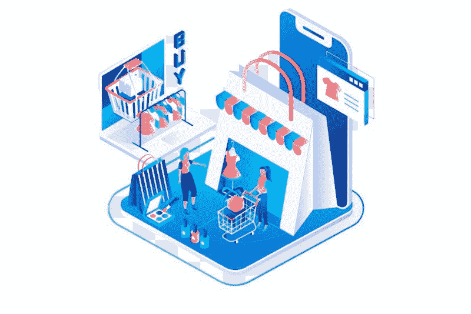

# 蚂蚁集团帮助上海成为全球金融中心——市场疯人院

> 原文：<https://medium.datadriveninvestor.com/ant-group-helps-shanghai-become-global-financial-capitol-market-mad-house-13184e03cc96?source=collection_archive---------27----------------------->

被选举和特朗普精神错乱综合症分心的美国人错过了今年最大的经济新闻。世界金融市场的中心已经转移到中国。

他们正在上海和香港举行今年最大、最热门的股票发行，蚂蚁集团 345 亿美元的首次公开募股，而不是在纽约。事实上，蚂蚁正在上海的明星市场进行首次公开募股(IPO)。

蚂蚁对一个市场的选择引人入胜，因为[上交所科技创新板](https://www.investopedia.com/what-is-china-s-star-market-4693703)；或者说明星市场，已经有一年多的历史了。他们于 2019 年 7 月推出了星空市场。相比之下，华尔街的纽约证券交易所(NYSE)有 228 年的历史。

# 上海是世界股市吗？

我认为上海可以取代纽约成为世界金融中心，因为它的交易员和投机者可以筹集到巨额资金。

令人惊讶的是，据《市场内幕》估计,[出价 2.9 万亿美元(19.1 万亿元人民币)](https://markets.businessinsider.com/news/stocks/ant-group-record-ipo-attracts-trillions-retail-investor-bids-alibaba-2020-10-1029746289)收购蚂蚁集团。此外，香港买家出价 1680 亿美元(1.3 万亿元人民币)收购蚂蚁股份。

令人难以置信的是，交易者超额认购了蚂蚁金服上海上市的 872 倍。此外，交易商超额认购了蚂蚁金服在香港发行的 389 倍。

蚂蚁集团声称，它的首次公开募股比历史上任何一次募股筹集的现金都多。因此，我认为我们将会看到一大批公司涌向上海和香港，利用这一有利时机，在明星市场进行 IPO。

我预测许多美国和欧洲公司将加入这一行列。我预计许多历史悠久的美国公司将尝试在上海和香港上市。此外，许多新公司将放弃华尔街，前往上海。

# 上海是世界金融中心吗？

美国人需要害怕，因为世界投资者和投机者已经用他们的钱投票，选举中国为全球金融领袖。

上海的崛起可能会成为世纪故事，因为这个全球金融中心在现代史上只搬过三次家。大约 1602 年，随着荷兰东印度公司(VOC) 的成立，现代金融市场开始于荷兰。VOC 是第一家现代股份公司。

然而，荷兰弱小，无法成为一个大国。特别是荷兰在欧洲大陆。荷兰人不得不投入大部分资源来抵御欧洲列强，如掠夺成性的西班牙帝国。

1688 年光荣革命后，世界金融市场的中心转移到了伦敦。在[光荣革命](https://www.history.com/topics/british-history/glorious-revolution)中，荷兰奥兰治王子威廉三世推翻了斯图亚特王朝，在英国建立了议会君主制。

光荣革命后，英国采用了所有荷兰式的经济创新，包括中央银行、英格兰银行和股票市场。到 1700 年，伦敦金融城已经成为第一个全球金融中心。

伦敦在第一次世界大战前一直是全球金融中心。第一次世界大战期间，美国；已经是世界上最大的工业国，成为最大的经济强国。到 1920 年，华尔街已经成为世界金融中心。

# 抱歉，美国，中国赢了

如今，一个世纪过去了，在冠状病毒疫情的冲击之后，全球金融资本已经转移到了上海。中华人民共和国正崛起为世界上占主导地位的金融大国。

十多年来，中国的经济实力一直在崛起。美国有史以来前三大 IPOs】都是中国公司。这些公司分别是**阿里巴巴**，2014 年 250 亿美元；中国农业银行 2010 年为 221 亿美元，中国工商银行 2007 年为 219 亿美元。

然而，这三家公司都在美国上市。蚂蚁集团忽略了美国市场，这是投资者喜欢的策略。我认为蚂蚁集团受欢迎的一个原因是美国未能应对冠状病毒。

# 冠状病毒击败美国

例如，Worldometers 估计，截至 2020 年 11 月 1 日，美国已有 [236，011 例冠状病毒死亡](https://www.investopedia.com/articles/investing/011215/top-10-largest-global-ipos-all-time.asp)。相比之下，中华人民共和国在同一天有 4634 人死于冠状病毒。

引人注目的是，约翰·霍普金斯大学估计，2020 年 11 月 30 日，当局在美国发现了[99231 例新型冠状病毒](https://www.investopedia.com/articles/investing/011215/top-10-largest-global-ipos-all-time.asp)。值得注意的是，他们在同一周举行了蚂蚁集团的 IPO。这超过了中华人民共和国[报告的冠状病毒病例总数 85997 例](https://www.worldometers.info/coronavirus/country/china/)。有趣的是，他们在 2020 年 11 月 1 日报告了中国 24 例新型冠状病毒病例。

投资者购买中国股票的一个原因是，由于冠状病毒，美国国内生产总值(GDP)在 2020 年第二季度萎缩了 31.4%。平心而论，2020 年第三季度美国 GDP 增长了 33.1%。

 [## 给数字营销工作者的 5 本书推荐|数据驱动的投资者

### 随着就业率的上升，由于疫情和人们花更多的时间在网上，数字营销的技巧…

www.datadriveninvestor.com](https://www.datadriveninvestor.com/2020/10/28/5-book-recommendations-for-those-who-work-with-digital-marketing/) 

我认为，许多投资者担心，如果冠状病毒疫情恶化，美国 GDP 将再次崩溃。令人担忧的是，美国经济比中国更容易受到冠状病毒的影响。对收入不平等和反应迟钝的美国政治体系引发的内乱的担忧增加了美国的怀疑态度。

同样，美国消费者新闻与商业频道的休·森注意到成千上万的高收入金融专业人士正在离开纽约市。纽约在 2020 年受到冠状病毒和骚乱的重创。

# 美国已经失去了世界金融中心

历史重演了。世界金融大厦因为冠状病毒的大灾难从纽约搬走了，就像伦敦因为一战的大灾难失去了金融大厦一样。

有趣的是，一些美国官员试图抵制历史。路透社称，唐纳德·j·特朗普(佛罗里达州共和党)政府的强硬派正在考虑将蚂蚁集团(Ant Group)列入美国国务院的黑名单。

将 Ant 加入黑名单可能会阻止美国人在美国股市购买其股票。然而，美国人仍然可以通过中国或其他地方的中间人购买蚂蚁的股票。

我认为一个明显的丑闻可能是特朗普政府官员购买 Ant 股票，同时阻止普通美国人投资 Ant。同样，我预测华尔街将向特朗普及其可能的继任者乔·拜登(特拉华州民主党人)施压，要求允许 Ant 在美国交易所交易。

具体来说，我认为美国人可以从蚂蚁股票中赚到的钱将会战胜爱国主义和仇外心理。然而，我预测我们会看到美国试图抑制中国股票市场，但所有这些都将失败。

事实上，我认为这些尝试会将更多的资金引入中国，因为投资者担心美国政府会变得越来越不理性、软弱、低效和排外。如果美国总统大选导致混乱，将提振中国股市。

# 什么是蚁族？

蚂蚁集团，前身为蚂蚁金服，曾是[全球最有价值的独角兽](https://marketmadhouse.com/ant-financial-not-uber-worlds-valuable-unicorn/)；上市前几年的公司。

蚂蚁集团是一家类似于 **PayPal(纳斯达克代码:PYPL)的金融科技和金融服务公司。**蚂蚁的招牌产品是支付宝，**阿里巴巴的**数字钱包。据 Techcrunch 估计，支付宝在 2020 年 3 月拥有 13 亿活跃用户。阿里巴巴在 2011 年将蚂蚁剥离成为一家独立公司。

支付宝应用程序是一个门户，让用户能够访问各种各样的第三方金融服务。蚂蚁是金融服务的主要参与者。这些服务包括数字支付、保险和财富管理。

Techcrunch 称，截至 2020 年 3 月，蚂蚁的财富管理部门管理着 5.7 亿美元(4 万亿)的资产。彭博估计，2020 年，蚂蚁的余额宝自有货币市场基金有 1730 亿美元。路透社称，余额宝是世界上最大的自营货币市场基金。蚂蚁的保险技术部门与 90 多家中国保险公司合作。

Ant 提供来自 20 家管理公司的共同基金，包括美国巨头 Invesco 和 Vanguard。截至 2020 年 6 月，蚂蚁的投资技术部门通过余额宝促成了价值 4.1 万亿元人民币(6100 亿美元)的投资。余额宝和 InvestTech 提供 170 家资产管理公司的第三方产品。

# 蚂蚁集团如何赚钱

高盛(Goldman Sachs)估计，到 2021 年，蚂蚁集团可能会发放价值 2900 亿美元的消费贷款。2019 年 6 月至 2020 年 6 月期间，蚂蚁的借贷平台华北(只花)和街北(只贷)向 5 亿人提供了贷款。这些贷款是无担保的，但蚂蚁通过收取 15%的利息来赚钱。

蚂蚁金服的信贷科技业务是其最大的赚钱工具，该业务包括华北和街北。彭博声称，在 2020 年的前六个月，CreditTech 为蚂蚁创造了 39%的收入。路透社称，2020 年 6 月，CreditTech 的贷款余额为 2.1 万亿元人民币(3100 亿美元)，其中约 1.7 万亿元人民币(2500 亿美元)是消费信贷。

此外，彭博估计湘湖宝蚂蚁的健康保险计划覆盖了 1.07 亿人。InsureTech 提供来自 90 家中国保险公司的保单。

彭博估计，支付宝控制着中国移动支付市场约 55%的份额，2020 年约有 7.11 亿活跃用户。

彭博声称，支付宝在 2019 年 6 月至 2020 年 6 月期间处理了[17 万亿](https://www.bloomberg.com/news/articles/2020-08-30/as-ipo-looms-all-you-need-to-know-about-jack-ma-s-ant-group#:~:text=The%20IPO%20is%20set%20to,Hangzhou%20Junhan%20and%20Hangzhou%20Junao.)美元的支付。支付宝创造了蚂蚁集团约 30%的收入。

2019 年，蚂蚁金服约 50%的收入来自技术服务费。蚂蚁首席执行官胡小明希望技术服务费占其收入的 80%。

由于中国金融监管机构和中国人民银行的压力，蚂蚁金服正退出金融服务领域。相反，蚂蚁正试图将自己重塑为一家类似于 **PayPal (PYPL)的金融科技公司。**

阿里巴巴拥有蚂蚁集团大约 33%的股份。据彭博估计，阿里巴巴创始人马云持有蚂蚁集团 50.1%的股份。

# 蚂蚁集团赚多少钱？

据路透社估计，蚂蚁集团报告 2020 年前六个月的收入为 725 亿元人民币(105 亿美元)，219 亿元人民币(32.7 亿美元)。

从 2019 年上半年到 2020 年上半年，Ant 的收入增长了 38%。2020 年 8 月，分析师对蚂蚁集团的估值超过 2000 亿美元。

我认为蚂蚁可能是一个值得购买的好股票，因为它是一个真正赚钱的 IPO。不幸的是，美国人现在不能购买蚂蚁集团的股票。但是，美国人可以购买**阿里巴巴(NSYE: BABA)** 的股票。2030 年 10 月 30 日，市场先生支付了 304.69 美元购买巴巴股票。阿里巴巴拥有蚂蚁集团约 33%的股份。

我认为蚂蚁集团表明，上海可以成为世界金融中心，而中国可以成为世界主要的金融强国。只有历史会告诉我们美国人对这一现实的反应。

# 是的，中国是第一，习惯吧，美国

然而，美国看跌者将注意到，英国从未真正适应其帝国和地位的丧失。此外，历史表明，美国可以长期保持其影响力和军事力量。

在 20 世纪 30 年代苏联、日本帝国和第三帝国崛起之前，大英帝国一直是世界上占主导地位的军事力量。此外，英国的世界领先地位一直持续到法国沦陷、敦刻尔克大撤退和 1940 年夏天的不列颠之战。

1940 年，当希特勒向世界表明英国无法自卫时，英国迅速崩溃；或者发动战争，没有美国的帮助。我认为美国未能遏制冠状病毒类似于 1940 年英国的军事灾难。

尽管美国在第一次世界大战中成为世界上占主导地位的金融强国，但直到第二次世界大战，美国才成为世界上占主导地位的军事和政治力量。只有历史才能证明美国的军事和政治力量是否会像其金融力量一样迅速崩溃。

*原载于 2020 年 11 月 2 日*[*【https://marketmadhouse.com】*](https://marketmadhouse.com/ant-group-helps-shanghai-become-global-financial-capitol/)*。*

## 访问专家视图— [订阅 DDI 英特尔](https://datadriveninvestor.com/ddi-intel)