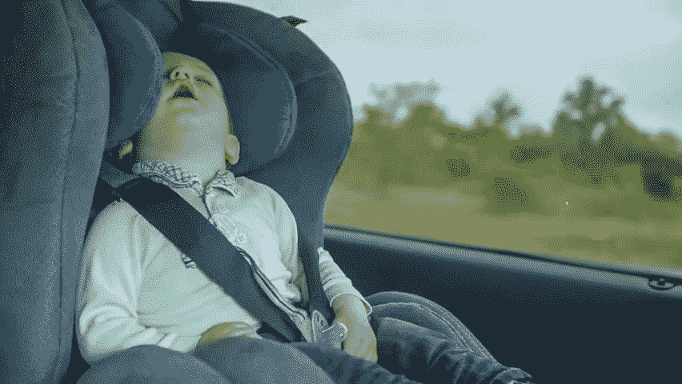
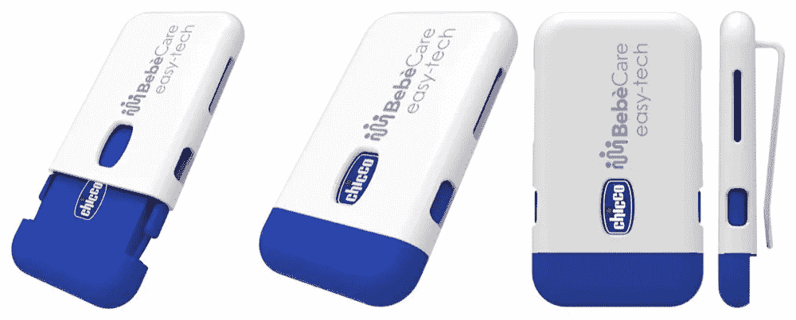

# 防遗弃装置，多么痛苦的事实

> 原文：<https://medium.datadriveninvestor.com/anti-abandonment-devices-what-a-painful-truth-519560346062?source=collection_archive---------19----------------------->

这款设备非常容易使用，完全可以通过手机上的应用程序进行编辑。所以它唯一的规格只有蓝牙。

 [## 新的健康技术如何让我们活过 100 岁？数据驱动的投资者

### 不久前，我们都在看一台黑色电视，不得不带着天线跑遍整个公寓，以确保…

www.datadriveninvestor.com](https://www.datadriveninvestor.com/2020/08/12/how-new-health-technology-makes-us-live-past-100-years/) 

该技术设备有两个警报级别。当手机距离儿童座椅太远时，该设备会发出响亮的铃声，告诉你你离开了你的宝宝。第二次警报仅适用于紧急情况。在这种情况下，它会比第一级的声音更大，并会向首选联系人发送设备本身的位置，即孩子应该在哪里。

在我看来，这个装置是对我们责任感的一种侮辱。问题还是一样:“**你怎么会把孩子忘在车里或其他地方呢？**”。

不幸的是，如今责任被承担得太容易了(显然不是所有人)，这是一种可怕的行为。在意大利，这些事件在过去几年里经常发生。你知道吗，仅在美国，就有 711 名儿童死于中暑、窒息和心脏骤停？

**在美国和欧洲，如果你患有压力赦免或其他疾病，就必须拥有它。**

这种装置对那些患有特殊疾病的人很有用，如大赦国际和许多其他人。不是为了他们自己，而是为了他们的孩子，帮助他们。

我想强调的最后一点是，我们并不真的需要这些设备来记住我们亲爱的宝贝，但我们需要更放松，对我们的行为更负责，加上专注于什么是真正值得的。

**请注意:**这个号召只针对像文章开头的例子这样不负责任的人，**而不是那些患有疾病的人**。**干杯，祝大家平安！**

## 访问专家视图— [订阅 DDI 英特尔](https://datadriveninvestor.com/ddi-intel)