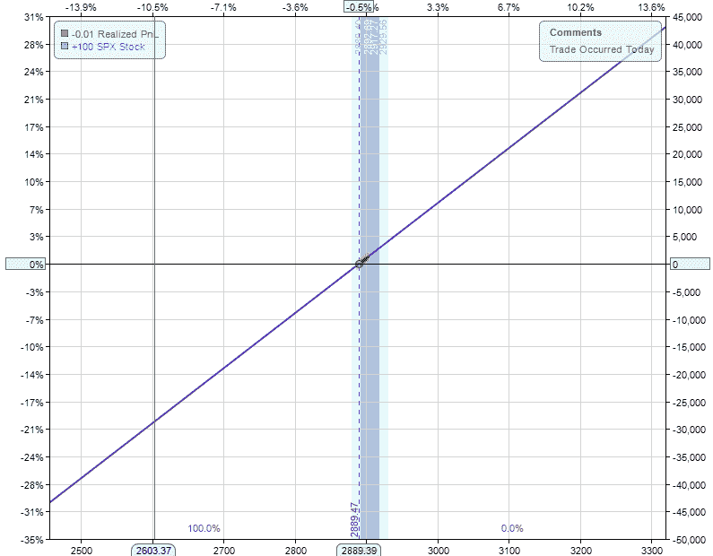
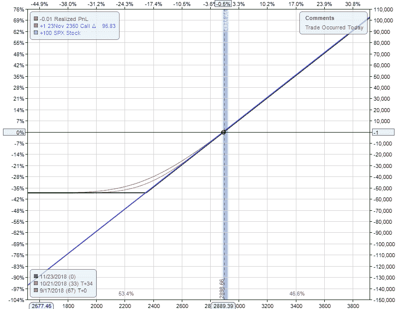
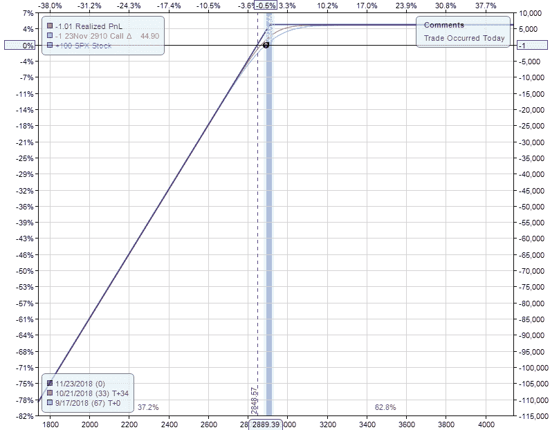
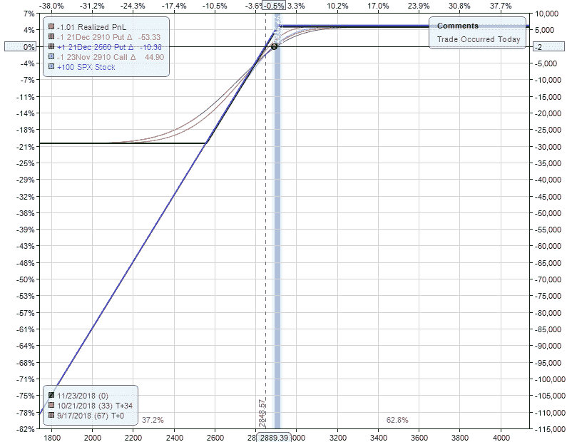

# 反杠杆

> 原文：<https://medium.datadriveninvestor.com/anti-leverage-34870873b18f?source=collection_archive---------16----------------------->

Photo by [Chris Henry](https://unsplash.com/@chrishenryphoto?utm_source=unsplash&utm_medium=referral&utm_content=creditCopyText) on [Unsplash](https://unsplash.com/?utm_source=unsplash&utm_medium=referral&utm_content=creditCopyText)

市场上普遍认为，要获得更多回报，就必须承担更多风险。这是不真实的，原因有很多，下面的只是降低相同回报的风险的一种方法。

杠杆就是借比你拥有的更多的钱，并投资于市场，放大收益和损失。反杠杆就是用更少的资本获得同样回报的能力。这是一个最直观的概念。

 [## 投资区块链前要问的三个简单问题(也是一个困难的问题)|数据…

### 现在是了解区块链的最佳时机。不同货币之间的增长率，比如…

www.datadriveninvestor.com](https://www.datadriveninvestor.com/2020/03/12/three-simple-questions-and-one-difficult-one-to-ask-before-investing-in-a-blockchain/) 

这是购买股票的收益结构。如果市场上涨，投资者就赚钱了。如果市场下跌，投资者就会赔钱。重要的是要记住，股票可以，有时确实会归零。市场上的一美元就是处于风险中的一美元。

期权具有独特的反杠杆特性。下面是买入期权与做多股票相比的收益结构。

这两种投资都有相同的上升潜力，而绿线代表的看涨期权在市场上的资本减少了 82%。

这是反杠杆，同样的回报，更低的风险。

另一个很好的反杠杆例子来自一个流行的期权策略，备兑买入期权。

备兑看涨期权是指投资者拥有标的股票，并卖出该股票的看涨期权。正如我们在前面的例子中看到的，用看涨期权替代股票可以大大减少所需的资本。

运用反杠杆原理，可以用少 90%的资本获得同样的回报。

在市场上，你不必冒更大的风险来获得更多的回报。有一些方法可以降低风险，同时保持上升趋势。期权固有的反杠杆作用只是实现这一结果的一种方式。