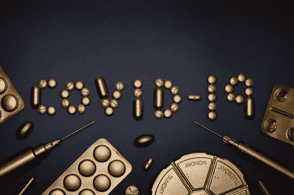

# 来自冠状病毒的抗病毒信息

> 原文：<https://medium.datadriveninvestor.com/anti-vaxxers-take-home-message-from-coronavirus-eb7752137e86?source=collection_archive---------12----------------------->

#COVID-19 #Coronavirus

疫苗是一种生物制剂，旨在产生对特定感染因子的主动获得性抗性。其特征性地包含一种部分类似于微生物的因子。所谓的特征要么是相同微生物的弱化或死亡形式，要么是其构建[模块](https://www.datadriveninvestor.com/glossary/block/)中携带的一种或多种毒素或表面蛋白。

据称，该物质刺激身体的免疫系统发现该物质是一种威胁，因此破坏它，并进一步学会破坏与这种特征相关的任何微生物；如果遇到即将到来的传染性危险。

如今，并不是每一种现存的传染性病原体都提供了针对它们的疫苗。一些人缺乏它是因为缺乏稳定的结构，像 HIV 和一些；我们没有疫苗，因为它们是新出现的，比如新冠肺炎。或者对于少数其他尽管致命的病毒(例如埃博拉病毒；直到最近)，他们未能得到及时的关注，仅仅是因为缺乏财政上的可行性，以明显垄断的制药行业。

医疗保健和医学专业人士认为疫苗是几个世纪以来的重大成就之一。它拯救了许多生命，降低了发病率，并帮助了经济。但是，并不是每个人都与疫苗和免疫接种相关的事实一致。反对接种疫苗是一个世纪以来的问题。几十年来，这一直是新闻辩论的主题。

 [## 冠状病毒；惊慌失措；字里行间的 z |数据驱动的投资者

### 围绕冠状病毒的话题；更准确地说，新冠肺炎几乎占据了整个新闻预报的头条…

www.datadriveninvestor.com](https://www.datadriveninvestor.com/2020/03/23/coronavirus-a-to-panic-z-between-the-lines/) 

最近的[争议被政治言论所污染，主要是通过患有自闭症](https://medium.com/the-4-elements-of-change/vaccines-and-senate-bill-276-the-epitome-of-the-physician-outlaws-with-political-5d550d8a7a30)的儿童的父母。因此，父母比以往任何时候都更多地选择不为他们的孩子接种疫苗，以及无数不同的原因和理由。选择不进行麻疹、腮腺炎和风疹等传染病的免疫接种导致了如今几乎不存在的传染病的重新出现。

 [## 疫苗接种——个人选择和公共卫生义务的世纪

### 虽然疫苗接种在印度和孟加拉国等发展中国家是强制性的，但在美国，父母们…

medium.com](https://medium.com/be-unique/vaccination-century-of-personal-choice-and-obligation-to-public-health-bc16baf5c087) 

反对接种疫苗的态度并不是一个新的想法，因为它与疫苗的存在平行存在。19 世纪后，当人口和公共卫生成为政府的责任时，政府接管公共卫生产生了公民抗议者的派别(被称为反疫苗接种者或反疫苗接种团体)。这种疗法的反对者开始改变疫苗接种或立法，要求大规模免疫接种。

拒绝接种疫苗始于 19 世纪早期，当时天花疫苗开始大量流行。对疫苗接种的吹毛求疵有各种各样的原因，从卫生、宗教和政治上的异议。

最近的争论是关于麻疹-腮腺炎-风疹(MMR)疫苗很可能会给儿童带来自闭症的说法。最近，定量配给成为父母选择不为其子女进行常规免疫接种的公开理由。一个多世纪以来，立法一直将疫苗接种作为公共卫生的标准，同时引发了疫苗接种争论。这种紧张关系已经足够强烈，以至于地方和州政府已经采取了额外的严厉的立法措施来反对反疫苗运动和个人选择。

政府当局甚至更进一步，限制医生出于医疗原因豁免接种疫苗。截至今天，MMR 疫苗和自闭症之间的相关性在所有意识形态岛屿上都存在争议。然而，对疫苗的一些抵制不可避免地来自于对科学的怀疑和对政府的不信任。

很少有人假设；制药公司渴望销售他们的产品，不管结果如何。其他人对他们无法理解的科学持怀疑态度，包括各种疫苗中的成分。这种不信任继续升级，因为更多的限制性法律要求儿童在能够进入公立学校之前接种疫苗。作为辩护，一些反对接种疫苗的家长倾向于“自然”或顺势疗法作为疫苗接种的替代疗法。因此，当人们信奉医学虚无主义或不信任医学科学时，他们就不太可能使用疫苗。同样，他们也不太可能相信开疫苗的医生。

 [## 面对不断变化的技术发展，竞争激烈的医疗保健领域

### 对敏捷业务度量的需求

medium.com](https://medium.com/datadriveninvestor/the-competitive-healthcare-landscape-in-the-face-of-veering-technological-upswings-acf8fbdedc85) 

# 冠状病毒教会我们什么！

2020 年 2 月，世界卫生组织(世卫组织)正式宣布由一种新型冠状病毒株引起的新疫情。自 2019 年首次爆发以来，这种新兴病毒已经感染了全球数千人。该组织现在称之为新冠肺炎。

目前没有针对新冠肺炎的疫苗。这种新型病毒已经感染了全世界超过 10 万人；数千人死于并发症。截至 2020 年 3 月，数字仍在滚雪球，还会持续多久是中心谜团。

尽管我们对这种新生物的形态了解有限；尽管如此，它似乎仍在延续典型的钟形流行病传播轨迹，就像每一次常规流行病一样，只是速度更快。

这一历史规模的疫情的话题不仅使医疗保健系统面临重大消亡，还伴随着整个世界的恐慌和混乱。

我们需要记住，流行病是自然灾害，需要明智而平静地应对。然而，灾难性的是，我们准确地瞥见了不同的状态。社会孤立，关闭企业，由媒体带来的铺天盖地的恐慌主宰了社会安宁，即使是出于良好的理由。

#Vaccination

有一个坚实的动机假设；随着冠状病毒在世界各地蔓延，在今天恐慌的人群中，有无数的反对者。甚至公正地认为，一些医学科学领域的虚无主义者也可能希望(无论出于何种原因)有一种针对冠状病毒的疫苗。

也许现在是时候在不威胁个人主权的情况下，调查一些关于疫苗接种的先决条件、个人责任、公共卫生的事实和现实了。

# 接种疫苗有助于个人和社区

疫苗是一种预防药物。它有助于保持我们的健康。就像每一种药物一样，不管是像泰诺或处方药这样的非处方药，疫苗都有太多的副作用。如果使用得当，通过考虑其使用的[风险效益比，](https://medium.com/datadriveninvestor/personalized-healthcare-vs-population-health-application-of-risk-benefit-ratio-25022a497635)疫苗最有可能造福人类。免疫接种的优势不仅在于直接的健康维护，还在于间接的经济和社会改善。

# 疫苗接种的挑战

围绕免疫接种的争议就像一把双刃剑。没有它，人们会遭受严重的感染，并毫不费力地传染给他人。在另一个极端，反堕胎人士对医学、公共卫生官员和制药行业的冷嘲热讽造成了一种现状。随着千禧一代对高质量医疗服务的期望和认知日益增长，后者变得更加复杂。支持和反对疫苗之间的拉锯战是一个严重的问题，使得个性化疫苗接种指征变得更加重要。与此同时，接种疫苗的决定需要考虑该社会的情况。遵守与他们自身相关的规章制度和道德规范。

# 考虑治疗的风险和收益比也适用于疫苗接种

风险收益比表示一项努力的风险与其可能的优势的比例。通过分析任何医疗干预的风险-收益关系，提供了列举给定治疗的可行性的方法。风险分析在很大程度上依赖于个人决定因素，因为我们生活中特定程度的危险是不可避免的，因此在[交换](https://www.datadriveninvestor.com/glossary/exchange/)中可以接受一定程度的利益。

也许，每种疫苗都有副作用，但大多数人会接种，因为任何疫情的社会经济惩罚都要高得多。同时，实际感染的直接危害也是独立显著的。个人感知是风险收益比的重要驱动因素。通过控制自身理解的因素，可以影响风险形成的情况。当个人受到无意的风险时，他们往往会对最初目标线的风险产生厌恶情绪。在这种情况下，个体需要风险的概率接近其感知控制下相同情境的千分之一。

# 对疫苗的厌恶

通过有偏见的行为放大风险与收益来厌恶疫苗，不仅有个人因素，也带来了社会经济方面的不利因素。作为社会人，除了道德义务之外，人类还有相互协作的义务，让彼此远离传染性疾病。因为毫无疑问，如果人类单独生活在远离彼此的地方，像冠状病毒或麻疹这样的有机体就不会影响数百万人。

相关文章:[冠状病毒；惊慌失措；字里行间-全球流行病频发年表](http://Coronavirus;%20A-%20to%20Panic;%20Z%20between%20the%20lines%20By%20Adam%20Tabriz,%20MDMarch%2023,%2020201389%20Chronology%20of%20frequent%20global%20pandemics)

“社会距离”的概念并不是人类本性所固有的。因此，如果我们这些社会人失去了对降低风险收益比的自觉反抗，那么我们作为一个个体也将会消失。前面提到的并没有消除每个人都必须首先确保自己的健康和安全的事实。此外，如果免疫接种的高风险迫在眉睫，个人优先考虑的因素会压倒社会因素，因此不接种疫苗是明智的。但是再一次，仅仅因为虚无主义的观点而避免接种疫苗是草率的，因此也是危险的。事实上，每一次疫情都会带来经济上的暗示，以及伴随每一种疾病的直接发病率和死亡率；疫苗可以避免这些并发症。

# 围绕疫苗接种的人群健康和个性化

群体健康是指一群个体的健康结果。这包括前面提到的结果在预先安排的组内的分布。这些组通常是地理社区，如县、州或国家。一个群体也可以是独特的，如雇员、种族群体、残疾人、囚犯或任何其他定义的人群。有必要牢记:无论是在公共部门还是在私营部门，一个群体的健康结果仅仅与决策者相关。在过去的几个世纪里，人口健康一直是公共卫生实践的标准；然而，结局正在改变。

#immunization #COVID 19

今天，是几个世纪以来的人口健康模型从表面上规定了谁以及如何接种疫苗。特定国家的国家立法主导了个体患者的意愿和医生的临床判断。后者需要确保为特定群体接种疫苗。

政治、官僚主义和人口健康的结合确实形成了一个在社区中建立所谓的[群体免疫](https://en.wikipedia.org/wiki/Herd_immunity)的通用解决方案。

# 但是人们的期望和疫苗接种呈现出利益冲突

随着技术和科学领域的不断变化，公民的期望也在不断变化。这种景象在千禧一代中更加突出，他们比他们的同龄人更精通知识，也更有自我意识。事实上，人们想要更好、更安全、更健康的健康和幸福。

由于群体健康以集体的方式发挥作用，因此它完全不能有效地满足个体的特定需求。上述内容是不满、叛乱和虚无主义的沃土。反 vaxxer 驱动器就是这样一个例子。

# 反 Vaxxer 需求个性化保健

如果你在网上查询，你几乎肯定会找到数以千计的个性化医疗定义。然而，总的来说，个性化医疗保健是一个系统的总体框架，它统一了技术、人员和策略，以增强患者、医生和其他医疗保健提供者的能力。个性化医疗保健侧重于个人，而不是群体健康。以病人为中心的医疗保健利用病人和医生之间的共同决策。

新的年龄层对个性化有着强烈的渴望。因此，将集体倾向强加给具有自我管理心态的个人，迟早会让他们走上不信任和叛逆的道路。

大多数疫苗接种反对者并不支持大流行；也不希望自己的孩子患上致残性疾病。但与此相反，当谈到免疫接种实践时，他们不愿意支持伪极权主义策略。

简而言之，他们要求个性化的风险收益检查，在理想情况下，这种检查在他们和他们的医生之间不加区分地进行。

# 自由选择和极权主义

开放式选项和协作式医疗保健交付模式是任何真正的个性化医疗保健的本质。在构象中，反疫苗接种的态度围绕这样一个现象蓬勃发展。

在 19 世纪之前，当人口健康不存在时，医疗保健的挑战主要集中在科技繁荣的短缺上。在人口健康剧变后，直到最近，典型风格的概念发展得相当好，因为知识和信息的获取与人们的期望相平行。

病人接受任何给予的想法；在功利主义下运作良好，仅仅是因为个人没有分享他们今天享受的希望。代表公民的利益，这一制度承受了更多的摩擦；人口健康政策变得越严格，从而使系统变得更加极权。

# 人口健康正在变成极权主义

尽管现代公共卫生实践在改善患者健康方面遇到阻力，人口健康管理局仍在有区别地前进。这都是关于预防性药物的更大的[重量](https://www.datadriveninvestor.com/glossary/weight/)，并确保它蒸发。人口健康是一项精益商业实践。它的目的仅仅是控制成本，仅仅专注于跟踪和协调社区的医疗保健。健康数据分析和社会决定因素对于实现人口健康目标变得更加重要。然而，这是以牺牲医生的独立性和病人的自主权为代价的。

对于这位蒸蒸日上的医生来说，加入一个更突出的团体实践似乎是收支平衡所必需的，因为小的实践没有“复杂的工具”来实现让整个人口健康的目标。从今以后，这是一个流行的观念，医生的独立性将不会到来，如果没有必要的工具去个人化或屈服于极权主义制度。

在英国和法国，工业革命[干预了人口健康](https://www.ncbi.nlm.nih.gov/pmc/articles/PMC1449802/)并刺激了开创性的流行病学探索，形成了早期预防性公共卫生运动。

 [## 疫苗和参议院法案-276:医生与政治不法分子的缩影…

### 疫苗！—针对特定感染主动提供免疫的生物成分！—我们是……

medium.com](https://medium.com/the-4-elements-of-change/vaccines-and-senate-bill-276-the-epitome-of-the-physician-outlaws-with-political-5d550d8a7a30) 

自由民主力量和富裕利益之间长达一个世纪的政治安排过程导致了 20 世纪福利国家的出现。福利国家于是成为将经济增长转化为增强人口健康的多层面政治机制。然而，诋毁政府作用的“新自由主义”计划的兴起，凸显了预防和人口健康方法的重要性，以绘制和宣传这一新阶段“全球”预算津贴的健康影响。

# 人口健康与个人自由的冲突

个人权利和公共卫生政策之间的持续紧张是真正的新问题。今天，自我自由和集体人口健康的争论已经成为美国和其他国家关于公共健康争论的基础。对超越权威的根深蒂固的怀疑助长了冲突。

对于不加选择地应用官场，比如疫苗接种指令，有着压倒性的担忧。从传染性疾病到慢性疾病，在对公共健康的一系列威胁中，我们可以发现集体利益和个人主权之间存在许多内在的紧张关系。

一些人自信地认为通往更健康生活的道路在于自由的国家规范。基于后一种理论，更好的公共卫生补救措施始于公共卫生项目，停止偏见和偏袒，支持公民自由。但是，反对者觉得；虽然上述步骤无疑会增加一些健康障碍，但健康现实可能会更加复杂，无法以这种方式[解决](https://www.datadriveninvestor.com/glossary/address/)。

#vaccination

# 群体免疫和个人主义

这种对传染性疾病的间接保护也被称为[群体免疫](https://en.wikipedia.org/wiki/Herd_immunity)，只有当大部分人群(通常为 60-80%)对移交感染产生免疫时才会发生。后者可以通过以前的感染或通过疫苗接种来参与，从而为没有主动免疫力的人提供一种保护。然而，正如我们之前所讨论的，针对[疫苗可预防的传染性疾病的个人保护权利产生了一种集体责任](https://www.ncbi.nlm.nih.gov/books/NBK538382/)，这种集体责任表现为一种共同责任，即理解群体免疫。

 [## “选择不接种疫苗是你个人的特权，只要它不会直接…

medium.com](https://medium.com/@Adamtabriz/it-is-your-individual-prerogative-to-choose-not-to-be-vaccinated-as-long-as-it-does-not-directly-c4eee4d6e3da) 

这种共同的责任为社区的每个成员产生了接受疫苗接种的个人承诺，除非有医学原因使疫苗接种成为额外的。有必要鼓励有助于群体免疫认定的行政措施。还必须强调支持实际疫苗接种计划的个人责任，同时遵循国家必须至少在其控制的情况下保护个人健康的原则，并至少实现群体免疫。

新冠肺炎危机是众多例子中的一个，说明了为什么制定平衡的、负责任的政策是至关重要的，这些政策不仅要尊重个人自由，还要维护适用于所有人的“黄金法则”。

# 政治和疫苗接种

就维持群体免疫而言，我们必须保持立法授权和个人主义之间的平衡，同样，我们必须防止将主要是医学难题的事情政治化。不幸的是，一个集中的、自上而下的人口健康解决方案已经完全将疫苗接种的话题官僚化了。例如，过去十年在加州和其他几个州爆发的[麻疹使得](https://www.medpagetoday.com/infectiousdisease/vaccines/49876)疫苗保护将医疗保健问题变成了政治教条。政治家们已经考虑了在疫情爆发期间是否应该强制儿童接种疫苗的问题。

# 再说一次，谁是反暴力者

反疫苗运动是历史上不断增长的官僚主义和极权主义方法的结果，以确保大众的群体免疫。反暴力的不容忍已经逐渐脱离了风险收益比的范畴，进入了医疗虚无主义和对政府的不信任。放弃医学科学，反过来又在公民中造成了意识形态的冲突，助长了不健康的宣传和不信任与不服从的恶性循环。反疫苗政治、人口健康和集体主义已经形成了自己的流行病。但与前者不同的是，最近的疫情是政治性的。

# 反疫苗和官僚需要明白什么

疫苗拯救生命，让我们保持健康。但与此同时，我们必须确保为每个患者维持合理的风险效益比。似乎公众在心理上倾向于对疾病的危险变得不敏感，因为我们通过接种疫苗享受群体免疫。要看到一幅现实的画面，我们必须进一步关注新冠肺炎。反疫苗意识形态需要保持现实的眼光，坚持黄金法则的伦理观念。像冠状病毒这样可以致命的感染可能会持续数年。他们需要明白，没有个人的承诺，保护就不会到来。

一个人不需要放弃个人自由来实践确定群体免疫的个人责任。秘诀是在个性化的医疗保健环境中额外强调受试者自身的风险和收益比。

# 社会、经济、健康和政治风险

公共卫生，尤其是像疫情冠状病毒这样的传染病，正面临着伦理和法律之间日益加剧的冲突。讲话的后果不仅是通过身体健康的方式给病人带来危险，而且还通过间接的政治、经济和社会混乱带来危险。

医学虚无主义，连同它的促发因素，对医学科学的可变性无动于衷。虚无主义是人类灭亡的理由，个人主义更是如此。它对医生和消费者的形象视而不见，将大部分责任推给他们，而事实上，大部分责任应该指向功能失调的系统、政治和腐败。

*原载于 2020 年 4 月 12 日*[*【https://www.datadriveninvestor.com】*](https://www.datadriveninvestor.com/2020/04/12/anti-vaxxers-take-home-message-from-coronavirus/)*。*

 [## 增强患者权能离不开增强医生权能

### 作为个体特征的权力

medium.com](https://medium.com/datadriveninvestor/patient-empowerment-cannot-be-without-physician-empowerment-6d0dd3858d32)