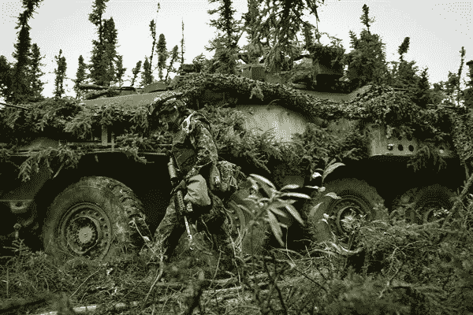

# 预测、适应、行动:加拿大应对不断变化的安全环境和气候变化威胁的防御方法——哥伦比亚公共政策评论

> 原文：<https://medium.datadriveninvestor.com/anticipate-adapt-act-the-canadian-approach-to-defense-in-response-to-the-evolving-security-68ff6bb25fe7?source=collection_archive---------22----------------------->

加拿大的“预见、适应、行动”( [**A3**](https://www.canada.ca/en/department-national-defence/corporate/reports-publications/canada-defence-policy/new-approach-defence.html) )是军方提高武装部队效力的新方法，包括但不限于陆、海、空三军。该方法详细说明了交战规则(ROE)和标准操作程序(SOP)倡议，旨在实现加拿大国内外的国防目标。加拿大今天的安全挑战与几个并不相互排斥的动荡局势错综复杂地交织在一起。这包括气候变化、国内不安全和对盟友的威胁；因此，加拿大需要一个现代的，可持续的，反作用的行动方针，如 A3。这一行动方针包括提高战备效率(OP)、与盟国进行联合军事演习(JME)、增加作战和责任区的侦察(AOO/R)、提高部队的声明单位要求(SUR)以及最重要的威胁中的作战控制(OPCON)。

加拿大 A3 政策的实施将受到考验，因为它正面面临最严峻的挑战:气候变化。

第一个支柱“预见”，从战略上使加拿大军队处于戒备状态。新法规强化并实施了交叉工具评级、现代技术机制和部门支柱，用于英特尔收集和规划信息和运营服务的快速分发。这使得加拿大在实现加拿大国防目标的过程中，能够与学术智囊团、专家和其他盟友有效合作。确保加拿大在全球强大军事力量的一个例子是加拿大部队情报司令部(CFINTCOM)。该倡议旨在通过高质量和有效的情报收集，提高其预测和阻止任何形式的敌对行为的能力。

 [## 气候变化辩论中的科学与金钱|数据驱动的投资者

### 没有关于气候变化的公开辩论。在我发布文章的媒体上，有成千上万的文章是关于…

www.datadriveninvestor.com](https://www.datadriveninvestor.com/2020/01/30/science-and-money-in-the-climate-change-debate/) 

新任务的第二个支柱是“适应”。虽然加拿大部队预见到敌对行动，但第二个政策支柱使这些部队能够适应不断变化的安全环境。国防部正在着手的一项关键举措是整合和增强预备役部队。这用足够的人力加强了最初的军事力量。部队正在通过实施军事能力研究来实现这一目标。敌对行为可以通过几种方式持续存在；为了探测、威慑和防御，国防部正在与其他部门，特别是全球事务部门结成战略伙伴关系，在遵守国际空间法的同时提高空间单位的执行能力。此外，在满足单位和安全需求方面，国防部在 A3 的指导下，正在私营部门中形成引人注目的联盟。这些独特的公私伙伴关系使加拿大能够利用私营部门的最佳做法来应对不可预见的挑战。

最后，有了 A3 中概述的适当机制和条例，加拿大的作战和战术准备能够行动和适应。这种行动的一个显著例子是 DND 在低到高动荡地区与全球事务协调的战备状态，如与全球事务、DND 和联合国(维和行动)的积极伙伴关系；加拿大部队在乌干达恩德培的联合国后勤行动(维持和平/调度)中发挥了重要作用。

***气候变化:加拿大在当今不断变化的安全环境中面临的重大挑战***

加拿大今天面临的安全挑战或威胁与几种不对称的局势错综复杂地交织在一起。这些挑战已经超越了它们曾经采取的传统形式，已经演变成严重的、多方面的、无国界的威胁。这一威胁的严重性在本质上是不可预测的，需要国际和国内的合作。气候变化是一个全球性的危机，而加拿大处于危机的中心:加拿大位于全球北部，拥有丰富的自然资源，如淡水、油砂和森林，因此最有可能以前所未有的速度遭受气候变化的影响。加拿大北部与俄罗斯和美国接壤。北极正以惊人的速度融化，解冻并释放出前所未闻的疾病。这些冰的融化创造了新的旅行路径，使加拿大处于捍卫其主权和预防异常疾病的紧迫时间窗口。加拿大继续保卫其边境免受各种形式的威胁。然而，气候变化的影响超越了国界。

此时此刻，气候变化的影响在加拿大再怎么强调也不为过。国防参谋长乔纳森·万斯将军表示，他需要“更多的男人和女人来处理这些危机，他的士兵需要更多的训练来处理火灾和洪水。”根据 [**国家对加拿大气候变化的评估统计，**](https://changingclimate.ca/CCCR2019/chapter/executive-summary/) “加拿大是一个海洋国家。其 10 个省中的 8 个省和所有 3 个地区都与海洋接壤。这使得北极西部、加拿大东南大西洋海岸以及温哥华和哈利法克斯等主要城市处于海平面上升的前沿。”

***“预见”在加拿大应对气候变化中的作用***

DND/CAF 预测、适应和应对威胁的新方法是通过国际伙伴关系和合作确保和维持国内外加拿大人安全的机制。全球气候变化威胁的严重性肯定会在我们还无法理解的特定时期内造成无法估量的破坏。不可否认，气候变化对安全环境构成了一股强大的破坏性力量，国防和安全部队处于应对这一威胁的最前沿。理想情况下，应对这种威胁的应对措施应该是一种常规手段，就像以前非类似自然灾害相关情况下使用的手段一样。然而，由于气候变化的形式非常规，因此需要一种新的方法，如 A3 政策指令。

由于加拿大军队预计到气候变化的威胁，A3 指令加强了跨领域的工具性政策评级，以及旨在实施国家和国防承诺的技术，以减少温室气体排放，实现联邦可持续发展目标。新指令中的“预测”支柱利用英特尔的这一技术及其军事能力，在发现之前减轻这一威胁。DND/CAF 预测气候变化威胁并提高其缓解能力的一个重要方法是与私营部门在建设气候适应技术方面的战略联系。除了有一个强大的机制可以抵御气候变化和预计未来的气候风险，特别是在加拿大境内，加拿大军队正在着手整合和加强储备倡议。

由于加拿大目前的 A3 工具性政策评级，加上加拿大军队在应对气候变化方面的作战能力的提高，这两个特点可以为其他国家制定环境友好型国防政策创造一个蓝图。对加拿大来说重要的是，它为气候行动创造了一个统一战线。

*原载于 2020 年 7 月 16 日*[*【http://www.columbiapublicpolicyreview.org】*](http://www.columbiapublicpolicyreview.org/2020/07/anticipate-adapt-act-the-canadian-approach-to-defense-in-response-to-the-evolving-security-environment-and-the-threat-of-climate-change/)*。*

**访问专家视图—** [**订阅 DDI 英特尔**](https://datadriveninvestor.com/ddi-intel)