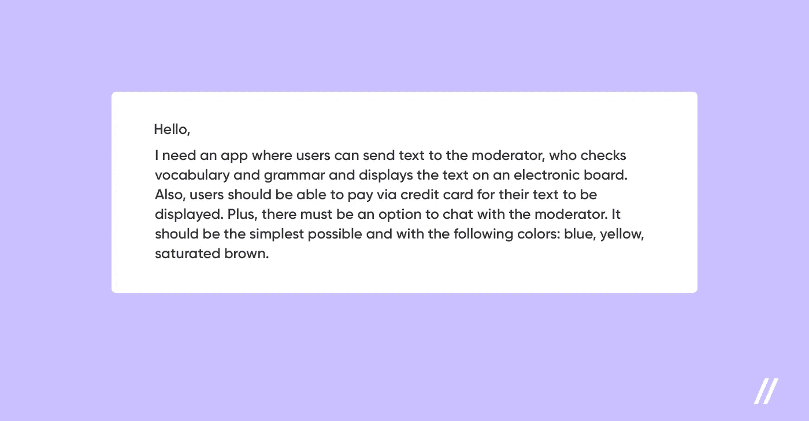
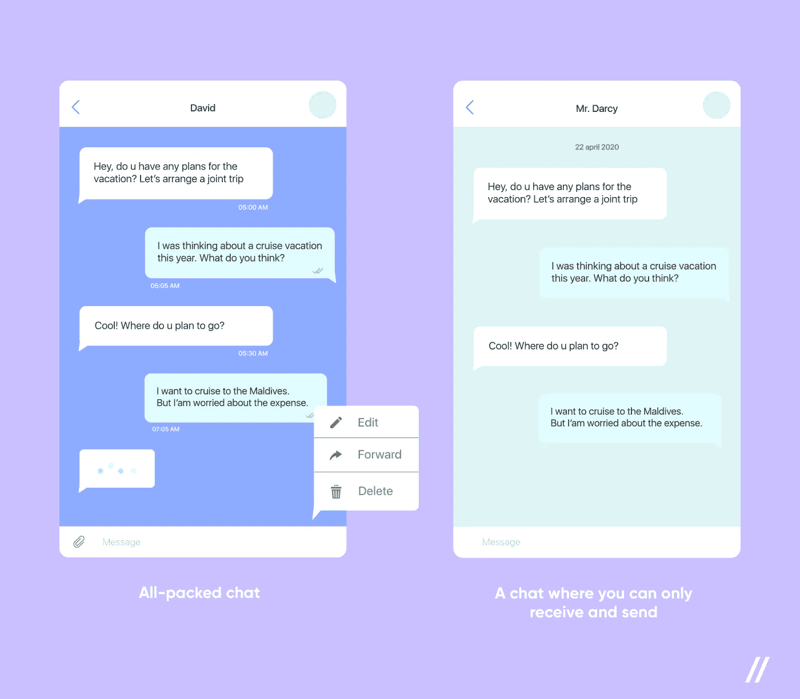
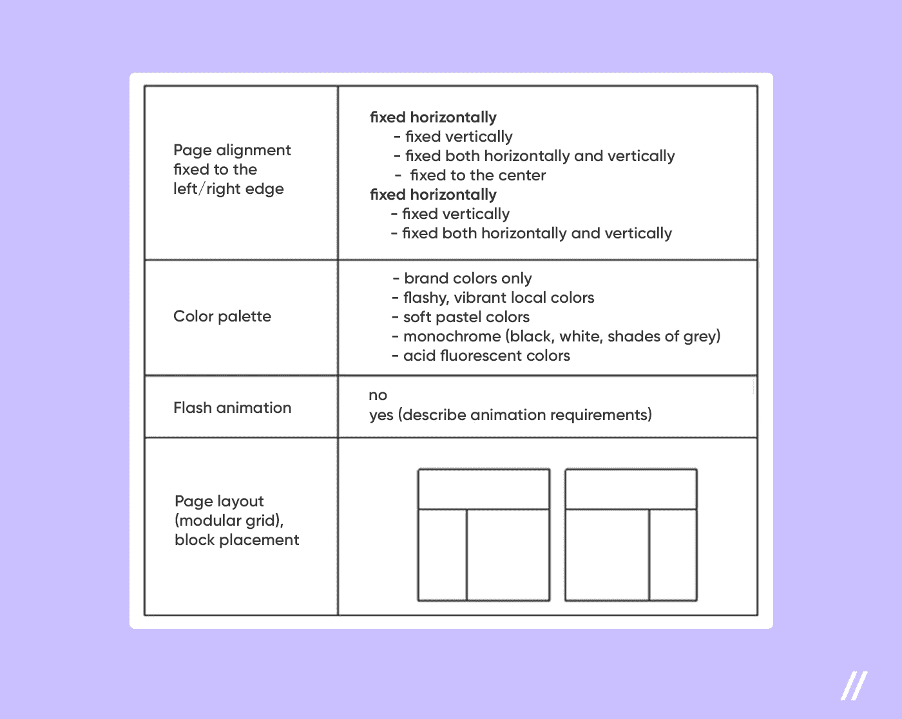
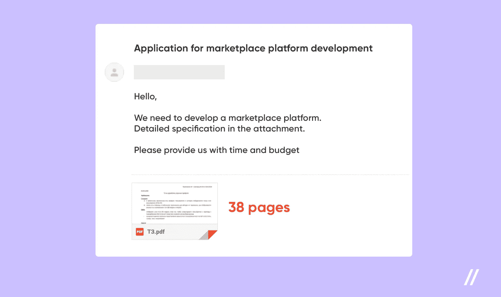
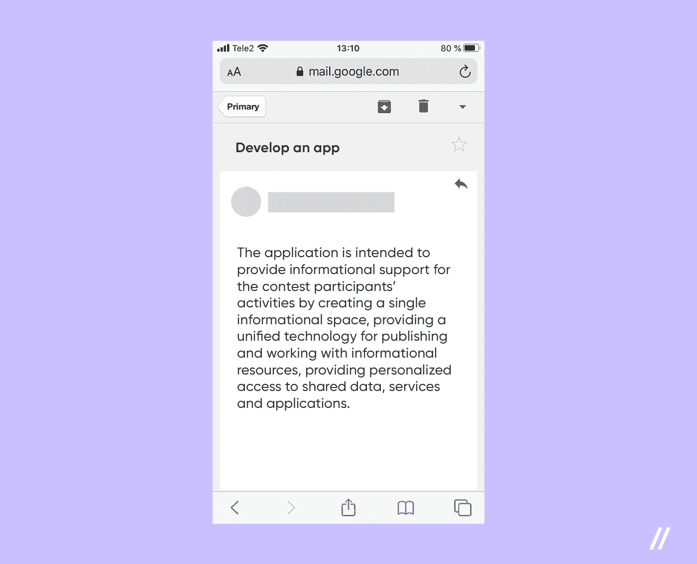

# App 开发 RFP:如何正确书写？

> 原文：<https://medium.datadriveninvestor.com/app-development-rfp-how-to-write-it-correctly-582267163ad0?source=collection_archive---------28----------------------->

*‘我需要一个每天能带来 10 美元的网站’——早在我们的* [*MVP 开发机构*](https://www.purrweb.com/?utm_source=medium&utm_medium=app+development+rfp) *成立之前，我们就收到了这个请求。那时，我们的老板亚历山大和安东是自由职业者。没有其他细节。而且，你知道，有时候这样的要求比 75 页的技术要求更好。*

让我们来谈谈如何写一份令人惊叹的应用程序开发 RFP，并确保收到它的人清楚地了解你的需求，并将其全部转化为适用和有用的东西。

# 什么和为什么而不是如何

当产品所有者长期珍视 app 概念，并仔细思考其使用场景时，整个商业想法可能看起来愚蠢而明显。与家人和朋友的一系列讨论使产品在你的头脑中来回滚动了一百次，它已经获得了一个清晰的轮廓。因此，当联系开发公司时，产品负责人往往会跳过整体层面，直接进入细节，即提供足够背景的功能。事实上，他们不会。

有一次我们拿到了这样一个 app 开发 RFP:

HOW and even WHAT are clear. What about WHY?

似乎客户在他的应用程序开发 RFP 中提供了大量的细节:关于计划的功能(文本发送，审核)和颜色。但是等一下，你明白这一切是为了什么吗？有哪些用户场景？用户为什么要发送消息？为了什么目的，文本应该显示在黑板上，为谁？它将会是什么样的广告牌:足球比赛的记分牌、银行墙上的新闻字幕还是公共汽车站附近的数字广告牌？

事实上，功能和颜色无助于回答最重要的问题:你需要什么样的产品？为什么你的目标和业务真的需要它？没有看到整个画面(不仅仅是真空中给出的特性和需求的列表)，软件开发机构不可能给你一个准确的项目评估。

> **使用场景(WHAT & WHY) >所需功能和颜色(HOW)**

# 如何描述 HOWs

如果你非常确定你未来的产品是什么，并且你真的渴望描述如何，那么写一份有效的应用程序开发 RFP 的理想方式是参考其他产品或竞争对手。

> **我想要一张 PayPal 中的虚拟卡。亚马逊的过滤机制。AirBnB 和 HeadSpace-like 设计中的预订**

在编写应用程序开发 RFP 时，功能需求很重要，但并不关键。传达一项业务任务是至关重要的——就像最初那个“每天 10 美元”项目的例子一样。不太可能有人仅仅基于一个需求就交付一个全功能的产品(尽管可能会有例外)。这个例子有些夸张，但很能说明问题——因为它提供了一个清晰的业务目标。

至于功能性，任何软件开发公司都可以提供这方面的指导。当然，只有在你分享了业务目标、限制和产品期望覆盖的痛点之后。

# 技术要求不是必须的

有时我们会收到 40 多页的应用程序开发 RFP，其中包含几乎所有方面的详细要求:人体工程学、技术美学、数据保护等。这样的文档碰巧是绝对无效的——大量的需求和零上下文。

因此，没有必要从技术需求规格开始，描述开发者应该如何开发你的应用。相反，最好给产品经理提供一些能够回答“我们为什么要开发这个应用，为谁开发这个应用？”这个问题的东西它可以被称为业务需求文档(BRD)。如果你能把它控制在两页以内就太好了。

技术规范可能对会计有帮助——例如，确认雇佣一个软件开发团队的成本。在这个场景中，我们可以在启动工作流程之后交付这样一个文档(例如，在设计阶段)。虽然，一只小鸟告诉我，一些公司准备在事后的基础上签署这样的规范(顺便说一句，这很好，:D)。

> **首先是业务需求，然后是技术需求**

# 关于钱

大多数客户害怕披露预算，因为他们预计会出现对抗和欺骗——“我会告诉你我有多少钱，你会要价更高！”在跳蚤市场，这可能是一个可行的选择。在发展的世界里，事情要稍微复杂一点。

选择承包商如何节省时间？从一开始就坦率地分享你的预算期望——在第一封信中。这种方法有两大优势:

*   如果工作室在不同的价格段工作→你可以节省发邮件和打电话的时间，更快地找到合适的承包商，
*   经理肯定会给你一个符合预期预算的选择。

无论你怎么说，软件开发不仅仅是关于技术技能，也是关于创造力。任何功能都可以通过各种方式实现。比方说，您希望将实时聊天功能集成到应用程序中。可以用不同的方式来评估这一特性:

*   升级:能够跟踪一个人何时打字或何时阅读信息；设置日期和删除/编辑消息。
*   仅基础:只是一个实时聊天，尽管如此，实现其主要目的。

Left: All-packed chat. Right: A chat where you can only receive and send messages

同样的规则也适用于设计:预算大小决定了动画、过渡和自定义插图的复杂性。

不了解开发成本，在市场上走来走去并检查价格是正常的。这里有一个真实的例子:

> 有一次我找地方印一本书。我只需要一份拷贝，而且对这个市场的价格一无所知:假设服务费用在 50 到 300 美元之间。我的决定是坚持 100 美元。为了立即排除 300 美元的报价，我在一封信中注明了预算，并把它寄给了当地的印刷厂。因此，我收集了一份能在我最初设定的预算内完成这项工作的候选人名单:一些人建议用软皮封面取代硬皮封面，另一些人建议用更便宜的报纸。对成本的预期是合理的，任务也完成了。

印刷一本书或者发展一个商业想法——你总是知道你愿意在这上面投资多少钱。在撰写软件开发 RFP 时，简单地分享您的价格预期。有了这些知识，代理商将为您未来的产品提供最佳的“封面硬度”。

> **讨论预算是合作，而不是对抗**

# 我有一份完整的简报，可以吗？

代理机构通常会主动填写一份简介。事实上，这种做法很好:填写调查问卷，客户可以自己整理项目。例如，它可以让您思考一些可能在早期遗漏的项目方面。也许你需要离线模式？是否考虑了所有的用户角色:管理员，也许是版主，或者是支持经理的单独界面？

基本上，填写简报是有用的。但是，将一个机构填写好的简介重新发送给另一个机构绝对不是一个好主意。我们的一个客户曾经犯过这样的错误。

> 在第一封信中，客户发给我们一份简报，这是他之前为另一家工作室填写的。客户需要一个像 Airbnb 这样的功能性 web 应用程序。给他做简报的机构专门从事简单的多页网站。那么，我们得到了什么？该项目的描述与对配色方案，页面布局和 flash 动画吨说明。

A bunch of requirements that have nothing to do with business objectives 🙁

将来，我们肯定会需要颜色。虽然目前有更重要的事情应该首先考虑，以便为您提供一个估计:用户流、服务器逻辑、集成。因此，在没有很好地理解整个产品理念及其商业逻辑的情况下，我们甚至不应该开始讨论“不必要”的东西，比如页面布局。

> T **他的这种想法就像打算用“未来”工作的薪水去买泳衣度假一样愚蠢**

因此，你为一家公司填写的简介并不能帮助另一家公司的经理给你回复一个可行的答案。它可能只对要求你填写这个的机构有帮助。在上面的故事中，它是专门从事登陆页面的机构——不幸的是，一个登陆页面绝对不是客户最终期望得到的。

即使你计划给一个相同档案的机构发一份简报，这个机构也有可能遵循不同的工作方法或者有完全不同的专业。或者案情摘要本身写得不好。对于所有这些情况，一个简单的带有项目描述的 Google 文档会更有帮助🙂

# 准备好接电话

“我已经创建了一个清晰且结构良好的应用程序开发 RFP，但该机构仍然希望有一个电话”

假设你已经做了上面列出的所有事情。清楚地描述了未来产品的概念，共享预算预期。如果这些步骤已经完成，你已经节省了很多打电话和开会的时间，并让经理爱上了你🙂

在 Purrweb，我们坚信沟通应该被视为对项目的投资。即使当你开始寻找合适的项目团队时，投入时间进行沟通也是至关重要的。你只需要考虑一件事:如果没有准备好每天花几个小时与潜在的承包商沟通，你怎么会有时间和精力去做剩下的事情呢？

我们已经讨论了通常附在申请信中的大量技术规范。老实说，代理经理不会花时间去分析 38 页，除非他们亲自和你联系。

Without an actual call, agencies are unlikely to take such an application into assessment right away.

我知道向 6 个不同的机构重复同样的事情很累。尽管在这个阶段，你的主要目标是理解与潜在的项目团队沟通有多容易，如果你们对工作过程有相同的想法。当当地商店的收银员仅仅因为他们的长相而激怒你时，这是绝对没问题的。但是开发工作室是你的长期合作伙伴，所以在沟通方面筛选掉任何你不喜欢的人是很关键的。进行实时聊天(语音通话，或者更好的是视频通话)是弄清楚这一点的最简单的方法。

> **在应用程序中，分享您的联系信息、您有空接听电话的时间以及便捷的沟通渠道**

# 真实的人——真实的语言

最后但同样重要的是。当我和朋友在电报上聊天时，我们的沟通技巧总是很高:我们准确地表达我们的意思，使用简单的词语。当谈到商务谈判时，我们彼此交谈的方式发生了巨大的变化:简单感消失了，所有的短语和文本都变得杂乱和超级复杂。

‘Messy and super complicated’ is when you read the text twice and still didn’t get anything

将上下文隐藏在太长、太复杂的词语后面，并不是高效合作的关键。这是多余的华而不实的东西，会妨碍团队获得本质和理解如何帮助你。如何避免这种情况？从第一天开始，就用简单明了的词语交谈。无论在家还是在办公室，你都可以完美地做到这一点。我敢打赌，未来的项目可以完全以同样的方式进行讨论。