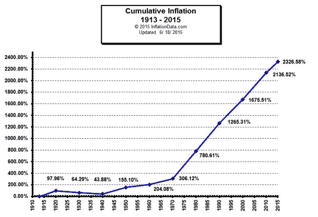
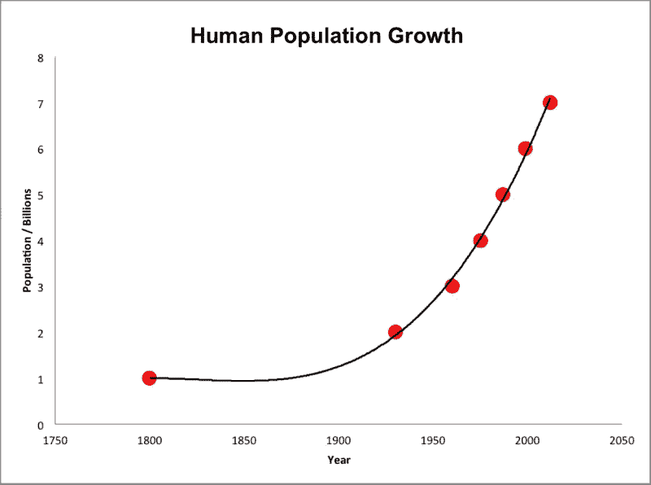

# 苹果和亚马逊将比你想象的更快达到 10 万亿市值

> 原文：<https://medium.datadriveninvestor.com/apple-and-amazon-will-hit-ten-trillion-sooner-than-you-think-a5a8a0670fbc?source=collection_archive---------2----------------------->

## 这将意味着股价分别为 600 美元和 20，000 美元

Photo by [Tom Ritson](https://unsplash.com/@ritsxn?utm_source=medium&utm_medium=referral) on [Unsplash](https://unsplash.com?utm_source=medium&utm_medium=referral)

当人们寻找要购买的公司时，我注意到我们中消息不灵通的人喜欢低股价，因为他们认为那里的增长潜力最大。因此，对细价股的迷恋。

但众所周知，要了解一家公司的相对规模，你应该关注的不是股价，而是市值。

我想大家大概都同意这一点。这是一个有争议的说法。我相信，消息不那么灵通的人喜欢低市值股票，因为他们认为那里有最大的潜在增长空间。

毕竟，潜在增长是有相对上限的，对吗？方的股票根本不会从现在开始上涨 10 倍。是的，那将是荒谬的，如果他们那样做，他们都将价值超过 10 万亿美元。

好吧，我会试着反驳这个观点。我认为我们离第一个 10 万亿美元并在几十年后达到 100 万亿美元并最终达到万亿美元的市值已经不远了。

这比你想象的要快。

**今日 FAANG 股票**

苹果、亚马逊、Alphabet 和微软的市值都超过了一万亿美元。苹果已经达到了两万亿，看起来其他公司最终也会达到。

多大才算太大？

苹果的市值超过了全球除前 10 名以外所有国家的 GDP(根据 2019 年 GDP 排名)。也就是说，除了美国、中国、日本、德国、印度、英国、法国、意大利、巴西和加拿大之外，它们的市值超过了世界上任何一个国家。

这意味着市场已经疯了，这些股票最终会跌回地面。对吗？

这里有三个原因让我看不到这种情况发生。事实上，我认为万亿美元的公司将成为新的标准，在接下来的几十年里，将会出现第一批十万亿和一百万亿美元的公司。

**1)创新和技术进步**

一百年前，当美国的工业巨头洛克菲勒、安德鲁·卡内基和摩根大通分别创立了标准石油公司、美国钢铁公司和摩根大通时，十亿美元是一个闻所未闻的数字。一个公司或个人价值十亿美元的想法在大多数人的头脑中还不是一个概念。毕竟，大多数资料称“百万富翁”这个词可能是在大约一个半世纪前的 17 世纪创造的。这些听起来是不是很熟悉今天关于万亿美元公司的新故事，以及关于谁将成为第一个亿万富翁的猜测。

但工业时代正如火如荼地进行着，伴随着规模经济的能力，新的产业不断涌现。在工业革命中，石油、钢铁和金融行业突然繁荣起来，围绕这些行业创建公司并延伸到整个国家成为可能。

**美国钢铁，标准石油**

这里有两个公司在大约一百年前价值超过十亿美元的例子。

1901 年，美国钢铁公司进行了首次公开募股，如果他们的发行价上涨，他们的市值将超过 10 亿美元。不幸的是，普通股在首次公开募股时暴跌。但他们最终到达了那里，1916 年美国钢铁的价值超过了 10 亿美元。

1911 年，美国政府介入标准石油公司，并利用《谢尔曼反托拉斯法》将其拆分。这导致了 34 个独立的公司。基本上，在分裂之后，每个州都有了自己的石油公司。这些公司变成了今天的埃克森、美孚、雪佛龙、英国石油、马拉松，只是为了让人们对标准石油公司解体前的规模有所了解。

有趣的是，标准石油公司没有公开交易，但是有私人股票发行和交易。2011 年 5 月，标准石油公司解散时的私人股份价格和数量对该公司的估值为 11 亿美元。

**历史与今天平行**

当这些公司发展到前所未见的规模时，美国正处于有史以来最伟大的技术革命之一。蒸汽机、电、电话、电报、铁路、汽车、青霉素、飞机、装配线和许多其他发明都在一百年左右的时间里发挥了作用。

今天，没有人可以否认我们没有经历类似的革命，计算机、互联网、智能手机、社交媒体、电子商务、云计算都在几十年内相继出现。更不用说电动汽车和自动驾驶汽车、区块链以及向生物技术和能源等行业的转型了。

**2)通货膨胀和法定货币**

第二个原因是通货膨胀。这个很明显。今天一万亿美元的实际购买力将比一百年后的一万亿美元少得多。因此，逐年递增，达到这些看似很高的数字会变得越来越容易。

正如我们从下图中看到的，一美元根本不值 1900 年的一美元。

Cumulative Inflation by Decade via inflationdata.com

但是仔细看看这个图表。1970 年左右见拐点。1973 年，美国正式停止将美元与金本位挂钩。美元曾经由美国政府持有的黄金支持。

从 1973 年开始不再是了。

1973 年后的美元仅仅是由国家和世界对美国政府的信任支撑的。一个政府，现在有能力随心所欲地印刷钞票。我认为，与其他一些政府相比，美国政府在印钞方面相当负责。但是争论这个毫无意义。你可以清楚地看到，从历史上的那个点开始，一美元的价值开始以更快的速度下降。

我指出这一点只是因为我认为我们从美国钢铁公司和标准石油公司时的 10 亿美元到今天 FANG 股票的 1 万亿美元的速度是如此之快。我认为它会更快地达到一千万亿这个疯狂的数字。也许不到 2120 年，反而更像是 2060 年或 70 年。

**成长**

这张图表展示了我们不断向越来越大的数字快速迈进的最后一个原因。

6 billion humans and counting via earthsky.org

在人类历史的大部分时间里，人口增长相对稳定，直到大约 150 年前，从那以后我们看到了指数增长。与此同时，我们看到了人类的集体潜力和能力的增长，以及工业、科学和技术的飞速发展。这种增长不会永远持续，但至少会在未来几十年持续下去。

所以，现在你知道了 1)技术 2)通货膨胀，3)疯狂的增长是为什么这些超级大盘股会达到两万亿，然后十万亿，然后继续下去。

时间在继续前进，新的发明不断出现，世界各国的中央银行只会继续印更多的钱。

让我知道你们所有人的想法。我错了吗？