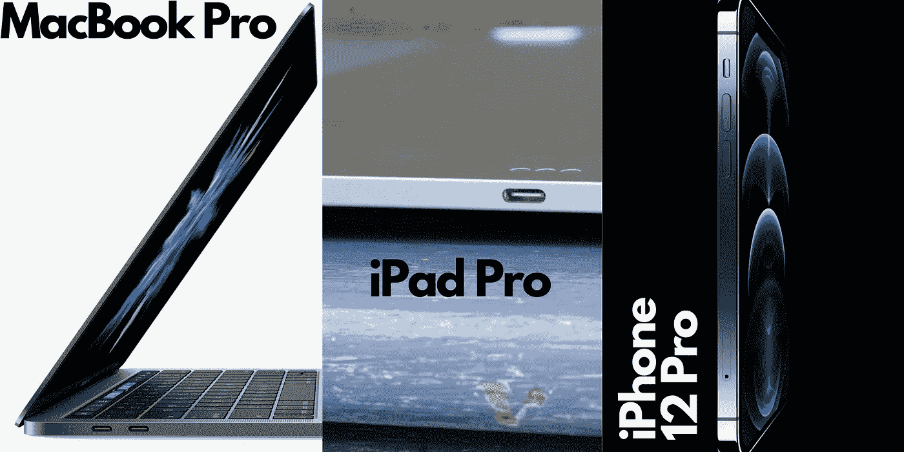
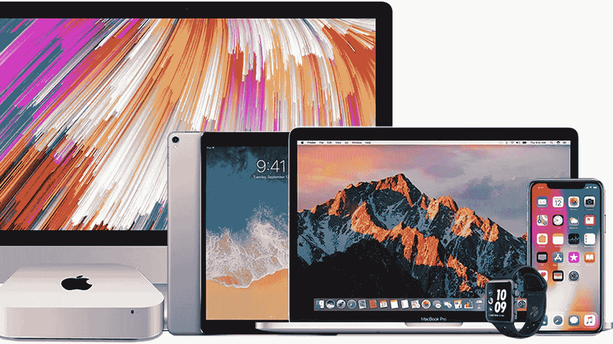
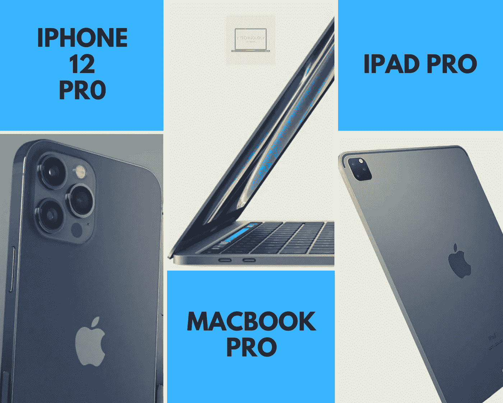
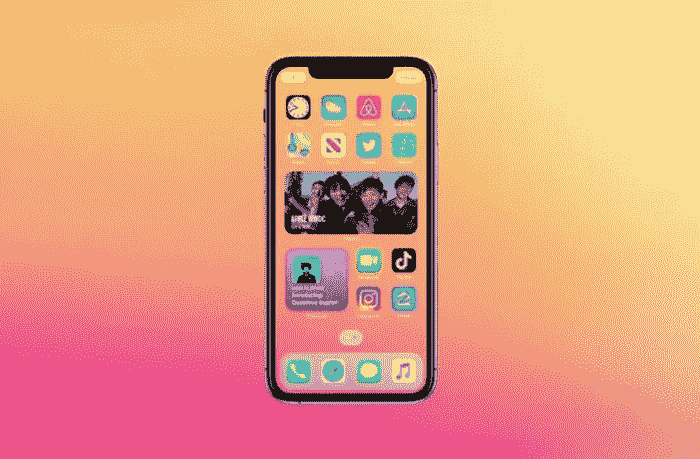
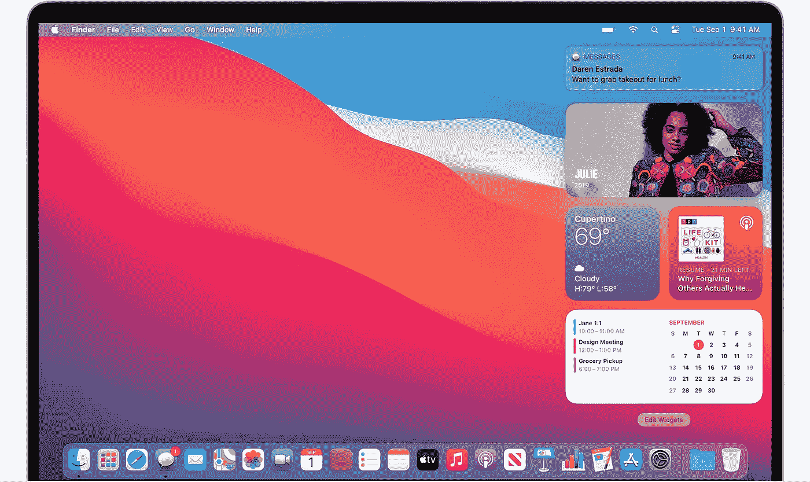

# 苹果最大的举动

> 原文：<https://medium.datadriveninvestor.com/apple-biggest-move-bb93dddec99d?source=collection_archive---------14----------------------->

苹果正悄悄地转向新的设计。嗯，旧设计。但不全是…

# **简介**

T **何卖得最多的** [**苹果**](http://www.apple.com) **产品？**答案是 iPhones、iPads、MacBooks。这很简单，但让我们更深入一点。我不会谈论它们的规格或功能，但**我会谈论一些更深入的东西**，从另一个角度看产品本身的细节。

是我们可以从主文章照片中看到的。**懂了吗？**如果是，那么**你真棒！如果不是，你仍然很棒，但让我向你解释这张照片的意义。事情是这样的**苹果主要产品的设计非常相似**，我想说完全相同。**

我们中的许多人(包括 T21)认为新的 iPhone 12 有这样的设计，因为苹果想做一个像 5S 或第一代 iPhone SE 一样的怀旧造型。但是，如果你从另一个角度来看，这并不是公司对客户的怀旧想法。从整个产品线来看，这更像是一个经过深思熟虑的举措。

Credits: MacRumors

# 设计方面(硬件)

1.  MacBook Pro 有一个非常令人惊叹的设计，更加方正，带有淡淡的圆角……这难道不类似于 5S 的设计吗？

2.新的 iPad 系列有一个漂亮的设计，在我看来，比旧的要好得多。猜猜看？很像 5S 的设计。

3.**iPhone 12(Pro 和 Mini)** 我们所知道的，是和 SE 一样的外形，全触屏。

Credits: YTECHNOLOGY

( ***一点硬件注意事项*** :苹果终于**完成了自己的芯片叫 M1**……那个**是不是听起来很耳熟？当然，这个芯片让我想起了 iPhone 和 iPad 的 A 芯片，苹果手表的 S 芯片)**

***小结论:***

看起来苹果想为它所有的产品做一个标准设计。我们也可以认为，库比蒂诺巨人**正等着在未来几年用新设计给所有人带来惊喜**。另一种可能的想法是 [**苹果**](http://www.apple.com) ，**目前缺乏想象力**来开发和准备一个具有新的独家硬件/软件规格的新设计。

# 功能方面(软件)

与 iOS 13 相比， [**iOS 14(查看我的文章)**](https://medium.com/y-technology/ios-14-all-the-news-of-the-new-apple-iphone-update-out-now-for-developers-914204d96b90) 中有很多实现，但这些只是以前操作系统的一些“插件”，软件本身没有什么重大新内容，就像 iOS 10 到 11 或 12 一样。

*我们来看看*[***MAC OS Big Sur***](https://medium.com/datadriveninvestor/macos-a-developers-point-of-view-about-big-sur-news-and-bugs-that-i-have-personally-encountered-f597ed965ed0)*。*

**从卡特琳娜码头的 3D 应用程序形状来看，我们现在有了一个与 iPad 略有相同的码头，也有了相同的图标**。不要忘记通知栏中的小部件，从右向左滑动。在 iPhone 和 iPad 上，我们必须从左向右滑动，**但功能是一样的。**

Credits: Apple

# 结尾部分

另外，苹果公司在一次采访中宣称，很快我们就能在 macOS 上运行 iOS 和 iPadOS 应用程序。这是苹果迄今为止最大的一次革命。

**干杯！**

