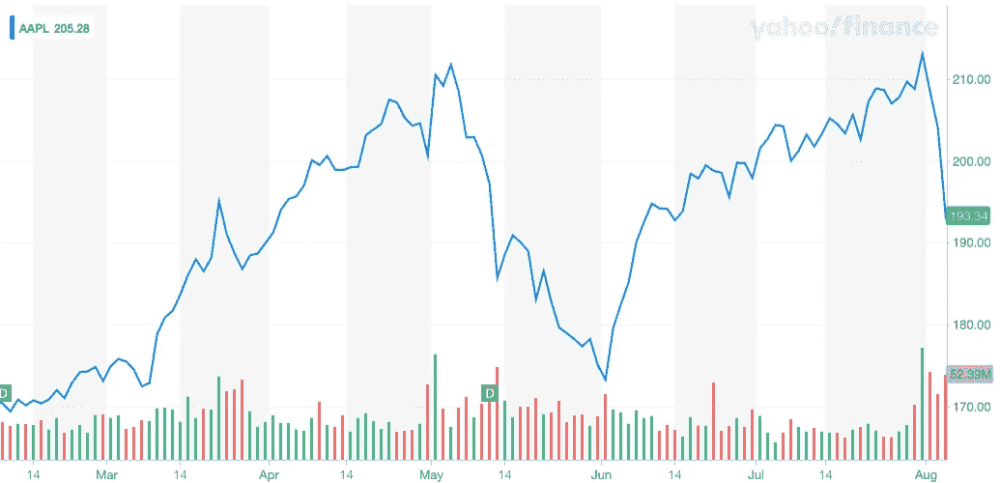
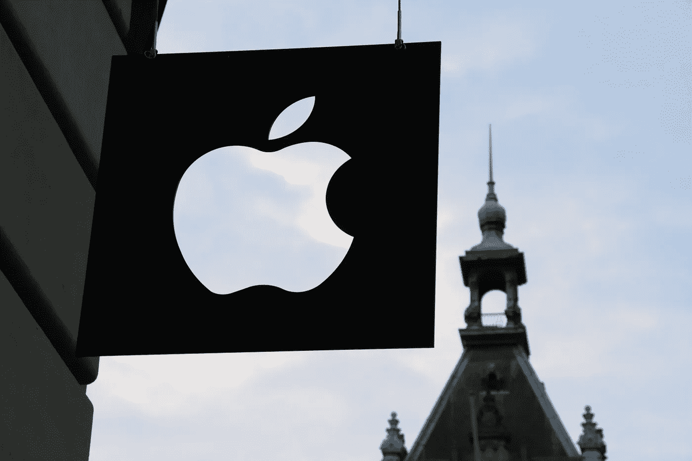

# 苹果:1.4 万亿美元的公司还能增长多少？

> 原文：<https://medium.datadriveninvestor.com/apple-how-much-more-can-a-1-4-trillion-company-grow-8f761d6cb09f?source=collection_archive---------7----------------------->

## 随着世界上最有价值的公司达到四个逗号，投资者想知道苹果还能大到什么程度？

***由*** [***安东尼·布隆伯格***](https://www.anthonyblumberg.com/)

## 苹果公司保持强劲的季度增长势头

随着昨天收益的到来，势头已经对苹果有利:自上一份报告以来，股价上涨了 30%,比一年前上涨了 100%。Q1 财政收入每年增长 9%，达到 30 多亿英镑。让我们开始吃吧。

Apple’s stock in the last one year.

## 货物

首席执行官蒂姆·库克指出，iPhone 11 和可穿戴设备、家居和配件部门表现强劲，季度销售额首次超过 100 亿美元。

The Apple Watch—a rising sector in Apple’s portfoilo.

如果这些数字大到抽象的程度，这里还有一个:苹果在全球超过了 15 亿台活跃设备。

库克说，可穿戴设备增长了 44%，超过 75%的 Apple Watch 购买者是首次购买。但目前的产品是 AirPods，苹果无法生产足够的产品来满足需求。

该公司没有披露数字，但一位分析师估计 AirPods 在 Q1 的销售额高达 40 亿美元。

***大图:苹果是可穿戴设备市场的王者和女王。***

> 享受你看到的金融和投资报道？在我的网站上查看更多！

# 服务呢？

ook 一直在将苹果的重点重新放在服务上，包括订阅视频、游戏和支付。上个季度，该部门收入 127 亿美元，同比增长 17%。**亮点:**

苹果的平台上有超过 4.18 亿的付费订阅，预计 3 月份将有 5 亿。

Apple Pay 的收入和交易每年增长一倍以上。高管们表示，他们正在用用户总数来判断 Apple TV+的成功……但没有给出这些数字。

 [## 苹果会成为新的网飞吗？数据驱动的投资者

### 有可能。然而，该公司肯定会与大公司竞争。许多人不得不看到这一天的到来…

www.datadriveninvestor.com](https://www.datadriveninvestor.com/2019/02/15/will-apple-be-the-new-netflix/) 

自那以后的一年里，苹果在其最重要的市场之一中国大幅降价，以重振那里的销售。该公司还进军付费服务，去年推出了与高盛(Goldman Sachs)合作的信用卡以及付费游戏和电视服务。

Apple’s CEO Tim Cook

苹果公司的蒂姆·库克(Tim Cook)告诉全球科技投资者安东尼·布隆伯格(Anthony Blumberg)，该公司预计在截至 3 月份的当前季度，将提前超过其此前宣布的 2020 年 5 亿用户的目标。库克表示，苹果正在建立一个新的目标，即在今年年底前拥有 6 亿用户。

“我们为装机量增长 1 亿(用户)感到非常自豪。那是巨大的。这证明了我们带来的新客户，即转换者，”库克告诉布隆伯格。

库克表示，该公司去年秋天发布的 Apple TV+订阅流媒体视频服务是一个“令人振奋的成功”，它“非常强大，无论是捆绑购买的人还是没有购买新设备的人。”

iPhone 亿美元的稳定销售额和 520 亿美元的上年销售额终结了苹果最畅销硬件产品长达一年的主要销售下滑趋势。库克表示，iPhone 11 和 iPhone 11 Pro 型号推动了增长，也计入了公司的预测，称这些设备是“我们有史以来最强的 iPhone 阵容”。

库克还告诉布隆伯格，苹果无法在第一财季制造足够多的 AirPods 和 Apple Watch Series 3 设备来满足需求，并且继续短缺这两款设备。库克说，苹果没有估计何时能够满足每一款手机的需求。“我们正在非常努力地解决这两个问题。”

> 想获得高科技产业内部运作的内幕消息吗？查看 23andMe 和消费者 DNA 行业上的这篇文章！

## 中国呢

苹果第二大市场大中华区的收入每年增长 3%，达到 136 亿美元。大约一年前，由于担心中国消费者对 iPhone 的需求下降，苹果下调了销售预期。但昨天，库克表示，iPhone 在 Q1 大陆的收入增长了两位数。

The signature Apple logo

***展望未来…*** 苹果正在密切关注冠状病毒的爆发，这可能会影响农历新年期间的销售，并影响其部分生产，因为全国各地的工厂仍然关闭。

*本文为* [*原载*](http://www.anthonyblumberg.com/blog/apple-how-much-more-can-a-14-trillion-company-grow) *我的财经、科技、旅游网站:*[*https://www.anthonyblumberg.com/*](https://www.anthonyblumberg.com/)

如果你喜欢这篇文章，可以在那里看到更多的独家文章和评论。一定要给这篇文章一些掌声，并在下面留下评论；真的很感谢！