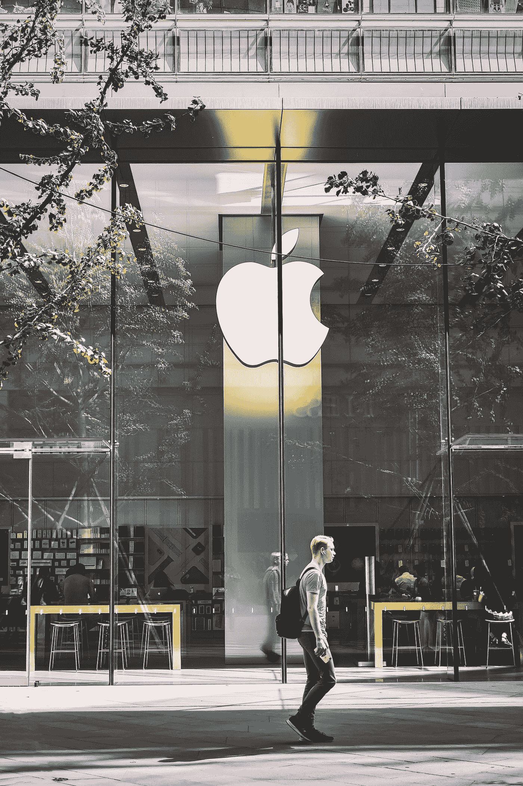

# 苹果再次进行股票分割

> 原文：<https://medium.datadriveninvestor.com/apple-is-doing-a-stock-split-again-136d46339617?source=collection_archive---------15----------------------->

## 该公司自成立以来第五次股票分割的投资教训

Photo by [zhang kaiyv](https://unsplash.com/@zhangkaiyv?utm_source=medium&utm_medium=referral) on [Unsplash](https://unsplash.com?utm_source=medium&utm_medium=referral)

在第三季度收益电话会议之后，苹果公司于 7 月 30 日宣布，它已经批准了一项四对一的股票分割。这只是他们在**自公司成立以来的第五次分手，也是自 2014 年以来的第一次。**

每家上市公司最初都会经历一个[首次公开募股(IPO)](https://www.ig.com/au/shares/ipos/what-is-an-ipo) 阶段。随着时间的推移，当公司需要筹集更多资金来运营时，它就会发行更多股票。当股票分割发生时，在这种情况下，苹果的四分之一分割，股东现在将拥有四倍于分割前的股票数量。显然，在相反的效果下，每股的价值将在价值上四分五裂。这意味着股东在公司的股份价值不受影响。

# 为什么公司要拆分股票——背后的基本原理

公司分割股票价格的原因之一是，对于你日常的父母投资者来说，股票已经变得“太贵”了。较低的股价意味着现在购买同一只股票的进入点较低，因为股票的可承受性变得更高。这将导致对股票的更多需求，从而导致公司估值的更高升值。

 [## 科技日记:苹果的革新，Starlink 的推出和微软转向区块链|数据…

### 欢迎来到科技日记的第一版——我的新博客系列，讲述与科技相关的重要问题…

www.datadriveninvestor.com](https://www.datadriveninvestor.com/2019/05/16/tech-diaries-apples-reinvention-starlink-launch-microsofts-pivot-towards-blockchain/) 

# 苹果股票分割和日期

苹果将在 8 月 24 日交易日结束时启动四对一的分拆。到 8 月 28 日交易日结束时，该股投资者的持股数量将是之前的四倍。从 8 月 31 日开始，苹果公司的股票将以其前值的四分之一在交易所交易。

Photo by [Julian O’hayon](https://unsplash.com/@anckor?utm_source=medium&utm_medium=referral) on [Unsplash](https://unsplash.com?utm_source=medium&utm_medium=referral)

# 苹果正在做与亚马逊相反的事情

亚马逊股价最近飙升超过 3000 美元大关，但尚未分拆股票。相反，苹果在 1987 年、2000 年和 2005 年进行了二对一的股票分割，同时在 2014 年进行了七对一的股票分割。

> 如果你自 1987 年以来只持有一只苹果股票；8 月 31 日拆股后，你会把它变成 224 股。

这是一把双刃剑。一些投资者喜欢股价上涨带来的稳定性，因为这阻止了短线交易者进入市场，从而降低了波动性。

# 苹果公司对道琼斯工业平均指数的变动(DJIA)

苹果股票拆分将产生的一个重大变化与道琼斯工业平均指数有关，苹果是该指数的成员之一。DJIA 指数是一个 30 个成员的价格加权指数。这意味着指数的变动是基于成份股公司的股价，而不是像其他市场指数那样的百分比变动。

随着拆分实施后苹果股价从 400 多美元跌至约 100 美元，其股价的任何后续变动对道指的影响都将较小。苹果，目前道琼斯指数中价格最高的股票，在拆分后将被联合健康所取代。

# 不要太担心股票分割

你是在拆股前还是拆股后买股票都没关系。如果你是一个拥有 7-10 甚至更长投资期限的长期投资者，你以什么价格购买股票并不重要。这里或那里的几美元不应该使你太担心。一个在 2000 年购买了 3 美元或 4 美元股票的人不会在乎他们的购买决定，因为现在的股票价值已经超过了 400 美元，不是吗？

投资股票的关键是以计划为导向并坚持下去。只要有可能，就买股票，不要对消息过于大惊小怪。**不要把你 7-10 年的投资决策建立在 7-10 分钟的新闻上。**如果你认为苹果将继续主导科技行业，并一直在考虑投资该行业，但由于股票分割而不确定，不要让股票分割成为你投资论点中的决定性因素。做出明智而理性的决定。

**访问专家视图—** [**订阅 DDI 英特尔**](https://datadriveninvestor.com/ddi-intel)