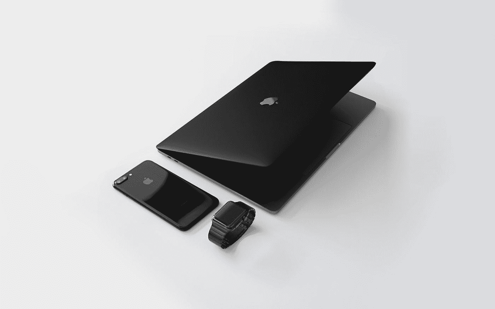

# 苹果现在是一家价值 2 万亿美元的公司

> 原文：<https://medium.datadriveninvestor.com/apple-is-now-a-2-trillion-company-6e62f293be8d?source=collection_archive---------14----------------------->

## 苹果公司仅用了两年时间就实现了估值翻倍。

Photo by [Julian O'hayon](https://unsplash.com/@anckor?utm_source=medium&utm_medium=referral) on [Unsplash](https://unsplash.com?utm_source=medium&utm_medium=referral)

苹果公司用了 42 年时间跨过了 1 万亿美元的估值大关。事情发生在 2018 年。到 2020 年，苹果公司的估值已经翻了一番，该公司现在跨越了令人垂涎的 2 万亿美元大关。这是惊人的，耸人听闻的，真正令人难以置信的。在全球疫情中，这是一个惊人的上升。

更令人震惊的事实是，苹果的所有收益(第二个 1 万亿美元)都是在过去的 21 周内获得的，当时疫情正开始在全球范围内变得可怕。

8 月 19 日星期三，苹果成为第一家达到这一里程碑的美国公司。毫无疑问，它巩固了自己作为世界上最有价值的上市公司的地位。

 [## 苹果会成为新的网飞吗？数据驱动的投资者

### 有可能。然而，该公司肯定会与大公司竞争。许多人不得不看到这一天的到来…

www.datadriveninvestor.com](https://www.datadriveninvestor.com/2019/02/15/will-apple-be-the-new-netflix/) 

只是在 3 月中旬，在股价因担心冠状病毒而下跌后，苹果的估值才跌破 1 万亿美元。但是在 3 月 23 日，就在美联储宣布了对抗股市下跌的激进策略之后，股价疯狂飙升。到目前为止，苹果、亚马逊、Alphabet、微软和脸书在 2020 年都取得了丰收。

投资者对这 5 只股票给予了大量的爱，希望这些科技巨头能够成为疫情引发的经济衰退的避难所。客观来看，自 3 月 23 日以来，这 5 家公司的估值已经上涨了 3 万亿美元，几乎与标准普尔 500 排名第二的 50 家最大公司的估值总和相同，其中包括伯克希尔哈撒韦公司、迪士尼公司和沃尔玛公司等。如果我再做一些数字运算，并进入更细的细节，这相当于苹果的估值自 3 月份以来每天增加 68 亿美元。哇，只是哇。

Photo by [AB](https://unsplash.com/@applefanboy?utm_source=medium&utm_medium=referral) on [Unsplash](https://unsplash.com?utm_source=medium&utm_medium=referral)

# 苹果做了什么才达到这个疯狂的 2 万亿美元估值？

自 2018 年以来，苹果的估值翻了一番，但这家公司本身并没有做多少事情。该公司由史蒂夫·乔布斯和史蒂夫·沃兹尼亚克于 1976 年创立，给世界带来了一些革命性的产品，如麦金塔电脑、iPhone、iPod 等。

但从那以后，苹果基本上调整了过去产品的一些功能，销售了一些新的产品，如 Apple Watch 和 Airpods。它还涉足其他流媒体服务，并出售订阅服务。

在最近的财报电话会议上，苹果首席执行官蒂姆·库克表示:

> “我们没有零和的繁荣之道。”他补充说，“我们专注于做大蛋糕，确保我们的成功不仅仅是我们的成功，我们制造、建造或做的一切都是为了给他人创造机会。”

苹果是第二家市值达到 2 万亿美元的上市公司，仅次于沙特国有石油公司 Saudi Aramco。它曾是最有价值的公司，直到苹果在 7 月份超越它，夺得冠军。

这使得苹果的 2 万亿美元(即 20 亿美元)估值相当于美国 GDP 的 10%。自今年年初以来，苹果的股价已经上涨了约 60%，这让投资者非常高兴。迄今为止，全球已售出超过 12 亿部 iPhones。

Photo by [Mike Petrucci](https://unsplash.com/@mikepetrucci?utm_source=medium&utm_medium=referral) on [Unsplash](https://unsplash.com?utm_source=medium&utm_medium=referral)

# 下面列出了世界上市值最大的 10 家公司

苹果**2.02 万亿美元、**Saudi Aramco**1.8 万亿美元、**亚马逊**1.65 万亿美元、**微软**1.6 万亿美元、**Alphabet**1.06 万亿美元、**脸书**7580 亿美元、**阿里巴巴**7010 亿美元、**腾讯**6250 亿美元、**伯克希尔·哈撒韦【1

哪家公司将成为第三家进入 2 万亿美元俱乐部的公司？

**访问专家视图—** [**订阅 DDI 英特尔**](https://datadriveninvestor.com/ddi-intel)