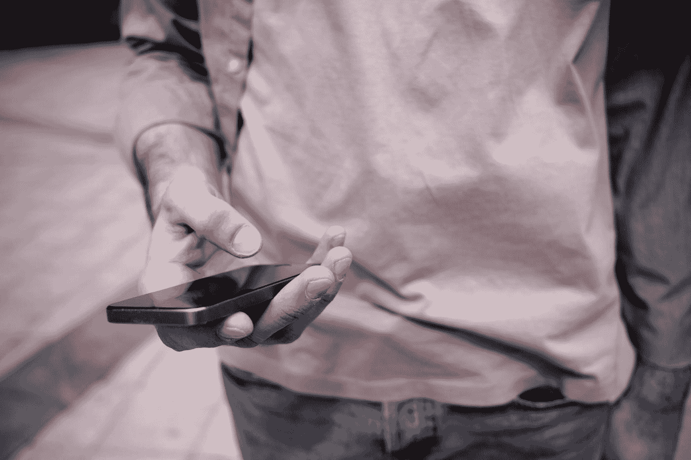
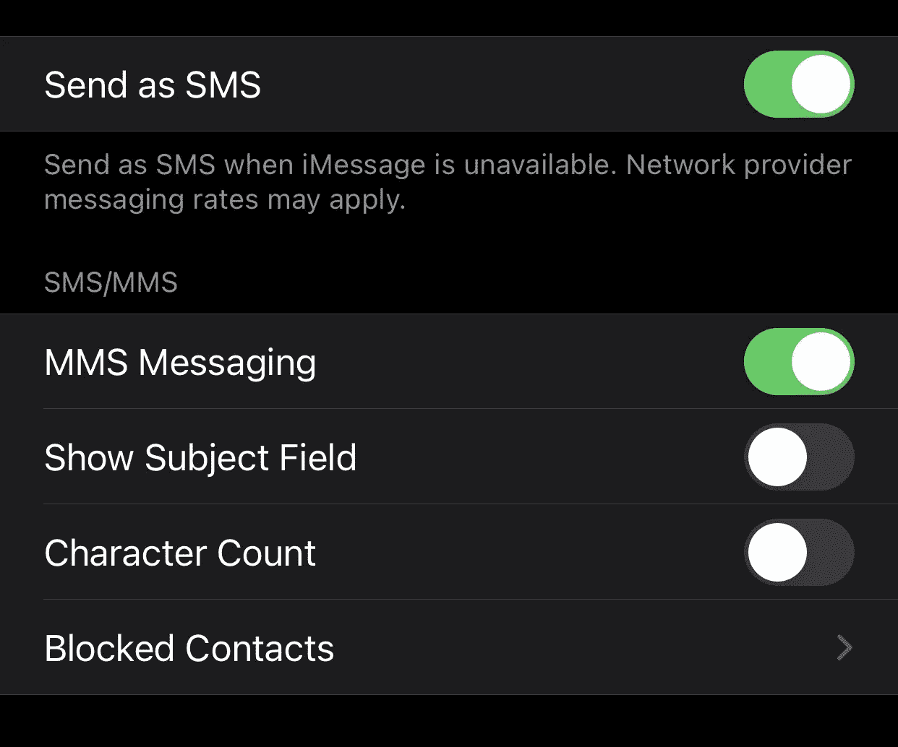
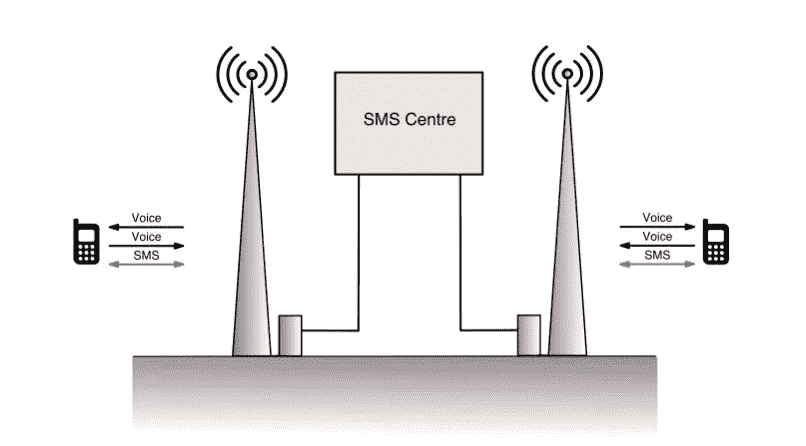
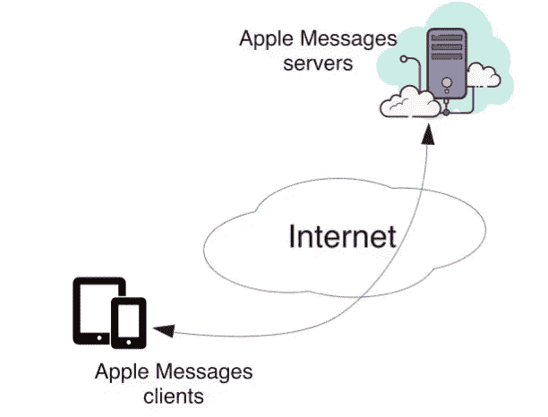

# Apple 信息和 SMS 如何协同工作

> 原文：<https://medium.datadriveninvestor.com/apple-messages-and-sms-the-unofficial-guide-to-reducing-stress-788306430e4f?source=collection_archive---------11----------------------->

## 如果你给一个非苹果用户的朋友发信息，会让人感到困惑。我仔细看了看，想知道为什么

Photo by [Clique Images](https://unsplash.com/@cliqueimages?utm_source=medium&utm_medium=referral) on [Unsplash](https://unsplash.com?utm_source=medium&utm_medium=referral)

我是苹果信息的忠实粉丝，它在大部分时间都“管用”。什么雨落在我的游行上？短信有。当一个人、一个网站或一个组织给我发短信时，这个通常很简洁且运行良好的短信应用程序开始表现异常。

首先，短信似乎没有复制到我的其他设备上，短信用一个绿色的泡泡来嘲弄我。如果我用非 Apple 设备给朋友发送信息，我会失去“信息”的大部分功能。这并不令我惊讶，但如果能知道确切的原因就好了。也许有变通办法？

更令人费解的是，我可以允许 Messages 使用短信。我为什么要这么做？显然，它在没有互联网的时候也能工作，但是我可能会被我的移动运营商收费。怎么会这样

所以我想知道的是:

*   当数据不可用时，SMS 为什么还能工作？
*   为什么我的信息失去了短信的所有功能？
*   如果“信息”使用短信，我还有隐私吗？
*   短信比短信快还是慢？
*   为什么短信不复制？

我从未在苹果公司工作过，也没有苹果公司的股份。接下来是基于几十年的电信经验和对苹果产品的热爱的有根据的猜测。

# 短信和手机短信的区别

事实是:

*   SMS 是控制蜂窝网络技术的一部分，它让手机用户交换短消息。
*   Apple Messages 是一项存在于互联网上的信息服务。
*   如果您允许,“信息”可以使用 SMS，但它只是一种传送机制。

iPhone 上有一个允许它使用短信的设置。

Screenshot by author of SMS setting on iPhone

彩信只是短信的一个变种，可以传送照片和音频。

如果你想单独用短信给某人发信息，你需要他们的手机号码。使用“信息”，您可以从多个电话号码和电子邮件地址中选取。

SMS 世界和 Messages 世界是完全独立的领域，你需要某种网关在它们之间移动。

让我们打开其中的一些

# 短信是如何工作的

短信是一种极简主义的信息服务，它实际上比它有权做的要好得多。

顾名思义，蜂窝网络将城市和国家分割成小区。每个牢房都有一个天线杆，移动电话使用三种频率与天线杆上的设备通信。

*   两个频率用于进出桅杆的声音。
*   第三频率被用作控制信道。
*   只有电话和天线杆之间的通信是加密的。

当移动电话用户旅行时，当他们从一个蜂窝移动到另一个蜂窝时，他们被从一个桅杆传递到另一个桅杆。几乎是在事后，有人认为使用控制信道(SMS)发送 160 个字符的文本消息是有用的。

当有人发送文本时，它会通过控制信道传递到最近的桅杆。然后，它被发送到短信中心，在那里，直到收件人的手机可以找到。这被称为存储和转发。

Diagram by author of how SMS works

最终，SMS 消息被发送到终端设备，这意味着它不再需要存储在 SMS 中心。唯一有把握保存信息的地方是收件人的手机。

手机有“真相”，原始信息的主副本。不保证邮件会被送达。它可能会多次到达，也可能根本不会到达。通常它会做明智的事情。

# 苹果信息

除了苹果公司，没有人确切知道它的信息服务是如何工作的，但从广义上讲，它可能是这样的。

Diagram by author of Apple Messages

所有苹果信息的神奇之处都发生在某个苹果服务器农场，那里有大量的互联网管道。

*   当我在 iPad 上点击“发送信息”时，信息会被加密并发送到苹果服务器。
*   苹果服务器会将我的信息发送给所有安装了苹果信息客户端的苹果设备。
*   苹果信息服务器掌握着发送内容的“真相”。

这就是为什么 Android 和 Windows 设备的供应商不能使用消息进行通信。他们的软件必须知道如何与苹果的服务器进行认证和通信。

某个非常聪明的人可能会暂时利用某个弱点，但随后苹果会修补它。任何设备都可以使用信息进行通信的唯一方式是苹果为它编写一个客户端。

# 消息和短信是如何协同工作的？

## SMS 用户可以向 iPhone 或蜂窝 iPad 发送消息

若要接收短信，您需要连接到手机网络。只有 iPhones 或蜂窝 iPads 可以做到这一点。

就标准短信而言，苹果短信是不存在的。您无法在 SMS 消息中添加任何内容来告诉蜂窝网络转移 SMS。给苹果服务器的信息。

那么，iPhone 上的信息是如何接收短信的呢？

当 iPhone 在其蜂窝调制解调器上接收到 SMS 信息时，它会通知“信息”客户端，后者会存储该信息。它在您的“信息”客户端显示为绿色气泡。这样做是为了方便您。

## “信息”用户向非 Apple“信息”用户发送短信

您在“信息”客户端键入您的信息和收件人手机号码。“苹果信息”会检查收件人是否是“信息”用户。

当它意识到收件人不是时,“短信”客户端使用 iPhone 或蜂窝 iPad 上的蜂窝调制解调器发送短信，去掉任何功能。

# 回答问题

让我们来回答我在开始时提出的一些问题。

## 当数据不可用时，SMS 为什么还能工作？

简单。SMS 使用蜂窝网络发送短消息，因此不需要互联网。

你可能会因此被起诉。大多数包括每月几百条短信，但是如果你的套餐没有，或者你已经用完了，你将被收费。

“信息”没有最大信息长度，但 SMS 有。消息是如何绕过这一点的？它将消息分割成 160 个字符的片段。

这可能会增加很多短信，所以如果你超出了当月的限额，你将被收费。

## 为什么我的信息失去了短信的所有功能？

短信是另一个时代的简单协议。你可以在上面编码视频和其他更丰富的内容，但是接收者的设备必须理解这种编码。

你为什么要这么做？就用网络吧！

## 如果“信息”使用短信，我还有隐私吗？

[消息是端到端加密的](https://support.apple.com/en-us/HT209110)，因此发送方对隐私有合理的预期。[关于苹果是否能读取信息](https://www.quora.com/Is-iMessage-end-to-end-encryption-really-safe)存在争议，但苹果设定的预期是它不能。

手机和手机天线之间的短信是加密的。除此之外，没有任何保证。

你还应该记住，使用的加密技术已经有 30 年的历史了，现代计算机可以很容易地破解它。

## 短信比短信快还是慢？

消息客户端和服务器将通过互联网非常快速地通信。想想那些表示某人正在输入信息的小圆圈。这些在手机短信中都不存在。

SMS 是一个存储和转发系统。这意味着消息通过控制信道发送到桅杆，再从桅杆发送到 SMS 控制中心。

在目标手机开机或进入蜂窝范围之前，这些信息一直存在。不能保证交货，更不能保证多快交货。

通常，“信息”更快。

## 为什么短信不复制？

有时候，我会收到一位不使用苹果设备的朋友发来的短信。这些文字在我的 iPhone 上以绿色气泡的形式出现，但当我在 iPad 上查看信息时，它不在那里。那发生在上周。

如前所述，你需要一个手机调制解调器来接收短信。苹果似乎将短信传输到接收短信的设备上的“信息”中，但不会将其复制到其他“信息”客户端。

我还没有找到一个设置，可以让短信复制来自短信源的信息。

# 外卖

我有时会忘记 SMS 是独立于 Apple Messages 的，因此该服务的行为似乎不可预测。

当你思考 SMS 和 Apple Messages 的工作原理时，一切都变得清晰了(即使是广义的)。你不需要细节就能看出哪里需要妥协。

苹果将短信无缝整合到其信息服务中的尝试值得称赞。你不会想去想它的。

但是因为短信和苹果消息是不同时代的根本不同的技术，所以会有异常。

尽管有诸多缺点，短信仍然是苹果和安卓/Windows 世界之间的桥梁。