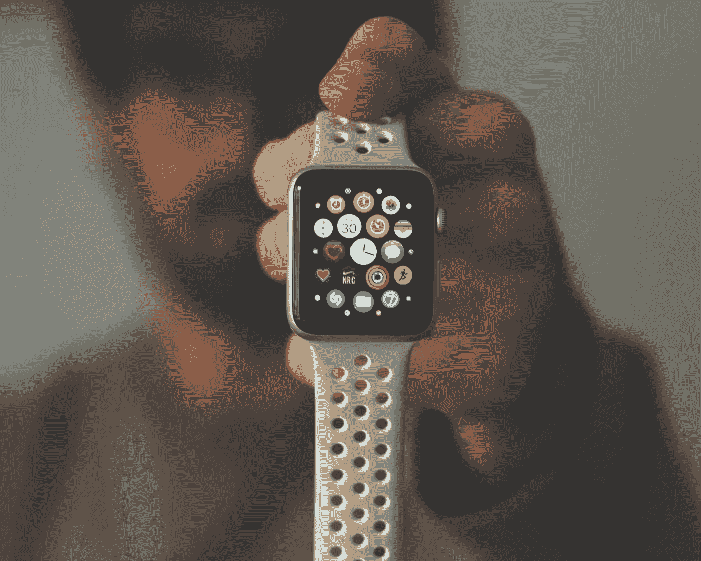
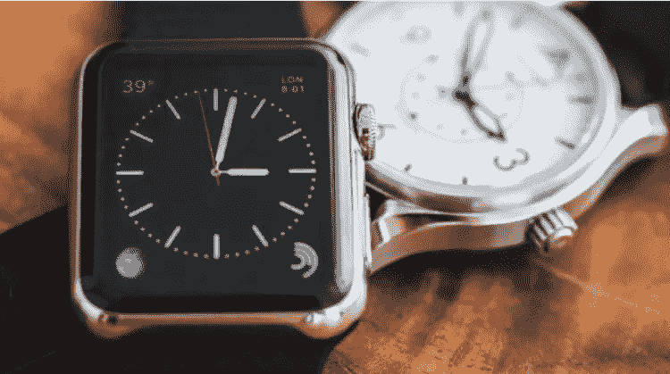
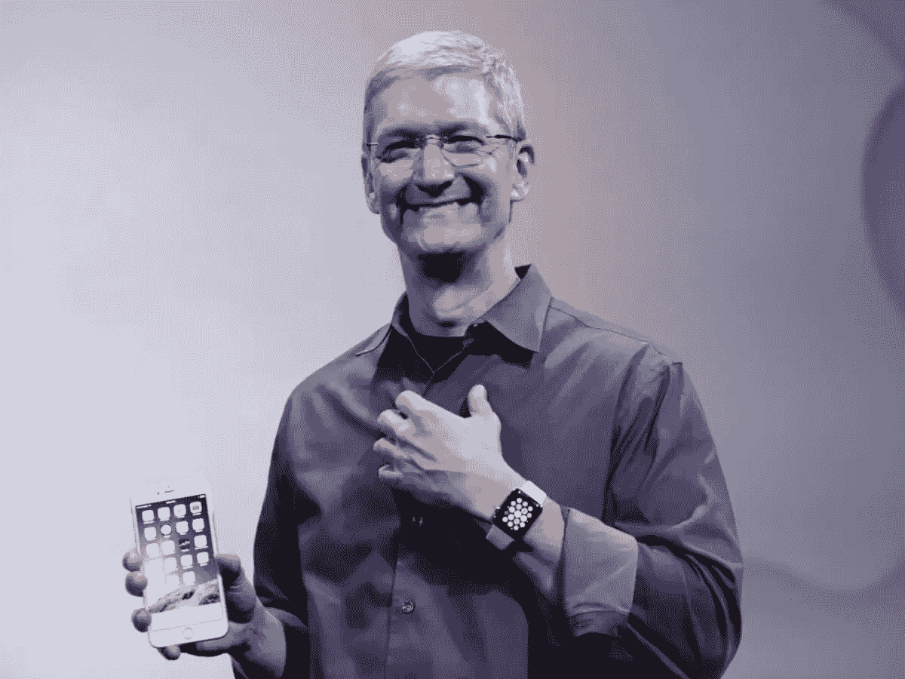
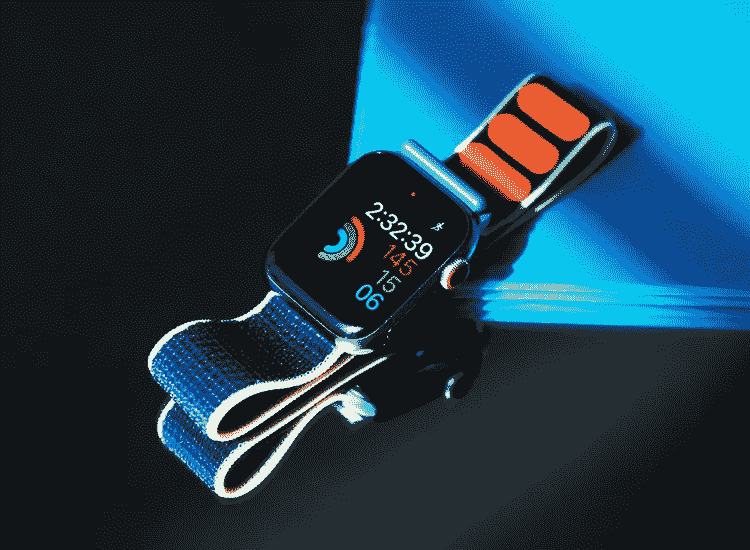
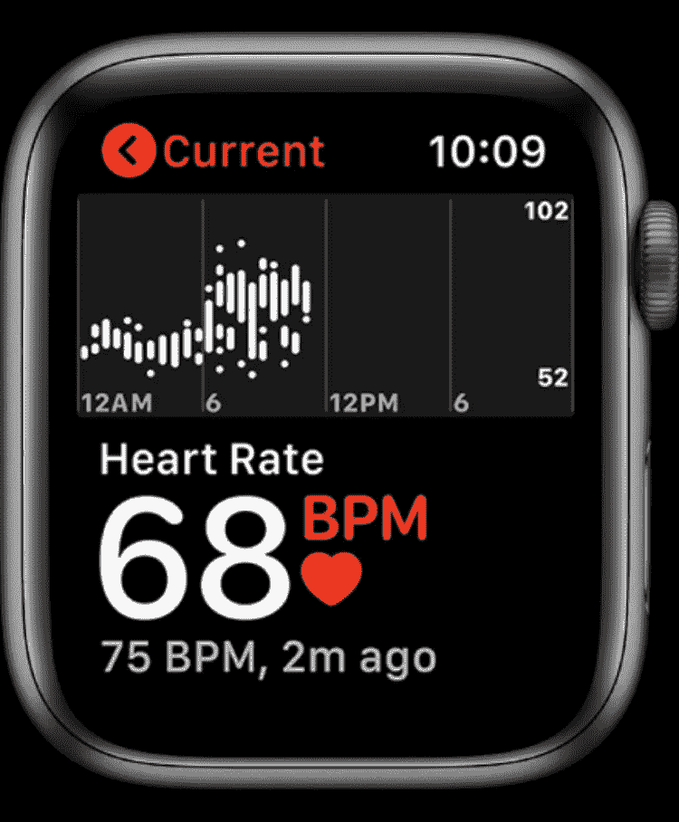

# 苹果 2019 年比整个瑞士钟表业多卖了 1000 多万块手表！

> 原文：<https://medium.datadriveninvestor.com/apple-outsells-the-entire-swiss-watch-industry-in-2019-by-more-than-10-million-watches-9b4500697395?source=collection_archive---------20----------------------->

## 全球售出了超过 3100 万台可穿戴设备

The Apple Watch with the Sport Band

***由*** [***安东尼·布隆伯格***](https://www.anthonyblumberg.com/)

2019 年，随着消费者越来越多地从传统手表转向更加电脑化的钟表，苹果公司的销售额比整个瑞士钟表行业高出 1000 万件。苹果手表不仅是去年最畅销的智能手表，也让瑞士手表行业蒙羞。

Apple Watch compared to typical Switch wristwatch

据研究公司 Strategy Analytics 估计，2019 年，这家科技巨头在全球范围内出货 3100 万只智能手表，而瑞士手表品牌整体出货量仅为 2100 万只。该公司估计，这些估计数字代表着较去年 2250 万辆的健康增长 36%。

Strategy Analytics 高级分析师史蒂文·沃尔兹尔(Steven Waltzer)表示:“吸引人的设计、用户友好的技术和粘性应用的结合，使得 Apple Watch 在北美、西欧和亚洲广受欢迎。

 [## 数据驱动投资的兴起|数据驱动投资者

### 当 JCPenney 报告其 2015 年 2Q 的财务结果时，市场感到非常震惊。美国零售巨头…

www.datadriveninvestor.com](https://www.datadriveninvestor.com/2019/02/28/the-rise-of-data-driven-investing/) 

虽然苹果没有在季度收益中公布具体的 Apple Watch 销量，但 Strategy Analytics 从零售合作伙伴和其他供应商那里收集数据，以得出其销售估计。Waltzer 的同事 Strategy Analytics 的执行董事 Neil Mawston 写道:“模拟手表在老年消费者中仍然很受欢迎，但年轻买家正在倾向于智能手表和电脑化手表。”

Apple CEO Tim Cook wearing the Apple Watch

> [苹果这个 1.4 万亿美元的公司还能增长多少？在我之前的帖子里找吧！](https://www.anthonyblumberg.com/blog/apple-how-much-more-can-a-14-trillion-company-grow)

自 2015 年 4 月首次亮相以来，这款小众产品在年轻人中人气飙升。每一个化身都将技术和设计的极限推进一步。据苹果公司称，9 月份首次亮相的最新系列提供了永不休眠的视网膜显示屏。

Waltzer 说，苹果例行升级的设计和功能继续对传统手表制造商构成威胁。

“传统的瑞士手表制造商，如斯沃琪和天梭，正在输掉智能手表战争，”Waltzer 说。“Apple Watch 正通过更深入的零售渠道提供更好的产品，并吸引越来越想要数字手表的年轻消费者。瑞士手表品牌影响智能手表的窗口正在关闭。对于斯沃琪、天梭、豪雅等品牌来说，时间可能已经不多了。

苹果手表多年来一直是智能手表类别的市场领导者，并在 2017 年的季度销售额中一度超过瑞士手表行业，但这是该产品首次超过其模拟竞争对手。“模拟手表在年纪较大的消费者中仍然很受欢迎，但年轻的买家正倾向于智能手表和电脑手表。”

The Apple Watch is sought after for its easy fitness tracking and wildly popular “rings.”

从许多方面来看，苹果手表是一款附有手表的健康追踪设备。最近几个月，苹果似乎将注意力从 iPhone 转移到了 Apple Watch 等其他智能设备上，试图制定未来十年的战略。

Strategy Analytics 的发现有趣的是，它们支持——或者至少不会破坏——当今的手表不仅仅是钟表的想法。

手表和 Fitbits 等健康专用手表之间的界限似乎越来越模糊。

The Apple Watch can also check the user’s heart rate.

这是苹果首席执行官蒂姆·库克长期以来的观点:从他之前的评论来看，库克认为 Apple Watch 是苹果在医疗保健领域努力的一个组成部分。在 2019 年 1 月的一次采访中，他说:“如果你放眼未来，回首过去，你会问这样一个问题，‘苹果对人类最大的贡献是什么？’这是关于健康的。他说:“我们正在利用公共机构的经验，让个人有能力管理自己的健康。

*本文为* [*原载*](http://www.anthonyblumberg.com/blog/apple-outsells-the-entire-swiss-watch-industry-in-2019-by-more-than-10-million-watches) *我的财经、科技、旅游网站:*[*https://www.anthonyblumberg.com/*](https://www.anthonyblumberg.com/)

如果你喜欢这篇文章，可以在那里看到更多的独家文章和评论。一定要给这篇文章一些掌声，并在下面留下评论；真的很感谢！