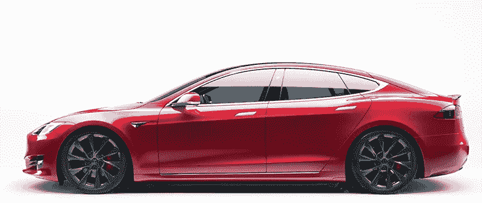
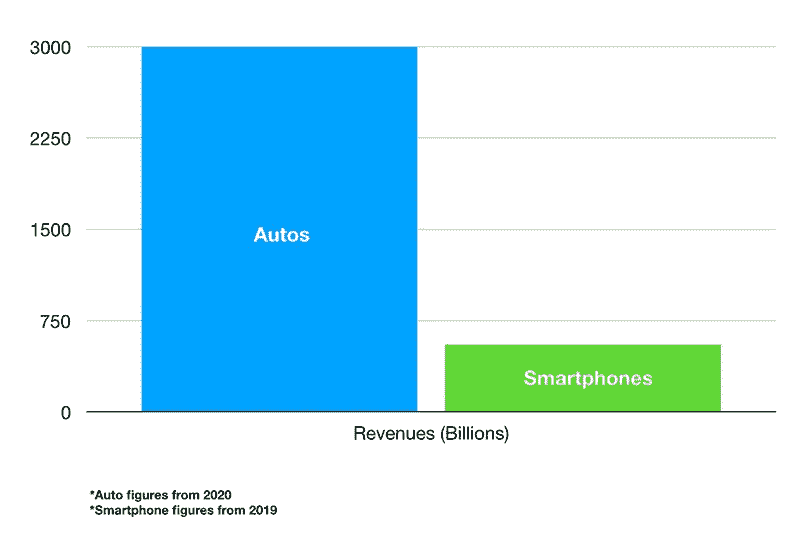
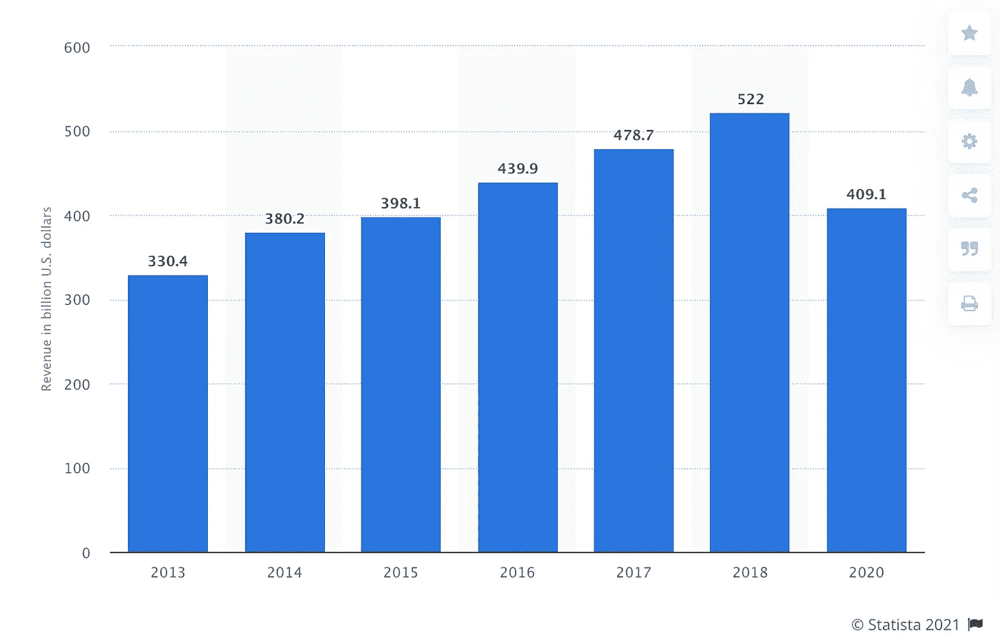
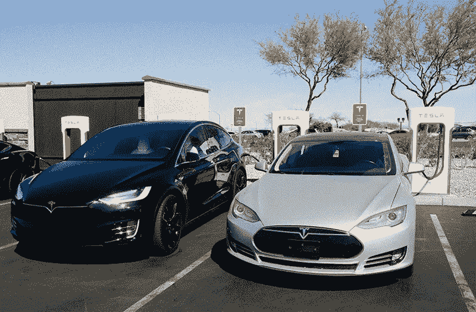
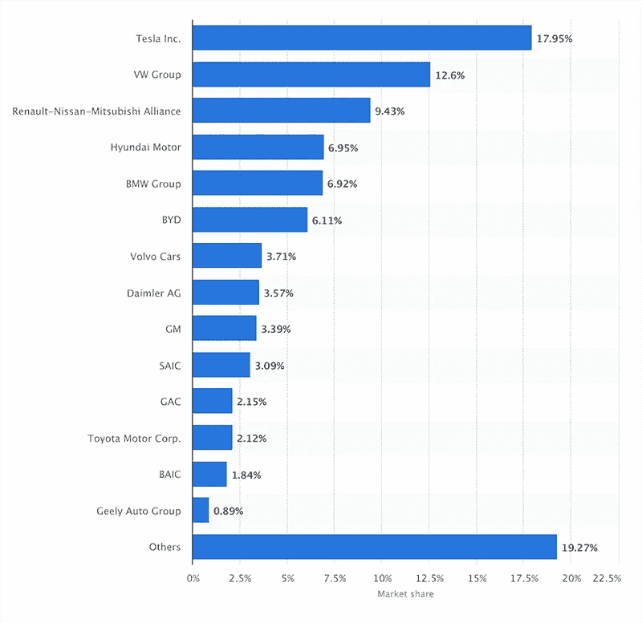

# 苹果应该和特斯拉竞争

> 原文：<https://medium.datadriveninvestor.com/apple-should-compete-with-tesla-6a908cf6303c?source=collection_archive---------17----------------------->

苹果公司生产电脑和手机。特斯拉制造汽车和电池。一家一直处于计算和通信产品的前沿，另一家则处于汽车行业的前沿。众所周知，苹果公司的创意和产品创新引领了计算机行业的潮流。特斯拉是汽车行业开发非常规技术的大胆先锋。这种比较非常显著，但它们之间并没有直接的竞争关系。

作为创新者，这可能是苹果进入汽车行业的好时机。苹果公司毫不掩饰他们开发自己汽车的计划。他们的项目[始于 2014 年](https://en.wikipedia.org/wiki/Apple_electric_car_project)(代号泰坦项目)，起初似乎是为了测试[无人驾驶汽车](https://phys.org/news/2018-05-apple-self-driving-car-california-waymo.html)。他们只是不太关注它，让事情不被发现。在关于[开发电动汽车](https://asia.nikkei.com/Business/Automobiles/Apple-Car-expected-to-shake-up-auto-industry-in-Asia-and-world)细节的新闻报道浮出水面后，人们更加兴奋。据报道，它将是电动的，具有自动驾驶功能。苹果内部人士迟明-郭认为，苹果汽车最早可能在年[左右推出。](https://www.macrumors.com/roundup/apple-car/)

The Model S electric sedan (Source Tesla)

如果你把它比作苹果和橘子，这可能没有意义。也就是说，如果你把苹果仅仅看作一家电脑公司。事实是，苹果公司有足够的资本投资新企业，这包括开发电动汽车。他们已经开始建立一个团队，其中包括来自特斯拉和其他汽车制造商的前工程师。苹果倾向于对他们的项目保密，所以有猜测说苹果正在试验无人驾驶技术。对其他人来说，这已经暗示了苹果实际上在做什么。这意味着制造他们自己的汽车。

## 汽车行业的潜力

移动市场(智能手机)的规模在 2018 年达到顶峰，约为 5220 亿美元。到 2020 年，汽车行业(包括汽油、柴油和电动汽车)的全球总销售额[超过 3 万亿美元](https://www.ibisworld.com/global/market-research-reports/global-car-automobile-sales-industry/)，预计到 2030 年将达到 9 万亿美元(根据[统计](https://www.statista.com/statistics/574151/global-automotive-industry-revenue/))。根据摩根士丹利首席分析师凯蒂·休伯蒂的说法:

> **“…鉴于汽车行业的总规模，苹果进入汽车市场是有道理的。”**

这两个市场都在很大程度上受到了新冠肺炎的影响，销售额比上一年有所下降。说到销量反弹，汽车行业的市场要大得多。

The global mobile phone market in revenues is much smaller to the size of the auto market. 2020 saw a fall in revenues, as the markets recover. (Source Statista)

对苹果来说，智能手机一直是其最赚钱的业务之一。iPhone 一发布就颠覆了移动行业。与苹果的其他产品相比，这是苹果最赚钱的产品线。它优先考虑开发和营销，并取得了回报。也许他们可以对汽车做同样的事情。在这一点上，特斯拉现在是世界上最有价值的汽车制造商(截至发稿时为 8098 亿美元)，在估值(非销售额)方面领先于丰田和通用汽车[。](https://www.visualcapitalist.com/tesla-is-now-the-worlds-most-valuable-automaker/)

由于智能手机销售是苹果最大的收入来源之一，这并不能完全维持公司的发展。这是因为市场预计将下滑，不仅仅是因为新冠肺炎损害了销售，还因为智能手机市场总体上的竞争加剧。该行业已经成熟，需求仍然存在，但它不会继续带来更大的利润。随着来自华为和三星的竞争变得更加激烈，增长空间可能也很小。苹果在全球出货量和销售额方面的排名有所下降。由于增长潜力，这将是苹果进入汽车行业的一个原因。

和特斯拉一样，苹果也可以成为他们汽车的直销商。在没有第三方经销商或特许经营的情况下，[商业模式](https://www.iebrain.com/wp-content/uploads/2017/08/Tesla-direct-Retail.pdf)对特斯拉来说运转良好。直接销售给顾客是一个有效的策略，这将使苹果成为他们自己的经销商。它可以像一个苹果商店，除了汽车。

## 电动汽车之路

随着碳排放新规的出台，政策正转向鼓励和激励电动汽车(EV)。随着替代能源的开发和利用，对化石燃料的需求将会减少。推动更清洁、更环保的技术是电动汽车制造商的动力。美国政府已经在这个项目上给特斯拉[补贴了 24.4 亿美元](https://cleantechnica.com/2020/08/03/tesla-subsidies-how-much)。还有针对车主的高达 7500 美元的[电动汽车税收抵免](https://cars.usnews.com/cars-trucks/how-does-the-electric-car-tax-credit-work)。

特斯拉的税收抵免已经结束。对于新的电动汽车制造商来说，情况大不相同。这一机会鼓励汽车购买者转向电动汽车，因为税收抵免是其中的一项好处(除了节省汽油成本)。当苹果的电动汽车上市时，条款可能会与现在不同。新政府可能会对电动汽车更友好，并给予苹果一定数量汽车的税收抵免计划。这些税收抵免有助于促进销售，并允许电动汽车制造商建立自己的市场。由于苹果是一个众所周知的品牌，他们可以很容易地占领市场，但我们不要忘记，汽车不是苹果公司所熟知的东西。他们仍然需要证明自己的价值。

## 苹果汽车面临的挑战

由于苹果不是一家汽车公司，他们将不得不从基本原则开始。他们有开发和制造汽车的团队，所以技术不是大问题。主要问题是如何大量生产这种汽车。在面临大规模生产 Model 3 的问题后，苹果或许可以从特斯拉的经历中吸取教训。特斯拉确实从他们的“生产地狱”中获益，从 2018 年第三季度开始盈利(3.12 亿美元)。这里的关键是找到规模化生产的方法，以增加收入。另一种方法是为利基市场生产汽车，比如为外国汽车爱好者。当有更重要的事情要做的时候，苹果似乎不会仅仅为了满足一个小市场而每年生产几个外来产品。

特斯拉相对于苹果的优势在于电池技术。[特斯拉在电池设计方面取得了突破](https://medium.com/0xmachina/teslas-latest-battery-improvements-from-battery-day-2020-tera-is-the-new-giga-1e6b1a004605)，可以将每千瓦时的成本降低一半(100 美元/千瓦时)。这使得电动汽车的价格降至 25，000 美元，与市场上的传统汽车价格持平。特斯拉在这场游戏中遥遥领先，因此苹果可能要么必须制造更好的电池，要么从其他制造商那里采购。

电动汽车制造商将面临的一大挑战是基础设施。全球电动汽车充电站系统正在[发展壮大](https://www.greenbiz.com/article/great-ev-infrastructure-challenge)。苹果没有像特斯拉那样的充电站网络，所以这是该系统的另一部分，必须建设。你需要充电设备来为你的汽车提供动力。苹果将不得不要么建立自己的充电站，要么购买或与能够提供电动汽车充电的公司合作。

Tesla charging station in Las Vegas, NV (USA)

特斯拉[已经成功地将垂直整合](https://medium.com/the-innovation/why-vertical-integration-made-tesla-more-powerful-8b33b6aee773)引入到他们的电动汽车生产中。同样，[苹果也可以做同样的事情](https://appleinsider.com/articles/21/01/07/apple-vertical-integration-could-boost-apple-car-margins-threaten-tesla)。这可以带来更大的规模经济，降低生产成本，从而降低每辆车的销售价格。苹果可以围绕其电动汽车开发一个全新的生态系统。为了制造他们的第一辆汽车，苹果必须建立他们的供应链，然后相应地开发流程。

找到制造地点是下一步要考虑的事情。如果他们能在海外以更低的成本生产电动汽车，就会夺走美国的就业机会。国内生产设施，就像特斯拉在奥斯汀的工厂一样，对美国经济更有利。他们甚至可能探索与汽车制造商建立合资企业或合作伙伴关系来制造车身，作为生产过程的一部分。在相关新闻中，有报道称苹果正在与现代商谈合作生产苹果汽车。地点和合作伙伴仍然要考虑，所以没有什么官方的。

## 竞争带来创新

这件事的好处是，苹果可以给整个汽车行业带来颠覆，或者给特斯拉这样的电动汽车制造商带来更多竞争。这总是受欢迎的，因为它给了消费者更多的选择。人们对苹果的期望可能与他们将手机改造成智能手机的方式相同。这一进入汽车行业的举动可能会导致一辆*智能汽车*。苹果汽车没有基准可以依据，但我们确实知道竞争越来越激烈，电动汽车市场有很大的增长空间。

即将上任的美国总统政府可能对 EV 有利。目前[根据 Statista](https://www.statista.com/statistics/541390/global-sales-of-plug-in-electric-vehicle-manufacturers/) (截至 2020 年 6 月)的数据，特斯拉在全球电动汽车市场的销量份额为 17.95%。根据联合市场研究公司的数据，2019 年全球电动汽车市场价值 1623.4 亿美元，预计 2027 年将达到 8028.1 亿美元。美国可以通过影响汽车行业的更加环保的政策来进一步加快电动汽车的采用。在 2020 年新冠肺炎疫情之前，电动汽车销量[已经上升](https://www.forbes.com/sites/arielcohen/2020/10/26/plugging-into-the-future-the-electric-vehicle-market-outlook/?sh=67d4bb779812)高达 65%。即使从 2%的市场份额开始，对苹果来说也是巨大的。到 2030 年，在 9 万亿美元的汽车市场(包括非电动汽车)中，这一价值约为 1800 亿美元。这实际上比 2019 财年 iPhone 单独销售的收入还要多( [iPhone 2019 年销售收入为 559.6 亿美元](https://www.investopedia.com/apple-s-5-most-profitable-lines-of-business-4684130))。

The EV market by share (percentage) from automakers (Source Statista)

有了苹果这样的竞争对手，电动汽车市场将有更多的选择和更好的选择。如果苹果能制造出更好的电动汽车，它也会影响接下来的竞争。电动汽车的生产将导致设计为消费者提供更高的效率和更低的成本。规模化生产也会降低价格，同时质量标准也会提高。凭借先进的人工智能研究，苹果工程师可以为自动驾驶汽车系统带来新的发展。这也意味着产品更加安全可靠。

## 滑动以驾驶

拥有一辆苹果汽车的愿景已经引起了很多人的兴奋。它增加了整个苹果生态系统，允许 iPhone 应用程序集成，使其像“滑动驾驶”一样简单。不过，实事求是地说，老牌汽车制造商，尤其是特斯拉，在研发方面遥遥领先。苹果将不得不在性能和功能上展开竞争。这是他们第一次制造汽车，所以我们不知道会发生什么。苹果进入这个新兴和不断扩大的市场还为时不晚，特别是在电动汽车领域。这对这家科技巨头来说是一个机会。

*原载于 2021 年 2 月 3 日*[*【https://www.datadriveninvestor.com】*](https://www.datadriveninvestor.com/2021/02/03/apple-should-compete-with-tesla/)*。*